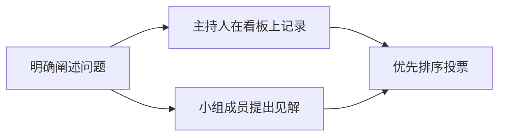
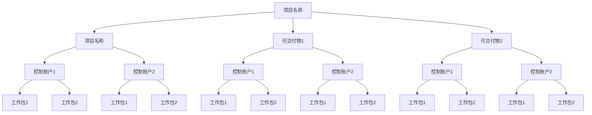

---

#  名义小组技术&观察&引导&原则法
> 课时：55
> 小结：51

## 名义小组技术（结构化的头脑风暴）
- 使不善言辞者也能充分的发表意见

结构化头脑风暴：

> 真正发言的就几个人， 不善言辞的人则不会发言
> 目的是让所有人都需要强制发言
>
> 主持人：
> 说明讨论目标
> 给每个人 15 分钟考虑时间
> 每个人都要发言
> 优先排序， 择优录取

## 人际关系与团队技能 -- 观察

观察，也称为“工作跟随”，通常由旁站观察者观察业务专家如何执行工作，
但也可以由“参与观察者”来观察，通过实际执行一个流程或程序，
来体验该流程或程序是如何实施的，以便挖掘隐藏的需求。

> 方式一：旁站式观察
> 方式二：体验式观察

## 人际关系与团队技能 -- 引导

与焦点小组最大的区别在于引导：
* 规模无限制 (焦点小组人数少)
* 跨职能干系人参加 
  * 快速定义跨职能需求
  * 协调干系人差异，<u>**干系人达成共识**</u> （目的在于意见达成一致， 焦点小组在于得到方案）
   

## 原型法

原型法是指在实际制造预期产品之前，先造出该产品的模型，并据此征求对需求的早期反馈。

适用场景：
> 客户需求不够明确，想和客户快速达成一致，适用于新系统或大型复杂系统。

原型法可以测试出不同解决方案所产生的不同结

# 总结

- **名义小组技术**：结构化头脑风暴
- **观察**：旁站式&体验式观察
- **引导**：跨职能干系人达成共识
- **原型法**：复杂项目模型验证

---

# 输出：需求文件&需求跟踪矩阵
| 标题 | 课时 | 章节 |
| --- | --- | --- |
| 进度 | 56 | 52 |

## 需求文件

<u>记录</u> 项目干系人对项目的各种具体需求，渐进明细。
是明确的（可测量和可测试的）、可跟踪的、完整的、相互协调的且主要干系人愿意认可的业务和项目目标、需求、验收标准、假设条件和制约因素等。

**产品功能需求**

* 需求名称
* 需求描述
* 触发条件
* 输入
* 处理步骤
* 输出
* 流程
* 数据字典
* 权限
* 业务规则

**项目需求**

* 项目目
* 项目里程
* 项目进度要
* 项目范
* 项目质量要
* 项目成本要
* 项目风险要
* 项目交付物要
* 项目验收要
* 项目付款要

**产品性能需求**

* 安全
* 性能 （性能需求比较容易忽略）
* 易用性
* 可靠性
* 可维护性
* 可测试性
* 健壮性
* 接口需求

## 需求跟踪矩阵

需求跟踪矩阵。把产品需求从其来源连接到能满足需求的可交付物的一种表格。

使用需求跟踪矩阵，**把每个需求与业务目标或项目目标联系起来**，有助于确保每个需求都具有商业价值。

需求跟踪矩阵提供了在整个项目生命周期中跟踪需求的一种方法，**有助于确保需求文件中被批准的每项需求在项目结束的时候都能交付。**

## 总结

| 知识点 | 重点 |
| :--- | :--- |
| 需求文件 | 记录所有需求的文件 |
| 需求跟踪矩阵 | 每个需求与项目目标关联 |

---

# 过程：范围定义
| 标题 | 课时 | 章节 |
| --- | --- | --- |
| 进度 | 57  | 53  |

## 定义范围

**输入**
1. 项目管理计划
   1. 范围管理计划
1. 项目章程
1. 项目文件
   1. 假设日志
   1. 需求文件
   1. 风险登记册
1. 事业环境因素
1. 组织过程资产

**工具与技术**
1. 专家判断
1. 数据分析
   1. **备选方案分析**
1. 决策
   1. **多标准决盖分析**
1. 人际关系与团队技能
   1. 引导
1. **产品分析**

**输出**

1. 项目范围说明书
2. 项目文件（更新）
   1. 假设日志
   2. 需求文件
   3. 需求跟踪矩阵
   4. 干系人登记册

## 本节知识点

| 知识点 | 重点 |
| :--- | :--- |
| 工具 | 备选方案分析 多标准决策分析 产品分析 |
| 需求跟踪矩阵 | 项目范围说明书 |

---

# 输出：项目范围说明书
| 标题 | 课时 | 章节 |
| --- | --- | --- |
| 进度 | 58  | 54 |

# 项目范围说明书

项目范围说明书详细描述项目的可交付物，

**在项目规划时被创建**

以及为提交这些可交付物而必须开展的工作。
* 可交付物
* 产品范围描述 （工作过程）
* **验收标准** （试题中出现对可交付物不满意的时候，多半是验收标准没有定义清晰）
* 项目的除外责任

## 本节知识点

| 知识点 | 重点 |
| :--- | :--- |
| 项目范围说明书 | 产品范围描述+可交付物； 验收标准+项目除外责任 |

---

# 过程：创建 WBS
| 标题 | 课时 | 章节 |
| --- | --- | --- |
| 进度 | 59  | 55 |

## 创建 WBS 

**WBS** 
> 全称：__Work Breakdown Structure__ 
> 工作分解结构

建立 WBS 的过程
把项目的工作进行分解
负责的事情拆解为简单的事情

**输入**
1. 项目管理计划
   1. 范围管理计划
2. 项目文件
   1. 项目范围说明书
   2. 需求文件
3. 事业环境因素
4. 组织过程资产

**工具与技术**
1. 专家判断
1. 分析
   

**输出**
1. 范围基准
2. 项目文件（更新）
   1. 假设日志
   2. 需求文件

## 范围基准

范围基准是经过批准的范围说明书、WBS和相应的 WBS词典，

只有通过正式的变更控制程序才能进行变更，它被用作比较的基础。

> 范围基准 = 范围说明书 + WBS + WBS词典

> 范围说明书：没有拆解
> WBS：细致的分解，工作过程中不断地进行监控
> WBS 词典：每个分解内容的进一步描述， 避免出现一些含义的歧义

## 本节知识点

| 知识点 | 重点 |
| :--- | :--- |
| 工具 | 分解 |
| 输出 | 范围基准 |

---

# 输出：WBS&WBS 词典
| 标题 | 课时 | 章节 |
| --- | --- | --- |
| 进度 | 59  | 55 |

## WBS

复杂的工作简单化 -> 简单的事情要量化 -> 量化的事情专业化

WBS是工作分解结构（ Work Breakdown Structure ）的缩写
* WBS的组件：控制账户（ Control Account ） ：： 对应一个执行者，负责对应的工作包。方便项目经理控制进度。 注意：控制账户可以接受多个工作包，但是每个工作包只对应一个控制账户
* WBS的组件：工作包（ Work Packages ）用于未来估算
* 每个工作包都是控制账户的一部分，而控制账户则是一个管理控制点。在该控制点上，把范围、预算和进度加以整合，并与挣值相比较，以测量绩效。控制账户拥有两个或更多工作包，但每个工作包只与一个控制账户关联。

>  
> <u>简言之，WBS是一种将复杂任务分解为简单任务的方法。</u>
>  
>  

把底层所有工作逐层向上汇总，确保没有遗漏工作，也没有增加多余的工作
- 全部最底层的工作包全部相加等于最终的可交付物

**WBS的形态展示**

## WBS 分解

系统拆解
- 包括项目管理
- 包括培训（服务）
- 数据
- 设备
- 设施
- 测试与评价
- 实体和交付物

有助于详细的价格估算， 比如报价

## WBS 词典

WBS词典：针对工作分解结构中的每个组件，详细描述可交付物、活动和 **进度信息** 的文件。

| WBS标识 | 组件名称 | 工作描述 |
| --- | --- | ---|
| 1.2 | 中文手稿 | 与手稿有关的范围，它包括一系列的文档，如以下部分所描述 |
| 1.2.1 | 目录 | 一个包含了本书目录的文档。应用与管理类著作相关的模板来生成 |
| 1.2.2 | 引言 | 对本书的介绍 |
| 1.2.3 | 章节 | 由13个文档组成的著作正文。 每个文档都是著作中的一张，包括文字、图片、表格、图形、使用技巧框和注脚 |

## 习题：

工作分解结构最好被认是谁的沟通的有效辅助工具？
A. 团队
B. 项目经理
C. 客户
D. 干系人

答案：D

解析：团队啊，老板啊， 这些都属于干系人的范围， 其他的选项都比较片面

---

# 章节习题
| 标题 | 课时 | 章节 |
| --- | --- | --- |
| 进度 | 60  |  |

