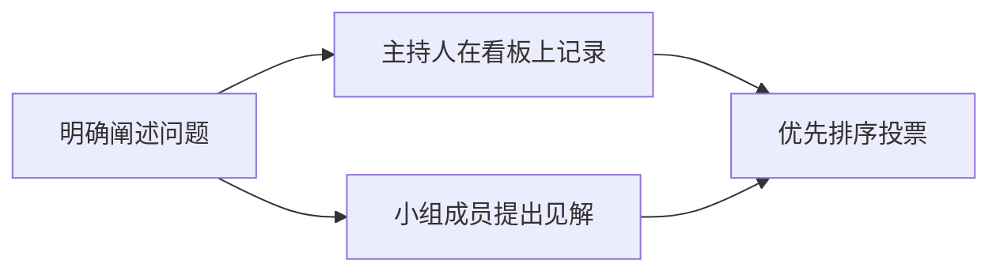
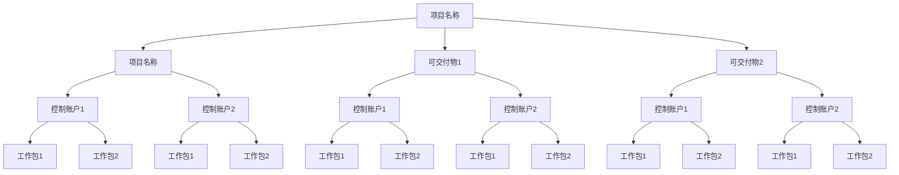
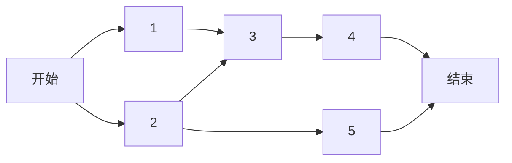

---

#  名义小组技术&观察&引导&原则法
> 课时：55
> 小结：51

## 名义小组技术（结构化的头脑风暴）
- 使不善言辞者也能充分的发表意见

结构化头脑风暴：



> 真正发言的就几个人， 不善言辞的人则不会发言
> 目的是让所有人都需要强制发言
>
> 主持人：
> 说明讨论目标
> 给每个人 15 分钟考虑时间
> 每个人都要发言
> 优先排序， 择优录取


## 人际关系与团队技能 -- 观察

观察，也称为“工作跟随”，通常由旁站观察者观察业务专家如何执行工作，
但也可以由“参与观察者”来观察，通过实际执行一个流程或程序，
来体验该流程或程序是如何实施的，以便挖掘隐藏的需求。

> 方式一：旁站式观察
> 方式二：体验式观察


## 人际关系与团队技能 -- 引导

与焦点小组最大的区别在于引导：
* 规模无限制 (焦点小组人数少)
* 跨职能干系人参加 
  * 快速定义跨职能需求
  * 协调干系人差异，<u>**干系人达成共识**</u> （目的在于意见达成一致， 焦点小组在于得到方案）
   

## 原型法

原型法是指在实际制造预期产品之前，先造出该产品的模型，并据此征求对需求的早期反馈。

适用场景：
> 客户需求不够明确，想和客户快速达成一致，适用于新系统或大型复杂系统。

原型法可以测试出不同解决方案所产生的不同结


# 总结

- **名义小组技术**：结构化头脑风暴
- **观察**：旁站式&体验式观察
- **引导**：跨职能干系人达成共识
- **原型法**：复杂项目模型验证


---


# 输出：需求文件&需求跟踪矩阵
| 标题 | 课时 | 章节 |
| --- | --- | --- |
| 进度 | 56 | 52 |


## 需求文件


<u>记录</u> 项目干系人对项目的各种具体需求，渐进明细。
是明确的（可测量和可测试的）、可跟踪的、完整的、相互协调的且主要干系人愿意认可的业务和项目目标、需求、验收标准、假设条件和制约因素等。


**产品功能需求**

* 需求名称
* 需求描述
* 触发条件
* 输入
* 处理步骤
* 输出
* 流程
* 数据字典
* 权限
* 业务规则


**项目需求**

* 项目目
* 项目里程
* 项目进度要
* 项目范
* 项目质量要
* 项目成本要
* 项目风险要
* 项目交付物要
* 项目验收要
* 项目付款要


**产品性能需求**

* 安全
* 性能 （性能需求比较容易忽略）
* 易用性
* 可靠性
* 可维护性
* 可测试性
* 健壮性
* 接口需求


## 需求跟踪矩阵

需求跟踪矩阵。把产品需求从其来源连接到能满足需求的可交付物的一种表格。

使用需求跟踪矩阵，**把每个需求与业务目标或项目目标联系起来**，有助于确保每个需求都具有商业价值。

需求跟踪矩阵提供了在整个项目生命周期中跟踪需求的一种方法，**有助于确保需求文件中被批准的每项需求在项目结束的时候都能交付。**


## 总结

| 知识点 | 重点 |
| :--- | :--- |
| 需求文件 | 记录所有需求的文件 |
| 需求跟踪矩阵 | 每个需求与项目目标关联 |


---


# 过程：范围定义
| 标题 | 课时 | 章节 |
| --- | --- | --- |
| 进度 | 57  | 53  |


## 定义范围


**输入**
1. 项目管理计划
   1. 范围管理计划
1. 项目章程
1. 项目文件
   1. 假设日志
   1. 需求文件
   1. 风险登记册
1. 事业环境因素
1. 组织过程资产


**工具与技术**
1. 专家判断
1. 数据分析
   1. **备选方案分析**
1. 决策
   1. **多标准决盖分析**
1. 人际关系与团队技能
   1. 引导
1. **产品分析**


**输出**


1. 项目范围说明书
2. 项目文件（更新）
   1. 假设日志
   2. 需求文件
   3. 需求跟踪矩阵
   4. 干系人登记册


## 本节知识点

| 知识点 | 重点 |
| :--- | :--- |
| 工具 | 备选方案分析<br>多标准决策分析<br>产品分析 |
| 需求跟踪矩阵 | 项目范围说明书 |


---


# 输出：项目范围说明书
| 标题 | 课时 | 章节 |
| --- | --- | --- |
| 进度 | 58  | 54 |


# 项目范围说明书

项目范围说明书详细描述项目的可交付物，

**在项目规划时被创建**

以及为提交这些可交付物而必须开展的工作。
* 可交付物
* 产品范围描述 （工作过程）
* **验收标准** （试题中出现对可交付物不满意的时候，多半是验收标准没有定义清晰）
* 项目的除外责任

## 本节知识点

| 知识点 | 重点 |
| :--- | :--- |
| 项目范围说明书 | 产品范围描述+可交付物；<br>验收标准+项目除外责任 |


---


# 过程：创建 WBS
| 标题 | 课时 | 章节 |
| --- | --- | --- |
| 进度 | 59  | 55 |


## 创建 WBS 

**WBS** 
> 全称：__Work Breakdown Structure__ 
> 工作分解结构

建立 WBS 的过程
把项目的工作进行分解
负责的事情拆解为简单的事情


**输入**
1. 项目管理计划
   1. 范围管理计划
2. 项目文件
   1. 项目范围说明书
   2. 需求文件
3. 事业环境因素
4. 组织过程资产


**工具与技术**
1. 专家判断
1. 分析
   

**输出**
1. 范围基准
2. 项目文件（更新）
   1. 假设日志
   2. 需求文件


## 范围基准

范围基准是经过批准的范围说明书、WBS和相应的 WBS词典，

只有通过正式的变更控制程序才能进行变更，它被用作比较的基础。


> 范围基准 = 范围说明书 + WBS + WBS词典


> 范围说明书：没有拆解
> WBS：细致的分解，工作过程中不断地进行监控
> WBS 词典：每个分解内容的进一步描述， 避免出现一些含义的歧义


## 本节知识点

| 知识点 | 重点 |
| :--- | :--- |
| 工具 | 分解 |
| 输出 | 范围基准 |


---

# 输出：WBS&WBS 词典
| 标题 | 课时 | 章节 |
| --- | --- | --- |
| 进度 | 59  | 55 |


## WBS

复杂的工作简单化 -> 简单的事情要量化 -> 量化的事情专业化

WBS是工作分解结构（ Work Breakdown Structure ）的缩写
* WBS的组件：控制账户（ Control Account ） ：： 对应一个执行者，负责对应的工作包。方便项目经理控制进度。 注意：控制账户可以接受多个工作包，但是每个工作包只对应一个控制账户
* WBS的组件：工作包（ Work Packages ）用于未来估算
* 每个工作包都是控制账户的一部分，而控制账户则是一个管理控制点。在该控制点上，把范围、预算和进度加以整合，并与挣值相比较，以测量绩效。控制账户拥有两个或更多工作包，但每个工作包只与一个控制账户关联。

> <br>
> <u>简言之，WBS是一种将复杂任务分解为简单任务的方法。</u>
> <br>
> <br>

把底层所有工作逐层向上汇总，确保没有遗漏工作，也没有增加多余的工作
- 全部最底层的工作包全部相加等于最终的可交付物


**WBS的形态展示**



## WBS 分解

系统拆解
- 包括项目管理
- 包括培训（服务）
- 数据
- 设备
- 设施
- 测试与评价
- 实体和交付物


有助于详细的价格估算， 比如报价


## WBS 词典

WBS词典：针对工作分解结构中的每个组件，详细描述可交付物、活动和 **进度信息** 的文件。


| WBS标识 | 组件名称 | 工作描述 |
| --- | --- | ---|
| 1.2 | 中文手稿 | 与手稿有关的范围，它包括一系列的文档，如以下部分所描述 |
| 1.2.1 | 目录 | 一个包含了本书目录的文档。应用与管理类著作相关的模板来生成 |
| 1.2.2 | 引言 | 对本书的介绍 |
| 1.2.3 | 章节 | 由13个文档组成的著作正文。<br>每个文档都是著作中的一张，包括文字、图片、表格、图形、使用技巧框和注脚 |


## 习题：

```
工作分解结构最好被认是谁的沟通的有效辅助工具？
A. 团队
B. 项目经理
C. 客户
D. 干系人
```

答案：**D**

> 解析：
> 团队啊，老板啊， 这些都属于干系人的范围， 其他的选项都比较片面


---

# 章节习题
| 标题 | 课时 | 章节 |
| --- | --- | --- |
| 进度 | 60  |  |


## 错题分析

```
6. 目管理计划应该是现实的，以便于用来管理项目。以下哪项是实现现实的项目管理计划的最佳方法？

A.	发起人根据项目经理的意见创建项目管理计划。

B.	职能经理根据项目经理的输入创建项目管理计划。

C.	项目经理根据高级管理层的意见来制定项目管理计划。

D.	项目经理根据团队的输入来制定项目管理计划。


```

我选了：C

正确项：D

### 解析
> 项目经理作为项目的直接负责人，需要全面协调和管理项目的各个方面。而团队成员是项目的具体执行者，他们对项目工作的具体内容、技术难度、所需资源、时间要求等实际情况最为了解。项目经理根据团队的输入来制定项目管理计划，能够充分考虑到项目执行过程中的各种实际因素，使计划更符合实际情况，具有更高的可行性和可操作性，便于在项目实施过程中进行有效的管理和控制。
选项A. 发起人通常更关注项目的整体目标、战略意义以及资金等宏观层面的问题，虽然他们对项目有重要的决策权，但他们可能并不了解项目的具体细节和执行过程中的实际情况，仅根据项目经理的意见来创建项目管理计划可能会导致计划缺乏可操作性，与实际执行情况脱节。
选项B.职能经理主要负责特定职能领域的工作，如技术、人力资源、财务等，他们可能对自己职能范围内的事情比较熟悉，但缺乏对项目整体的全面视角，而且可能会过于关注本职能部门的利益和需求，从职能部门的角度出发创建的项目管理计划可能无法很好地协调各部门之间的工作，也难以保证计划的全面性和现实性。
选项C. 高级管理层通常具有更宏观的战略眼光和决策权力，但他们可能远离项目的具体执行层面，对项目的实际操作细节和团队的实际能力了解有限。仅根据高级管理层的意见制定计划，可能会使计划过于理想化，缺乏对实际执行过程中可能遇到的问题和困难的考虑，导致计划在实施过程中遇到诸多障碍。

<br>
<br>
<br>

```
9. 要准备好做一个完整的开发和最终确定范围基准的工作，需要你在识别和分析相关方以及收集需求方面做得彻底而及时。制定工作分解结构由（ ）参与可以最好的描述。

A.	职能经理
B.	项目团队
C.	所有的相关方
D.	业务分析员

```

我选了：D

正确项：B

### 解析
> 项目团队成员直接参与项目的执行，对项目的具体工作内容、流程和技术要求等有深入的了解。他们能够根据项目的实际情况，将项目工作合理地分解为具体的任务和可交付成果，确定工作之间的逻辑关系和层次结构，从而制定出详细、准确、可行的 WBS。所以项目团队参与制定 WBS 是最合适的，能够全面考虑项目的各个方面，确保 WBS 的完整性和有效性。
选项A. 职能经理通常负责特定职能领域的工作，他们可能对项目的整体目标和具体工作细节了解不够全面，在制定 WBS 时可能仅从自己的职能角度出发，无法涵盖项目的所有方面，不能很好地完成 WBS 的制定工作。
选项C. 所有相关方虽然都与项目有利益关系，但他们对项目工作的了解程度和专业角度各不相同，让所有相关方都参与 WBS 的制定，可能会导致意见过于分散，难以形成统一、有效的 WBS。而且有些相关方可能并不具备足够的专业知识来对项目工作进行合理分解，反而会影响制定 WBS 的效率和质量。
选项D. 业务分析员主要侧重于对业务需求和流程的分析，虽然能从业务角度提供一定的信息，但对于项目中的技术工作、项目管理流程等方面可能了解有限，无法独自完成一个全面、详细的 WBS 制定工作，在制定 WBS 时需要与项目团队其他成员密切配合。

<br>
<br>
<br>

```
10. 
你所管理的一个公路更新项目似乎有一些遗漏的范围。你对项目范围的理解是，公路要重新铺设。现在，一个建筑工头来问，为什么他发现没有提到在重新铺设的道路上重新画线的问题。他还想知道该项目中是否有更换护栏的工作包。你已经看到了一些已经完成的重铺的道路，上面画着新的线路。以下哪项最可能造成对项目范围说明的误解？


A.	不精确的语言
B.	模式、结构和时间顺序不佳
C.	工作包的大小或工作的细节有差异
D.	细节太多

```

我选了：C

正确项：A

### 解析
> 在项目范围说明中，如果使用了不精确的语言来描述公路重新铺设的工作，就可能导致不同人员对范围的理解产生偏差。例如，仅说 “公路要重新铺设”，没有明确说明是否包括重新画线以及更换护栏等工作内容，没有清晰界定 “重新铺设” 的具体工作边界，这就容易让建筑工头产生疑问，不知道这些工作是否属于项目范围，同时也能解释为什么会出现已经完成重铺的道路上却画了新线（可能有人对范围的理解包含了重新画线），所以不精确的语言最可能造成对项目范围说明的误解，该选项正确。
选项B. 模式、结构和时间顺序主要涉及项目范围说明的组织方式以及各项工作的先后顺序等方面。而题干中主要问题是对 “重新铺设” 工作具体包含内容的理解不一致，并非是范围说明的模式、结构和时间顺序存在问题导致的误解，所以该选项不符合。
选项C. 工作包的大小和工作细节的差异一般会影响到项目的计划、执行和监控等方面，比如资源分配、进度安排等。但对于本题中关于 “重新铺设” 工作是否包含重新画线和更换护栏的范围理解问题，工作包大小和细节差异不是主要原因，主要还是因为对范围描述的语言不清晰，所以该选项不正确。
选项D. 如果项目范围说明细节太多，可能会使阅读者难以抓住重点，但一般不会直接导致对范围的理解出现像本题中这样关于工作内容是否包含的误解。而且题干中并没有体现出是因为细节过多而导致的问题，主要还是描述不精确的问题，所以该选项也不合适。


---
5. 规划过程组

# 过程：规划进度管理
| 标题 | 课时 | 章节 |
| --- | --- | --- |
| 进度 | 62  | 57 |

## 规划进度管理


**输入**
1. 项目管理计划
	1. 范围管理计划
	2. 开发方法
2. 项目章程
3. 事业环境因素
4. 组织过程资产


**工具与技术**
1. 专家判断
1. 数据分析
	1. **备选方案分析**
2. 会议

**输出**
1. 进度管理计划

分两个部分：

- 如何定义进度的步骤和流程
- 制定进度的标准和规则


## 本节知识点

| 知识点 | 重点 |
| :--- | :--- |
| 输出 | 进度管理计划 |


---

5. 规划过程组

# 过程：定义活动

| 标题  | 课时  | 章节  |
| --- | --- | --- |
| 进度  | 63  | 58  |

**输入**
1. 项目管理计划
	1. 进度管理计划
	2. 范围基准
2. 事业环境因素
3. 组织过程资产


**工具与技术**
1. 分解
2. <u>滚动式规则</u>
3. 专家判断
4. 会议

**输出**
1. 活动清单
2. 活动属性
3. <u>里程碑清单</u>
4. 变更请求
5. 项目管理计划（更新）
	1. 进度基准
	2. 成本基准


## 本节知识点

| 知识点 | 重点 |
| :--- | :--- |
| 工具 | 分解<br>滚动式规划 |
| 输出 | 活动清单<br>活动属性<br>里程碑清单 |

---


5. 规划过程组

# 工具：滚动式规划
| 标题 | 课时 | 章节 |
| --- | --- | --- |
| 进度 | 64  | 59 |


滚动式规划。一种用迭代方法进行的规划，对近期要完成的工作进行详细规划，对远期工作只做粗略规划。

未来不确定的因素太多，不要对太长久之后的事情做详细的规划，只对近期的事情做规划， 大局有一个整体的计划

随着项目时间的推进再逐步的完善后继的计划


## 本节知识点

| 知识点 | 重点 |
| :--- | :--- |
| 滚动式规划 | 近细远粗，渐进明细 |


---


5. 规划过程组

# 输出：里程碑清单
| 标题 | 课时 | 章节 |
| --- | --- | --- |
| 进度 | 65  | 60 |


## 里程碑清单

* 项目中的重要时点或事件，历时为0。
* 里程碑清单列出了所有里程碑，并指明每个里程碑是强制性的（如合同要求的）还是选择性的（如根据历史信息确定的）


解析：
>
> 里程碑对应了明确的时间点，所以实际上里程碑的持续时间为 0
>
> **强制性里程碑**： 写在合同中， 和验收和
>
> **选择性里程碑**：项目经理有主导权，根据项目需求来定
>
> 里程碑的数量视情况而定， 不是越多越好


| 知识点 | 重点 |
| :--- | :--- |
| 里程碑清单 | 持续时间为 0，强制和选择性 |


---


5. 规划过程组

# 过程：排列活动顺序
| 标题 | 课时 | 章节 |
| --- | --- | --- |
| 进度 | 66  | 61 |


**输入**
1. 项目管理计划
	1. 进度管理计划
	2. 范围基准
2. 项目文件
   1. 活动清单
   2. 活动属性
   3. 假设日志
   4. 里程碑清单
3. 事业环境因素
4. 组织过程资产


**工具与技术**
1. <u>紧前关系绘图法</u>
2. <u>确定和整合依赖关系</u>
3. <u>提前量和之后两</u>
4. 项目信息管理系统

**输出**
1. 项目进度网络图
2. 活动属性
3. 项目文件（更新）
   1. 活动清单
   2. 活动属性
   3. 假设日志
   4. 里程碑清单


| 知识点 | 重点 |
| :--- | :--- |
| 工具 | 紧前关系绘图法<br>确定和整合依赖关系<br>提前量和滞后量<br>项目管理信息系统 |
| 输出 | 项目进度网络图 |

---

5. 规划过程组

# 工具: 紧前关系绘图法
| 标题 | 课时 | 章节 |
| --- | --- | --- |
| 进度 | 67  | 62 |


## 紧前关系绘图法

**示例：**

| # | 任务 | 前置任务 | 资源 |
| --- | --- | --- | --- |
| 1 | 获取花园材料 | | 房东 |
| 2 | 打扫地块 | | 甲和乙 |
| 3 | 准备土壤 | 1,2 | 甲 |
| 4 | 种花 | 3 | 甲 |
| 5 | 种草 | 2 | 甲 |

> 制约因素会写在 **假设日志** 中
> 也叫 <活动节点法>

## 活动节点法 (Activity-on-Node)



## 紧前关系绘图法使用4种逻辑关系


- **只有紧前活动**...，**紧后活动才能**....的逻辑关系


**FS**: 完成 - 开始
> 先洗锅再炒菜

**SS**: 开始 - 开始
> 主人开始，客人才可以开始

**SF**: 开始 - 完成
> 新系统上线后，旧系统化再下线 （这里需要注意一下和 FS 的区别， 是有前后关系的）

**FF**: 完成 - 完成
> 预案审批先完成，领导最后签字才能跟着一起完成


| 知识点 | 重点 |
| :--- | :--- |
| 紧前关系绘图法：| 节点表示活动，箭线表示逻辑顺序 |
| 4种逻辑关系 | 完成-开始<br>开始-开始<br>完成-完成<br>开始-完成 |

---

5. 规划过程组

# 工具: 确定和整合依赖关系
| 标题 | 课时 | 章节 |
| --- | --- | --- |
| 进度 | 68  | 63 |


## 确定和整合依赖关系

四种依赖关系：

- **强制性依赖关系**：合同要求的或工作的内在性质决定的依赖关系。<u>这种类型的依赖关系通常不能改变。</u>
- **选择性依赖关系**：一种基于最佳实践或项目偏好的关系。这种类型的依赖关系可以改变。
- **外部依赖关系**：项目活动与非项目活动之间的关系。<u>这种类型的依赖关系通常不能改变。</u>
- **内部依赖关系**：一个或多个项目活动之间的关系。这种类型的依赖关系可以改变。


| 知识点 | 重点 |
| :--- | :--- |
| 4种依赖关系 | 强制性依赖<br>选择性依赖<br>外部依赖<br>内部依赖 |


---

5. 规划过程组

# 工具: 提前量和滞后量
| 标题 | 课时 | 章节 |
| --- | --- | --- |
| 进度 | 69  | 64 |


## 提前量和滞后量

提前量。相对于紧前活动，紧后活动可以提前的时间量。
滞后量。相对于紧前活动，紧后活动需要推迟的时间量。

都是针对紧后活动的，提前量和滞后量的使用不能取代进度逻辑关系。


### 滞后 （Lag）


活动 A 完成 2 天后，活动 B 才能开始


> 刷油漆，第一遍刷完，必须干了 2 天后再刷第二遍


### 提前 （Leading）


活动 A 完成 2 天前，活动 B 就开始

> 当前流程进度到审核阶段，后继流程就可以开始了


| 知识点 | 重点 |
| :--- | :--- |
| 提前量 | 提前紧后活动的开始时间，压缩进度 |
| 滞后量 | 推迟紧后活动的开始时间，延后进度 |


## 习题

滞后是指什么？
A.一项活动在不耽误项目完成日期的情况下可以推迟的时间量。
B.一项活动在不推迟其后续活动的早期开始日期的情况下可以推迟的时间量
C.等待的时间
D.前进和后退

正确选（ C ）

A: 滞后有可能会导致延期的
B: 滞后是指针对紧后活动而言的， 题目中是针对紧前的，因此不对
C: 没毛病
D: 定义错误


---

5. 规划过程组

# 过程: 估算活动持续时间
| 标题 | 课时 | 章节 |
| --- | --- | --- |
| 进度 | 70  | 65 |


## 估算活动持续时间

**输入**
1. 项目管理计划
	1. 进度管理计划
	2. 范围基准
2. 项目文件
   1. 活动属性
   2. 活动清单
   3. 假设日志
   4. 经验教训登记册
   5. 里程碑清单
   6. 项目团队派工单
   7. 资源分解结构
   8. 资源日历
   9. 资源需求
   10. 风险登记
3. 事业环境因素
4. 组织过程资产

**工具与技术**
1. 专家判断
2. <u>类比估算</u>
3. <u>参数估算</u>
4. <u>三点估算</u>
5. <u>自下而上估算</u>
6. 数据分析
   1. 备选方案分析
   2. <u>储备分析</U>
7. 决策
   1. 投票
8. 会议


**输出**

1. 持续时间估算
2. 估算依据
3. 项目文件（更新）
   1. 活动属性
   2. 假设日志
   3. 经验教训登记册

## 估算持续时间时需要考虑的其他因素


- **收益递減规律。**<br>在保持其他因素不变的情况下，增加一个用于确定单位产出所需投入的因素（如资源）会最终达到一个临界点，在该点之后的产出或输出会随着增加这个因素而递减。

- **资源数量。**<br>增加资源数量，使其达到初始数量的两倍不一定能缩短一半的时间，因为这样做可能会因风险而造成持续时间增加；<br>在某些情况下，如果增加太多活动资源，可能会因知识传递、学习曲线、额外合作等其他相关因素而造成持续时间增加。

- **技术进步。**<br>在确定持续时间估算时，这个因素也可能发挥重要作用。<br>例如，通过采购最新技术，制造工厂可以提高产量，而这可能会影响持续时间和资源需求。

- **员工激励。**<br>项目经理还需要了解“学生综合征”（即拖延症）和帕金森定律，<br>前者指出，人们只有在最后一刻，即快到期限时才会全力以赴：<br>后者指出，只要还有时间，工作就会不断扩展，直到用完所有的时间。


| 知识点   | 重点                                   |
| :---- | :----------------------------------- |
| 工具    | 类比<br>参数<br>三点<br>自下而上估算、备选方案<br>储备分 |
| 考虑的因素 | 收益递减规律<br>资源数量<br>技术进步<br>员工激励       |


思考

> 为了提升项目进度
> 不能一味的增加成本
> - 考虑使用新技术
> - 为员工设定更加激进的截止日期


---
