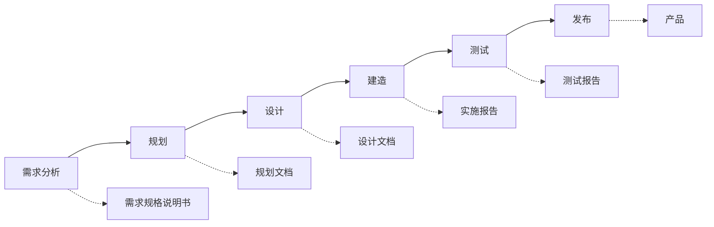
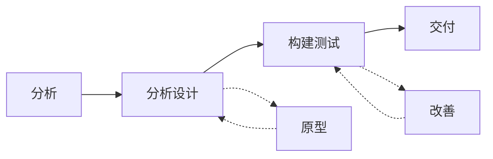
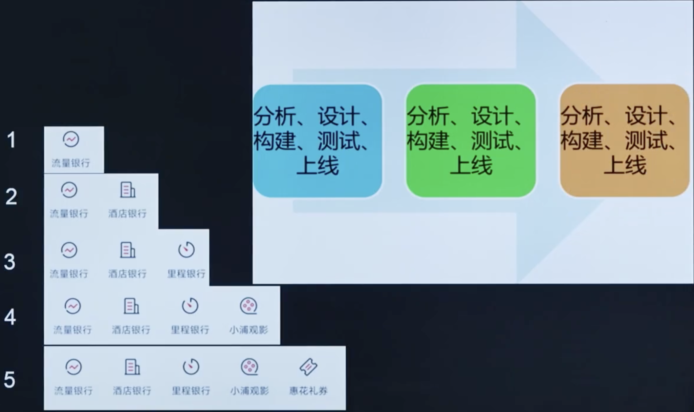
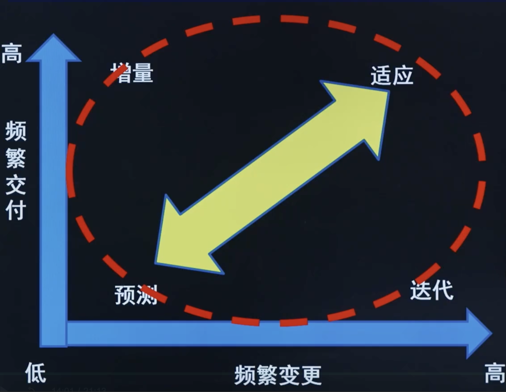

# 第3阶段: 《敏捷实践指南》

# 第1章: 生命周期选择

# 课时 182 : 课前思考

| 标题  | 课时  | 章节  |
| --- | --- | --- |
| 进度  | 182  | 1 |

## 习题解析

产品负责人对范围不清晰，项目需要多次迭代，产品负责人对最后完成期限表示担忧，问项目经理应该采用什么样的方式？

   - [ ] A. 预测型
   - [ ] B. 迭代型  
   - [ ] C. 敏捷型
   - [ ] D. 混合型

> 解析：
> 根据题目描述，这是一个范围不明确、需要多次迭代的项目，同时对交付时间有担忧。这种情况下应该选择能够应对需求变化、允许迭代开发且能够控制时间的项目管理方式。

> 本章会学到以上各种不同的生命周期，让我们来学习一下哪种更适合这个题目吧。

---

# 课时 183 : 预测&迭代&增量&适应型生命周期

| 标题  | 课时  | 章节  |
| --- | --- | --- |
| 进度  | 183  | 2 |

## 预测型生命周期

这是一种更为传统的方法，提前进行大量的计划工作，然后一次性执行；执行是一个连续的行程。

## 瀑布式生命周期流程图

瀑布式生命周期是一种顺序性的项目管理方法，每个阶段产生特定的交付物，为下一阶段提供输入。各阶段按照线性顺序执行，强调文档驱动和阶段门控制。

> 凡事预则立，不预则废

## 迭代型生命周期

这种方法允许对未完成的工作进行反馈，从而改进和修改该工作。

## 迭代式生命周期流程图

迭代式生命周期通过重复的周期来逐步完善产品。在分析设计阶段通过原型来验证和改进设计，在构建测试阶段通过改善来优化实现。这种方法允许在每个迭代中获得反馈并持续改进，比瀑布式更灵活。

> 多次迭代，一次交付

## 增量型生命周期

这种方法向客户提供各个已完成的，可能立即使用的可交付成果。

> 交付生命周期，是将产品拆分成多个系统，每次都交付一个完整的功能
> 关注交付速度
> 多次迭代，多次交付

## 适应型生命周期 （敏捷开发）

这种方法既有迭代，也有增量，便于完善工作，频繁交付。

## 本节知识点

| 序号 | 知识点 | 重点 |
| :--- | :--- | :--- |
| 1 | 预测型生命周期 | 一次规划，一次交付 |
| 2 | 迭代型生命周期 | 应对需求，反复调整 |
| 3 | 增量型生命周期 | 应对市场，多次交付 |
| 4 | 适应型生命周期 | 应对需求和市场，定期交付 |

## 练习题

产品负责人对范围不清晰，项目需要多次迭代，产品负责人对最后完成期限表示担忧，问项目经理应该采用什么方式？

   - [ ] A. 预测型
   - [ ] B. 迭代型  
   - [x] C. 敏捷型
   - [ ] D. 混合型

> 解析：
> 应该选 C
> 题目描述的情况是范围不明确、需要多次迭代且对交付时间有担忧，这种情况下敏捷型生命周期最为适合，因为敏捷方法强调应对变化、快速响应需求，同时通过短迭代周期确保及时交付价值。
> A: 不适应多次修改的需求（需求范围不明确）
> B: 多次迭代容易出现时间延期

---  

