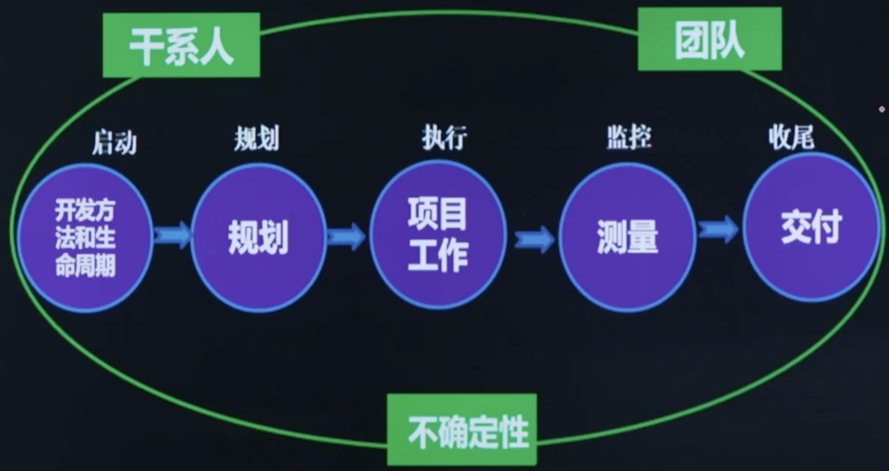

# 第2章: 项目绩效域

# 课时 247 : 课前思考

# 课时 248 : 项目绩效域概况

| 标题  | 课时  | 章节  |
| ---- | ---- | ---- |
| 进度  | 248  | 10 |

## 八大绩效域的意义和作用

绩效域代表着一组能有效地交付项目成果且至关重要的相关活动。项目管理指南中有八个项目绩效域。

- 开发方法和生命周期、规划、项目工作、测量、交付绩效域形成闭环指导项目经理按照流程做事；
- 干系人和团队绩效域指导项目经理领导项目团队和管理干系人；
- 不确定性绩效域指导项目经理通过管理风险实现商业价值。

## 本节知识点

| 序号 | 知识点 | 重点 |
| :--- | :--- | :--- |
| 1 | 流程 | 开发方法和生命周期、规划、项目工作、测量、交付绩效域 |
| 2 | 人员 | 干系人和团队绩效域 |
| 3 | 商业环境 | 不确定性绩效域 |

## 习题解析

在一个大型建筑工程项目中，项目经理正在全面考虑八大项目管理绩效域以确保项目成功交付。以下关于项目经理在各绩效域做法的描述，正确的是哪一个？

   - [ ] A. 在干系人绩效域，项目经理只关注与业主和主要供应商的沟通，认为其他干系人对项目影响较小，无需过多投入精力
   - [ ] B. 在规划绩效域，制定了详细的项目计划后，项目经理便严格按照计划执行，不考虑任何变更，以确保计划的严肃性
   - [ ] C. 在项目工作绩效域，为了加快进度，项目经理要求团队成员跳过一些质量检查环节，先完成工作任务再说
   - [x] D. 在不确定性绩效域，项目经理定期组织风险识别和评估会议，根据风险的变化及时调整应对策略，以降低风险影响

> 解析：
> 应该选 D
> A选项错误：干系人绩效域要求识别、分析和管理所有干系人，而不仅仅是业主和主要供应商。
> B选项错误：规划绩效域强调计划应具有适应性，需要根据实际情况进行调整和变更。
> C选项错误：项目工作绩效域强调质量管理，不能为了进度而跳过质量检查环节。
> D选项正确：不确定性绩效域的核心就是识别、评估和应对风险，定期组织风险会议并及时调整策略是正确的做法。

---

# 选修： 开发方法和生命周期&规划绩效域（选修）

| 标题  | 课时  | 章节  |
| ---- | ---- | ---- |
| 进度  | --  | 11 |

## 开发方法和生命周期绩效域成果检查

根据项目特点，选择适宜的交付节奏和开发方法

| 预期目标 | 指标及检查方法 |
| :--- | :--- |
| 开发方法与项目可交付物相符合 | ==产品质量和变更成本==：采用适宜的开发方法（预测型、混合型或适应型）可交付物的产品变量比较高，变更成本相对较小。 |
| 将项目交付与干系人价值紧密联系 | ==价值导向型项目阶段==：按照价值导向将项目工作从启动到收尾划分为多个项目阶段，项目阶段中包括适当的退出标准。 |
| 项目生命周期由促进交付节奏的项目阶段和产生项目交付物所需的开发方法组成 | ==适宜的交付节奏和开发方法==：如果项目具有多个可交付物，且交付节奏和开发方法不同，可将生命周期阶段进行重叠或重复。 |

> 将项目交付与干系人价值紧密联系: 项目能够持续提供价值
> 考试时，会让你根据情况判断项目在绩效域那个方面出现了问题

## 规划绩效域成果检查

规划的整体性、详尽程度、适宜性、充分性、可适应变化的能力

| 预期目标 | 指标及检查方法 |
| :--- | :--- |
| 项目以有条理、协调一致的方式推进 | ==绩效偏差==：对照项目基准和其他度量指标对项目结果进行绩效审查表明项目正在按计划进行，绩效偏差处于临界值范围内。 |
| 应用系统的方法交付项目成果 | ==规划的整体性==：交付进度、资金提供、资源可用性、采购等表明项目是以整体方式进行规划的，没有差距或不一致之处。 |
| 对演变情况进行详细说明 | ==规划的详尽程度==：与当前信息相比，可交付物和需求的初步信息是适当的、详尽的；与可行性研究与评估相比，当前信息表明项目可以生成预期的可交付物和成果。 |
| 规划投入的时间成本是适当的 | ==规划适宜性==：项目计划和文件表明规划水平适合于项目。 |
| 规划的内容对管理干系人的需求而言是充分的 | ==规划的充分性==：沟通管理计划和干系人信息表明沟通足以满足干系人的期望。 |
| 可以根据新出现的和不断变化的需求进行调整 | ==可适应变化==：采用待办事项列表的项目，在整个项目期间会对各个计划做出调整。采用变更控制过程的项目具有变更控制委员会，会议的变更日志和文档表明变更控制过程正在得到应用。 |

>

## 本节知识点

| 序号 | 知识点 | 重点 |
| :--- | :--- | :--- |
| 1 | 开发方法和生命周期绩效域 | 根据项目特点，选择适宜的交付节奏和开发方法 |
| 2 | 规划绩效域 | 规划的整体性、详尽程度、适宜性、充分性、可适应变化的能力 |

## 习题解析

在一个大型基础设施建设项目中，项目经理正在依据项目阶段划分的原则开展工作。关于项目阶段的划分与管理，以下做法正确的是哪一个？

   - [ ] A. 项目经理随意划分项目阶段，不考虑项目工作的价值导向，仅依据以往经验确定每个阶段的任务
   - [ ] B. 虽然项目阶段划分时考虑了价值导向，但为了赶进度，跳过了部分阶段的退出标准检查，直接进入下一阶段
   - [x] C. 项目经理按照价值导向将项目工作从启动到收尾划分为可行性研究、设计、施工、验收等多个项目阶段，每个阶段都明确了适当的退出标准，在进入下一阶段前严格检查
   - [ ] D. 项目阶段划分完成后就不再变动，即使项目外部环境发生重大变化，也不重新审视和调整项目阶段划分

> 解析：
> 应该选 C
> A选项错误：项目阶段划分应该基于价值导向，而不是随意划分或仅凭经验。
> B选项错误：不能为了赶进度而跳过退出标准检查，每个阶段的退出标准必须严格执行。
> C选项正确：按照价值导向将项目划分为多个阶段，并为每个阶段设置适当的退出标准，在进入下一阶段前进行严格检查，这是正确的做法。
> D选项错误：项目阶段划分应该具有灵活性，当外部环境发生重大变化时，需要重新审视和调整。

---

# 选修： 选修： 项目工作&测量绩效域（选修）

| 标题  | 课时  | 章节  |
| ---- | ---- | ---- |
| 进度  | --  | 12 |

## 项目工作绩效域成果检查

项目的过程执行情况（包括沟通、实物资源、采购、变更、团队绩效等）

| 预期目标 | 指标及检查方法 |
| :--- | :--- |
| 高效且有效的项目绩效 | ==状态报告==：通过状态报告可以表明项目工作有效率且有效果。 |
| 适合项目和环境的项目过程 | • ==过程的适宜性==：证据表明，项目过程是为满足项目和环境的需要而裁剪的。 • ==过程相关性和有效性==：过程审计和质量保证活动表明，过程具有相关性且正得到有效使用。 |
| 干系人适当的沟通和参与 | ==沟通有效性==：项目沟通管理计划和沟通文件表明，所计划的信息且与干系人进行了沟通。如有新的信息沟通需求或误解，可间接表明干系人的沟通和参与活动缺乏成效。 |
| 对实物资源进行了有效管理 | ==资源利用率==：所用材料的数量、抛弃的废料和返工量表明，资源正得到高效利用。 |
| 对采购进行了有效管理 | ==采购过程适宜==：采购审计表明，所采用的适当流程足以开展采购工作，而且承包商正在按计划开展工作。 |
| 有效处理了变更 | ==变更处理情况==：使用预测型方法的项目已建立变更日志，该日志表明，正在对变更做出全面评估，同时考虑了范围、进度、预算、资源、干系人和风险的影响；采用适应型方法的项目建已建立待办事项列表，该列表显示完成范围的比率和增加新范围的比率。 |
| 通过持续学习和过程改进提高了团队能力 | ==团队绩效==：团队状态报告表明，错误和返工减少，而效率提高。 |

## 测量绩效域成果检查

项目状态度量和改进预测

| 预期目标 | 指标及检查方法 |
| :--- | :--- |
| 对项目状况充分理解 | ==度量结果和报告==：通过审计度量结果和报告，可表明数据是否可靠。 |
| 数据充分，可支持决策 | ==度量结果==：度量结果可表明项目是否按预期进行，或者是否存在偏差。 |
| 及时采取行动，确保项目最佳绩效 | ==度量结果==：度量结果提供了提前指标以及当前状态，可导致及时的决策和行动。 |
| 能够基于预测和评估作出决策，实现目标并产生价值 | ==工作绩效数据==：回顾过去的预测和当前的工作绩效数据可发现，以前的预测是否准确地反映了目前的情况。将实际绩效与计划绩效进行比较，并评估业务文档，可表明项目实现预期价值的可能性。 |

## 本节知识点

| 序号 | 知识点 | 重点 |
| :--- | :--- | :--- |
| 1 | 项目工作绩效域 | 项目的过程执行情况（包括沟通、实物资源、采购、变更、团队绩效等） |
| 2 | 测量绩效域 | 项目状态度量和改进预测 |

## 习题解析

某项目经理负责一个新产品研发项目，在项目执行过程中，需要依据绩效数据评估项目情况。以下关于该项目经理做法的描述，正确的是哪一个？

- [x] A. 项目经理定期回顾过去的预测数据，并将实际绩效与计划绩效进行对比，同时评估业务文档，以此来判断项目实现预期价值的可能性
- [ ] B. 虽然定期收集了实际绩效数据，但项目经理只是简单记录，没有将其与计划绩效进行比较，觉得这样做过于繁琐
- [ ] C. 项目经理从不回顾过去的预测数据，认为只要关注当前的工作进展就足够了，过去的预测对当前工作没有参考价值
- [ ] D. 项目经理只评估业务文档，认为这是判断项目能否实现预期价值的唯一依据，无需关注绩效数据对比

> 解析：
> 应该选 A
> A选项正确：定期回顾过去的预测数据、将实际绩效与计划绩效进行对比、评估业务文档，这是测量绩效域的完整做法，能够全面判断项目实现预期价值的可能性。
> B选项错误：只收集数据而不进行对比分析，无法发挥绩效数据的价值。
> C选项错误：过去的预测数据是重要的参考，能够帮助验证预测的准确性并改进未来的预测。
> D选项错误：仅评估业务文档是不够的，必须结合绩效数据对比才能做出准确判断。

---

# 选修： 项目工作&测量绩效域（选修）

| 标题  | 课时  | 章节  |
| ---- | ---- | ---- |
| 进度  | --  | 12 |

## 项目工作绩效域成果检查

项目的过程执行情况（包括沟通、实物资源、采购、变更、团队绩效等）

| 预期目标 | 指标及检查方法 |
| :--- | :--- |
| 高效且有效的项目绩效 | ==状态报告==：通过状态报告可以表明项目工作有效率且有效果。 |
| 适合项目和环境的项目过程 | • ==过程的适宜性==：证据表明，项目过程是为满足项目和环境的需要而裁剪的。 • ==过程相关性和有效性==：过程审计和质量保证活动表明，过程具有相关性且正得到有效使用。 |
| 干系人适当的沟通和参与 | ==沟通有效性==：项目沟通管理计划和沟通文件表明，所计划的信息与干系人进行了沟通，如有新的信息沟通需求或误解，可以表明干系人的沟通和参与活动缺乏成效。 |
| 对实物资源进行了有效管理 | ==资源利用率==：所用材料的数量、抛弃的废料和返工量表明，资源正得到高效利用。 |
| 对采购进行了有效管理 | ==采购过程适宜==：采购审计表明，所采用的适当流程足以开展采购工作，而且承包商正在按计划开展工作。 |
| 有效处理了变更 | ==变更处理情况==：使用预测型方法的项目已建立变更日志，该日志表明，正在对变更做出全面评估，同时考虑了范围、进度、预算、资源、干系人和风险的影响；采用适应型方法的项目已建立待办事项列表，该列表显示完成范围的比率和增加新范围的比率。 |
| 通过持续学习和过程改进提高了团队能力 | ==团队绩效==：团队状态报告表明，错误和返工减少，而效率提高。 |

## 测量绩效域成果检查

### 项目状态度量和改进预测

| 预期目标 | 指标及检查方法 |
| :--- | :--- |
| 对项目状况充分理解 | ==度量结果和报告==：通过审计度量结果和报告，可表明数据是否可靠。 |
| 数据充分，可支持决策 | ==度量结果==：度量结果可表明项目是否按预期进行，或者是否存在偏差。 |
| 及时采取行动，确保项目最佳绩效 | ==度量结果==：度量结果提供了提前指标以及当前状态，可导致及时的决策和行动。 |
| 能够基于预测和评估作出决策，实现目标并产生价值 | ==工作绩效数据==：回顾过去的预测和当前的工作绩效数据可发现，以前的预测是否准确地反映了目前的情况。将实际绩效与计划绩效进行比较，并评估业务文档，可表明项目实现预期价值的可能性。 |

## 本节知识点

| 序号 | 知识点 | 重点 |
| :--- | :--- | :--- |
| 1 | 项目工作绩效域 | 项目的过程执行情况（包括： 沟通 实物资源 采购 变更 团队绩效等） |
| 2 | 测量绩效域 | 项目状态度量和改进预测 |

## 习题解析

某项目经理负责一个新产品研发项目，在项目执行过程中，需要依据绩效数据评估项目情况。以下关于该项目经理做法的描述，正确的是哪一个？

   - [x] A. 项目经理定期回顾过去的预测数据，并将实际绩效与计划绩效进行对比，同时评估业务文档，以此来判断项目实现预期价值的可能性
   - [ ] B. 虽然定期收集了实际绩效数据，但项目经理只是简单记录，没有将其与计划绩效进行比较，觉得这样做过于繁琐
   - [ ] C. 项目经理从不回顾过去的预测数据，认为只要关注当前的工作进展就足够了，过去的预测对当前工作没有参考价值
   - [ ] D. 项目经理只评估业务文档，认为这是判断项目能否实现预期价值的唯一依据，无需关注绩效数据对比

> 解析：
> 应该选 A
> 根据测量绩效域成果检查中的"工作绩效数据"指标，回顾过去的预测和当前的工作绩效数据可发现以前的预测是否准确地反映了目前的情况。将实际绩效与计划绩效进行比较，并评估业务文档，可表明项目实现预期价值的可能性。选项A完整描述了这一最佳实践。
---

# 选修： 交付&不确定性绩效域（选修）

| 标题  | 课时  | 章节  |
| ---- | ---- | ---- |
| 进度  | --  | 13 |

## 交付绩效域成果检查

项目完成度和价值交付的情况

| 预期目标 | 指标及检查方法 |
| :--- | :--- |
| 项目有助于实现业务目标和战略 | ==**目标一致性**==：组织的战略计划、可行性研究报告以及项目授权文件表明，项目可交付物和业务目标保持一致。 |
| 项目实现了预期成果 | ==**项目完成度**==：项目基础数据表明，项目仍处于正轨，可实现预期成果。 |
| 在预定时间内实现了项目收益 | ==**项目收益**==：进度表明财务指标和所规划的交付正在按计划实现。 |
| 项目团队对需求有清晰地理解 | ==**需求稳定性**==：在预测型项目中，初始需求的变更很少，表明对需求的真正理解度较高。在需求不断演变的适应型项目中，项目进展中阶段性需求确认反映了干系人对需求的理解。 |
| 干系人接受项目可交付物和成果，并对其满意 | • ==**干系人满意度**==：访谈、观察和最终用户反馈可表明干系人对可交付物的满意度。 • ==**质量问题**==：投诉或退货等质量相关问题的数量也可用于表示满意度。 |

## 不确定性绩效域成果检查

风险应对措施的适宜性

| 预期目标 | 指标及检查方法 |
| :--- | :--- |
| 了解项目的运行环境，包括 技术、社会、政治、市场和经济环境等 | ==**环境因素**==：团队在评估不确定性、风险和应对措施时考虑了环境因素。 |
| 积极识别、分析和应对不确定性 | ==**风险应对措施**==：与项目制约因素（例如，预算、进度和绩效）的优先级排序保持一致。 |
| 了解项目中多个因素之间的相互依赖关系 | ==**应对措施适宜性**==：应对风险、复杂性和模糊性的措施适合于项目。 |
| 能够对威胁和机会进行预测，了解问题的后果 | ==**风险管理机制或系统**==：用于识别、分析和应对风险的系统非常强大。 |
| 最小化不确定性对项目交付的负面影响 | ==**项目绩效处于临界值内**==：满足计划的交付日期，预算执行情况处于偏差临界值内。 |
| 能够利用机会改进项目的绩效和成果 | ==**利用机会的机制**==：团队使用既定机制来识别和利用机会。 |
| 有效利用成本和进度储备，与项目目标保持一致 | ==**储备使用**==：团队采取步骤主动预防威胁，有效使用成本或进度储备。 |

## 本节知识点

| 序号 | 知识点 | 重点 |
| :--- | :--- | :--- |
| 1 | 交付绩效域 | 项目完成度和价值交付的情况 |
| 2 | 不确定性绩效域 | 风险应对措施的适宜性 |

## 习题解析

在一个新型医疗设备研发项目中，充满了技术难题、法规政策变化等风险，同时市场需求也存在一定模糊性。项目经理在制定应对策略时，以下做法正确的是哪一个？

   - [ ] A. 照搬以往普通设备研发项目的风险应对措施，认为所有项目的风险应对方式都差不多
   - [x] B. 针对法规政策变化风险，建立政策跟踪机制，及时获取信息并评估对项目的影响，提前制定应对预案
   - [ ] C. 对于技术难题，打算等问题出现后再临时组建专家团队解决，不提前规划应对方案
   - [ ] D. 因为市场需求模糊，就搁置需求分析工作，等需求明确后再开展项目

> 解析：
> 应该选 B
> 选项B体现了主动的风险管理方法，针对法规政策变化风险建立跟踪机制并提前制定应对预案，这是正确的风险应对策略。选项A忽略了项目特殊性，选项C属于被动应对，选项D延误了项目进展，都不是正确的做法。

---

# 选修： 干系人&团队绩效域（选修）

| 标题  | 课时  | 章节  |
| ---- | ---- | ---- |
| 进度  | --  | 14 |

## 干系人绩效域成果检查

干系人的共创和支持

| 预期目标 | 指标及检查方法 |
| :--- | :--- |
| 建立高效的工作关系 | ==**干系人参与的连续性**==：通过观察、记录方式，对干系人参与的连续性进行衡量。 |
| 干系人认同项目目标 | ==**变更的频率**==：对项目范围、产品需求的大量变更或修改可能表明干系人没有参与进来或与项目目标不一致。 |
| 支持项目的干系人提高了满意度，并从中收益；反对项目的干系人没有对项目产生负面影响 | • ==**干系人行为**==：干系人的行为可表明项目受益人是否对项目感到满意和表示支持，或者他们是否反对项目。 • ==**干系人满意度**==：可通过调研、访谈和焦点小组方式，确定干系人满意度，判断干系人是否感到满意和表示支持，或者他们对项目及其可交付物是否表示反对。 • ==**干系人相关问题和风险**==：对项目问题日志和风险登记册的审查可以识别与单个干系人有关的问题和风险。 |

## 高绩效团队的打造

| 预期目标 | 指标及检查方法 |
| :--- | :--- |
| 共享责任 | ==**目标和责任心**==：所有项目团队成员都了解愿景和目标。项目团队对项目的可交付物和项目成果承担责任。 |
| 高绩效团队 | • ==**信任与协作程度**==：项目团队彼此信任，相互协作。 • ==**适应变化的能力**==：项目团队适应不断变化的情况，并在面对挑战时有韧性。 • ==**彼此赋能**==：项目团队感到被赋能，同时项目团队对其成员赋能并认可。 |
| 所有项目团队成员都展现出相关领导力和其他人际关系技能 | ==**管理和领导力风格适宜性**==：项目团队成员运用批判性思维和人际关系技能。项目团队成员的管理和领导力风格适合项目的背景和环境。 |

## 本节知识点

| 序号 | 知识点 | 重点 |
| :--- | :--- | :--- |
| 1 | 干系人绩效域 | 干系人的共创和支持 |
| 2 | 团队绩效域 | 高绩效团队的打造 |

## 习题解析

在一个跨国软件开发项目中，团队成员来自不同国家和文化背景，项目面临着技术难题、紧迫的交付期限以及复杂的沟通协调挑战。项目经理在管理团队和应对项目情况时，以下做法正确的是什么？

   - [ ] A. 项目经理采用单一的指令式领导风格，要求所有成员严格按照自己的指示执行任务，认为这样能提高效率
   - [ ] B. 面对技术难题，团队成员甲凭借自己以往的经验直接给出解决方案，不听取其他成员的意见，认为自己的方法最有效
   - [ ] C. 当团队成员之间出现沟通冲突时，项目经理选择忽视，认为他们自己能够解决，不进行干预
   - [x] D. 项目经理根据项目成员的技能和经验，采用灵活的领导风格，鼓励成员积极沟通协作，共同探讨技术难题的解决方案，同时注重运用批判性思维分析各种方案的可行性

> 解析：
> 应该选 D
> 选项D体现了高绩效团队管理的核心原则：根据团队成员的技能和经验采用灵活的领导风格，鼓励团队协作和积极沟通，运用批判性思维分析问题。这与"管理和领导力风格适宜性"的要求相符。选项A的单一指令式风格缺乏灵活性，选项B忽视团队协作，选项C对冲突采取回避态度，都不是正确的做法。

---

# 选修： 项目绩效域知识点总结（选修）

## 项目绩效域知识点总结

| 知识点分类 | 主要内容 |
| :--- | :--- |
| 干系人绩效域 | 执行效果检查：干系人的共创和支持 |
| 团队绩效域 | 执行效果检查：高绩效团队的打造 |
| 开发方法和生命周期绩效域 | 执行效果检查：根据项目特点，选择适宜的交付节奏和开发方法 |
| 规划绩效域 | 执行效果检查：规划的整体性、详尽程度、适宜性、充分性、可适应变化的能力 |
| 项目工作绩效域 | 执行效果检查：项目的过程执行情况（包括沟通、实物资源、采购、变更、团队绩效等） |
| 度量绩效域 | 执行效果检查：项目状态度量和改进预测 |
| 交付绩效域 | 执行效果检查：项目完成度和价值交付的情况 |
| 不确定性绩效域 | 执行效果检查：风险应对措施的适宜性 |

---