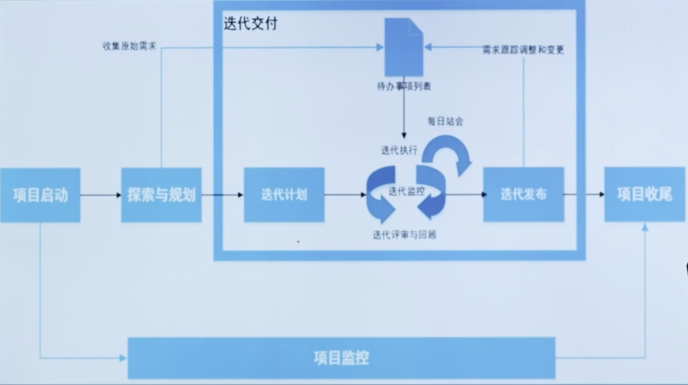
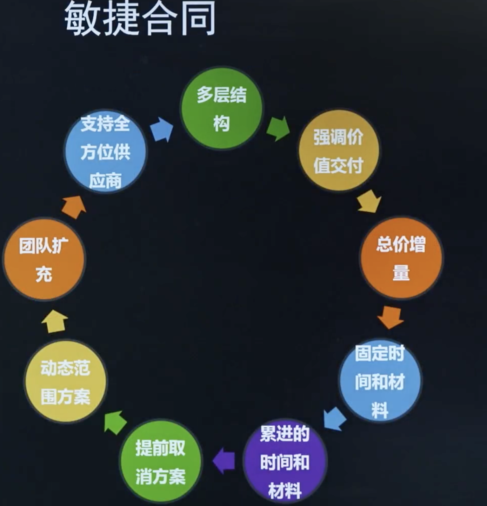
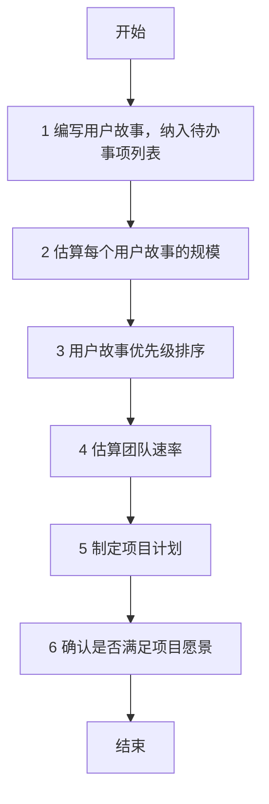
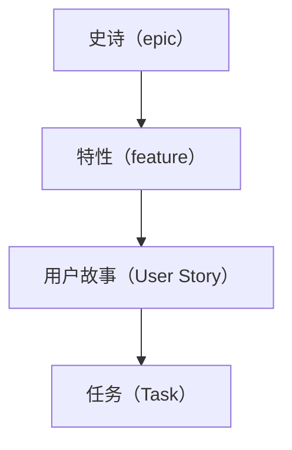
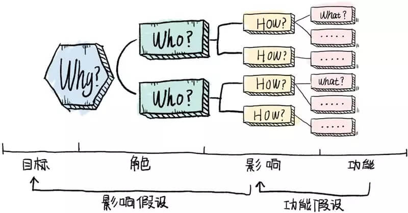
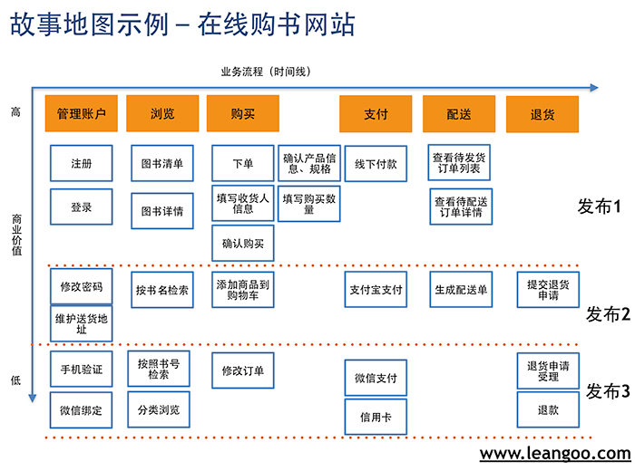
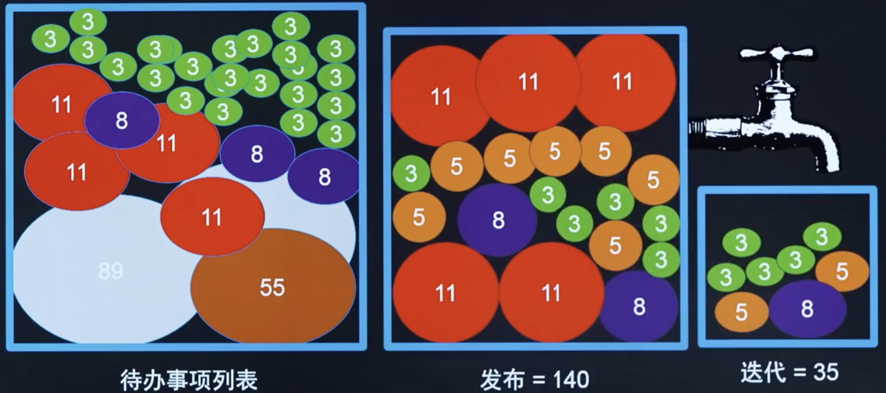

# 第4章: 敏捷项目管理流程

# 课时 205 : 课前思考

> 敏捷框架，敏捷故事点等

# 课时 206 : 敏捷项目流程框架

| 标题  | 课时  | 章节  |
| ---- | ---- | ---- |
| 进度  | 206  | 22 |

## 敏捷项目管理流程框架

敏捷型项目，以价值交付为目标，基于透明、检视与调
整的原则，采用选代的方式进行增量交付。

## 知识点

| 序号 | 知识点 | 重点 |
| :--- | :--- | :--- |
| 1 | 敏捷项目管理流程框架 | 采用迭代方式增量交付 |

## 练习题

在一个敏捷项目中，团队按照敏捷项目交付流程框架开展工作。
在项目执行过程中，遇到了以下情况，请问团队的应对措施正可的是哪一个？

- [x] A. 迭代执行阶段，客户提出新的功能需求。产品负责人立即将该需求添加到产品待办事项列表中，并与团队一起评估该需求后续迭代计划的影响。
- [ ] B. 在迭代执行阶段，团队成员发现之前预估的任务工时严重不足，导致部分任务可能无法按时完成。团队成员没有告知任何人，打算加班完成任务。
- [ ] C. 在迭代规划阶段，产品负责人刚刚确定了本次选代要开发的用户故事，但技术团队认为部分故事技术难度过大，在规定时内无法完成。此时，技术团队直接减少了这些用户故事，按照自己的计划进行开发。
- [ ] D.迭代回顾会议上，团队成员提出了一些改进流程的建议，但由于时间紧张，敏捷教练决定将这些建议留到下个项目再考虑。

> 正确选 A
> A 产品负责人和团队一起评估，这个是 OK 的
> B 加班是不可取的
> C 技术团队直接私自减少用户故事，有问题。应该和产品负责人沟通
> D 回顾但不作出变化是不对的，应该立即实施

---

# 课时 207 : 项目启动

| 标题  | 课时  | 章节  |
| ---- | ---- | ---- |
| 进度  | 207  | 23 |

## 敏捷合同

敏捷合同是一个环形循环的合同模式，包含以下九个核心要素：

1. **多层结构** - 采用分层的合同架构
2. **强调价值交付** - 重点关注价值的实现和交付
3. **总价增量** - 基于增量的总价模式
4. **固定时间和材料** - 时间和材料成本固定
5. **累进的时间和材料** - 递进式的时间材料计费
6. **提前取消方案** - 允许提前终止的机制
7. **动态范围方案** - 灵活调整项目范围
8. **团队扩充** - 支持团队规模的动态调整
9. **支持全方位供应商** - 全面的供应商支持体系

这些要素相互关联，形成一个完整的敏捷合同循环体系，确保项目的灵活性和价值交付。

## 项目章程&团队章程

- 每个项目都需要一个项目章程，这样项目团队就能了解项目之所以重要的原因、团队的前进方向以及项目的目标。
  不过，对于团队而言，仅有项目章程还不够。敏捷团队需要有团队规范以及对一起工作方式的理解。
  这种情况下，团队可能需要一个团队章程。
- 仆人式领导可以促进章程的制定过程。因队可以通过一起工作实现协作，而制定项目章程是一种很好的开始工作的的方式。
  此外，团队成员可能希望通过协作了解他们将如何一起工作。
  只要团队知道如何一起工作，制定章程就不需要一个正式的过程。有些团队可以从团队制定章程的过程中受益。
- 团队章程包括：
  - 团队价值观，例如可持续的开发速度和核心工作时间：只
  - 工作协议，例如“就绪”如何定义，这是团队可以接受工作的前
  - “完成”如何定义，这样团队才能一致地判断完整性；考虑时间盒；或使用工作过程限制：
  - 基本规则，例如有关一个人在会议上发言的规定；
  - 以及团队规范，例如团队如何对待会议时间。
  - 团队的社会契约，即团队章程，将规定团队成员之间彼此互动的方式。

==团队章程的目标是创建一个敏捷的环境，在这个环境中，团队成员可以发挥他们作为团队的最大能力。==

> 敏捷的章程由敏捷负责人和团队成员一起制定，
> 体现了团队的平等协作和组织的自管理

## 本节知识点

| 序号 | 知识点 | 重点 |
| :--- | :--- | :--- |
| 1 | 敏捷合同 | 根据变化调整 |
| 2 | 项目章程 | 明确目标和制约因素 团队章程：明确规则 创造协作环境 |

## 习题解析

在一个新启动的敏捷项目中，团队成员对于如何制定团队章程产生了不同看法。以下观点正确的是哪一个？

   - [ ] A. 团队章程应该由项目经理独立编写，然后分发给团队成员执行，这样能保证章程的权威性
   - [x] B. 制定团队章程时，应召集所有团队成员共同参与讨论，明确团队的价值观、沟通方式、决策机制等关键内容
   - [ ] C. 团队章程只需包含团队的工作时间和休假政策，其他内容在项目进行中再补充
   - [ ] D. 团队章程一旦制定就不能修改，以确保项目执行过程的稳定性

> 解析：
> 应该选 B
> 在敏捷项目中，团队章程的制定应该体现敏捷价值观中的"个体和互动胜过流程和工具"。团队章程需要所有成员共同参与制定，包括价值观、沟通方式、决策机制等关键要素，这样才能确保团队的协作效果和章程的有效执行。
> A: 独立编写错误
> C: 要明确价值观，沟通章程等。
> D: 可以修改

---

# 课时 208 : 探索与规划

| 标题  | 课时  | 章节  |
| ---- | ---- | ---- |
| 进度  | 208  | 24 |

## 敏捷项目探索与规划步骤总览

## 本节知识点

| 序号 | 知识点 | 重点 |
| :--- | :--- | :--- |
| 1 | 先需求 | 编写用户故事，纳入待办事项列表 |
| 2 | 再估算 | 估算每个用户故事的规模 |
| 3 | 排好序 | 用户故事优先级排序 |
| 4 | 稳速率 | 估算团队速率 |
| 5 | 定计划 | 制定项目计划 |
| 6 | 验目标 | 确认是否满足项目愿景 |

## 习题解析

在一个敏捷项目的前期规划阶段，团队需要按照一系列步骤来制定项目计划。以下是关于这些步骤执行顺序及操作的描述，其中正确的是哪一个？

   - [ ] A. 团队首先估算团队速率，然后编写用户故事并纳入待办事项列表，接着对用户故事进行优先级排序，再估算每个用户故事的规模，最后制定项目计划
   - [x] B. 团队先编写用户故事并纳入待办事项列表，之后估算每个用户故事的规模，接着进行用户故事优先级排序，再估算团队速率，最后依据前面的结果制定项目计划
   - [ ] C. 团队直接进行用户故事优先级排序，再编写用户故事纳入待办事项列表，估算每个用户故事的规模，然后估算团队速率，后制定项目计划
   - [ ] D. 团队先估算每个用户故事的规模，再编写用户故事纳入待办事项列表，进行用户故事优先级排序，接着估算团队速率，最后制定项目计划

> 解析：
> 应该选 B
> 根据敏捷项目规划的标准流程，正确的顺序应该是：
> 1) 先编写用户故事并纳入待办事项列表 
> 2) 估算每个用户故事的规模 
> 3) 进行用户故事优先级排序 
> 4) 估算团队速率 
> 5) 制定项目计划。
> 
> 这个顺序确保了在估算和规划之前有明确的需求基础。

---

# 课时 209 : 用户故事&人物角色

| 标题  | 课时  | 章节  |
| ---- | ---- | ---- |
| 进度  | 209  | 25 |

## 用户故事的优势

敏捷方法中，面对客户需求的不清晰如何处理？
面对客户的需求，多问几个为什么
传统的需求表述方式只体现了what，而敏捷的需求表述（用户故事）体现了5W1H

- Who
- What
- When
- Where
- Why
- How

## 用户故事&人物角色

每个需求都是一个用户故事（user story）
用户故事三要素：

1. 作为 <角色＞，在＜时间/地点＞，我根<做什么>，是为了<什么目的/商业价值＞。
2. 于是，我<怎样做/怎样操作>。
3. 最后<如何验证>。

 

**完成的定义（DoD,Definition of Done）**
是指一个工作项（如用户故事、任务等）被认为“完成”时，必须满足的所有条件。
DoD通常由敏捷团队共同制定，包括开发人员、测试人员、产品负责人等，确保每个角色都清楚工作项完成的标准。

**人物角色（Persona）**
是真实用户的虚拟代表，它包含用户的基本信息、行为习惯、需求和痛点等，用于帮助团队理解目标用户，指导产品设计。
人物角色在产品早期和发展阶段尤为重要，能够帮助团队更好地理解用户需求和设计产品。

## DoD 和 DoR

DOR （ Definition of Ready ）和 DoD （ Definition of Done ）是敏捷开发中的重要概念：

**DoR（定义）：**
指一个用户故事在被开发团队接受并进入开发阶段之前必须满足的条件。
它定义了用户故事的准备就绪标准，确保故事是清晰的、可行的、可测试的，并且所有必要的信息都是可用的。
例如，用户故事有明确的验收标准、依赖关系已明确等。

**DoD（定义）：**
指用户故事被视为所需要达到的最低验收条件。
它是需求准出的标准，通常呈现为一份清单形式的简短文档，
例如，代码已完成、单元测试全部通过、部署到测试环境并通过系统测试、通过用户验收测试并签字确认符合需求等。

**区别：**

1. 目的不同：
   - DoR：目的是确保用户故事在开发前已经准备好，减少开发过程中的不确定性和风险。
   - DoD：目的是确保交付质量，明确工作完成的标准，使团队交付的产品增量能够满足客户需求和质量标准。

2. 所处阶段不同：
   - DoR：是关于需求准入的标准，发生在迭代开始时，用于判断一个用户故事是否可以进入开发流程。
   - DoD：是关于需求准出的标准，发生在迭代结束时，用于判断用户故事是否真正完成。

> DOR 是开发前的准备工作，时间：迭代开始
> DoD 是交付的标准，时间：迭代结束

## 本节知识点

| 序号 | 知识点 | 重点 |
| :--- | :--- | :--- |
| 1 | 用户故事 | 三要素 完成的定义 |
| 2 | 人物角色 | 真实用户的虚拟代表 |
| 3 | DoD | 完成的定义，用于验收 DoR：准备就绪，用于准备进入开发阶段 |

## 习题解析

在一个敏捷软件开发项目中，关于用户故事和人物角色的运用，以下说法正确的是什么？

   - [ ] A. 人物角色只是一个虚构的形象，对编写用户故事没有实际帮助，所以可以省略创建人物角色的步骤
   - [ ] B. 用户故事只需要描述功能需求，非功能需求不需要体现在用户故事中
   - [x] C. 为了更好地理解用户需求，创建了多个不同类型的人物角色，基于这些人物角色编写的用户故事更能反映真实用户的需求，并且在编写用户故事时充分考虑人物角色的目标、行为和痛点
   - [ ] D. 一旦确定了人物角色和编写好用户故事，在整个项目过程中都不能进行修改，以保证项目的稳定性

> 解析：
> 应该选 C
> 人物角色是真实用户的虚拟代表，能够帮助团队更好地理解用户需求和设计产品。基于不同类型的人物角色编写用户故事，可以更准确地反映真实用户的需求，并在编写时充分考虑人物角色的目标、行为和痛点，这是敏捷开发中的最佳实践。

---

# 课时 210 : 影响地图&故事地图

| 标题  | 课时  | 章节  |
| ---- | ---- | ---- |
| 进度  | 210  | 26 |

## 影响地图 VS 故事地图

**影响地图**
影响地图就是一个很好的规划工具，它通过可视化和结构化的的形式，将业务目标和产品功能之间建立关联，确保实现的产品功能都是对客户有用，能为公司带来有价值的收益。

**故事地图**
故事地图是一种既定产品所应具备的特性和功能的可视化模型，旨在使团队其所创建的产品及创建原因有整体了解。

## 本节知识点

| 序号 | 知识点 | 重点 |
| :--- | :--- | :--- |
| 1 | 影响地图 | 编写用户故事的框架梳理 |
| 2 | 用户故事地图 | 用户故事的逻辑关系串联 |

## 练习题
在一个敏捷产品开发项目中，团队开始使用用户故事地图来规划产品功能。关于用户故事地图的使用，以下理解正确的是什么？

- [ ] A. 用户故事地图只需列出所有功能点，不需要考虑用户使用产品的流程
- [ ] B. 一旦用户故事地图创建完成，无论项目中发生什么变化都不能修改
- [ ] C. 用户故事地图主要由开发团队创建，创建完成后直接交给产品负责人，无需向其他团队成员展示
- [x] D. 产品负责人和开发团队共同创建用户故事地图，通过它来明确产品的功能范围、优先级以及用户在使用产品时的关键路径

> 正确选 D
> A 核心就是梳理用户使用流程， 不正确
> B 需要有动态调整
> C 用户故事地图需要组员共同参与， 不能光技术去搞
> D 正确

---

# 课时 211 : 影响地图&故事地图

| 标题  | 课时  | 章节  |
| ---- | ---- | ---- |
| 进度  | 211  | 27 |

## 最小可行产品

- 最小可行产品（**MVP**）。一个概念，通过识别可交付价值的最少数量的特性或需求，用来定义向客户首次发布解决方案的范围。
- **MVP（minimum viable product）** 最小可行产品背后的核心原则就是減少时间成本，解决分析瘫痪症。

> 用最小的代价验证商业的可能性

## 本节知识点

| 序号 | 知识点 | 重点 |
| :--- | :--- | :--- |
| 1 | MVP | 向客户首次发布解决方案的范围 |

## 练习题

**在一个新产品开发项目中，团队正在讨论关于最小可行性产品（MVP）的相关事宜。以下关于最小可行性产品的说法，正确的是什么？**

- [ ] A. 最小可行性产品就是产品的第一个完整版本，包含了所有规划的功能，只是质量稍低
- [ ] B. 为了尽快推出最小可行性产品，团队可以忽略产品的用户体验，后续再进行优化
- [x] C. 团队在确定最小可行性产品的功能时，应聚焦于最核心的用户需求，确保能验证产品的价值假设，以最小的成本和最快的速度推向市场
- [ ] D. 最小可行性产品推出后，若市场反馈不佳，团队应立即放弃该产品，重新进行市场调研和产品规划

> 正确： C
> A 最小可行性产品应该包含核心功能的精简版本，而不是完整的功能
> B 需要关注核心功能的用户体验
> C 正确
> D 不能放弃，应该根据用户反馈持续迭代

---

# 课时 212 : 待办事项列表

| 标题  | 课时  | 章节  |
| ---- | ---- | ---- |
| 进度  | 212  | 28 |

## 待办事项列表

- 待办事项列表记载了所有的用户故事，通过待办列表梳理会进行整理。
- 梳理会的内容：把当前产品的需求清单进行梳理，包括排优先级、拆成粒度适中的故事卡片等。
- 梳理会的时间：两周的迭代用60分钟的时间盒讨论。
- 梳理会与迭代规划会议的关系：只有产品待办列表梳理会完成，迭代规划会议才能开始。

## 本节知识点

| 序号 | 知识点 | 重点 |
| :--- | :--- | :--- |
| 1 | 待办事项列表 | 记载了所有的用户故事 |
| 2 | 待办事项列表梳理会 | 编写并拆解用户故事 用户故事排优先级 |

## 习题解析

在一个敏捷项目中，关于待办事项列表梳理会的相关描述，下列正确的是哪一项？

   - [x] A. 在待办事项列表梳理会上，产品负责人和团队成员共同对产品待办事项列表中的用户故事进行细化、估算和优先级排序，确保对需求的理解一致，为后续迭代做好准备
   - [ ] B. 待办事项列表梳理会的主要目的是对已完成的任务进行总结回顾，分析存在的问题
   - [ ] C. 待办事项列表梳理会只需产品负责人参加，因为只有他清楚产品需求，梳理完后直接把任务分配给开发团队即可
   - [ ] D. 待办事项列表梳理会在项目启动阶段进行一次就可以，后续不需要再召开，以节省时间提高效率

> 解析：
> 应该选 A
> 待办事项列表梳理会是敏捷项目中的重要活动，需要产品负责人和团队成员共同参与，对用户故事进行细化、估算和优先级排序，确保团队对需求理解一致。选项B描述的是回顾会议；选项C错误，团队成员必须参与；选项D错误，梳理会应该持续进行，通常每个迭代都要进行。
> B 回顾不是目的
> C 共同协作才对
> D 应该定期召开

---

# 课时 213 : 用户故事估算

| 标题  | 课时  | 章节  |
| ---- | ---- | ---- |
| 进度  | 213  | 29 |

## 用户故事估算的优势

持续时间估算从来都没有真正”准确过“：

- 团队迟迟拿不出估算结果，因为害怕估算不准确
- 部分团队成员对工作评估过于乐观，导致估算周期太少，项目延期
- 部分团队成员喜欢把个人工作留出很多富余量，导致估算后项目周期过长

**敏捷方法中的团队故事点估算法，一种另类类比估算**

## 故事点

故事点估算。
故事点估算涉及分配项目团队成员实施用户故事所需的抽象的但相关联的人力投入的点数。
它可使项目团队在考虑所涉及的复杂性、风险和人力投入的前提下了解故事的难度。

> 点数越大，越复杂，风险越高

## 故事点估算的优势

这种估计不是精确的。但这并不意味着它没用

**收益**

- 无需纠结估算的准确性，快速投入工作
- 团队不会混淆估算与承诺
  - （估算 = 充分猜测）
  - （承诺 = 最坏情况下的策略）

> 先不分工
> 团队一起估算用户故事的故事点
> 发生在每个迭代规划之前

## 知识点

| 序号 | 知识点 | 重点 |
| :--- | :--- | :--- |
| 1 | 故事点 | 用户故事衡量单位，相对大小 |

## 练习题

**在敏捷项目中，团队使用故事点估算用户故事工作量。下列对故事点的理解，正确的是？**

- [ ] A. 故事点就是完成任务所需的天数
- [x] B. 故事点是对用户故事相对大小的估算，综合考虑复杂度、工作量和风险
- [ ] C. 故事点只能由项目经理来确定
- [ ] D. 一旦确定故事点，整个项目过程都不能更改

> 选 B
> A：故事点事相对估算，不是天数
> B：正确
> C: 应该由全体成员一起估算
> D: 故事点有可能会随时进行调整

---
