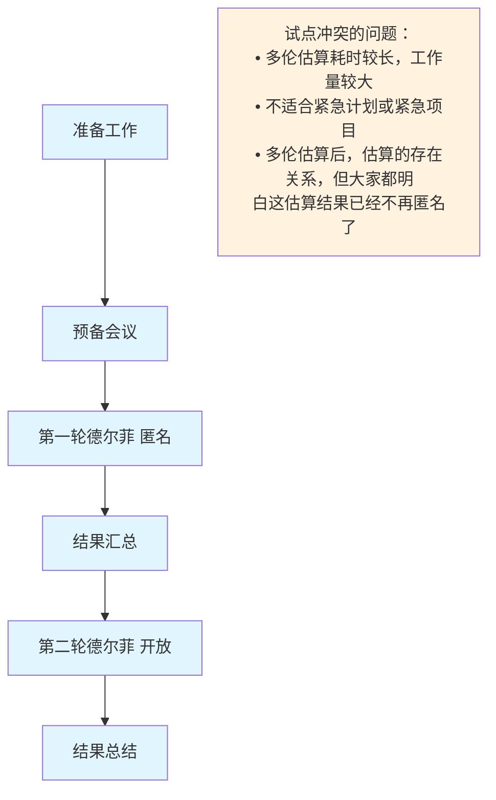

# 第4章: 模型、方法和工件

# 课时 251 : 课前思考

# 课时 252 : Cynefin框架&Stacey 矩阵

| 标题  | 课时  | 章节  |
| ---- | ---- | ---- |
| 进度  | 252  | 21 |

## OSCAR教练和辅导模型
OSCAR 教练和辅导模型由 Karen Whittleworth 和Andrew Gilbert 开发。
它可帮助个人调整其教练或领导风格，以便为已有发展行动计划的个人提供支持。

此模型涉及五个促成因素:
- 成果。成果确定了个人的长期目标以及每次交流会议后的期望结果。
- 情境。情境可促成就相关内容展开对话，如项目团队成员的当前技能、能力和知识水平、人员为何处于该水平以及该水平如何影响个人的绩效和同伴关系。
- 选择/后果。选择和/或后果确定了实现预期成果的所有潜在途径以及每种选择的后果，以便个人可以选择实现其长期目标的可行途径。
- 行动。在特定时限内，行动是指个人通过专注于眼前和可实现目标，以致力于具体改进的措施。
- 评审。定期举行会议可提供支持，并有助于确保个人保持积极状态和正确方向。

## 本节知识点

| 序号 | 知识点 | 重点 |
| :--- | :--- | :--- |
| 1 | OSCAR 教练和辅导模型 | 成果 情境 选择/后果 行动 评审 |

## 习题解析

项目经理用 OSCAR 模型辅导成员，正确的是什么？

   - [ ] A. 只说努力工作，没让成员讲目标
   - [x] B. 帮助成员分析成员现状及对工作影响
   - [ ] C. 成员没给任务设完成时间
   - [ ] D. 结束才回顾辅导过程

> 解析：
> 应该选 B
> OSCAR模型中的"情境"(Situation)要求帮助成员分析当前状况及其对工作的影响，这正是选项B所描述的内容。其他选项都不符合OSCAR模型的正确应用方式。

---

# 课时 254 : 变革模型

| 标题  | 课时  | 章节  |
| ---- | ---- | ---- |
| 进度  | 254  | 24 |

## 变革模型

| 主要考点 | 主要内容 |
| :--- | :--- |
| 组织变革管理迭代模型 | 启动变革、规划变革、实施变革、管理过渡、维持变革 |
| ADKAR模型 | 关注个人在适应变革时所经历的五个连续步骤： • 认知、渴望、知识、能力、巩固 |
| 领导变革八步法 | 营造紧迫感、组建强大的联盟、创建变革愿景、沟通愿景、清除障碍、创造短期成果、促进深入变革、巩固企业文化中的变革 |
| 萨提亚变革模型 | 帮助项目团队成员了解他们的感受，使他们高效实施变革： 因循守旧、外部干扰、混乱、思想转变、整合和实践、进入新常态 |
| 转变模型 | 该模型识别了与变革相关的三个转变阶段： • 结束、失去、放手 • 中间区域 • 新的开始 |

## 本节知识点

| 序号 | 知识点 | 重点 |
| :--- | :--- | :--- |
| 1 | 组织变革 | 组织变革管理迭代模型 领导变革八步法 |
| 2 | 人的认知变革 | ADKAR模型 萨提亚变革模型 转变模型 |

## 习题解析

某企业计划进行数字化转型变革，任命项目经理小张负责推动这一变革项目。在实施变革过程中，小张采取了以下一系列行动，其中符合变革八步法的是什么？

   - [ ] A. 小张认为企业员工都已意识到数字化转型的重要性，无需营造紧迫感，直接组建了变革联盟
   - [ ] B. 小张组建了由各部门负责人和技术骨干组成的变革联盟，但没有明确联盟的职责和目标
   - [ ] C. 小张制定了数字化转型的变革愿景，但只在高层会议上提及，未向全体员工沟通愿景
   - [x] D. 当遇到部门之间数据共享障碍时，小张积极协调，组织相关部门重新梳理业务流程，打破数据壁垒

> 解析：
> 应该选 D
> 根据Kotter的变革八步法，第六步是"创造短期成果"，第七步是"促进深入变革"。选项D中小张积极协调解决数据共享障碍，重新梳理业务流程，这体现了清除变革障碍和促进深入变革的做法，符合变革八步法的要求。其他选项都违反了变革八步法的基本原则。

---

# 课时 255 : 群体决策方法

| 标题  | 课时  | 章节  |
| ---- | ---- | ---- |
| 进度  | 255  | 25 |

## 克拉德尔菲法

### 试点冲突的问题

- 多伦估算耗时较长，工作量较大
- 不适合紧急计划或紧急项目  
- 多伦估算后，估算的存在关系，但大家都明白这估算结果已经不再匿名了

## 本节知识点

| 序号 | 知识点 | 重点 |
| :--- | :--- | :--- |
| 1 | 群体决策 | 罗马式表决法 举手表决 宽带德尔菲 |

## 习题解析

在一个项目的关键决策会议上，项目经理决定采用举手表决法来确定项目下一步行动方案。以下关于此次举手表决过程的描述，正确规范的是什么？

   - [ ] A. 项目经理在会议开始时，没有详细阐述每个行动方案的内容和利弊，就直接要求团队成员举手表决
   - [ ] B. 团队成员小李在举手表决时，因受到房边同事的暗示，改变了自己原本的想法，举手支持了多数人选择的方案
   - [ ] C. 项目经理详细介绍了各个行动方案，确保每位成员都充分理解后，宣布开始表决，要求成员们在10秒内快速举手表明态度
   - [x] D. 表决结束后，项目经理认真统计了支持和反对每个方案的人数，并对结果进行了记录和公示，还询问大家对结果是否有疑问

> 解析：
> 应该选 D
> 举手表决法的正确规范要求：1）充分介绍各方案确保理解；2）快速表决避免相互影响；3）公开透明的过程。选项C体现了这些要求，而其他选项都存在程序上的问题。
> A: 团队的了解不充分
> B: 违背了公正性
> C: 10秒太仓促了
> D: 正确

---

# 选修： 测量陷阱（选修）

| 标题  | 课时  | 章节  |
| ---- | ---- | ---- |
| 进度  | 255  | 26 |

## 测量陷阱

| 主要考点 | 主要内容 |
| :--- | :--- |
| 霍桑效应 | 霍桑效应指出，测量某种事物的行动会对行为产生影响。因此，制定度量指标时要慎重。例如，仅测量项目团队可交付物的输出，会鼓励项目团队专注于创建更多数量的可交付物，而不是专注于提供更高客户满意度的可交付物。 |
| 虚荣指标 | 似乎会显示某些结果但不提供决策所需有用信息的测量指标。例如，新用户下载量只能说明在新用户获取上的成功，但不能说明用户留存也获得了同样的成功。 |
| 士气低落 | 如果设定了无法实现的测量指标和目标，项目团队的士气可能会因持续未能达到目标而下降。例如，设定缺陷率为0。 |
| 误用度量指标 | 尽管存在用于测量绩效的度量指标，人们可能会扭曲测量指标或专注于错误的事情。例如，重视进度完成比例却忽略资源的投入。 |
| 确认偏见 | 作为人类，我们倾向于寻找并看到支持我们原有观点的意见。这可能会导致我们对数据作出错误解释。例如，证实辛苦工作的数据。 |
| 相关性与因果关系对比 | 解释测量数据的一个常见错误是将两个变量之间的相关性与一个变量导致了另一个变量的因果性混淆起来。例如，看到项目进度落后且预算超支，可能就会推断是预算超支导致了进度问题。 |

## 本节知识点

| 序号 | 知识点 | 重点 |
| :--- | :--- | :--- |
| 1 | 测量陷阱 | 霍桑效应 虚荣指标 士气低落 误用度量指标 确认偏见 相关性与因果关系对比 |

## 习题解析

某项目经理负责一个软件开发项目，为了衡量项目团队的工作绩效，准备制定一系列度量指标。以下关于度量指标制定的做法，正确的是什么？

   - [ ] A. 项目经理决定只关注代码编写的行数，认为这能直接体现团队的工作效率，代码行数越多说明工作完成得越好
   - [x] B. 考虑到霍桑效应，项目经理不仅关注可交付成果的数量，还将客户满意度纳入度量指标，综合评估团队绩效
   - [ ] C. 项目经理制定度量指标时，只与技术骨干沟通，认为他们最了解项目技术层面的情况，无需征求其他团队成员意见
   - [ ] D. 为了激励团队成员，项目经理制定度量指标时，只设定奖励机制，不考虑可能存在的惩罚措施

> 解析：
> 应该选 B
> 选项B正确地考虑了霍桑效应的影响，避免了仅关注单一指标可能导致的行为偏差。通过综合考虑可交付成果数量和客户满意度，能够更全面地评估团队绩效，避免团队只追求数量而忽视质量的问题。其他选项都存在测量陷阱的问题。

---

# 课时 256 : 项目管理绩效域&裁剪&模型方法工件:闯关题

## 17-第七版-项目管理绩效域&裁剪&模型方法工件（9小节-25小节）闯关题

**裁剪旨在更好地满足组织、运行环境和项目的需要。以下关于为什么裁剪的理由正确的选项是?**

A.	建造核反应堆所需的严谨、制衡和报告的要求要低于建造新办公楼。

B.	裁剪无法为组织带来直接的收益。

C.	裁剪可以更有效地利用项目资源。

D.	裁剪只针对结构规模很大的交付项目进行。

正确答案：C ， 回答正确

> 解析：
只有选项C是裁剪的收益。
选项A：建造核反应堆的要求要高于建造新办公楼。
选项B：裁剪可以为组织带来直接收益。
选项D：针对规模大和小的项目都可以裁剪。

**组织和项目的管理方法都可以进行裁剪。以下哪项不属于项目裁剪的内容?**
A.	生命周期。

B.	工具。

C.	过程。

D.	事业环境因素。

正确答案：D ， 回答正确

> 解析：
事业环境因素是项目遵守的内容，不能随意裁剪。而其他几个选项都属于裁剪的内容。

**生命周期和开发方法的选择属于裁剪的内容之一，如果建设新的数据中心项目包括建筑施工和构建计算能力两部分工作，该数据中心建设项目应该选择以下那种开发方法?**

A.	预测

B.	迭代

C.	适应

D.	混合

正确答案：D ， 回答正确

> 解析：
数据中心项目中建筑施工部分一般用预测的方法，而构建所需的计算能力可采用迭代或者适应方法，因此此项目应采用混合的开发方法进行管理。

**评估项目领导层和项目团队的技能和能力，然后根据项目类型和运作情况选择应参与的人员以及应具备的能力。这属于裁剪的哪部分内容？**

A.	参与

B.	过程

C.	工具

D.	方法

正确答案：A ， 回答正确

> 解析：
“参与” 裁剪主要涉及确定项目中各类人员的参与程度和角色。评估项目领导层和团队的技能与能力，据此选择应参与的人员以及明确他们应具备的能力，这直接关系到人员在项目中的参与情况，属于 “参与” 裁剪的内容。
B：“过程” 裁剪侧重于对项目管理过程的调整和选择，例如确定需要执行哪些过程、省略哪些过程等，与人员的选择和能力评估无关。
C：“工具” 裁剪是关于选择适合项目的管理工具和技术，如选择特定的项目管理软件、估算工具等，不涉及人员相关的评估和选择。
D：“方法” 裁剪主要是对项目执行方法的调整，比如选择不同的软件开发方法、施工方法等，与人员的技能和参与度的确定没有直接联系。

**项目经理刚刚被雇用来管理一个提高会计部门数据处理效率的项目，他最关心的是管理项目的风险。项目周期很短，发起人的期望很高。以下哪项最能帮助项目经理对项目的风险进行初步评估?**

A.	敏感性分析

B.	项目规划过程中的项目范围说明书

C.	对企业环境因素的审查

D.	与一个从事类似项目的项目经理的谈话

正确答案：D ， 回答正确

> 解析：
与从事类似项目的项目经理谈话，能够直接获取他人在类似项目中遇到的风险情况、应对措施以及经验教训。从 “不确定性绩效域” 角度，这是一种利用他人实践经验来快速识别和评估本项目潜在风险的有效方式。通过借鉴类似项目的实际情况，项目经理可以更全面、更有针对性地了解可能出现的风险，从而对当前项目的风险进行初步评估，制定相应的应对策略，以满足发起人期望并有效管理项目风险。所以该选项最能帮助项目经理对项目风险进行初步评估。
> A 选项：敏感性分析通常是在项目有了一定的数据和模型基础上，用于分析哪些因素对项目结果的影响程度最大。在项目初期，尤其是对于一个新启动且周期很短的项目，可能缺乏足够的数据来进行有效的敏感性分析，所以它不太能帮助项目经理对项目风险进行初步评估。
> B 选项：项目范围说明书主要是明确项目的范围边界、可交付成果等内容，虽然范围的明确对识别风险有一定帮助，但它更多的是从项目工作内容的角度出发，对于全面评估项目面临的各种不确定性风险，尤其是外部环境等方面的风险，作用相对有限。
> C 选项：审查企业环境因素可以了解项目所处的外部大环境，包括组织文化、市场条件、法规政策等。然而，这些信息较为宽泛，对于直接评估当前具体项目的风险来说，缺乏针对性和具体的指导意义，难以帮助项目经理快速、有效地对项目风险进行初步评估。

**在管理一个变化驱动的项目中，干系人管理的哪一方面是最重要的?**

A.	确保团队成员在任何时候都有充分的时间

B.	规划团队成员与其他干系人的互动

C.	让团队单独解决自己的问题

D.	确保对项目目标有共同的理解

正确答案：D ， 回答正确

>解析：
在干系人绩效域中，确保所有干系人对项目目标有共同的理解是至关重要的，尤其是在变化驱动的项目中。项目目标可能会随着项目的进展和各种变化因素而调整，只有当所有干系人对目标有清晰且共同的理解，才能确保他们朝着同一个方向努力，减少误解和冲突，提高项目成功的可能性。这是干系人管理的核心目标之一，也是保障项目顺利推进的关键因素。所以该选项是在管理变化驱动的项目中，干系人管理最重要的一方面。
选项 A：“确保团队成员在任何时候都有充分的时间” 主要涉及到资源管理方面，与干系人管理中的关键要素关联不大。虽然时间管理对项目很重要，但它不是干系人管理的核心方面，不能直接体现干系人管理在变化驱动项目中的关键作用。
选项 B：“规划团队成员与其他干系人的互动” 在干系人管理中是一个重要的环节。通过规划互动，可以更好地协调各方利益和沟通，但它并不是变化驱动项目中干系人管理最重要的方面。在变化驱动的项目中，更关键的是确保大家对不断变化的项目目标有共同的理解，而不仅仅是规划互动。
选项 C：“让团队单独解决自己的问题” 这种做法在一定程度上忽视了干系人管理的重要性。在项目中，团队不能完全孤立地解决问题，因为项目会受到各种干系人及其利益诉求的影响。而且在变化驱动的项目中，更需要与干系人密切沟通和协作，以应对变化，而不是让团队单独解决问题。

**项目经理正在领导一个大型组织变革项目。项目启动后，发现团队成员对变革的紧迫感认识不足，积极性不高。根据约翰科特的领导力八步法，项目经理首先应该采取以下哪项措施？**​

A.	组建强有力的指导联盟​

B.	制定愿景和战略​

C.	建立紧迫感​

D.	广泛传播变革愿景

正确答案：C ， 回答正确

> 解析：
约翰科特领导力八步法的第一步就是建立紧迫感。在项目中，当团队成员对变革的紧迫感认识不足时，项目经理首先要做的就是通过各种方式让团队成员意识到变革的必要性和紧迫性，这样才能激发他们的积极性，为后续的变革步骤奠定基础。
选项 A 组建强有力的指导联盟是八步法的第二步；
选项 B 制定愿景和战略是第三步；
选项 D 广泛传播变革愿景是第四步。

**一个软件开发项目正在进行重大的技术升级变革。在项目执行过程中，部分团队成员虽然了解了变革的必要性，但对于如何实现新的技术要求感到迷茫。按照 ADKAR 变革模型，项目经理此时应重点关注以下哪个方面？**​

A.	Awareness（认知）​

B.	Desire（渴望）​

C.	Knowledge（知识）​

D.	Ability（能力）

正确答案：C ， 回答正确

> 解析：
题目中团队成员已经了解了变革的必要性，认知是对变革产生疑问，渴望是期待变革好处，即具备了认知（A选项）和渴望（B选项），但对于如何实现新的技术要求感到迷茫，这表明他们缺乏实现变革所需的知识（Knowledge）。此时项目经理应重点提供相关培训和信息，帮助团队成员掌握新的技术知识，以推动变革的顺利进行。
选项 D 能力是在掌握知识之后通过实践逐渐形成的，当前重点应先解决知识层面的问题。

---

