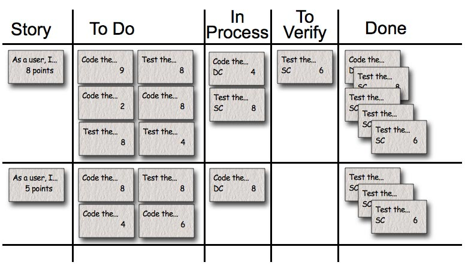

# 第4章: 敏捷项目管理流程

# 课时 205 : 课前思考

> 敏捷框架，敏捷故事点等

# 课时 206 : 敏捷项目流程框架

| 标题  | 课时  | 章节  |
| ---- | ---- | ---- |
| 进度  | 206  | 22 |

## 敏捷项目管理流程框架

敏捷型项目，以价值交付为目标，基于透明、检视与调
整的原则，采用选代的方式进行增量交付。


## 知识点

| 序号 | 知识点 | 重点 |
| :--- | :--- | :--- |
| 1 | 敏捷项目管理流程框架 | 采用迭代方式增量交付 |

## 练习题

在一个敏捷项目中，团队按照敏捷项目交付流程框架开展工作。
在项目执行过程中，遇到了以下情况，请问团队的应对措施正可的是哪一个？

- [x] A. 迭代执行阶段，客户提出新的功能需求。产品负责人立即将该需求添加到产品待办事项列表中，并与团队一起评估该需求后续迭代计划的影响。
- [ ] B. 在迭代执行阶段，团队成员发现之前预估的任务工时严重不足，导致部分任务可能无法按时完成。团队成员没有告知任何人，打算加班完成任务。
- [ ] C. 在迭代规划阶段，产品负责人刚刚确定了本次选代要开发的用户故事，但技术团队认为部分故事技术难度过大，在规定时内无法完成。此时，技术团队直接减少了这些用户故事，按照自己的计划进行开发。
- [ ] D.迭代回顾会议上，团队成员提出了一些改进流程的建议，但由于时间紧张，敏捷教练决定将这些建议留到下个项目再考虑。


> 正确选 A
> A 产品负责人和团队一起评估，这个是 OK 的
> B 加班是不可取的
> C 技术团队直接私自减少用户故事，有问题。应该和产品负责人沟通
> D 回顾但不作出变化是不对的，应该立即实施

---

# 课时 207 : 项目启动

| 标题  | 课时  | 章节  |
| ---- | ---- | ---- |
| 进度  | 207  | 23 |

## 敏捷合同


敏捷合同是一个环形循环的合同模式，包含以下九个核心要素：

1. **多层结构** - 采用分层的合同架构
2. **强调价值交付** - 重点关注价值的实现和交付
3. **总价增量** - 基于增量的总价模式
4. **固定时间和材料** - 时间和材料成本固定
5. **累进的时间和材料** - 递进式的时间材料计费
6. **提前取消方案** - 允许提前终止的机制
7. **动态范围方案** - 灵活调整项目范围
8. **团队扩充** - 支持团队规模的动态调整
9. **支持全方位供应商** - 全面的供应商支持体系

这些要素相互关联，形成一个完整的敏捷合同循环体系，确保项目的灵活性和价值交付。

## 项目章程&团队章程

- 每个项目都需要一个项目章程，这样项目团队就能了解项目之所以重要的原因、团队的前进方向以及项目的目标。
  不过，对于团队而言，仅有项目章程还不够。敏捷团队需要有团队规范以及对一起工作方式的理解。
  这种情况下，团队可能需要一个团队章程。
- 仆人式领导可以促进章程的制定过程。因队可以通过一起工作实现协作，而制定项目章程是一种很好的开始工作的的方式。
  此外，团队成员可能希望通过协作了解他们将如何一起工作。
  只要团队知道如何一起工作，制定章程就不需要一个正式的过程。有些团队可以从团队制定章程的过程中受益。
- 团队章程包括：
  - 团队价值观，例如可持续的开发速度和核心工作时间：只
  - 工作协议，例如“就绪”如何定义，这是团队可以接受工作的前
  - “完成”如何定义，这样团队才能一致地判断完整性；考虑时间盒；或使用工作过程限制：
  - 基本规则，例如有关一个人在会议上发言的规定；
  - 以及团队规范，例如团队如何对待会议时间。
  - 团队的社会契约，即团队章程，将规定团队成员之间彼此互动的方式。

==团队章程的目标是创建一个敏捷的环境，在这个环境中，团队成员可以发挥他们作为团队的最大能力。==

> 敏捷的章程由敏捷负责人和团队成员一起制定，
> 体现了团队的平等协作和组织的自管理


## 本节知识点

| 序号 | 知识点 | 重点 |
| :--- | :--- | :--- |
| 1 | 敏捷合同 | 根据变化调整 |
| 2 | 项目章程 | 明确目标和制约因素<br>团队章程：明确规则<br>创造协作环境 |

## 习题解析

在一个新启动的敏捷项目中，团队成员对于如何制定团队章程产生了不同看法。以下观点正确的是哪一个？

   - [ ] A. 团队章程应该由项目经理独立编写，然后分发给团队成员执行，这样能保证章程的权威性
   - [x] B. 制定团队章程时，应召集所有团队成员共同参与讨论，明确团队的价值观、沟通方式、决策机制等关键内容
   - [ ] C. 团队章程只需包含团队的工作时间和休假政策，其他内容在项目进行中再补充
   - [ ] D. 团队章程一旦制定就不能修改，以确保项目执行过程的稳定性

> 解析：
> 应该选 B
> 在敏捷项目中，团队章程的制定应该体现敏捷价值观中的"个体和互动胜过流程和工具"。团队章程需要所有成员共同参与制定，包括价值观、沟通方式、决策机制等关键要素，这样才能确保团队的协作效果和章程的有效执行。
> A: 独立编写错误
> C: 要明确价值观，沟通章程等。
> D: 可以修改

---

# 课时 208 : 探索与规划

| 标题  | 课时  | 章节  |
| ---- | ---- | ---- |
| 进度  | 208  | 24 |

## 敏捷项目探索与规划步骤总览


## 本节知识点

| 序号 | 知识点 | 重点 |
| :--- | :--- | :--- |
| 1 | 先需求 | 编写用户故事，纳入待办事项列表 |
| 2 | 再估算 | 估算每个用户故事的规模 |
| 3 | 排好序 | 用户故事优先级排序 |
| 4 | 稳速率 | 估算团队速率 |
| 5 | 定计划 | 制定项目计划 |
| 6 | 验目标 | 确认是否满足项目愿景 |

## 习题解析

在一个敏捷项目的前期规划阶段，团队需要按照一系列步骤来制定项目计划。以下是关于这些步骤执行顺序及操作的描述，其中正确的是哪一个？

   - [ ] A. 团队首先估算团队速率，然后编写用户故事并纳入待办事项列表，接着对用户故事进行优先级排序，再估算每个用户故事的规模，最后制定项目计划
   - [x] B. 团队先编写用户故事并纳入待办事项列表，之后估算每个用户故事的规模，接着进行用户故事优先级排序，再估算团队速率，最后依据前面的结果制定项目计划
   - [ ] C. 团队直接进行用户故事优先级排序，再编写用户故事纳入待办事项列表，估算每个用户故事的规模，然后估算团队速率，后制定项目计划
   - [ ] D. 团队先估算每个用户故事的规模，再编写用户故事纳入待办事项列表，进行用户故事优先级排序，接着估算团队速率，最后制定项目计划

> 解析：
> 应该选 B
> 根据敏捷项目规划的标准流程，正确的顺序应该是：
> 1) 先编写用户故事并纳入待办事项列表 
> 2) 估算每个用户故事的规模 
> 3) 进行用户故事优先级排序 
> 4) 估算团队速率 
> 5) 制定项目计划。
> 
> 这个顺序确保了在估算和规划之前有明确的需求基础。

---

# 课时 209 : 用户故事&人物角色

| 标题  | 课时  | 章节  |
| ---- | ---- | ---- |
| 进度  | 209  | 25 |

## 用户故事的优势

敏捷方法中，面对客户需求的不清晰如何处理？
面对客户的需求，多问几个为什么
传统的需求表述方式只体现了what，而敏捷的需求表述（用户故事）体现了5W1H

- Who
- What
- When
- Where
- Why
- How

## 用户故事&人物角色

每个需求都是一个用户故事（user story）
用户故事三要素：

1. 作为 <角色＞，在＜时间/地点＞，我根<做什么>，是为了<什么目的/商业价值＞。
2. 于是，我<怎样做/怎样操作>。
3. 最后<如何验证>。


<br>


**完成的定义（DoD,Definition of Done）**
是指一个工作项（如用户故事、任务等）被认为“完成”时，必须满足的所有条件。
DoD通常由敏捷团队共同制定，包括开发人员、测试人员、产品负责人等，确保每个角色都清楚工作项完成的标准。

**人物角色（Persona）**
是真实用户的虚拟代表，它包含用户的基本信息、行为习惯、需求和痛点等，用于帮助团队理解目标用户，指导产品设计。
人物角色在产品早期和发展阶段尤为重要，能够帮助团队更好地理解用户需求和设计产品。


## DoD 和 DoR

DOR （ Definition of Ready ）和 DoD （ Definition of Done ）是敏捷开发中的重要概念：

**DoR（定义）：**
指一个用户故事在被开发团队接受并进入开发阶段之前必须满足的条件。
它定义了用户故事的准备就绪标准，确保故事是清晰的、可行的、可测试的，并且所有必要的信息都是可用的。
例如，用户故事有明确的验收标准、依赖关系已明确等。

**DoD（定义）：**
指用户故事被视为所需要达到的最低验收条件。
它是需求准出的标准，通常呈现为一份清单形式的简短文档，
例如，代码已完成、单元测试全部通过、部署到测试环境并通过系统测试、通过用户验收测试并签字确认符合需求等。

**区别：**

1. 目的不同：
   - DoR：目的是确保用户故事在开发前已经准备好，减少开发过程中的不确定性和风险。
   - DoD：目的是确保交付质量，明确工作完成的标准，使团队交付的产品增量能够满足客户需求和质量标准。

2. 所处阶段不同：
   - DoR：是关于需求准入的标准，发生在迭代开始时，用于判断一个用户故事是否可以进入开发流程。
   - DoD：是关于需求准出的标准，发生在迭代结束时，用于判断用户故事是否真正完成。

> DOR 是开发前的准备工作，时间：迭代开始
> DoD 是交付的标准，时间：迭代结束

## 本节知识点

| 序号 | 知识点 | 重点 |
| :--- | :--- | :--- |
| 1 | 用户故事 | 三要素<br>完成的定义 |
| 2 | 人物角色 | 真实用户的虚拟代表 |
| 3 | DoD | 完成的定义，用于验收<br>DoR：准备就绪，用于准备进入开发阶段 |


## 习题解析

在一个敏捷软件开发项目中，关于用户故事和人物角色的运用，以下说法正确的是什么？

   - [ ] A. 人物角色只是一个虚构的形象，对编写用户故事没有实际帮助，所以可以省略创建人物角色的步骤
   - [ ] B. 用户故事只需要描述功能需求，非功能需求不需要体现在用户故事中
   - [x] C. 为了更好地理解用户需求，创建了多个不同类型的人物角色，基于这些人物角色编写的用户故事更能反映真实用户的需求，并且在编写用户故事时充分考虑人物角色的目标、行为和痛点
   - [ ] D. 一旦确定了人物角色和编写好用户故事，在整个项目过程中都不能进行修改，以保证项目的稳定性

> 解析：
> 应该选 C
> 人物角色是真实用户的虚拟代表，能够帮助团队更好地理解用户需求和设计产品。基于不同类型的人物角色编写用户故事，可以更准确地反映真实用户的需求，并在编写时充分考虑人物角色的目标、行为和痛点，这是敏捷开发中的最佳实践。

---

# 课时 210 : 影响地图&故事地图

| 标题  | 课时  | 章节  |
| ---- | ---- | ---- |
| 进度  | 210  | 26 |

## 影响地图 VS 故事地图

**影响地图**
影响地图就是一个很好的规划工具，它通过可视化和结构化的的形式，将业务目标和产品功能之间建立关联，确保实现的产品功能都是对客户有用，能为公司带来有价值的收益。


**故事地图**
故事地图是一种既定产品所应具备的特性和功能的可视化模型，旨在使团队其所创建的产品及创建原因有整体了解。


## 本节知识点

| 序号 | 知识点 | 重点 |
| :--- | :--- | :--- |
| 1 | 影响地图 | 编写用户故事的框架梳理 |
| 2 | 用户故事地图 | 用户故事的逻辑关系串联 |

## 练习题
在一个敏捷产品开发项目中，团队开始使用用户故事地图来规划产品功能。关于用户故事地图的使用，以下理解正确的是什么？

- [ ] A. 用户故事地图只需列出所有功能点，不需要考虑用户使用产品的流程
- [ ] B. 一旦用户故事地图创建完成，无论项目中发生什么变化都不能修改
- [ ] C. 用户故事地图主要由开发团队创建，创建完成后直接交给产品负责人，无需向其他团队成员展示
- [x] D. 产品负责人和开发团队共同创建用户故事地图，通过它来明确产品的功能范围、优先级以及用户在使用产品时的关键路径

> 正确选 D
> A 核心就是梳理用户使用流程， 不正确
> B 需要有动态调整
> C 用户故事地图需要组员共同参与， 不能光技术去搞
> D 正确

---

# 课时 211 : 影响地图&故事地图

| 标题  | 课时  | 章节  |
| ---- | ---- | ---- |
| 进度  | 211  | 27 |

## 最小可行产品

- 最小可行产品（**MVP**）。一个概念，通过识别可交付价值的最少数量的特性或需求，用来定义向客户首次发布解决方案的范围。
- **MVP（minimum viable product）** 最小可行产品背后的核心原则就是減少时间成本，解决分析瘫痪症。

> 用最小的代价验证商业的可能性

## 本节知识点

| 序号 | 知识点 | 重点 |
| :--- | :--- | :--- |
| 1 | MVP | 向客户首次发布解决方案的范围 |

## 练习题

**在一个新产品开发项目中，团队正在讨论关于最小可行性产品（MVP）的相关事宜。以下关于最小可行性产品的说法，正确的是什么？**

- [ ] A. 最小可行性产品就是产品的第一个完整版本，包含了所有规划的功能，只是质量稍低
- [ ] B. 为了尽快推出最小可行性产品，团队可以忽略产品的用户体验，后续再进行优化
- [x] C. 团队在确定最小可行性产品的功能时，应聚焦于最核心的用户需求，确保能验证产品的价值假设，以最小的成本和最快的速度推向市场
- [ ] D. 最小可行性产品推出后，若市场反馈不佳，团队应立即放弃该产品，重新进行市场调研和产品规划

> 正确： C
> A 最小可行性产品应该包含核心功能的精简版本，而不是完整的功能
> B 需要关注核心功能的用户体验
> C 正确
> D 不能放弃，应该根据用户反馈持续迭代

---

# 课时 212 : 待办事项列表

| 标题  | 课时  | 章节  |
| ---- | ---- | ---- |
| 进度  | 212  | 28 |

## 待办事项列表

- 待办事项列表记载了所有的用户故事，通过待办列表梳理会进行整理。
- 梳理会的内容：把当前产品的需求清单进行梳理，包括排优先级、拆成粒度适中的故事卡片等。
- 梳理会的时间：两周的迭代用60分钟的时间盒讨论。
- 梳理会与迭代规划会议的关系：只有产品待办列表梳理会完成，迭代规划会议才能开始。

## 本节知识点

| 序号 | 知识点 | 重点 |
| :--- | :--- | :--- |
| 1 | 待办事项列表 | 记载了所有的用户故事 |
| 2 | 待办事项列表梳理会 | 编写并拆解用户故事<br>用户故事排优先级 |


## 习题解析

在一个敏捷项目中，关于待办事项列表梳理会的相关描述，下列正确的是哪一项？

   - [x] A. 在待办事项列表梳理会上，产品负责人和团队成员共同对产品待办事项列表中的用户故事进行细化、估算和优先级排序，确保对需求的理解一致，为后续迭代做好准备
   - [ ] B. 待办事项列表梳理会的主要目的是对已完成的任务进行总结回顾，分析存在的问题
   - [ ] C. 待办事项列表梳理会只需产品负责人参加，因为只有他清楚产品需求，梳理完后直接把任务分配给开发团队即可
   - [ ] D. 待办事项列表梳理会在项目启动阶段进行一次就可以，后续不需要再召开，以节省时间提高效率

> 解析：
> 应该选 A
> 待办事项列表梳理会是敏捷项目中的重要活动，需要产品负责人和团队成员共同参与，对用户故事进行细化、估算和优先级排序，确保团队对需求理解一致。选项B描述的是回顾会议；选项C错误，团队成员必须参与；选项D错误，梳理会应该持续进行，通常每个迭代都要进行。
> B 回顾不是目的
> C 共同协作才对
> D 应该定期召开

---

# 课时 213 : 用户故事估算

| 标题  | 课时  | 章节  |
| ---- | ---- | ---- |
| 进度  | 213  | 29 |

## 用户故事估算的优势

持续时间估算从来都没有真正”准确过“：

- 团队迟迟拿不出估算结果，因为害怕估算不准确
- 部分团队成员对工作评估过于乐观，导致估算周期太少，项目延期
- 部分团队成员喜欢把个人工作留出很多富余量，导致估算后项目周期过长


**敏捷方法中的团队故事点估算法，一种另类类比估算**

## 故事点

故事点估算。
故事点估算涉及分配项目团队成员实施用户故事所需的抽象的但相关联的人力投入的点数。
它可使项目团队在考虑所涉及的复杂性、风险和人力投入的前提下了解故事的难度。

> 点数越大，越复杂，风险越高


## 故事点估算的优势

这种估计不是精确的。但这并不意味着它没用

**收益**

- 无需纠结估算的准确性，快速投入工作
- 团队不会混淆估算与承诺
  - （估算 = 充分猜测）
  - （承诺 = 最坏情况下的策略）

> 先不分工
> 团队一起估算用户故事的故事点
> 发生在每个迭代规划之前

## 知识点

| 序号 | 知识点 | 重点 |
| :--- | :--- | :--- |
| 1 | 故事点 | 用户故事衡量单位，相对大小 |

## 练习题

**在敏捷项目中，团队使用故事点估算用户故事工作量。下列对故事点的理解，正确的是？**

- [ ] A. 故事点就是完成任务所需的天数
- [x] B. 故事点是对用户故事相对大小的估算，综合考虑复杂度、工作量和风险
- [ ] C. 故事点只能由项目经理来确定
- [ ] D. 一旦确定故事点，整个项目过程都不能更改

> 选 B
> A：故事点是相对复杂度，不是天数
> B：正确
> C: 应该由全体成员一起估算
> D: 故事点有可能会随时进行调整

---

# 课时 214 : 相对估算&宽带德尔菲估算

| 标题  | 课时  | 章节  |
| ---- | ---- | ---- |
| 进度  | 214  | 30 |

## 估算故事方法之相对估算

相对估算可用于创建估算，这些估算源自在考虑人力投入、复杂性和不确定性的基础上针对类似工作进行的对比。
相对估算不一定基于成本或时间的绝对单位。故事点是相对估算中使用的一种常见的无单位的测量方法。


## 估算故事方法之宽带德尔菲估算

宽带德尔菲。宽带德尔菲估算方法是 Delphi 估算的一种变化方式，
即主题专家会完成多轮估算，每轮之后与项目团队展开讨论，真至达成共识。对于宽带德尔菲估算方法，
那些提出了最高和最低估算的人会解释自己的理由，然后每个人又都重新估算。该过程会不断重复，直到接近一致。
计划扑克牌是宽带德尔菲估算方法的一种变化形式。

## 试点中发现的问题

- 多轮估算耗时的特长，工作量投入较大
- 不适合详细的任务估算，成本太高  
- 多轮估算后，结果仍存在差异，但人主观的自己的估算结果已经不能自由调整了


| 序号 | 知识点 | 重点 |
| :--- | :--- | :--- |
| 1 | 相对估算 | 针对类似工作进行的对比 |
| 2 | 宽带德尔菲估算 | 主题专家会完成多轮估算<br>每轮之后与项目团队展开讨论<br>直至达成共识 |

## 练习题

**在一个敏捷项目中，团队需要对一系列用户故事进行工作量估算。关于相对估算和宽带德尔菲估算方法，以下说法正确的是什么？**

- [ ] A. 相对估算只能使用计划扑克法，而宽带德尔菲估算只能使用专家判断法
- [ ] B. 相对估算是以具体的时间或工作量数值来表示估算结果，宽带德尔菲估算则是基于相对大小进行估算
- [ ] C. 在相对估算中，团队成员通常根据以往经验和直觉快速给出估算值；宽带德尔菲估算则需要经过多轮的信息反馈和讨论来达成共识
- [ ] D. 相对估算主要用于估算单个任务，宽带德尔菲估算主要用于估算整个项目的工期

> 选 C
> A: 相对估算是基础，也可以使用专家判断
> B: 相对估算基于大小的比较
> C: 对
> D: 都可以估算单个任务

---

# 课时 215 : 计划扑克估算&T-shirt估算&亲和估算

| 标题  | 课时  | 章节  |
| ---- | ---- | ---- |
| 进度  | 215  | 31 |

## 估算方法之计划扑克

> 使用 斐波那契数列来标记点数


## 估算方法之T-shirt估算

> 使用 T恤的尺码来进行点数的定义
> 估算会更快一些
> 快速和形象对任务的难度有一个统一的认知


## 估算方法之亲和估算法

> 更直观的看到故事之间的相对复杂度。
> 速度回更快一些


## 本节知识点

| 序号 | 知识点 | 重点 |
| :--- | :--- | :--- |
| 1 | 计划扑克 | 集体估算<br>斐波那契数列<br>达成共识 |
| 2 | T-shirt估算 | 简化的估算扑克 |
| 3 | 亲和估算 | 按相似性将用户故事分组估算 |


## 习题解析

在一个敏捷软件开发项目中，团队采用敏捷扑克（计划扑克）方法进行用户故事的工作量估算。在某次估算会议中，针对"用户订单管理系统中添加批量删除订单功能"这一用户故事，出现了以下情况，其中做法正确的是什么？

- [x] A. 每位团队成员在出牌前，都充分了解用户故事内容，结合自身经验和对项目的理解，独立思考并给出故事点估算，出牌后共同讨论差异原因
- [ ] B. 当团队成员对故事点的估算出现较大分歧时，产品负责人直接拍板决定故事点，结束讨论
- [ ] C. 团队成员A在其他成员还未充分阐述观点时，就直接亮出自己认为合适的故事点卡片，引导大家按照他的思路进行估算
- [ ] D. 团队为了节省时间，只进行了一轮出牌和简单讨论，就确定了该用户故事的故事点

> 解析：
> 应该选 A
> 计划扑克的正确流程是：每个团队成员独立思考并给出估算，避免被他人影响，然后通过讨论达成共识。A选项正确体现了计划扑克的核心原则：独立估算、充分讨论、达成共识。
> B 不是集体决策
> C 提前量干扰了团队的判断
> D 得多轮讨论

---

# 课时 216 : 用户故事优先级排序

| 标题  | 课时  | 章节  |
| ---- | ---- | ---- |
| 进度  | 216  | 32 |

## 莫斯科排序法&卡诺模型

**莫斯科优先级排序法**

是项目管理定义范围、确定功能质量、变更管理中常用的工具法则，
以便用户、项目主管、项目经理供应商对纳入项目中的每个需求交付的重要性和紧急性达成共识。
M-O-S-C—o-W，是四个优先级别的首字母的缩写，
再加上O使之能够形成便于记忆的名称一MoSCoW。

- Must Have
- Should Have
- Could Have
- Won't Have


**卡诺模型（KANO模型）**

是对用户需求分类和优先排序的有用工具，

以分析用户需求对用户满意的影响为基础，

体现了产品性能和满意之间的非线性关系


## 100点排序法 & 多标准加权分析

**100点排序法**

为需求优先级讨论会议中的每个干系人分
配100点，以便在他们看到合适的需求进
行投票。干系人可以在需求之间平均分配
他们的点数，例如，每个需求分配5点，
也可以在一个需求上花费全部100点。

**多标准加权分析**

多标准加权分析，就是将你认为的
重要的因素加以排序，根据重要的
程度赋予不同的值，然后和当前的
结果相乘，得到一个新的结果。


## 本节知识点

| 序号 | 知识点 | 重点 |
| :--- | :--- | :--- |
| 1 | 莫斯科法 | MoSCoW |
| 2 | 卡诺模型 | 必要<br>期望<br>兴奋<br>无差别性 |
| 3 | 100点排序法 | 干系人在需求之间分配100点 |
| 4 | 多标准加权分析 | 根据多个要素进行排序 |


## 习题解析

在一个新产品功能规划项目中，项目经理需要选择合适的方法对众多功能需求进行优先级排序。针对以下排序方法的描述与应用场景，判断正确的是什么？

   - [x] A. 采用莫斯科法时，将所有功能需求分为必须有、应该有、可以有、不必有四类，然后按照"必须有> 应该有 > 可以有 > 不必有"的顺序确定优先级，这种方法简单直观，能快速区分关键和非关键需求
   - [ ] B. 卡诺模型主要依据功能实现的难易程度对需求进行排序，容易实现的功能优先级高，较难实现的功能优先级低
   - [ ] C. 100点法是让项目团队成员对每个功能需求进行打分，分数总和最高的功能需求优先级最高，此方法仅考虑了团队成员的主观意愿，不考虑功能的实际价值
   - [ ] D. 多标准加权分析在排序时只考虑功能的市场需求这一个因素，根据市场需求的强烈程度来确定功能优先级

> 解析：
> 应该选 A
> 
> - **选项A正确**：莫斯科法(MoSCoW)确实是将需求分为必须有(Must Have)、应该有(Should Have)、可以有(Could Have)、不必有(Won't Have)四类，并按此顺序确定优先级，方法简单直观。
> 
> - **选项B错误**：卡诺模型不是依据实现难易程度排序，而是根据功能对用户满意度的影响进行分类(必要、期望、兴奋、无差别性)，体现产品性能和用户满意之间的非线性关系。
> 
> - **选项C错误**：100点法让干系人在需求之间分配100点进行投票，虽然包含主观意愿，但也会考虑需求的实际价值，不是仅考虑主观意愿。
> 
> - **选项D错误**：多标准加权分析是根据**多个**重要因素进行排序和加权计算，而不是只考虑市场需求这一个因素。

---

# 课时 217 : 估算团队速率

| 标题  | 课时  | 章节  |
| ---- | ---- | ---- |
| 进度  | 217  | 33 |

## 估算团队速率
团队速率：团队在单位时间里完成的工作量

| 第一个迭代 | 第二个迭代| 第三个迭代 |
| --- | --- | ---|
| 16个故事点 | 17个故事点| 15个故事点|

```
16+17+15=48个故事点

团队速率=48/3=16个故事点/迭代
```
故事点是一个相对估计，当团队之外的任何人试图

改变这个数字时，它会变得没那么有用了！

> 至少也要经理3个迭代以上，因为速率会有偏差
> 团队之外的人不要轻易去改变这个速度
> 禁止跨团队对比
> 重点在于改善自己团队的速率

## 本节知识点

| 序号 | 知识点 | 重点 |
| :--- | :--- | :--- |
| 1 | 团队速率 | 多次迭代后计算团队在迭代周期的工作量 |


## 习题解析

在一个敏捷软件开发项目中，团队已经完成了3个迭代，每个迭代的故事点完成情况如下：迭代1完成20个故事点，迭代2完成22个故事点，迭代3完成18个故事点。关于该敏捷团队速率及相关应用，以下说法正确的是哪一个？

   - [ ] A. 该团队的平均速率为（20 + 22 + 18）÷ 3 = 20个故事点/迭代，在规划下一个迭代时，团队应严格按照这个速率安排20个故事点的工作量，不做任何调整
   - [ ] B. 如果团队成员中有一名核心开发人员在下个迭代开始前请假，团队速率肯定不会受到影响，因为团队速率是一个固定的参考值
   - [ ] C. 团队速率只对当前项目有参考价值，在新的敏捷项目中，不能参考这个团队之前项目的团队速率来进行初期规划
   - [x] D. 在第4个迭代过程中，发现之前估算故事点时对一个复杂功能的难度预估不足，导致实际工作量大幅增加，此时团队应重新评估团队速率

> 解析：
> 应该选 D
> 
> - **选项A错误**：虽然平均速率计算正确（20个故事点/迭代），但团队速率是参考值而非绝对值，不应"严格按照"和"不做任何调整"。团队应根据实际情况灵活调整工作量安排。
> 
> - **选项B错误**：团队速率是基于当前团队成员能力和配置计算的。如果核心开发人员请假，团队的实际产能会下降，团队速率必然会受到影响。团队速率不是固定不变的参考值。
> 
> - **选项C错误**：如果团队的人员没有变化的话，那么针对同样的工作，团队速率还有一定的参考意义的。可以参考
> 
> - **选项D正确**：故事点估算错误肯定应该重新评估团队速率。重新来计算平均速率

---
# 课时 218 : 制定项目计划

| 标题  | 课时  | 章节  |
| ---- | ---- | ---- |
| 进度  | 218  | 34 |

## 制定项目计划


> 愿景 --> 产品路线图 --> 发布计划 --> 迭代计划

# 时间盒 & 缓冲

- 时间盒（ **Timeboxing** ）：为活动设定一个固定的时间段，无论工作是否完成，时间一到即停止。
- 进度缓冲：是指在项目时间线上预留的时间段，用于应对任务延期或不可预见的延误。
- 特性缓冲：是指在产品待办事项列表（ **ProductBacklog** ）中预留的一组特性或故事点，用于应对需求变化或新增功能的要求。

## 敏捷三角


## 本节知识点

| 序号 | 知识点 | 重点 |
| :--- | :--- | :--- |
| 1 | 产品愿景->产品路线图->发布计划->迭代计划 | 制定进度计划的层级结构 |
| 2 | 进度缓冲：预留的时间段<br>特性缓冲：预留的一组特性或故事点 | 两种缓冲类型的区别 |
| 3 | 敏捷倒三角 | 团队无法按时完成工作考虑砍需求 |


## 习题解析

敏捷项目团队正在创建一个项目的发布计划。发布计划应包含哪些信息？

   - [ ] A. 为完成每个任务或故事而将执行的一系列详细活动。
   - [ ] B. 开发人员的概要任务，指出他们需要工作的用户故事。
   - [ ] C. 需要在特定版本中开发的故事详细视图、估算和验收标准。
   - [x] D. 对可能开发什么以及在什么时间范围开发的粗略视图和期望。

> 解析：
> 应该选 D
> 发布计划是高层次的规划，提供的是对"可能开发什么"和"在什么时间范围开发"的粗略视图和期望。选项A、B、C都过于详细，这些是迭代计划或更细粒度计划的内容，而不是发布计划层面的信息。
> A：发布计划是一个宏观的愿景， 不会涉及到详细的开发细节
> B：每日站会的内容， 同样的， 这是具体的用户故事
> C：详细试图不符合开发计划的特点
> D：正确

---

# 课时 219 : 敏捷项目管理流程：闯关题1

## 15-敏捷-敏捷项目管理流程（21小节-34小节）闯关题

**对于敏捷项目来说，变更是流程的重要组成部分，作为敏捷项目的经理，你应该如何来管理变更？**

A.	需求变更无需进入变更流程，而应该把新的需求记入待办列表。

B.	为了避免延误和成本超支，只有那些能增加可衡量价值的变更才应该被批准。

C.	应该使用敏捷的工具和方法来减少所需的变更数量及其破坏性影响。

D.	敏捷项目与计划驱动的项目相比，管理变更的基础没有区别。

==正确答案：A ， 你的答案：C回答错误==

> 解析：
在敏捷项目中，变更被视为正常流程的一部分，新的需求通常会被记录到产品待办列表中，然后根据优先级和团队的能力在后续的迭代中进行处理，这体现了敏捷对变化的适应性和灵活性。
> B. 敏捷强调拥抱变化，不仅仅是关注可衡量价值的变更。虽然价值是重要的考量因素，但即使一些变更不能直接带来可衡量的价值，只要对项目的整体目标、用户体验或团队协作等方面有积极作用，也可能被纳入考虑范围，且在敏捷中不是通过严格控制变更来避免延误和成本超支，而是通过灵活的迭代和调整来应对。
> C. 敏捷的工具和方法主要是用于更好地管理变更，而不是减少变更数量。敏捷承认变更不可避免，重点在于如何快速响应和适应变更，将变更的影响降到最低，而不是试图去减少变更本身。
> D. 敏捷项目和计划驱动的项目在管理变更上有很大区别。计划驱动的项目通常有严格的变更控制流程，强调在项目前期尽可能明确需求以减少变更，而敏捷项目则是主动拥抱变更，将变更融入到日常的项目流程中，通过灵活的迭代和团队协作来应对变更。


**在一个敏捷项目中，谁负责确定产品待办事项列表的优先级？**

A.	项目经理

B.	产品所有者或客户

C.	任何感兴趣的干系人

D.	团队领导

==正确答案：B ， 你的答案：A回答错误==

> 解析：
在敏捷项目中，产品所有者或客户负责确定产品待办事项列表的优先级。产品所有者代表客户的利益，对产品的愿景和方向有着清晰的认识，他们根据业务价值、客户需求、市场情况等因素来对产品待办事项列表中的各项任务进行排序，以便让团队明确先做什么、后做什么，确保团队的工作能够最大程度地满足客户需求和实现产品的商业价值。
而
> A.项目经理、
> D.团队领导主要负责项目的整体管理和团队的协调等工作，不负责直接确定产品待办事项列表的优先级。
> C.虽然干系人可能会对产品待办事项列表有一定的影响，但最终确定优先级的还是产品所有者或客户，因为他们对产品的目标和价值有着最直接的责任和决策权。


**敏捷负责人需要提供一份敏捷项目计划，计划中需包括发布日期和每个版本中的关键功能。哪份计划包含这些内容？**

A.	产品路线图

B.	团队看板

C.	产品待办事项列表

D.	需求清单

正确答案：A ， 回答正确

> 解析：
产品路线图是对产品发展方向和计划的战略性概述，它通常会明确列出产品的发布日期以及每个版本中包含的关键功能，为项目提供了一个宏观的指导框架，让团队成员和相关利益者能够清晰地了解产品的发展路径和目标。
> B. 团队看板主要用于可视化团队的工作流程，展示任务在不同阶段的进展情况，如待办、进行中、已完成等，它侧重于实时反映团队的工作状态，而不是提供产品发布日期和版本关键功能等信息。
> C. 产品待办事项列表是对产品所有需求的详细罗列，包含了各种功能、特性、改进和缺陷修复等事项，但它通常不会明确指定发布日期和每个版本中的关键功能，只是对需求的一种有序排列，以便团队进行优先级排序和逐步实现。
> D. 需求清单与产品待办事项列表类似，主要是对产品需求的记录，侧重于详细描述需求内容，而不是从产品整体规划的角度明确发布日期和关键功能的版本安排。


**敏捷团队正在进行产品用户故事的探讨，以下哪个行为是对团队最有效的支持？**

A.	项目经理应该参加团队的审查和回顾会议。

B.	产品负责人对待办列表的内容进行澄清。

C.	项目发起人审查团队的发布和迭代计划。

D.	QA团队在发布前对功能进行全面测试。

正确答案：B ， 回答正确

> 解析：
产品负责人是最了解产品愿景、目标以及用户需求的人。在团队探讨产品用户故事时，产品负责人对内容进行澄清，能够确保团队成员对用户故事的理解一致，明确故事的优先级、业务价值以及具体要求等，有助于团队更高效地开展工作，是对团队最直接、有效的支持。
> A. 虽然项目经理参与审查和回顾会议有一定意义，但在产品用户故事探讨时，其直接作用相对有限。审查和回顾会议主要是对已完成工作的总结和反思，而此时团队更需要的是对当前用户故事相关内容的明确和指导。
> C. 项目发起人审查发布和迭代计划主要是从宏观层面把控项目进度和方向，但在团队进行产品用户故事探讨的当下，这一行为不能直接帮助团队解决对用户故事理解和细化等问题，对当前团队的讨论和工作支持不够直接。
> D. QA 团队的测试工作主要在开发完成后进行，是保证产品质量的重要环节，但在团队探讨用户故事阶段，QA 团队的测试工作尚未到时机，无法对当前的用户故事探讨提供直接有效的支持。


**产品负责人在项目中刚刚增加了两个主要的新功能。根据估算，这项额外的工作将需要两个为期两周的迭代来完成。对于敏捷团队来说，最好的解决办法是什么？**

A.	团队仍然会按时发布，但发布版本将不包括最不重要的功能。

B.	团队通过赶工追赶进度，但发布时间可能会推迟。

C.	缩短测试过程按时发布。

D.	给团队加班费和临时帮助按时发布。

正确答案：A ， 回答正确

> 解析：
这是比较符合敏捷原则的做法。敏捷强调价值驱动，当出现新的重要功能需求时，通过重新评估优先级，将原本计划中的一些相对不重要的功能推迟，以保证在既定的时间内交付最有价值的产品，满足客户的关键需求。这样既能应对需求的变化，又能维护项目的整体节奏和交付日期。
B. 赶工可能会导致团队成员疲劳，质量下降，而且违背了敏捷中可持续发展的原则。同时，发布时间不确定的推迟也会影响到项目的整体计划和相关方的预期，不是一个好的解决方案。
C. 测试是保证产品质量的重要环节，缩短测试过程可能会导致产品上线后出现质量问题，增加后期维护成本和风险，不符合敏捷注重质量的理念。
D. 敏捷强调团队的自主性和自组织性，外部强加的加班和临时帮助可能会打乱团队的节奏和协作方式，而且也不能从根本上解决需求变更带来的进度问题，还可能引发团队成员的不满和效率下降。


**敏捷团队的主管经理对团队用 T-shirt估算出的结果表示质疑，因为他觉得估算的太不准确了，请问敏捷中使用T-shirt估算的目的是什么？**

A.	敏捷团队不会计划何时完成工作，他们只是开始工作，并在最后期限前尽可能多地完成。

B.	敏捷团队需要制定快速、粗略的估算，以做出计划来开始工作。

C.	敏捷方法意味着做尽可能少的计划，这样团队就可以专注于他们最擅长的事情，交付价值。

D.	产品特性的不确定性太大，因此早期不需要做计划，团队将在后期做计划。

正确答案：B ， 回答正确

> 解析：
T-shirt 估算法是敏捷中一种快速、相对粗略的估算方法，它通过使用类似 T-shirt 尺码（如 S、M、L、XL 等）来对用户故事或任务的规模进行评估。其目的是让团队能够快速地对工作进行大致的估算，以便制定计划来开始工作，帮助团队在项目初期对工作量有一个初步的认识，从而更好地安排迭代和资源。
A：敏捷团队并非不做计划，而是采用迭代和增量的方式进行规划与交付，有明确的迭代周期和目标，并非只是开始工作然后在最后期限前尽可能多完成，所以 
A 选项错误。
C：敏捷并非做尽可能少的计划，而是强调计划的灵活性和适应性，根据项目进展不断调整和优化计划，所以 C 选项错误。D：虽然产品特性存在不确定性，但敏捷强调尽早做计划，只是计划会随着对产品理解的深入而不断更新和完善，并非早期不做计划，后期再做，所以
D 选项错误。


**团队负责人告诉敏捷教练，本周他们计划为下一个发布的计划中的用户故事举行一次规划扑克会议。规划扑克会议意味着什么？**

A.	他们想知道完成第一次迭代的时间。

B.	他们正在确定发布计划的周期。

C.	他们正在估算开发和测试需要多长时间。

D.	他们正在评估这个计划的故事点的相对大小。
正确答案：D ， 回答正确

> 解析：
规划扑克会议是敏捷项目中用于估算用户故事规模的一种方法。团队成员通过使用扑克牌来投票，每张牌代表不同的故事点数，以此来评估每个计划中的用户故事的相对大小。A：规划扑克会议主要不是用于确定完成第一次迭代的时间，它侧重于对用户故事的规模进行评估，而不是具体的时间安排，所以 
A 选项错误。
B：确定发布计划的周期通常会考虑项目的整体目标、业务需求、资源等多方面因素，规划扑克会议主要针对用户故事的工作量估算，并非确定发布计划的周期，B 选项错误。
C：规划扑克会议重点是评估用户故事的相对规模，虽然与开发和测试时间有一定关联，但不是直接确定开发和测试需要多长时间，C 选项错误。


**在一个为期一年的敏捷项目中，团队在前六次冲刺阶段的速度是43、24、47、34、30、32。对于团队来说，这是否正常？**

A.	正常，这看起来是敏捷团队速度的正常数据。

B.	正常，速度只是用来跟踪工作，而不是用来评估绩效。

C.	不正常，因为在过去的四个冲刺阶段，速度变化的太大了。

D.	不正常，团队需要稳定他们的速度，以便他们能够开始计划。

正确答案：A ， 回答正确

> 解析：
没有必要对这些结果感到担忧，敏捷团队的前几个冲刺通常波动很大，随后冲刺阶段出现了稳定，就表示团队已经逐步适应他们的工作并走向正轨。B：速度不仅可以用来跟踪工作，在一定程度上也能反映团队的绩效和工作效率。稳定的速度有助于团队更好地进行计划和预测，所以速度对于评估团队绩效有一定的参考价值，B 选项错误。
C：敏捷团队的前几个冲刺通常波动很大，随后冲刺阶段出现了稳定，就表示团队已经逐步适应他们的工作并走向正轨，C 选项错误。
D：团队确实需要稳定速度以便更好地进行计划，但说团队需要稳定速度才能开始计划是不准确的。即使速度不稳定，团队也可以根据以往的速度数据和经验进行计划，只是稳定的速度会使计划更加准确和可靠，D 选项错误。


**你正在管理一个具有高度需求不确定性的敏捷项目。以下哪个是管理变更的最佳方法？**

A.	要求开发团队在工作开始前创建一个变更管理计划。

B.	将权力下放给团队和产品所有者，以管理出现的变更。

C.	准备一个全面的变更管理计划并按照计划进行管理。

D.	要求产品所有者将所有实质性的变更提交给变更管理团队。

正确答案：B ， 回答正确

> 解析：
将权力下放给团队和产品所有者是管理变更的最佳方法。团队成员具有丰富的技术知识和对项目的深入理解，能够评估变更对技术实现的影响。产品所有者则对产品的愿景、业务需求和优先级有清晰的认识，能够判断变更的价值和对产品整体的影响。这种方式可以使变更管理更加灵活和高效，能够快速响应需求的变化，符合敏捷项目的特点。
A：在敏捷项目中，开发团队主要专注于产品的开发和交付，要求他们在工作开始前创建变更管理计划可能会增加额外的负担，并且与敏捷的灵活性和适应性原则不太相符。此外，在需求高度不确定的情况下，提前制定详细的变更管理计划可能不切实际，因为很难预测到所有可能的变更情况。
C：在高度需求不确定性的敏捷项目中，准备一个全面的变更管理计划是非常困难的，因为需求本身是不断变化和不确定的，很难提前准确地规划所有变更情况。而且，严格按照计划进行管理可能会导致项目缺乏灵活性，无法及时适应市场和客户的变化。
D：要求产品所有者将所有实质性的变更提交给变更管理团队，可能会导致决策流程冗长，降低项目的响应速度。在敏捷项目中，强调的是快速响应和团队的自主性，这种方式可能会阻碍团队的灵活性和创造力，不利于项目的顺利推进。


**产品负责人希望通过一些敏捷管理实践提高干系人满意度，产品负责人应该怎么做？**

A.	审查产品需求，并安排干系人参与每日站会。

B.	确保项目团队经常与干系人开会，审查项目进度计划。

C.	邀请干系人参加待办列表梳理会，与客户一起讨论产品的优先级排序。

D.	创建风险登记册，以便在下次每日站会时讨论。

正确答案：C ， 回答正确

> 解析：
邀请干系人参加待办列表梳理会，并与客户一起讨论产品的优先级排序，能让干系人直接参与到产品的规划和决策过程中，使他们感受到自己对产品的影响力，增强他们的参与感和对项目的认同感，从而有效提高干系人满意度。
A：审查产品需求是重要的，但安排干系人参与每日站会不太合适。每日站会主要是团队内部沟通工具，重点是团队成员分享工作进展，干系人参与可能会让会议变得冗长，且无法有效让干系人参与到产品决策中，对提高干系人满意度效果有限。
B：让项目团队经常与干系人开会审查项目进度计划，能让干系人了解项目进度，但这只是单向的信息传递，干系人较少有机会参与到项目的实际决策中，对于提高他们的满意度作用不够直接。
D：创建风险登记册并在每日站会讨论，主要是关注项目风险，与提高干系人满意度没有直接关联。干系人更关心产品的方向、功能以及自己对产品的参与度等方面，而不是单纯的风险情况


**一个敏捷项目正在进行用户故事的估算。Scrum项目经理与团队和产品负责人开会，产品负责人负责澄清用户故事，团队先提供个人用户故事估算，但团队共同决策用户故事的点数。团队采用的是什么方法？**

A.	敏捷扑克

B.	自下而上估算

C.	100点法

D.	经验教训

正确答案：A ， 回答正确

> 解析：
敏捷扑克是一种估算用户故事的方法。在使用该方法时，团队成员各自持有一套标有不同点数的扑克，他们根据对用户故事的理解和评估，选择相应点数的扑克出牌，然后共同讨论并决策用户故事的点数。这与题目中描述的 “团队先提供个人用户故事估算，但团队共同决策用户故事的点数” 的过程相符。
B：自下而上估算通常是指先估算每个具体任务或工作包的成本或时间，然后汇总得出项目的总估算，与题目中描述的用户故事估算方法不一致。
C：100 点法是将一定数量的点数分配给不同的用户故事，以表示它们的相对重要性或工作量，但通常不是通过团队成员先个人估算再共同决策的方式进行，与题目描述不符。
D：经验教训是在项目过程中或项目结束后对所获得的经验和知识进行总结和反思，与用户故事的估算方法无关。


**产品负责人正在确定下几个迭代中包含哪些用户故事，他希望客户也能参与进来。产品负责人需要客户提供什么支持？**

A.	项目的进度计划

B.	所有特征的功能描述和成本估算

C.	所需特征和功能的优先级列表

D.	工作分解结构（WBS）

正确答案：C ， 回答正确

> 解析：
客户是产品的最终使用者或受益者，他们最清楚自己对产品的需求和期望。产品负责人确定迭代中的用户故事时，客户提供所需特征和功能的优先级列表，能帮助产品负责人更好地了解客户需求的重点，从而合理安排用户故事的优先级，决定哪些用户故事应包含在下几个迭代中。
A：客户通常不负责提供项目进度计划，且这与确定迭代中包含哪些用户故事关联不大。
B：虽然客户可能对产品特征和功能有一定的想法，但详细的功能描述和成本估算一般是由项目团队中的相关专业人员，如开发人员、测试人员、成本估算师等负责，客户可能缺乏专业知识来提供准确的这些信息。
D：工作分解结构（WBS）是将项目可交付成果和项目工作分解成较小的、更易于管理的组件的过程，通常由项目团队来创建和维护，不是客户的职责范围，对确定迭代中的用户故事也没有直接帮助。


**MoSCoW方法的用途是什么？**

A.	跟踪进度

B.	验收产品

C.	确定故事的优先级

D.	估算用户故事

正确答案：C ， 回答正确

> 解析：
MoSCoW方式是给用户故事排序的一种方法，分成必须做的，应该做的，可以做的和暂时不做的。


**敏捷团队一直按照进度计划开展工作，一位职能经理希望团队在迭代中可以加快速度，完成更多工作。敏捷项目经理应该怎么做？**

A.	策划一次鼓舞士气的团队活动。

B.	开展根本原因分析，识别问题并提高速度。

C.	让职能经理与团队集中办公。

D.	向职能经理说明，团队的速度依赖于实际情况，而无法随意调整。

正确答案：D ， 回答正确

> 解析：
向职能经理说明团队的速度依赖于实际情况，而无法随意调整，这是正确的做法。敏捷团队的速度是根据团队成员的技能水平、任务的复杂度以及团队的协作效率等实际因素确定的，不能简单地为了满足职能经理的要求而随意加快。通过清晰地向职能经理解释这一点，可以让其了解团队的实际情况，避免不合理的要求。
A：策划一次鼓舞士气的团队活动可能在一定程度上提升团队的积极性，但并不能直接解决职能经理要求加快速度的问题。团队的速度是由团队的实际能力、任务的复杂性等多种实际情况决定的，单纯的鼓舞士气活动不一定能使团队在迭代中完成更多工作，且没有从根本上回应职能经理的不合理要求。
B：团队一直按照进度计划开展工作，说明目前并没有明显的问题导致速度需要提升。开展根本原因分析是在发现问题时采取的措施，而不是针对职能经理随意要求加快速度的合理回应，所以该选项不恰当。
C：让职能经理与团队集中办公，并不能改变团队的实际工作能力和速度。职能经理的参与可能会对团队造成干扰，且集中办公也无法直接解决团队速度依赖于实际情况这一本质问题，因此该选项不合适。


以下哪三个选项描述用户故事是正确的？ （选三项）

A.	用户故事用来记录干系人要求的特征或功能。
B.	用户故事为项目中遇到的问题创建一个记录。
C.	用户故事用来进行根本原因分析。
D.	用户故事用来交流项目进展情况。
E.	用户故事的写法为：作为一个<角色>，我想要<功能/目标>，以便实现<商业利益/动机> 。
F.	用户故事的编写可以作为需求收集的一部分工作。

正确答案：A,E,F ， 回答正确

> 解析：
A. 用户故事是从用户的角度来描述系统应具备的功能或特性，它记录了干系人对产品的期望和要求，有助于确保开发团队关注用户的实际需求。E. 这是用户故事的标准格式，通过明确角色、目标和动机，能够清晰地阐述用户的需求以及需求背后的原因，使开发团队更好地理解功能的价值和意义。F. 在敏捷项目中，用户故事是收集和整理需求的重要工具。它帮助团队与干系人进行有效的沟通，将模糊的需求转化为具体的、可理解的故事，以便进行后续的规划和开发工作。B选项：用户故事主要用于描述需求，而不是为项目中遇到的问题创建记录C选项：不是用于进行根本原因分析D选项：用于交流项目进展情况的通常是项目进度报告、看板等工具，而不是用户故事。

---

# 课时 220 : 迭代计划细化：迭代规划会

| 标题  | 课时  | 章节  |
| ---- | ---- | ---- |
| 进度  | 220  | 35 |

## 迭代规划会

- 前半部分：团队向产品负责人询问产品待办列表的内容、目的、含义及意图。
- 后半部分：团队计划本迭代的安排
  - 把用户故事继续分解为活动，提高估算准确率
  - 团队成员确定活动分工
  - 团队成员估算活动持续时间
- 紧急需求尽量不影响当前迭代，若紧急仔务被纳入当前迭代，团队应规划新迭代。


> 考试：干系人向要在迭代中插入一个紧急任务
> 不要让他打乱当前的迭代
> 先插入代办列表
> 如果在排序阶段，则检查优先级排序
> 在执行阶段可以不执行，保证原有的计划
> 如果真的十分的紧急，取消当前的迭代，在开始一个新的迭代


## 本节知识点

| 序号 | 知识点 | 重点 |
| :--- | :--- | :--- |
| 1 | 迭代规划会 | 产品负责人介绍待办列表内容，团队计划本迭代的安排 |


## 习题解析

在一个敏捷项目中，关于迭代规划会的相关描述，以下正确的是哪一个？

   - [ ] A. 迭代规划会由项目经理主导，单方面向团队成员传达本次迭代的任务和目标，团队成员只需接受并执行
   - [ ] B. 迭代规划会主要是确定迭代的时间周期，对于迭代要完成的用户故事和任务不需要在会上讨论，会后由产品负责人分配即可
   - [x] C. 在迭代规划会上，团队成员根据本次迭代要完成的用户故事，将其分解为具体的任务，明确任务负责人和时间安排
   - [ ] D. 迭代规划会只需在项目启动时召开一次，后续迭代无需再召开，以节省时间和精力

> 解析：
> 应该选 C
> 根据迭代规划会的定义，会议的主要目的是团队成员将用户故事分解为具体的任务，明确任务负责人和时间安排。这与前面学习的内容一致：团队计划本迭代的安排，把用户故事继续分解为活动，团队成员确定活动分工，团队成员估算活动持续时间。
> A: 不是单方面决定，团队自组织
> B: 不能由组织负责人决定，团队自组织
> C: 对的
> D: 规划会会在每个迭代周期的时候执行

---

# 课时 221 : 迭代执行：每日站会

| 标题  | 课时  | 章节  |
| ---- | ---- | ---- |
| 进度  | 221  | 36 |

## 每日站会

- 每日站立会议，即团队每日例会，通常15分钟，条件允许的话，每天都应该在同样的时间和地点，组织所有成员站立进行。
  
- Scrum团队所有成员轮流回答以下3个问题：
  
  - **上次站会以后我完成了什么工作？**
  - **从现在到下次站会，我打算做什么？**
  - **我在工作中遇到了什么障碍（或风险或问题）？**
  
- 发现问题后，==添加到停车场==，创建另一个会议，在站立会之后立即召开，并在会上解决问题。

鼓励任何团队成员主持会议而不是由项目经理或领导主持，
以确保它不会变成状态报告会议，
而是作为团队进行自我组织和相互承诺的会议。

> 结合白板，把用户故事写为纸条

## 任务板（Task Board）

任务板（墙）展现了在迭代过程中所有要完成的任务。团队可以通过任务板及时发现问题，快速反馈，工作完成也会增加信心



> 任务板，只能监控范围，不能监控进度

## 本节知识点

| 序号 | 知识点 | 重点 |
| :--- | :--- | :--- |
| 1 | 15分钟 | 成员自承诺和自组织，回答三件事 |
| 2 | 发现问题后 | 添加到停车场，创建另一个会议，在站立会之后立即召开 |
| 3 | 任务板 | 展现了在迭代过程中所有要完成的任务 |

## 习题解析

在一个敏捷软件开发项目中，关于每日站会的描述，下列正确的是哪一个？

   - [ ] A. 每日站会时间可长可短，以充分讨论项目中遇到的所有问题为目标，确保信息充分交流
   - [x] B. 团队成员在每日站会上依次回答三个问题：昨天做了什么、今天计划做什么、遇到了哪些阻碍，通过这种方式同步信息，促进团队协作
   - [ ] C. 每日站会主要由项目经理主持，向团队成员通报项目进度和任务分配情况
   - [ ] D. 为了提高效率，如果团队成员前一天的工作没有任何进展，在每日站会上可以不发言

> 解析：
> 应该选 B
> 根据敏捷开发中每日站会的标准实践，每日站立会议通常15分钟，Scrum团队所有成员轮流回答三个问题：上次站会以后我完成了什么工作？从现在到下次站会，我打算做什么？我在工作中遇到了什么障碍？这正是选项B所描述的内容。
> 选项A错误因为每日站会应该控制在15分钟内；
> 选项C错误因为鼓励任何团队成员主持会议而不是项目经理；
> 选项D错误因为所有成员都应该参与回答三个问题。

---

# 课时 222 : 看板

| 标题  | 课时  | 章节  |
| ---- | ---- | ---- |
| 进度  | 222  | 37 |

## 任务板

- 共同点：可视化的工作流
- 不同点：看板限制在制品 WIP ( Work InProcess WIP ) ,实现拉动式生产，提升生产效率

## 看板的工作原理

看板限制在制品，实现拉动式生产，提升生产效率

> 通过看板的动态演示，主动的实现任务分配和效率提升 

## 本节知识点

| 序号 | 知识点 | 重点 |
| :--- | :--- | :--- |
| 1 | 看板 | 可视化的工作流 |
| 2 | 看板限制在制品 | 实现拉动式生产<br>提升生产效率 |

## 习题解析

**敏捷团队应该如何使用看板？**

- [ ] A. 将问题上报给项目负责人
- [x] B. 通过看板的动态分析，提升团队速度
- [ ] C. 与项目经理分享风险
- [ ] D. 减少有关任务分工的困惑

> 解析：
> 应该选 B
> 看板是敏捷开发中的重要工具，其核心作用是可视化工作流程，通过动态分析看板上的工作项流动情况，团队可以识别瓶颈、优化流程、提升工作效率和团队速度。
> 选项A、C都是传统的上报机制，不符合敏捷自组织原则；
> 选项D虽然看板能起到一定作用，但不是其主要目的。选项B准确地描述了看板的核心价值。

---

# 课时 223 : 看板监控工具：累积流量图

| 标题  | 课时  | 章节  |
| ---- | ---- | ---- |
| 进度  | 223  | 38 |

## 累积流量图

- 累积流量图：展示项目或流程中随时间累计的工作项数量或工作量等数据变化情况
- 如果想缩短周期时间，就要減少在制品数量


## 本节知识点

| 序号 | 知识点 | 重点 |
| :--- | :--- | :--- |
| 1 | 累积流量图 | 展示工作项数量变化情况<br>确定WIP的数量 |


## 练习题

**在一个软件开发项目中，团队使用累积流量图来监控项目进度。以下关于累积流量图的理解，正确的是哪一个？**

A. 累积流量图展示的是项目中每个任务的详细完成时间和资源分配情况
B. 若累积流量图中的已完成任务曲线斜率突然变缓，说明项目进度在加快
C. 累积流量图中，横轴一般表示时间，纵轴表示已完成任务的累积数量或工作量
D. 累积流量图只能在项目结束时绘制，用于回顾项目整体情况

> 选 C
> A: 不是详细完成时间和资源分配
> B: 变缓说明制品数量减少，是速度减慢
> C: 符合定义，正确
> D: 实时更新和绘制，错

---