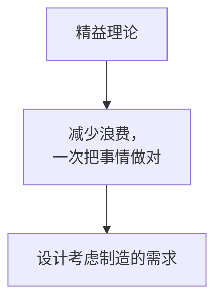

# 6.执行过程组
# 课时 122 : 课前思考题

## 章节导入思考题

## 习题解析

知识管理是项目经理的一项重要责任。这个责任包括管理项目中的两种知识：隐性和显性。以下哪些定义是正确的？

   - [ ] A. 隐性知识是基于事实的，可以很容易地通过语言和符号进行交流。
   - [ ] B. 隐性知识可能需要解释或背景来为这些信息的接受者信。
   - [ ] C. 隐性知识包括情感、经验和能力。
   - [ ] D. 通过PPT分享经验是隐性知识的一个例子。

> 计划驱动执行, 监控保障纠偏
> 项目经理在执行过程中，进需要再监控组执行监控的工作

---

- TBD

---

# 课时 126 : 过程：指导与管理项目工作

| 标题  | 课时  | 章节  |
| --- | --- | --- |
| 进度  | 126  | 119  |

- TBD

## 本节知识点

| 序号 | 知识点 | 重点 |
| :--- | :--- | :--- |
| 1 | 信息管理 | 分享显性知识 信息整理 |
| 2 | 知识管理 | 分享隐性知识 知识整合 |

---

# 课时 127 : 过程：管理质量

| 标题  | 课时  | 章节  |
| --- | --- | --- |
| 进度  | 127  | 120  |

## 管理质量

### 输入

1. **项目管理计划**
   1. 质量管理计划
2. **项目文件**
   1. 经验教训登记册
   2. 质量控制测量结果
   3. 质量测量指标
   4. 风险报告
3. **组织过程资产**

### 工具与技术

1. **数据收集**
   1. ==核对单==
2. **数据分析**
   1. 备选方案分析
   2. 文件分析
   3. 过程分析
   4. 根本原因分析
3. **决策**
   1. 多标准决策分析
4. **数据表现**
   1. 亲和图
   2. ==因果图==
   3. ==流程图==
   4. ==直方图==
   5. 矩阵图
   6. ==散点图==
5. ==审计==
6. ==面向X的设计==
7. **问题解决**
8. **质量改进方法**

### 输出

1. **质量报告**
2. **测试与评估文件**
3. **变更请求**
4. **项目管理计划（更新）**
   1. 质量管理计划
   2. 范围基准
   3. 进度基准
   4. 成本基准
5. **项目文件（更新）**
   1. 问题日志
   2. 经验教训登记册
   3. 风险登记册

## 本节知识点

| 序号 | 知识点 | 重点 |
| :--- | :--- | :--- |
| 1 | 工具 | 核对单 备选方案/文件/过程/根本原因分析 审计 面向X设计 问题解决 质量改进方法 |
| 2 | 输出 | 质量报告 测试与评估文件 |

## 习题解析

在一个建筑项目中，项目经理发现近期完成的部分工程存在质量缺陷，为了避免类似问题再次发生，提升整体项目质量，以下哪项活动属于管理质量过程？

   - [ ] A. 要求施工人员返工处理有质量缺陷的部分
   - [x] B. 分析质量缺陷产生的根本原因，制定并执行质量改进措施
   - [ ] C. 对后续施工过程进行更加严格的质量检查，增加检查频次
   - [ ] D. 与供应商重新协商原材料的质量标准，提高采购质量要求

> 正解：B
> A: 做质量控制
> B: 管理质量过程 （正确）
> C: 属于监控过程组
> D: 属于规划质量管理，并不是流程标准的改进

---

# 课时 128 : 工具：核对单&因果图&直方图&散点图

| 标题  | 课时  | 章节  |
| --- | --- | --- |
| 进度  | 128  | 121 |

## 数据收集-核对单

- 核对单是一种结构化工具，通常具体列出各项内容，用来核实所要求的一系列步骤是否已经执行；

- 需涵盖在范围基准中定义的验收标准。

### 核对单示例表格

例如：
**文件标识**：[ ]-FR-CODE-CHECKLIST-YY
| 编号 | 问题 | 是 | 否 | 不适用 | BUG# | 备注 |
| :--- | :--- | :---: | :---: | :---: | :---: | :--- |
| **变量（Attribute）和常量声明块（VC）** |
| 1 | 变量和常量的命名是否与约定保持一致？ | □ | □ | □ | | |
| 2 | 是否存在容易混淆的相似的变量和属性名？ | □ | □ | □ | | |
| 3 | 变量和属性是否书写正确？ | □ | □ | □ | | |
| 4 | 变量和属性是否被正确的初始化？ | □ | □ | □ | | |
| 5 | 非局部变量是否能用局部变量替换？ | □ | □ | □ | | |
| 6 | 所有的for循环的增量变量是否都在循环顶部声明？ | □ | □ | □ | | |
| 7 | 是否有应该命名为常量的文字常量？ | □ | □ | □ | | |
| 8 | 变量和属性是否可以用常量替换？ | □ | □ | □ | | |
| 9 | 属性是否可以用本地变量？ | □ | □ | □ | | |
| 10 | 所有的属性是否都有正确的访问限制符（private, protected, public）？ | □ | □ | □ | | |
| 11 | 是否有静态属性应该是非静态service-ver？ | □ | □ | □ | | |

## 数据表现-因果图

用于分析根本原因或主要原因

## 数据表现-直方图

用垂直的条形图，显示特定情况的发生次数。

用数字和柱形的相对高度，直观表示引发问题的最普遍原因。

## 数据表现-散点图

数据点越接近某斜线，两个变量之间的关系就越密切。

## 本节知识点

| 序号 | 知识点 | 重点 |
| :--- | :--- | :--- |
| 1 | 核对单 | 核实验收标准 |
| 2 | 因果图 | 分析根本原因或主要原因 |
| 3 | 直方图 | 数据分布 分析问题普遍原因 |
| 4 | 散点图 | 分析两个变量之间的关系 |

## 练习题
在汽车零部件制造项目的规划质量过程中，团队需要分析产品质量问题。以下关于因果图、散点图和直方图的应用场景，描述正确的是哪一个？
- [ ] A. 团队发现产品尺寸偏差较大，想探究是设备老化、人员操作失误还是原材料质量问题导致的，应使用散点图
- [x] B. 为了直观展示不同型号零部件的次品数量分布情况，团队应使用直方图
- [ ] C. 团队想了解生产线上温度与产品抗压强度之间是否存在关联，应使用因果图
- [ ] D. 为分析上个月产品缺陷数量随时间的变化趋势，团队应使用因果图

> A: 这是因果图（鱼骨图）
> B: 这是直方图
> C: 这是散点图
> D: 英国图不能展示随时间变化的原因

---

# 选修： 帕累托图（选修）
| 标题  | 课时  | 章节  |
| --- | --- | --- |
| 进度  | 128  | 122 |

帕累托图是一种特殊的直方图

- 和鱼骨图（因果图）类似，用于定位问题的主要原因
- 和因果图的区别是， 因果图还会找到主要原因

**重点关注界限：80%**

| # | 原因 | 问题 | 总计% |
| :--- | :--- | :--- | :--- |
| 1 | 饮食不规律 | 30 | 37.5% |
| 2 | 压力 | 20 | 62.5% |
| 3 | 作息不规律 | 15 | 81.3% |
| 4 | 遗传 | 10 | 93.8% |
| 5 | 不锻炼 | 5 | 100.0% |

- 注意 帕累托图每一项是前几项的总和
- 利用 2:8 原则， 识别少数对问题影响较大的主要原因（约 20% 的数量）
- 优先解决这些原因即可大幅度解决当前的问题

## 本节知识点

| 序号 | 知识点 | 重点 |
| :--- | :--- | :--- |
| 1 | 帕累托图 | 寻找关键原因 二八原则 直方图特例 |

## 习题解析

在电子产品组装项目中，质量团队收集了过去一个月内产品缺陷的数据，发现共有10种不同类型的缺陷。为确定应优先解决哪些缺陷以最大程度提升产品质量，质量团队打算使用一种质量管理工具。以下关于该工具的说法，正确的是？

   - [ ] A. 选择因果图，通过监控生产过程来发现异常波动，进而减少缺陷
   - [x] B. 采用帕累托图，它能按照缺陷发生频率对缺陷类型进行排序，帮助找出造成大部分缺陷的少数关键原因
   - [ ] C. 使用亲和图，将各种缺陷分类归纳，从而直观地看到各类缺陷的占比情况
   - [ ] D. 运用流程图，梳理产品组装流程，找出可能导致缺陷产生的环节

> 解析：
> 应该选 B  
> 目标是确定“应优先解决哪些缺陷”，需要按发生频率排序并聚焦少数关键原因，这正是帕累托图（80/20 原则）的用途。
> 因果图也可以解决这个问题。看一下实际的答案
> A 实为控制图的用途；
> C 的亲和图用于分组聚类想法而非占比；
> D 流程图用于过程梳理，不提供优先级排序。

---

# 课时 129 : 工具：审计&面向X的设计

| 标题  | 课时  | 章节  |
| --- | --- | --- |
| 进度  | 129  | 123 |

## 审计
质量审计是用来==确定项目活动是否遵循了组织和项目的政策、过程与程序的一种结构化的、独立的过程==。

- 质量审计可能是计划安排的或随机的，由内部或外部审计师进行。
  
- 质量审计可以带来质量成本的降低，并提高发起人或客户对项目产品的接受度。

> 用第三方人员来介入并检查工作的结果
> 可以是外部的也可以是内部的
> 项目组应该欢迎随机检查

## 面向X的设计
DfX (Design for X)中的 “X” 可以是产品开发的不同方面，
例如可靠性、调配、装配、制造、成本、服务、可用性、安全性和质量。

> 目的就是一次性把事情作对
> 经常会考虑用户思维的倒推设计

## 本节知识点（续）

| 序号 | 知识点 | 重点 |
| :--- | :--- | :--- |
| 1 | 审计 | 审核过程遵守情况 识别问题 提出改进 确认变更实施情况 分享良好实践 |
| 2 | 面向X的设计 | 优化设计各个方面 提升产品 |

## 习题解析

在你的项目中，有几个执行活动正在进行。你开始担心你的团队成员所做的进度报告的准确性。你怎样才能验证是否有问题？

   - [x] A. 进行一次质量审计
   - [ ] B. 创建风险量化报告
   - [ ] C. 进行回归分析
   - [ ] D. 进行蒙特卡洛分析

> 解析：
> 应该选 A  
> 质量审计用于独立检查项目活动是否遵循既定流程与标准，可抽查数据来源、取样与记录，核对实际与报告一致性，从而验证进度报告的准确性。  
> B 为定量风险分析的产物，不能验证报告准确性；
> C 回归分析用于建立变量关系并做预测；（复盘专用）
> D 蒙特卡洛用于不确定性模拟，与校验进度报告无关。（风险的内容）

---

# 课时 130 : 执行过程组：闯关题1

## 9-执行过程组（115小节-123小节）闯关题

关于项目的知识管理，下列说法正确的是哪一个？

A.	知识管理主要是将知识记录下来用于分享

B.	本项目生成的知识可用来支持组织运营或未来的项目

C.	知识管理主要是管理现有知识

D.	显性知识易于分享，是知识管理的重点

正确答案：B ， 回答正确

> 解析：
项目生成的知识是组织的宝贵财富，可以用于支持组织的运营，帮助解决实际问题，也可以为未来的项目提供经验教训和参考，避免重复犯错，提高项目成功率。
A 选项：知识管理不仅仅是将知识记录下来用于分享，还包括知识的创造、获取、存储、传播、应用和更新等多个环节，是一个更全面的管理过程。
C 选项：知识管理不仅包括对现有知识的管理，还涉及到新知识的创造和挖掘，以及对知识的整合、转化等，以适应不断变化的环境和需求。
D 选项：虽然显性知识易于分享，但隐性知识同样重要，它往往蕴含着个人或团队的独特经验、技能和洞察力等，对项目的成功也起着关键作用，所以知识管理不能只侧重于显性知识，而应兼顾显性知识和隐性知识。

在你的项目中，有几个执行活动正在进行。你开始担心你的团队成员所做的进度报告的准确性。你怎样才能验证是否有问题？

A.	进行一次质量审计

B.	创建风险量化报告

C.	进行回归分析

D.	进行蒙特卡洛分析

正确答案：A ， 回答正确

> 解析：
质量审计是对项目活动和过程进行结构化审查的方法，通过质量审计可以检查团队成员的工作过程和成果，包括进度报告的准确性。审计人员可以审查相关文档、记录，与团队成员沟通，核实报告中的信息是否与实际工作进展相符，从而验证进度报告是否存在问题。
B 选项：风险量化报告主要是对项目风险进行定量分析，评估风险发生的概率和影响程度，以确定风险的优先级和应对策略，与验证进度报告的准确性无关。
C 选项：回归分析是一种统计方法，用于项目总结和复盘，在这种情况下，它并不能直接帮助验证进度报告的准确性。
D 选项：蒙特卡洛分析是一种通过模拟来评估项目风险和不确定性的方法，主要用于分析项目进度、成本等方面的风险分布，而不是用于验证进度报告的准确性。

你是一个重大信息系统项目的项目经理。质量部门的人过来找你，说要开始对你的项目进行质量审计。这个团队在尽快完成项目的压力下，反对进行审计。你应该向团队解释，质量审计的目的是什么？

A.	检查项目交付物问题的原因

B.	检查客户是否遵循了质量流程

C.	识别低效和无效的政策

D.	检查团队提交的费用的准确性

正确答案：C ， 你的答案：A回答错误

> 质量审计是一种独立的结构化审查，其目的是识别项目中正在实施的活动是否符合组织的政策、过程和程序。质量审计可以识别项目中低效和无效的政策、过程和程序，有助于发现改进的机会，提高项目绩效，这是质量审计的重要目的之一。
A 选项：检查项目交付物问题的原因是质量控制的一部分内容，主要通过质量工具和技术来分析问题产生的根源，而不是质量审计的主要目的。
B 选项：质量审计主要关注项目团队自身是否遵循质量流程，而不是检查客户是否遵循质量流程。客户通常不直接参与项目内部的质量流程执行，质量审计的重点是项目团队的工作。
D 选项：检查团队提交费用的准确性属于成本管理范畴，与质量审计的目的无关，质量审计主要关注质量相关的活动和流程，而非费用方面的审查。

你正处于一个大型设施建设项目的中期。结构钢已经就位，供热管道正在安装，这时一位高级经理通知你，他担心项目不能达到质量标准。在这种情况下，你应该怎么做？

A.	向高级管理人员保证，在计划质量管理过程中，已经确定该项目将达到质量标准。

B.	类比估算未来的结果。

C.	让质量团队参与进来。

D.	检查上次质量管理计划的结果。

正确答案：C ， 回答正确

> 解析：
让质量团队参与进来，可以确定项目是否符合质量标准，并能及时发现潜在的质量问题，提出改进措施，从而有效回应高级经理的担忧。
A 选项：仅向高级管理人员保证在计划质量管理过程中确定了项目将达到质量标准，这只是口头承诺，没有实际行动来验证和解决当前的质量担忧，无法真正打消高级经理的顾虑。
B 选项：类比估算主要用于成本和时间估算等方面，通过与类似项目进行类比来估计当前项目的情况，而对于直接评估和确保当前项目的质量标准，类比估算并不是最有效的方法。
D 选项：检查上次质量管理计划的结果有一定的作用，但上次计划的结果只能反映过去的情况，不能代表当前项目中期的实际质量状况，可能无法全面解决高级经理对当前项目质量的担忧。所以让质量团队参与进来进行实时的质量评估更为关键。

问题日志在哪个管理过程首次被创建? 

A.	管理团队  

B.	指导与管理项目工作

C.	结束项目或阶段  

D.	监控项目工作

正确答案：B ， 你的答案：D回答错误

> 解析：
“指导与管理项目工作” 过程是为实现项目目标而执行项目管理计划中确定的工作。在执行过程中，会遇到各种问题，需要及时记录并跟踪，因此在此过程中首次创建问题日志，用来记录这些问题，以便后续进行处理和监控。
A 选项：“管理团队” 过程重点在于跟踪团队成员的表现，提供反馈，解决问题并协调变更，以优化项目绩效。此时问题日志已存在，用于记录团队相关问题及解决情况，并非首次创建。
C 选项：“结束项目或阶段” 过程主要是完成项目或阶段的所有活动，正式结束项目或阶段。此时主要工作是总结经验教训、完成项目收尾工作，问题日志在此阶段是作为项目文档进行整理和归档，而非首次创建。
D 选项：“监控项目工作” 过程是跟踪、审查和调整项目进展，以实现项目管理计划中确定的绩效目标。在该过程中会使用问题日志来记录和跟踪项目中发现的问题，但不是问题日志首次创建的过程。

---

# 课时 131 : 过程：获取资源

| 标题  | 课时  | 章节  |
| --- | --- | --- |
| 进度  | 131  | 124 |

## 获取资源（ITTO）

### 输入
1. 项目管理计划
   - 资源管理计划
   - 采购管理计划
   - 成本基准
2. 项目文件
   - 项目进度计划
   - 资源日历
   - 资源需求
   - 干系人登记册
3. 事业环境因素
4. 组织过程资产

### 工具与技术
1. ==预分派==
2. 人际关系与团队技能
   - ==谈判==
3. ==虚拟团队==
4. 决策
   - 多标准决策分析

### 输出
1. 物质资源分配单
2. 项目团队派工单
3. ==资源日历==
4. 变更请求
5. 项目管理计划（更新）
   - 资源管理计划
   - 成本基准
6. 项目文件（更新）
   - 经验教训登记册
   - 项目进度计划
   - 资源分解结构
   - 资源需求
   - 风险登记册
   - 干系人登记册
7. 事业环境因素（更新）
8. 组织过程资产（更新）

> 在获取资源的过程中，在获取资源的过程中 “事业环境因素” 可能会改变。比如团队被改变
## 本节知识点（获取资源·要点速记）

| 序号 | 知识点 | 重点 |
| :--- | :--- | :--- |
| 1 | 工具 | 预分派 谈判 虚拟团队 多标准决策分析 |
| 2 | 输出 | 物质资源分配单 项目团队派工单 资源日历 事业环境因素更新 |

## 习题解析

在项目的获取资源过程中，项目经理主要关注的是什么？

   - [x] A. 识别所需资源
   - [ ] B. 管理团队绩效
   - [ ] C. 控制资源使用
   - [ ] D. 释放项目资源

> 解析：
> 应该选 A  
> 获取资源的核心目标是确保按需求获得合适的人力与物理资源（类型、数量、时间窗、能力要求匹配）。  
> B 属于“管理团队”过程；C、D 属于“控制资源”过程，非获取阶段的主要关注点。

---

# 课时 132 : 工具：预分派&谈判&虚拟团队

| 标题  | 课时  | 章节  |
| --- | --- | --- |
| 进度  | 132  | 125 |

## 预分派
硕分派指事先确定项目的实物或团队资源，可生下列情况下发生：
• 在竟标过程中承诺分派特定人员进行项目工作
• 项目取决于特定人员的专有技能；
• 在完成资源管理计划的前期工作之前，制定项目章程过程或其他过程已经指定了某些团队成员的工作分派。

## 谈判

有许多谈判模型。其中一个模型是 Steven Covey 的“双赢思维”原则。
这一原则适用于所有互动场景，而不仅仅适用于谈判，但此处是以谈判为背景进行阐述。在谈判中，可能会有不同的结果：

- 在谈判中，可能出现的结果：
  - ==双赢==：最佳结果，所有参与方都感到满意。
  - ==赢-输 / 输-赢==：竞争取向的一方获胜、他方受损；也可能出于道德立场，个别人选择成就对方而“输掉”谈判。
  - ==双输==：本可实现双赢，但当竞争压过合作时出现此结果，所有人的结局都更糟。

- 更容易实现双赢的条件：
  - ==个性==：参与的各方都很成熟，表现出正直，并且都认为每个人都有的价值。
  - ==信任==：双方相互信任，就如何运作达成一致意见，并勇于担责。。
  - ==方法==：各方都愿意从对方的角度看待当前情形。各方共同努力识别关键的问题和顾虑。他们确定了可接受的解决方案，并确定了实现可接受解决方案的选项。

> 用规则代替猜疑
> 用担责代替甩锅

## 虚拟团队

- 虚拟团队。在不同地点工作但具有共同目标的人群，他们主要通过电话和其他电子通信方式彼此互动。
- 现代沟通技术（如电子邮件、电话会议、社交媒体、网络会议和==视频会议==等）使虚拟团队可行。
- 沟通规划更加重要。虚拟团队可以利用技术来营造在一起的团队环境，以供团队==存储文件、使用在线对话==来讨论题，以及保持团队统一日历。

> 考试：一个虚拟团队， 遇到了紧急事件，去找用于实时通讯的方案

## 本节知识点（预分派·谈判·虚拟团队）

| 序号 | 知识点 | 重点 |
| :--- | :--- | :--- |
| 1 | 预分派 | 竞标过程 项目章程制定 专有技能 |
| 2 | 谈判 | 双赢 一赢一输 双输 个性 信任 方法 |
| 3 | 虚拟团队 | 沟通最重要 现代沟通技术 |

## 习题解析

在一个跨国软件开发项目中，项目经理需要获取各类资源以保证项目顺利开展。项目中有关键模块需要熟悉特定语言与框架的开发人员，公司内部有类似项目经验的团队成员已被预先分配到该项目。同时，还需额外测试人员，因内部人力紧张，项目经理需与其他项目的职能经理协商调配；并计划招募部分远程办公的软件工程师。以下关于获取资源工具的说法，正确的是哪一项？

   - [ ] A. 公司内部有类似项目经验的团队成员预先分配到该项目，这运用的是谈判工具
   - [ ] B. 项目经理与其他项目的职能经理协商调配测试人员，这属于预分派
   - [x] C. 招募远程办公的软件工程师组建虚拟团队，可突破地域限制获取人才
   - [ ] D. 谈判主要用于从外部供应商获取物资资源，不能用于人力资源调配

> 解析：
> 应该选 C  
> - 预先把内部成员指定到项目属于“预分派（Pre-assignment）”，所以 A 错。  
> - 与其他经理协商调配资源属于“谈判（Negotiation）”，因此 B 为谈判而非预分派。  
> - 谈判既可用于内部人员/设备/预算协调，也可用于外部采购合同，D 的说法过窄，错误。  
> - 题干强调“计划招募远程办公的软件工程师”，对应“虚拟团队（Virtual Teams）”，突破地域限制，故 C 正确。

---

# 课时 133 : 输出：资源日历

| 标题  | 课时  | 章节  |
| --- | --- | --- |
| 进度  | 133  | 126 |

## 资源日历
- 资源日历识别了每种具体资源可用时的工作日、班次、正常营业的上下班时间、周末和公共假期。在规划活动期间，潜在的可用资源信息（如团队资源、设备和材料）用于估算资源可用性。资源日历还规定了在项目期间确定的团队和实物资源何时可用、可用多久。这些信息可以在活动或项目层面建立，这考虑了诸如资源经验和/或技能水平以及不同地理位置等属性。
- 资源直方图：以图表的形式展示了在项目的不同时间段内，各种资源（如人力资源、设备资源等）的需求或使用水平。它将时间作为横轴，资源数量或使用强度作纵轴，通过柱状图等形式来呈现每个时间段内所需资源的具体情况。

> 资源日历：设备或者人的上班表 （看时间）
> 资源直方图：每个资源的热力表 （看数量）
> 考试：多项目共享一个资源的时候， 需要关注资源日历相关的内容

## 本节知识点

| 序号 | 知识点 | 重点 |
| :--- | :--- | :--- |
| 1 | 资源日历 | 团队成员的可用情况信息 |
| 2 | 资源直方图 | 项目所需资源需求情况 |

## 习题解析

项目经理必须公布一个项目进度。活动、开始/结束时间和资源已经确定。项目经理接下来应该做什么？

   - [ ] A. 根据沟通管理计划，分发项目进度
   - [x] B. 确认资源的可用性
   - [ ] C. 完善项目管理计划以反映更准确的成本计算信息
   - [ ] D. 发布一个说明进度的横道图

> 需要确定资源是否可用，可以通过查阅资源日历
> A：得先确定资源（人）能来，才可以分发进度
> C: 和题干无关
> D: 先确定资源已经就位，再发布横道图
> 虽然活动、开始/结束时间和资源已经确定，但在公布项目进度之前，项目经理需要确认资源的实际可用性（通过资源日历）。资源的计划分配和实际可用性可能存在差异，只有确认了资源的可用性，才能保证进度计划的可行性和准确性。

---

# 课时 134 : 过程：建设团队

| 标题  | 课时  | 章节  |
| --- | --- | --- |
| 进度  | 134  | 127 |

## 建设团队

建设团队是==提高工作能力==，促进团队成员互动，改善团队==整体氛围==，以提高项目绩效的过程。本过程的主要作用是：改进团队协作，增强人际关系技能，激励员工，==减少摩擦==，以及提升整体项目绩效。

| 输入 | 工具与技术 | 输出 |
| :--- | :--- | :--- |
| 1. 项目管理计划 1）资源管理计划  2. 项目文件 - 经验教训登记册 - 项目进度计划 - 项目团队派工单 - 资源日历 - 团队章程  3. 事业环境因素 4. 组织过程资产 | 1. 虚拟团队 2. 沟通技术 3. 人际关系与团队技能： - 冲突管理 - 影响力 - ==激励== - 谈判 - 团队建设 4. ==培训== 5. ==集中办公== 6. ==认可和奖励== 7. 个人和团队评估 | 1. ==团队绩效评价== 2. 变更请求 3. 项目管理计划（更新） - 资源管理计划 4. 项目文件（更新） - 经验教训登记册 - 项目进度计划 - 项目团队派工单 - 资源日历 - 团队章程 5. [内容被遮挡] |

## 建设团队-文化差异

- 项目经理在全球化环境和富有文化多样性的项目中工作。
- 项目管理团队应该==利用文化差异==，在整个项目生命周期中==致力于发展和维护项目团队==，并促进在==相互信任==的氛围中充分协作。
- ==具有文化意识==并==采取后续行动==，能够最小化因项目干系人社区内的文化差异而导致的==理解错误==和==沟通错误==。

## 本节知识点

| 序号 | 知识点 | 重点 |
| :--- | :--- | :--- |
| 1 | 工具 | 虚拟团队 冲突管理 激励 团队建设 培训 集中办公 认可与奖励 个人和团队评估 |
| 2 | 输出 | 团队绩效评估 事业环境因素更新 |
| 3 | 文化差异 | 促进信任合作 也可制造协作障碍 |

## 习题解析

在一个跨国项目中，团队成员来自多个国家和地区，文化背景差异显著。项目经理在建设团队时，采取了一系列措施来应对文化差异带来的挑战。以下做法中，最恰当的是哪一个？

   - [ ] A. 制定统一的团队规章制度，要求所有成员严格遵守，消除文化差异的影响
   - [ ] B. 组织团队建设活动时，选择具有普遍性的活动形式，如户外拓展，避免因文化差异导致部分成员不适应
   - [x] C. 开展文化多样性培训，让团队成员了解不同文化背景下的沟通方式、工作习惯和价值观，促进相互理解和包容
   - [ ] D. 按照文化背景将团队成员分组，让同一文化背景的成员负责相关工作任务，减少文化冲突

> 解析：
> 应该选 C
> 根据PMBOK指南中建设团队过程的要求，项目管理团队应该利用文化差异，在整个项目生命周期中致力于发展和维护项目团队，并促进在相互信任的氛围中充分协作。具有文化意识并采取后续行动，能够最小化因项目干系人社区内的文化差异而导致的理解错误和沟通错误。选项C通过开展文化多样性培训，正是体现了这一理念，有助于团队成员相互理解和包容，建立信任合作的氛围。

---

# 课时 135 : 塔克曼阶梯理论

| 标题  | 课时  | 章节  |
| --- | --- | --- |
| 进度  | 135  | 128 |

## 塔克曼阶梯理论

此模型中的项目团队文化开始于形成阶段，并会在其余的发展阶段不断演进。虽然此模型显示了一个线性进展的过程，但项目团队可能会在这些阶段之间来回反复。此外，并非所有项目团队都能达到成熟阶段，有些甚至无法达到规范阶段。

> 考试记忆：5 个阶段的名称和特点

## 本节知识点

| 序号 | 阶段 | 特征 |
| :--- | :--- | :--- |
| 1 | 形成 | 相互独立 |
| 2 | 震荡 | 士气下降 |
| 3 | 规范 | 开始协同 |
| 4 | 成熟 | 相互依靠 |
| 5 | 解散 | 成员离开 |

## 习题解析

一个由来自六个国家的团队成员组成的虚拟团队正在完成一个项目。在不同的地点，团队成员在争论哪个办公室将主导这个项目，对会议的时间安排有不同意见，并质疑那些他们以前没有合作过的人的能力。这个团队处于塔克曼阶梯的哪个阶段？

   - [ ] A. 形成阶段
   - [ ] B. 改革中
   - [x] C. 震荡阶段
   - [ ] D. 资源配置

> 解析：
> 应该选 C
> 根据塔克曼阶梯理论，震荡阶段的典型特征包括：团队成员之间出现冲突、争论权力和主导地位、对其他成员的能力产生质疑、团队士气下降等。题目中描述的"争论哪个办公室将主导项目"、"对会议时间安排有分歧"、"质疑他人能力"都是震荡阶段的典型表现，因此答案是C。

---
