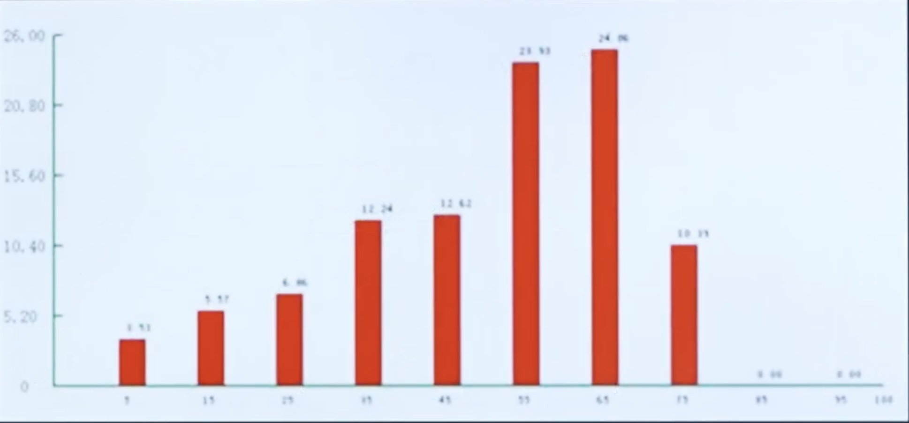

# 6.执行过程组
# 课时 122 : 课前思考题

## 章节导入思考题

## 习题解析

知识管理是项目经理的一项重要责任。这个责任包括管理项目中的两种知识：隐性和显性。以下哪些定义是正确的？

   - [ ] A. 隐性知识是基于事实的，可以很容易地通过语言和符号进行交流。
   - [ ] B. 隐性知识可能需要解释或背景来为这些信息的接受者信。
   - [ ] C. 隐性知识包括情感、经验和能力。
   - [ ] D. 通过PPT分享经验是隐性知识的一个例子。

> 计划驱动执行, 监控保障纠偏
> 项目经理在执行过程中，进需要再监控组执行监控的工作

---

- TBD

---

# 课时 126 : 过程：指导与管理项目工作

| 标题  | 课时  | 章节  |
| --- | --- | --- |
| 进度  | 126  | 119  |

- TBD

## 本节知识点

| 序号 | 知识点 | 重点 |
| :--- | :--- | :--- |
| 1 | 信息管理 | 分享显性知识 信息整理 |
| 2 | 知识管理 | 分享隐性知识 知识整合 |

---

# 课时 127 : 过程：管理质量

| 标题  | 课时  | 章节  |
| --- | --- | --- |
| 进度  | 127  | 120  |

## 管理质量

### 输入

1. **项目管理计划**
   1. 质量管理计划
2. **项目文件**
   1. 经验教训登记册
   2. 质量控制测量结果
   3. 质量测量指标
   4. 风险报告
3. **组织过程资产**

### 工具与技术

1. **数据收集**
   1. ==核对单==
2. **数据分析**
   1. 备选方案分析
   2. 文件分析
   3. 过程分析
   4. 根本原因分析
3. **决策**
   1. 多标准决策分析
4. **数据表现**
   1. 亲和图
   2. ==因果图==
   3. ==流程图==
   4. ==直方图==
   5. 矩阵图
   6. ==散点图==
5. ==审计==
6. ==面向X的设计==
7. **问题解决**
8. **质量改进方法**

### 输出

1. **质量报告**
2. **测试与评估文件**
3. **变更请求**
4. **项目管理计划（更新）**
   1. 质量管理计划
   2. 范围基准
   3. 进度基准
   4. 成本基准
5. **项目文件（更新）**
   1. 问题日志
   2. 经验教训登记册
   3. 风险登记册

## 本节知识点

| 序号 | 知识点 | 重点 |
| :--- | :--- | :--- |
| 1 | 工具 | 核对单 备选方案/文件/过程/根本原因分析 审计 面向X设计 问题解决 质量改进方法 |
| 2 | 输出 | 质量报告 测试与评估文件 |

## 习题解析

在一个建筑项目中，项目经理发现近期完成的部分工程存在质量缺陷，为了避免类似问题再次发生，提升整体项目质量，以下哪项活动属于管理质量过程？

   - [ ] A. 要求施工人员返工处理有质量缺陷的部分
   - [x] B. 分析质量缺陷产生的根本原因，制定并执行质量改进措施
   - [ ] C. 对后续施工过程进行更加严格的质量检查，增加检查频次
   - [ ] D. 与供应商重新协商原材料的质量标准，提高采购质量要求

> 正解：B
> A: 做质量控制
> B: 管理质量过程 （正确）
> C: 属于监控过程组
> D: 属于规划质量管理，并不是流程标准的改进

---

# 课时 128 : 工具：核对单&因果图&直方图&散点图

| 标题  | 课时  | 章节  |
| --- | --- | --- |
| 进度  | 128  | 121 |

## 数据收集-核对单

- 核对单是一种结构化工具，通常具体列出各项内容，用来核实所要求的一系列步骤是否已经执行；

- 需涵盖在范围基准中定义的验收标准。

### 核对单示例表格

例如：
**文件标识**：[ ]-FR-CODE-CHECKLIST-YY
| 编号 | 问题 | 是 | 否 | 不适用 | BUG# | 备注 |
| :--- | :--- | :---: | :---: | :---: | :---: | :--- |
| **变量（Attribute）和常量声明块（VC）** |
| 1 | 变量和常量的命名是否与约定保持一致？ | □ | □ | □ | | |
| 2 | 是否存在容易混淆的相似的变量和属性名？ | □ | □ | □ | | |
| 3 | 变量和属性是否书写正确？ | □ | □ | □ | | |
| 4 | 变量和属性是否被正确的初始化？ | □ | □ | □ | | |
| 5 | 非局部变量是否能用局部变量替换？ | □ | □ | □ | | |
| 6 | 所有的for循环的增量变量是否都在循环顶部声明？ | □ | □ | □ | | |
| 7 | 是否有应该命名为常量的文字常量？ | □ | □ | □ | | |
| 8 | 变量和属性是否可以用常量替换？ | □ | □ | □ | | |
| 9 | 属性是否可以用本地变量？ | □ | □ | □ | | |
| 10 | 所有的属性是否都有正确的访问限制符（private, protected, public）？ | □ | □ | □ | | |
| 11 | 是否有静态属性应该是非静态service-ver？ | □ | □ | □ | | |

## 数据表现-因果图

用于分析根本原因或主要原因

## 数据表现-直方图

用垂直的条形图，显示特定情况的发生次数。

用数字和柱形的相对高度，直观表示引发问题的最普遍原因。

## 数据表现-散点图

数据点越接近某斜线，两个变量之间的关系就越密切。

## 本节知识点

| 序号 | 知识点 | 重点 |
| :--- | :--- | :--- |
| 1 | 核对单 | 核实验收标准 |
| 2 | 因果图 | 分析根本原因或主要原因 |
| 3 | 直方图 | 数据分布 分析问题普遍原因 |
| 4 | 散点图 | 分析两个变量之间的关系 |

## 练习题
在汽车零部件制造项目的规划质量过程中，团队需要分析产品质量问题。以下关于因果图、散点图和直方图的应用场景，描述正确的是哪一个？
- [ ] A. 团队发现产品尺寸偏差较大，想探究是设备老化、人员操作失误还是原材料质量问题导致的，应使用散点图
- [x] B. 为了直观展示不同型号零部件的次品数量分布情况，团队应使用直方图
- [ ] C. 团队想了解生产线上温度与产品抗压强度之间是否存在关联，应使用因果图
- [ ] D. 为分析上个月产品缺陷数量随时间的变化趋势，团队应使用因果图

> A: 这是因果图（鱼骨图）
> B: 这是直方图
> C: 这是散点图
> D: 英国图不能展示随时间变化的原因

---

