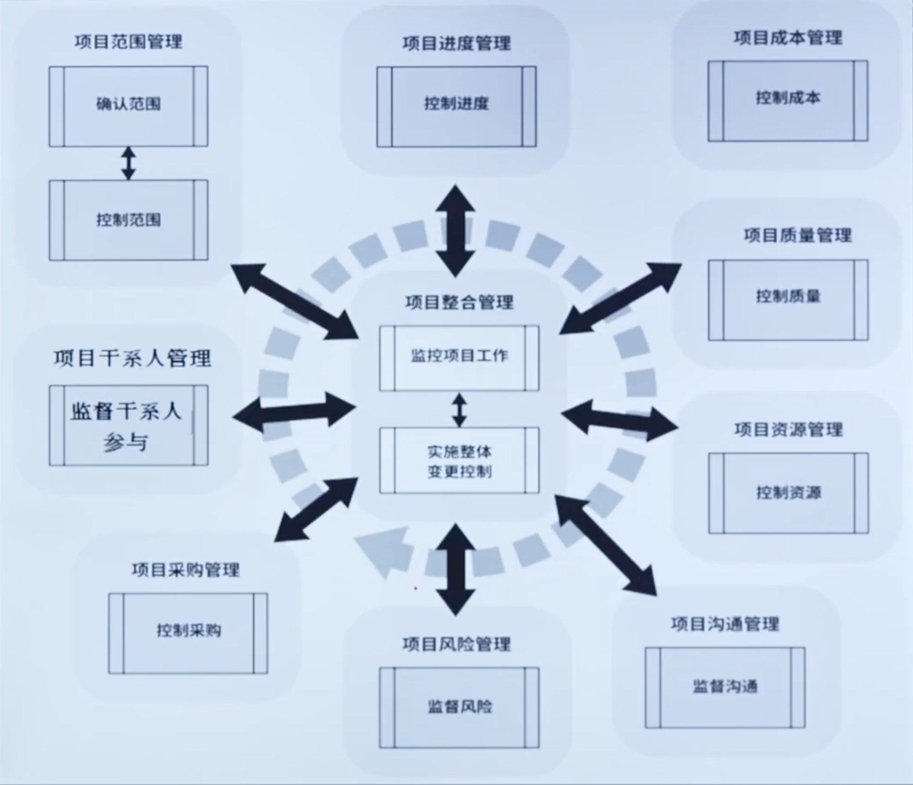
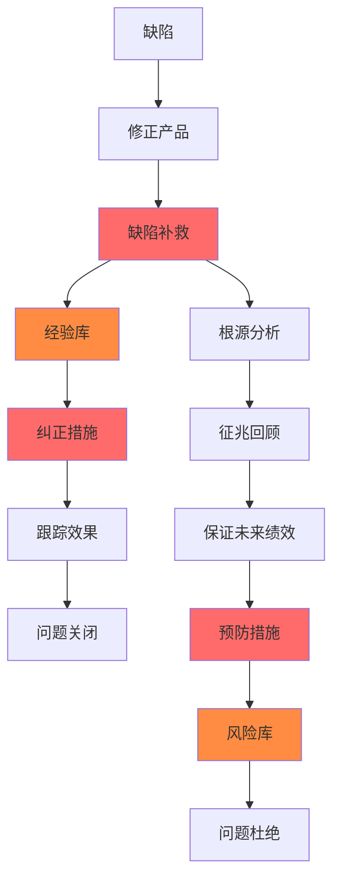
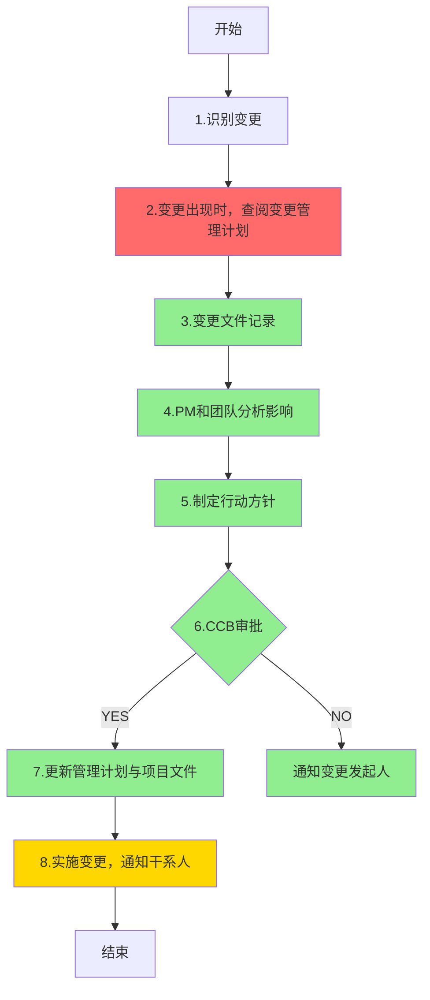

# 第7章: 项目管理生命周期--监控过程组

# 课时 151 : 课前思考

| 标题  | 课时  | 章节  |
| --- | --- | --- |
| 进度  | 151  | 142  |

## 章节开始引入思考题

项目经理刚刚收到客户的一个变更请求，该请求不影响项目进度，而且很容易完成。项目经理应该先做什么？

   - [ ] A. 尽快实现这个改变。
   - [ ] B. 联系项目发起人以获得许可。
   - [ ] C. 提交到变更控制委员会。
   - [x] D. 评估对其他项目约束的影响。

> 解析：
> 应该选 D
> 根据PMP变更管理最佳实践，即使客户的变更请求看似简单且不影响进度，项目经理也必须首先进行全面的影响分析。需要评估变更对项目的其他约束条件（如范围、成本、质量、资源、风险等）可能产生的影响。只有在完成影响评估后，才能决定后续的处理步骤，如是否需要提交变更控制委员会审批。选项A直接实施变更违反了变更管理流程；选项B和C都是在影响评估之后的步骤。

---

# 课时 152 : 课前思考

| 标题  | 课时  | 章节  |
| --- | --- | --- |
| 进度  | 152  | 143  |

## 监控项目工作

| 输入 | 工具与技术 | 输出 |
| :--- | :--- | :--- |
| 1. 项目管理计划 - 任何组件 2. 项目文件    - 假设日志    - 估算依据    - 成本预测    - 问题日志    - 经验教训登记册     - 里程碑清单    - 质量报告    - 风险登记册    - 风险报告    - 进度预测 3. 工作绩效信息 4. 协议 5. 事业环境因素 6. 组织过程资产 | 1. 专家判断 2. 数据分析    - 备选方案分析    - 成本收益分析    - 挣值分析    - 根本原因分析    - 趋势分析    - 偏差分析 3. 决策    -  投票 4. 会议 | 1. 变更请求 2. 工作绩效报告 3. 项目管理计划（更新）    - 任何组件 4. 项目文件（更新）    - 成本预测    - 问题日志    - 经验教训登记册    - 风险登记册    5. 进度预测 |

| 序号 | 知识点 | 重点 |
| :--- | :--- | :--- |
| 1 | 工具 | 偏差/趋势/根本原因/成本效益分析 |
| 2 | 输出 | 工作绩效报告 |

## 习题解析

在一个新的移动应用开发项目中，项目已进入中期阶段。此时，项目经理需要对项目进行有效的监控。以下哪一项活动属于监控项目工作的范畴？

   - [ ] A. 组织团队成员进行头脑风暴，讨论新功能的实现方案
   - [x] B. 对比项目实际成本与预算，分析成本偏差情况
   - [ ] C. 与供应商签订新的合作协议，确保项目物资供应
   - [ ] D. 为项目团队成员安排技能培训，提升团队整体能力

> 解析：
> 应该选 B
> 监控项目工作的核心是通过收集、测量和传播工作绩效信息，评估测量结果，并分析趋势来改进过程。选项B中对比实际成本与预算、分析成本偏差正是监控项目工作的典型活动，属于偏差分析的范畴。其他选项分别属于规划、采购和资源管理活动，不属于监控项目工作的范畴。
> A: 项目执行过程中没推进项目工作
> B：偏差分析
> C: 实施采购
> D: 不属于监控工作

---

# 课时 153 : 过程：实施整体变更控制

| 标题  | 课时  | 章节  |
| --- | --- | --- |
| 进度  | 153  | 144  |

## 实施整体变更控制

| 输入 | 工具与技术 | 输出 |
| :--- | :--- | :--- |
| 1. 项目管理计划 - 1. 变更管理计划 - 2. 配置管理计划 - 3. 范围基准 - 4. 进度基准 - 5. 成本基准 2. 项目文件 - 1. 估算依据 - 2. 需求跟踪矩阵 - 3. 风险报告 3. 工作绩效报告 4. ==变更请求== 5. 事业环境因素 6. 组织过程资产 | 1. 专家判断 2. 会议 3. ==变更控制工具== 4. 数据分析 - 1. 备选方案分析 - 2. 成本收益分析 5. ==决策== - 1. 投票 - 2. 独裁型决策制定 - 3. 多标准决策分析 | 1. 批准的变更请求 2. 项目管理计划（更新） - 1. 任何组件 3. 项目文件（更新） - 1. 变更日志 |

## 知识点

| 序号 | 知识点 | 重点 |
| :--- | :--- | :--- |
| 1 | 输入 | 变更请求 |
| 2 | 工具 | 会议 变更控制工具 投票 独裁型决策制定 多标准决策分析 |
| 3 | 输出 | 批准的变更请求 |

## 习题解析

你精心策划的项目在其生命周期中可能会遇到一些变更请求和批准的变更。在变更管理计划中，你已经概述了你和其他人将用于了解变更影响的过程。让干系人接受这个项目中与变化有关的决定是至关重要的，因为一个失败的项目可能会影响到股东的价值和组织的收益预测。你的注意力最好集中在以下哪项关于项目变化的内容上？

   - [ ] A. 做出改变
   - [ ] B. 跟踪和记录变化
   - [ ] C. 告知发起人更改的情况
   - [x] D. 防止不必要的改变

> 解析：
> 应该选 D
> 根据PMP变更管理的最佳实践，项目经理的注意力应该首先集中在"防止不必要的改变"上。这是因为：
> 1）每个变更都会增加项目的复杂性和风险；
> 2）不必要的变更会导致范围蔓延，影响项目的时间、成本和质量目标；
> 3）预防性的变更管理比被动应对变更更有效；
> 4）通过严格的变更控制流程，可以确保只有真正有价值和必要的变更才被实施。
> 选项A、B、C都是变更管理过程中的重要环节，但都不如防止不必要变更的重要性。

---
# 课时 154 : 输入：变更请求

| 标题  | 课时  | 章节  |
| --- | --- | --- |
| 进度  | 154  | 145  |

## 变更请求
任何干系人都可以提出变更请求。尽管可以口头提出，但必须以==书面形式记录==，并纳入变更管理和/或配置管理系统中。

> 变更并不一定增加需求和增加范围，不应该阻止变更
> 应该是组织随意的变更执行

## 变更请求的类型

变更包括：==纠正措施==、==预防措施==、==缺陷补救==和==更新==

| 变更类型 | 时间导向 | 说明 |
| :--- | :--- | :--- |
| 纠正措施 | 过程 | 针对已发生问题的纠正行动 |
| 预防措施 | 未来 | 预防潜在问题发生的措施 |
| 缺陷补救 | 结果 | 修复已发现缺陷的补救措施 |
| 更新 | 非缺陷 | 非缺陷性质的项目文件更新 |

## 缺陷补救与预防措施流程

流程说明：

- ==缺陷补救==：针对已发现的缺陷进行修正
- ==纠正措施==：基于经验库制定改进措施
- ==预防措施==：通过根源分析预防未来问题
- 经验库和风险库为组织过程资产的重要组成部分

## 本节知识点

| 序号 | 知识点 | 重点 |
| :--- | :--- | :--- |
| 1 | 变更特点 | 可以口头提出，但必须书面记录 |
| 2 | 变更类型 | 纠正措施 预防措施 缺陷补救 更新 |

## 习题解析

在软件开发项目里，出现了以下情况：
代码测试发现多个严重漏洞，影响软件正常运行。
团队发现新技术可提高软件性能，计划引入。
项目进度落后，需调整后续工作计划。
前期需求文档有误，需重新修订。
以下变更类型判断正确的是哪一个？

   - [ ] A. 修复代码漏洞是预防措施
   - [ ] B. 引入新技术是更新
   - [x] C. 调整工作计划是纠正措施
   - [ ] D. 修订需求文档是缺陷补救

> 解析：
> 应该选 C
> 根据PMP变更类型的定义：
> A 选项错误，修复代码漏洞属于缺陷补救，不是预防措施；
> B 选项错误，引入新技术提高性能属于预防措施（非缺陷性质的改进）；
> C 选项中调整工作计划确实是纠正措施，但这个表述是正确的；
> D 选项中修订需求文档属于纠正措施，属于前期的措施，也不属于更新
---
# 课时 155 : 工具：变更控制工具

| 标题  | 课时  | 章节  |
| --- | --- | --- |
| 进度  | 155  | 146 |

## 变更（配置）控制工具

**流程关键要点：**

- ==变更日志更新==：记录所有变更请求及其状态
- ==CCB审批==：变更控制委员会（Change Control Board）是变更批准的关键决策点
- ==影响分析==：PM和团队必须充分分析变更对项目各方面的影响
- ==文档更新==：批准后须及时更新相关管理计划和项目文件

> 当题目中出现关于项目的变更中，有关变更计划，需求变更计划，都是可选的
> 变更必须要经过负责人审批：项目发起人，项目经理，变更控制委员会
> PMP 中，影响项目基准的变更，项目正式的整体流程的变更，需要 CCB 来进行审批
>
> 考试中比较常考到的就是告诉你当前的步骤， 你需要根据当前的步骤来选择下一步的操作

## 本节知识点

| 序号 | 知识点 | 重点 |
| :--- | :--- | :--- |
| 1 | 变更流程 | 先记录、再分析、审批后再执行 |

## 习题解析

项目经理刚刚收到客户的一个变更请求，该请求不影响项目进度，而且很容易完成。项目经理应该先做什么？

   - [ ] A. 尽快实现这个改变。
   - [ ] B. 联系项目发起人以获得许可。
   - [ ] C. 提交到变更控制委员会。
   - [x] D. 评估对其他项目约束的影响。

> 解析：
> 应该选 D
> 根据PMP变更管理最佳实践，即使客户的变更请求看似简单且不影响进度，项目经理也必须首先进行全面的影响分析。需要评估变更对项目的其他约束条件（如范围、成本、质量、资源、风险等）可能产生的影响。只有在完成影响评估后，才能决定后续的处理步骤，如是否需要提交变更控制委员会审批。
> 选项A直接实施变更违反了变更管理流程；
> 选项B和C都是在影响评估之后的步骤。

---

