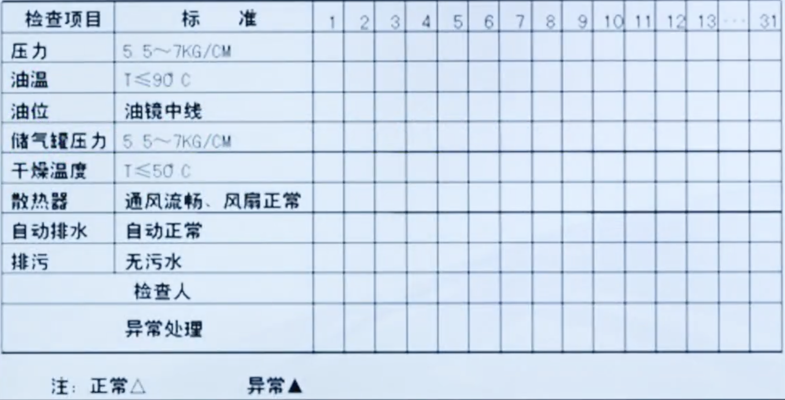
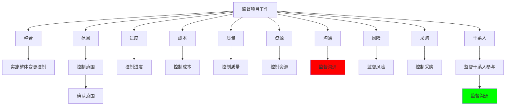

# 第7章: 项目管理生命周期--监控过程组

# 课时 151 : 课前思考

| 标题  | 课时  | 章节  |
| --- | --- | --- |
| 进度  | 151  | 142  |

## 章节开始引入思考题

项目经理刚刚收到客户的一个变更请求，该请求不影响项目进度，而且很容易完成。项目经理应该先做什么？

   - [ ] A. 尽快实现这个改变。
   - [ ] B. 联系项目发起人以获得许可。
   - [ ] C. 提交到变更控制委员会。
   - [x] D. 评估对其他项目约束的影响。

> 解析：
> 应该选 D
> 根据PMP变更管理最佳实践，即使客户的变更请求看似简单且不影响进度，项目经理也必须首先进行全面的影响分析。需要评估变更对项目的其他约束条件（如范围、成本、质量、资源、风险等）可能产生的影响。只有在完成影响评估后，才能决定后续的处理步骤，如是否需要提交变更控制委员会审批。选项A直接实施变更违反了变更管理流程；选项B和C都是在影响评估之后的步骤。


---

# 课时 152 : 课前思考

| 标题  | 课时  | 章节  |
| --- | --- | --- |
| 进度  | 152  | 143  |

## 监控项目工作

| 输入 | 工具与技术 | 输出 |
| :--- | :--- | :--- |
| 1. 项目管理计划<br>- 任何组件<br>2. 项目文件<br>   - 假设日志<br>   - 估算依据<br>   - 成本预测<br>   - 问题日志<br>   - 经验教训登记册<br>    - 里程碑清单<br>   - 质量报告<br>   - 风险登记册<br>   - 风险报告<br>   - 进度预测<br>3. 工作绩效信息<br>4. 协议<br>5. 事业环境因素<br>6. 组织过程资产 | 1. 专家判断<br>2. 数据分析<br>   - 备选方案分析<br>   - 成本收益分析<br>   - 挣值分析<br>   - 根本原因分析<br>   - 趋势分析<br>   - 偏差分析<br>3. 决策<br>   -  投票<br>4. 会议 | 1. 变更请求<br>2. 工作绩效报告<br>3. 项目管理计划（更新）<br>   - 任何组件<br>4. 项目文件（更新）<br>   - 成本预测<br>   - 问题日志<br>   - 经验教训登记册<br>   - 风险登记册<br>   5. 进度预测 |


| 序号 | 知识点 | 重点 |
| :--- | :--- | :--- |
| 1 | 工具 | 偏差/趋势/根本原因/成本效益分析 |
| 2 | 输出 | 工作绩效报告 |


## 习题解析

在一个新的移动应用开发项目中，项目已进入中期阶段。此时，项目经理需要对项目进行有效的监控。以下哪一项活动属于监控项目工作的范畴？

   - [ ] A. 组织团队成员进行头脑风暴，讨论新功能的实现方案
   - [x] B. 对比项目实际成本与预算，分析成本偏差情况
   - [ ] C. 与供应商签订新的合作协议，确保项目物资供应
   - [ ] D. 为项目团队成员安排技能培训，提升团队整体能力

> 解析：
> 应该选 B
> 监控项目工作的核心是通过收集、测量和传播工作绩效信息，评估测量结果，并分析趋势来改进过程。选项B中对比实际成本与预算、分析成本偏差正是监控项目工作的典型活动，属于偏差分析的范畴。其他选项分别属于规划、采购和资源管理活动，不属于监控项目工作的范畴。
> A: 项目执行过程中没推进项目工作
> B：偏差分析
> C: 实施采购
> D: 不属于监控工作

---

# 课时 153 : 过程：实施整体变更控制

| 标题  | 课时  | 章节  |
| --- | --- | --- |
| 进度  | 153  | 144  |

## 实施整体变更控制

| 输入 | 工具与技术 | 输出 |
| :--- | :--- | :--- |
| 1. 项目管理计划<br>- 1. 变更管理计划<br>- 2. 配置管理计划<br>- 3. 范围基准<br>- 4. 进度基准<br>- 5. 成本基准<br>2. 项目文件<br>- 1. 估算依据<br>- 2. 需求跟踪矩阵<br>- 3. 风险报告<br>3. 工作绩效报告<br>4. ==变更请求==<br>5. 事业环境因素<br>6. 组织过程资产 | 1. 专家判断<br>2. 会议<br>3. ==变更控制工具==<br>4. 数据分析<br>- 1. 备选方案分析<br>- 2. 成本收益分析<br>5. ==决策==<br>- 1. 投票<br>- 2. 独裁型决策制定<br>- 3. 多标准决策分析 | 1. 批准的变更请求<br>2. 项目管理计划（更新）<br>- 1. 任何组件<br>3. 项目文件（更新）<br>- 1. 变更日志 |

## 知识点

| 序号 | 知识点 | 重点 |
| :--- | :--- | :--- |
| 1 | 输入 | 变更请求 |
| 2 | 工具 | 会议<br>变更控制工具<br>投票<br>独裁型决策制定<br>多标准决策分析 |
| 3 | 输出 | 批准的变更请求 |


## 习题解析

你精心策划的项目在其生命周期中可能会遇到一些变更请求和批准的变更。在变更管理计划中，你已经概述了你和其他人将用于了解变更影响的过程。让干系人接受这个项目中与变化有关的决定是至关重要的，因为一个失败的项目可能会影响到股东的价值和组织的收益预测。你的注意力最好集中在以下哪项关于项目变化的内容上？

   - [ ] A. 做出改变
   - [ ] B. 跟踪和记录变化
   - [ ] C. 告知发起人更改的情况
   - [x] D. 防止不必要的改变

> 解析：
> 应该选 D
> 根据PMP变更管理的最佳实践，项目经理的注意力应该首先集中在"防止不必要的改变"上。这是因为：
> 1）每个变更都会增加项目的复杂性和风险；
> 2）不必要的变更会导致范围蔓延，影响项目的时间、成本和质量目标；
> 3）预防性的变更管理比被动应对变更更有效；
> 4）通过严格的变更控制流程，可以确保只有真正有价值和必要的变更才被实施。
> 选项A、B、C都是变更管理过程中的重要环节，但都不如防止不必要变更的重要性。

---
# 课时 154 : 输入：变更请求

| 标题  | 课时  | 章节  |
| --- | --- | --- |
| 进度  | 154  | 145  |

## 变更请求
任何干系人都可以提出变更请求。尽管可以口头提出，但必须以==书面形式记录==，并纳入变更管理和/或配置管理系统中。

> 变更并不一定增加需求和增加范围，不应该阻止变更
> 应该是组织随意的变更执行


## 变更请求的类型

变更包括：==纠正措施==、==预防措施==、==缺陷补救==和==更新==

| 变更类型 | 时间导向 | 说明 |
| :--- | :--- | :--- |
| 纠正措施 | 过程 | 针对已发生问题的纠正行动 |
| 预防措施 | 未来 | 预防潜在问题发生的措施 |
| 缺陷补救 | 结果 | 修复已发现缺陷的补救措施 |
| 更新 | 非缺陷 | 非缺陷性质的项目文件更新 |

## 缺陷补救与预防措施流程


流程说明：

- ==缺陷补救==：针对已发现的缺陷进行修正
- ==纠正措施==：基于经验库制定改进措施
- ==预防措施==：通过根源分析预防未来问题
- 经验库和风险库为组织过程资产的重要组成部分


## 本节知识点

| 序号 | 知识点 | 重点 |
| :--- | :--- | :--- |
| 1 | 变更特点 | 可以口头提出，但必须书面记录 |
| 2 | 变更类型 | 纠正措施<br>预防措施<br>缺陷补救<br>更新 |


## 习题解析

在软件开发项目里，出现了以下情况：
代码测试发现多个严重漏洞，影响软件正常运行。
团队发现新技术可提高软件性能，计划引入。
项目进度落后，需调整后续工作计划。
前期需求文档有误，需重新修订。
以下变更类型判断正确的是哪一个？

   - [ ] A. 修复代码漏洞是预防措施
   - [ ] B. 引入新技术是更新
   - [x] C. 调整工作计划是纠正措施
   - [ ] D. 修订需求文档是缺陷补救

> 解析：
> 应该选 C
> 根据PMP变更类型的定义：
> A 选项错误，修复代码漏洞属于缺陷补救，不是预防措施；
> B 选项错误，引入新技术提高性能属于预防措施（非缺陷性质的改进）；
> C 选项中调整工作计划确实是纠正措施，但这个表述是正确的；
> D 选项中修订需求文档属于纠正措施，属于前期的措施，也不属于更新
---
# 课时 155 : 工具：变更控制工具

| 标题  | 课时  | 章节  |
| --- | --- | --- |
| 进度  | 155  | 146 |


## 变更（配置）控制工具


**流程关键要点：**

- ==变更日志更新==：记录所有变更请求及其状态
- ==CCB审批==：变更控制委员会（Change Control Board）是变更批准的关键决策点
- ==影响分析==：PM和团队必须充分分析变更对项目各方面的影响
- ==文档更新==：批准后须及时更新相关管理计划和项目文件

> 当题目中出现关于项目的变更中，有关变更计划，需求变更计划，都是可选的
> 变更必须要经过负责人审批：项目发起人，项目经理，变更控制委员会
> PMP 中，影响项目基准的变更，项目正式的整体流程的变更，需要 CCB 来进行审批
>
> 考试中比较常考到的就是告诉你当前的步骤， 你需要根据当前的步骤来选择下一步的操作

## 本节知识点

| 序号 | 知识点 | 重点 |
| :--- | :--- | :--- |
| 1 | 变更流程 | 先记录、再分析、审批后再执行 |

## 习题解析

项目经理刚刚收到客户的一个变更请求，该请求不影响项目进度，而且很容易完成。项目经理应该先做什么？

   - [ ] A. 尽快实现这个改变。
   - [ ] B. 联系项目发起人以获得许可。
   - [ ] C. 提交到变更控制委员会。
   - [x] D. 评估对其他项目约束的影响。

> 解析：
> 应该选 D
> 根据PMP变更管理最佳实践，即使客户的变更请求看似简单且不影响进度，项目经理也必须首先进行全面的影响分析。需要评估变更对项目的其他约束条件（如范围、成本、质量、资源、风险等）可能产生的影响。只有在完成影响评估后，才能决定后续的处理步骤，如是否需要提交变更控制委员会审批。
> 选项A直接实施变更违反了变更管理流程；
> 选项B和C都是在影响评估之后的步骤。


---

# 课时 156 : 工具：决策

| 标题  | 课时  | 章节  |
| --- | --- | --- |
| 进度  | 156  | 147 |

## 决策-投票&独裁型决策制定

投票是一种 达成某种期望结果，而==对多个未来行动方案进行评估的集体决策技术和过程==。

可用于本过程的决策技术包括（但不限于）投票。投票可以包括用下列方法进行决策：

- 一致同意。每个人都同意某个行动方案。
- 大多数同意。获得群体中超过 50%人员的支持，就能做出决定。把参与决策的小组人数定为奇数，可防止因平局而无法达成决
- 相对多数同意。根据群体中相对多数人的意见做出决策，即便未获得大多数人的支持。通常在候选项超过两个时使用。
独裁型决策制定：采用这种方法，将由一个人负责力整个集体制定决算

补充：<u>德尔菲技术</u>

- 匿名
- 背靠背（每个人单独一个房间进行投票， 避免专家之间相互影响）


## 决策--多标准决策分析

该技术借助决策矩阵，根据一系列预定义的准则，用系统分析方法评估变更请求。

| 客户需求 | 相对重要性 | 定价 | 绿化 | 公交 | 保安 | 设计 | 施工质量 | 物业管理 | 水电气 | 学校 | 超市 | 医院 |
| :--- | :---: | :---: | :---: | :---: | :---: | :---: | :---: | :---: | :---: | :---: | :---: | :---: |
| 价格 | 9 | 9 | 1 | 1 | 1 | 2 | 4 | 1 | 1 | 3 | 3 | 2 |
| 舒适 | 8 | 3 | 6 | 2 | 1 | 4 | 4 | 5 | 5 | 4 | 4 | 4 |
| 安全 | 8 | - | - | - | 8 | 1 | 6 | - | - | - | - | 2 |
| 美观 | 6 | 5 | 6 | - | 2 | 1 | 1 | 1 | - | - | 2 | - |
| 生活配套 | 5 | 2 | 1 | 1 | 1 | 2 | - | 2 | 6 | 1 | 6 | 2 |
| 交通方便 | 4 | 1 | - | 8 | - | 1 | - | 2 | - | - | - | - |
| 维护方便 | 4 | 2 | 2 | - | - | - | - | 6 | 2 | - | - | - |
| 教育配套 | 3 | 1 | - | - | - | 1 | - | 1 | - | 8 | - | - |
| 适用性 | 3 | 1 | 2 | - | 8 | 2 | - | - | - | - | - | - |
| 医疗配套 | 2 | 1 | - | - | - | 1 | - | 1 | - | - | - | 8 |
| **加权总分** | | **165** | **112** | **62** | **86** | **103** | **88** | **150** | **93** | **88** | **89** | **104** |
| **难度等级** | | **1** | **5** | **4** | **5** | **3** | **3** | **5** | **5** | **2** | **3** | **2** |

分析说明：
- ==多标准决策分析==：通过系统化的评分矩阵评估各个选项
- ==相对重要性==：不同客户需求的权重差异影响最终决策
- ==加权总分==：根据重要性权重计算的综合评分
- ==难度等级==：实施各项措施的难度评估（1-5级）


## 本节知识点

| 序号 | 知识点 | 重点 |
| :--- | :--- | :--- |
| 1 | 投票 | 一致同意<br>大多数同意（超过50%）<br>相对多数同意 |
| 2 | 独裁型决策制定 | 一个人负责决策 |
| 3 | 德尔菲技术 | 匿名、背靠背 |
| 4 | 多标准决策分析 | 借助决策矩阵，系统分析评估 |


## 习题解析

在一个新产品研发项目中，团队需要确定产品的最终外观设计方案。目前有三个备选方案，分别是方案A、方案B和方案C。团队成员对这三个方案各有偏好，为了确定最终方案，项目经理考虑了几种决策方式，以下说法正确的是哪一个？

   - [ ] A. 项目经理独自决定采用方案A，这属于多标准决策分析
   - [ ] B. 团队成员通过举手投票，选择支持人数最多的方案B，这是独裁式决策
   - [x] C. 运用预先设定的外观美感、生产成本、生产可行性等多个标准，对三个方案打分后选择总分最高的方案，这是多标准决策分析
   - [ ] D. 独裁式决策能充分考虑团队成员的意见，提高决策的认可度

> 解析：
> 应该选 C
> 根据PMP决策技术的定义：A选项错误，项目经理独自决定属于独裁式决策制定，不是多标准决策分析；B选项错误，团队成员投票选择支持人数最多的方案属于投票决策（相对多数同意），不是独裁式决策；C选项正确，运用多个预设标准对方案进行评分和比较，这正是多标准决策分析的典型应用；D选项错误，独裁式决策是由一个人负责决策，并不能充分考虑团队成员意见。

---

# 课时 157 : 过程：确认范围

| 标题  | 课时  | 章节  |
| --- | --- | --- |
| 进度  | 157  | 148 |


## 确认范围

确认范围过程主要关注可交付物的验收，而控制质量过程主要关注可交付物的正确性及是否满足质量要求。控制质量过程通常先于确认范围过程，但二者也可同时进行。

### 输入、工具与技术、输出

| 输入 | 工具与技术 | 输出 |
| :--- | :--- | :--- |
| **1. 项目管理计划**<br>　1. 范围管理计划<br>　2. 需求管理计划<br>　3. 范围基准<br>**2. 项目文件**<br>　1. 经验教训登记册<br>　2. 质量报告<br>　3. 需求文件<br>　4. 需求跟踪矩阵<br>**3. 核实的可交付物**<br>**4. 工作绩效数据** | **1. 检查**<br>**2. 决策**<br>　1. ==投票== | **1. 验收的可交付物**<br>**2. 变更请求**<br>**3. 工作绩效信息**<br>**4. 项目文件（更新）**<br>　1. 经验教训登记册<br>　2. 需求文件<br>　3. 需求跟踪矩阵 |

**关键要点：**

- ==确认范围==：关注可交付物的验收
- ==控制质量==：关注可交付物的正确性及质量要求
- ==投票决策==：在确认范围过程中的重要决策工具
- 控制质量通常先于确认范围，但可同时进行

## 本节知识点

| 序号 | 知识点 | 重点 |
| :--- | :--- | :--- |
| 1 | 确认范围输入 | 核实的可交付物 |
| 2 | 确认范围工具 | 检查、投票 |
| 3 | 确认范围输出 | 验收的可交付物 |

## 习题解析

项目的产品已经完成，并由团队交付给客户。他们被客户告知，有几个交付物是不可接受的，因为它们不符合项目早期的要求。项目经理和团队审查了需求文件，并一致认为产品交付物符合他们所理解的客户需求。项目经理，是组织的新成员，寻求项目管理办公室的建议来确定什么地方出了问题。经过一些讨论，项目管理办公室意识到"确认范围"过程没有被项目经理适当地执行。以下哪项是确认范围过程的一个关键输出？

   - [ ] A. 一个更完整的范围管理计划
   - [x] B. 客户对项目交付物的接受
   - [ ] C. 需求分析
   - [ ] D. 项目范围说明书的确认

> 解析：
> 应该选 B
> 根据PMP确认范围过程的定义，确认范围的关键输出是"验收的可交付物"，这意味着客户对项目交付物的正式接受。题目中恰恰是因为缺少了这个过程，导致客户后来才发现交付物不符合要求。
> A 选项的范围管理计划是规划阶段的输出；
> C 选项需求分析是需求收集和分析阶段的活动；
> D 选项项目范围说明书的确认不是确认范围过程的输出。
> 只有 B 选项正确描述了确认范围过程的核心目的和关键输出。

---

# 课时 158 : 过程：控制范围

| 标题  | 课时  | 章节  |
| --- | --- | --- |
| 进度  | 158  | 149 |

## 控制范围

### 输入、工具与技术、输出

| 输入 | 工具与技术 | 输出 |
| :--- | :--- | :--- |
| **1. 项目管理计划**<br>　1. 范围管理计划<br>　2. 需求管理计划<br>　3. 变更管理计划<br>　4. 配置管理计划<br>　5. 范围基准<br>　6. 绩效测量基准<br>**2. 项目文件**<br>　1. 经验教训登记册<br>　2. 需求文件<br>　3. 需求跟踪矩阵<br>**3. 工作绩效数据**<br>**4. 组织过程资产** | **1. 数据分析**<br>　1. ==偏差分析==<br>　2. ==趋势分析== | **1. 工作绩效信息**<br>**2. 变更请求**<br>**3. 项目管理计划（更新）**<br>　1. 范围管理计划<br>　2. 范围基准<br>　3. 进度基准<br>　4. 成本基准<br>　5. 绩效测量基准<br>**4. 项目文件（更新）**<br>　1. 经验教训登记册<br>　2. 需求文件<br>　3. 需求跟踪矩阵 |

**关键要点：**

- ==控制范围==：监控项目和产品的范围状态，管理范围基准变更
- ==偏差分析==：比较实际绩效与基准的差异
- ==趋势分析==：识别范围变更的趋势和模式
- 控制范围与确认范围的区别：控制范围关注范围变更控制，确认范围关注可交付物验收

## 范围蔓延

范围蔓延。没有对时间、成本和资源做相应调整，就进行的未经控制的产品或项目范围的扩大。


## 范围控制的基础

客户没有提新需求，项目自己做了额外客户不需要工作，用工作授权系统避免范围蔓金。

范围控制层次结构：


**关键概念：**

- ==范围镀金==：客户没有提新需求，项目自己做了额外客户不需要工作，用工作授权系统避免范围镀金。
- ==范围蔓延==：未经控制的范围扩大，可能导致未得到控制的变更
- ==范围基准==：范围控制的基础，是项目范围的标准参照

## 本节知识点

| 序号 | 知识点 | 重点 |
| :--- | :--- | :--- |
| 1 | 输入 | 工作绩效数据 |
| 2 | 工具 | 偏差分析<br>趋势分析 |
| 3 | 输出 | 工作绩效信息<br>变更请求 |
| 4 | 范围蔓延 | 客户提出范围以外的新要求 |
| 5 | 范围镀金 | 团队自己做的范围以外的工作 |


## 习题解析

在一个网站开发项目中，项目范围已经明确界定，包括网站的页面设计、功能模块开发等内容。在项目执行过程中，客户提出希望在网站中增加一个在线客服功能，且不改变原定的项目交付时间和预算。此时，项目经理应该怎么做？

   - [ ] A. 同意客户的请求，立即安排团队成员开发在线客服功能，以满足客户需求
   - [ ] B. 拒绝客户请求，告知客户不能在项目中添加任何新功能，避免范围蔓延
   - [x] C. 对客户提出的新功能进行评估，分析其对项目进度、成本和资源的影响，按照变更管理流程处理
   - [ ] D. 先让团队成员进行初步开发，等完成后再与客户沟通费用和时间调整问题

> 解析：
> 应该选 C
> 当客户提出新的功能需求时，项目经理应该按照变更管理流程进行处理，首先评估变更对项目三重约束（范围、时间、成本）的影响，然后通过正式的变更控制流程来处理，而不是直接同意或拒绝。

---

# 课时 159 : 过程：控制进度

| 标题  | 课时  | 章节  |
| --- | --- | --- |
| 进度  | 159  | 150 |

## 控制进度

### 输入、工具与技术、输出

| 输入 | 工具与技术 | 输出 |
| :--- | :--- | :--- |
| **1. 项目管理计划**<br>　1. 进度管理计划<br>　2. 进度基准<br>　3. 范围基准<br>　4. 绩效测量基准<br>**2. 项目文件**<br>　1. 经验教训登记册<br>　2. 项目日历<br>　3. 项目进度计划<br>　4. 资源日历<br>　5. 进度数据<br>**3. 工作绩效数据**<br>**4. 组织过程资产** | **1. 数据分析**<br>　1. ==挣值分析==<br>　2. 迭代燃尽图<br>　3. 绩效审查<br>　4. ==趋势分析==<br>　5. ==偏差分析==<br>　6. 假设情景分析<br>**2. 关键路径法**<br>**3. 资源优化**<br>**4. 提前量和滞后量**<br>**5. 项目管理信息系统**<br>**6. 进度压缩** | **1. 工作绩效信息**<br>**2. 进度预测**<br>**3. 变更请求**<br>**4. 项目管理计划（更新）**<br>　1. 进度管理计划<br>　2. 进度基准<br>　3. 成本基准<br>　4. 绩效测量基准<br>**5. 项目文件（更新）**<br>　1. 假设日志<br>　2. 估算依据<br>　3. 经验教训登记册<br>　4. 项目进度计划<br>　5. 资源日历<br>　6. 风险登记册<br>　7. 进度数据 |

**关键要点：**

- ==控制进度==：监控项目状态，更新项目进度，管理进度基准变更
- ==挣值分析==：最重要的进度控制工具，结合成本和进度进行综合分析
- ==偏差分析==：比较实际进度与计划进度的差异
- ==趋势分析==：识别进度绩效的发展趋势


## 本节知识点

| 序号 | 知识点 | 重点 |
| :--- | :--- | :--- |
| 1 | 工具 | 绩效审查 |
| 2 | 输出 | 进度预测 |


## 习题解析

在一个桥梁建设项目中，计划工期为24个月。在项目进行到第12个月时，项目经理发现实际完成的工程进度仅达到原计划的40%，远远落后于进度计划。此时，项目经理采取了一系列措施来控制进度。以下措施中，属于控制进度过程的是什么？

   - [ ] A. 重新评估项目团队成员的技能，对技能不足的成员安排培训
   - [x] B. 分析进度延误的原因，如施工工艺复杂、原材料供应不及时等
   - [ ] C. 与设计团队沟通，优化桥梁部分结构设计，以降低施工难度
   - [ ] D. 制定项目进度报告，向项目干系人汇报项目当前进度情况

> 解析：
> 应该选 B
> 分析进度延误的原因属于偏差分析，这是控制进度过程中的重要工具与技术。控制进度过程的核心是监控项目状态、识别偏差并采取纠正措施。
> 选项A属于人力资源管理，
> 选项C属于变更管理，
> 选项D属于沟通管理，
> 都不是控制进度过程的直接活动。

---

# 课时 160 : 监控过程组：闯关题1

## 10-监控过程组（142小节-150小节）闯关题

你精心策划的项目在其生命周期中可能会遇到一些变更请求和批准的变更。在变更管理计划中，你已经概述了你和其他人将用于了解变更影响的过程。让相关方接受这个项目中与变化有关的决定是至关重要的，因为一个失败的项目可能会影响到股东的价值和组织的收益预测。你的注意力最好集中在以下哪项关于项目变化的内容上？

A.	做出改变

B.	跟踪和记录变化

C.	告知发起人更改的情况

D.	防止不必要的改变
正确答案：D ， 回答正确

> 解析：
在项目管理中，虽然变更不可避免，但防止不必要的变更至关重要。不必要的变更可能会对项目产生诸多负面影响，如导致项目进度延迟、成本超支、资源分配不合理等，进而影响股东价值和组织收益预测。精心策划变更管理计划的目的之一就是通过一系列流程和方法来评估变更的必要性和影响，尽量避免那些对项目目标没有积极贡献或会带来较大风险的变更。
选项 A “做出改变”，这只是变更管理中的一个环节，且没有强调对变更必要性的把控；
选项 B “跟踪和记录变化”，是变更管理的重要工作，但重点在于对已发生变更的管理，而不是从源头上防止不必要变更；
选项 C “告知发起人更改的情况”，只是信息传递的一个步骤，没有涉及到对变更本身的控制和管理，不能从根本上减少项目失败的风险。


你在项目规划期间接手了一个项目，发现有六个人签署了项目章程。以下哪项是你最应该关注的？

A.	谁将成为变更控制委员会的成员

B.	花更多的时间在配置管理上

C.	获得一个单一的项目发起人

D.	确定报告结构

正确答案：B ， 你的答案：D回答错误

> 解析：
项目章程有六个人签署，意味着相关方众多且意见可能较难统一，这会使项目需求和范围变更的可能性增加。在这种情况下，加强配置管理是非常关键的。配置管理通过严格控制对项目产品和文档的变更，能有效应对因多方相关方参与可能导致的混乱和不一致性。
>
> 选项 A，变更控制委员会成员的确定虽然重要，但不是当前最应关注的问题，且相关方多并不一定意味着变更控制委员会成员就多。
> 选项 C，获得单一的项目发起人可能不太现实，因为项目章程已经有多个签署人，且多个签署人并不一定代表没有明确的项目发起责任，重点是如何协调各方利益和需求。
> 选项 D，确定报告结构相对来说没有配置管理那么紧迫，报告结构主要涉及信息的传递和沟通，而配置管理直接关系到项目的范围和成果的稳定性，在面对多个相关方可能带来的变更风险时更为关键。


项目经理刚刚收到客户的一个变更请求，该请求不影响项目进度，而且很容易完成。项目经理应该先做什么？

A.	尽快实现这个改变。

B.	联系项目发起人以获得许可。

C.	提交到变更控制委员会。

D.	评估对其他项目约束的影响。

正确答案：D ， 回答正确

> 解析：
虽然该变更请求不影响项目进度且容易完成，但项目经理不能仅依据这一点就直接实施变更。项目是一个系统工程，任何变更都可能对其他方面产生潜在影响，如成本、质量、范围、资源等约束条件。所以，项目经理应首先全面评估该变更对其他项目约束的影响，然后再根据评估结果决定后续的行动方案。
选项 A，直接尽快实现变更过于草率，可能会引发一系列后续问题而不自知。
选项 B，联系项目发起人获得许可并不是首要步骤，在评估变更对项目整体的影响之前，发起人也无法做出合理决策。
选项 C，提交到变更控制委员会是变更管理流程中的一个环节，但在这之前需要先完成对变更影响的评估，以便为变更控制委员会提供充分的决策依据。


在项目中期，项目经理被她的调度员告知，项目的控制限制是安全的。同一天早上，她收到一个团队成员的纸条，说他遇到了一个问题。纸条上说："这个活动让我抓狂，而会计部门的经理不会帮助我，直到这个活动的浮动处于危险之中"。此外，项目经理还有来自一个次要相关方的电子邮件和来自团队成员的14封电子邮件。当她正在阅读这些邮件时，一个团队成员走进了项目经理的办公室，告诉她一个纠正措施是由项目管理办公室的一个团队成员实施的，但没有被记录下来。项目经理接下来应该做什么？

A.	向项目管理办公室报告违反文件的情况，评估控制限制的安全性，并审查通信管理计划中的电子邮件发送规则。

B.	澄清文件是一个问题的原因，让会计部门协助团队成员，并对小的相关方作出回应。

C.	将已实施的纠正措施添加到变更日志中，在下一次团队会议上讨论文件的价值，并让团队成员与会计部门顺利解决这个问题。

D.	找出是谁造成了会计部门的问题，在回复其他邮件之前，先回复次要相关方，并回顾沟通管理计划中的流程，向有文件问题的团队成员报告担忧。

正确答案：C ， 回答正确

> 解析：
对于题干中的情况，首先，项目管理办公室团队成员实施的纠正措施未被记录，项目经理应将其添加到变更日志中，以确保项目变更的可追溯性和规范性，这是项目管理中非常重要的一环。
其次，关于文件记录的问题，在下次团队会议上讨论文件的价值有助于提高团队成员对文件记录重要性的认识，避免类似情况再次发生。
最后，团队成员与会计部门之间的问题，应该让团队成员与会计部门自行顺利解决，项目经理可提供必要的指导和协调，而不是直接介入找出是谁造成了问题。
选项 A 中，评估控制限制的安全性并非当务之急，当前更重要的是处理已出现的纠正措施未记录以及团队成员之间的问题；且审查通信管理计划中的电子邮件发送规则对于解决当前问题并非首要任务。
选项 B 中，让会计部门协助团队成员可能需要先让团队成员自行尝试解决，且没有解决纠正措施未记录的问题。
选项 D 中，找出是谁造成会计部门的问题并非关键，重点是解决团队成员与会计部门之间的协作问题，并且先回复次要相关方也不是最优先的事项，首要还是处理项目内部的关键问题。


一个项目被授权来确定延长公司一种中等产量产品的产品寿命的新方法。项目经理来自工程部门，团队来自产品管理和营销部门。当一个相关方通知团队有一个更好的方法来完成其中一个工作包时，项目范围说明书和项目规划就完成了。该相关方提供了一封来自他所在部门的技术审查信，证明完成该工作包的新方法实际上比旧方法更快。项目经理在其他项目中与该部门有类似的经验，并期待着在这个项目中发生这种情况。项目经理应该做的第一件事是什么？

A.	联系该部门，再次抱怨他们错过了提交范围的最后期限。

B.	确定这一变化将如何影响完成工作包的成本和工作包的产品质量。

C.	看看是否有办法从矩阵式组织转变为职能式组织，以消除来自其他部门的所有干扰。

D.	询问该部门是否有其他变化。

正确答案：B ， 回答正确

> 解析：
当有相关方提出一种完成工作包的新方法时，这属于变更，项目经理首先应该确定这一变更将如何影响完成工作包的成本和工作包的产品质量。因为项目已经完成了范围说明书和项目规划，此时引入新的方法可能会对项目的多个方面产生影响，如成本超支或质量下降等。在评估了成本和质量等方面的影响后，才能更好地决定是否采用该新方法，以及是否需要对项目计划进行调整等后续行动。
选项 A，联系该部门抱怨错过提交范围的最后期限，并不能解决新方法对项目的实际影响问题，也不利于与相关部门建立良好的合作关系。
选项 C，试图从矩阵式组织转变为职能式组织来消除干扰，这是一种比较极端的做法，而且并不能直接针对当前新方法带来的影响进行处理，同时组织形式的转变也需要综合考虑多方面因素，不是解决该问题的首要步骤。
选项 D，询问该部门是否有其他变化，虽然也有一定意义，但不如先评估当前这个变化对成本和质量的影响重要，只有先了解了当前变化的影响，才能更好地应对可能存在的其他变化。


一个项目刚刚开始第二阶段，正在创建工作包。一个新的团队成员已经完成了他在这个阶段的工作包，并要求项目经理验证他的工作包的范围。该团队成员急于让客户看到他的工作包。项目经理虽然对这个新的团队成员很有信心，但希望这个团队成员在客户看到他的工作包后能获得信心。什么时候应该进行确认范围过程？

A.	在项目结束的时候

B.	在项目开始的时候

C.	在项目的每个阶段结束时

D.	在规划过程中

正确答案：C ， 回答正确

> 解析：
确认范围过程是正式验收项目已完成的可交付成果的过程。在项目的每个阶段结束时进行确认范围，有助于及时发现问题并进行纠正，确保项目的可交付成果符合相关方的期望和要求，同时也能让项目团队成员及时获得反馈，增强信心。
选项A：如果等到项目结束时才进行确认范围，一旦发现问题，可能需要花费大量的时间和成本来纠正，甚至可能无法挽回。
选项B：项目开始时主要是确定项目的初始范围等，而不是确认已完成的工作包范围。
选项D：规划过程中是确定项目范围如何定义、确认和控制，而不是进行实际的范围确认工作。


一个新软件产品的开发阶段已经接近尾声。一些质量问题增加了构建产品的成本，但项目经理和团队认为一旦项目进入市场，这些成本将是无足轻重的。接下来的阶段是测试和实施。该项目比计划提前两周。在进入下一阶段之前，项目经理应该最关注以下哪个过程？

A.	确认范围

B.	控制质量

C.	管理沟通

D.	控制成本

正确答案：A ， 回答正确

> 解析：
确认范围是正式验收项目已完成的可交付成果的过程。在本案例中，开发阶段接近尾声，虽然存在一些质量问题，但项目经理和团队认为成本影响不大，且项目进度提前。此时最重要的是确保开发阶段的成果得到正式确认，只有完成确认范围过程，才能正式进入下一阶段，避免后续因范围问题产生纠纷或返工。
选项 B：主要关注的是确保项目产品或服务符合质量要求，在开发阶段已经发现了质量问题并认为可接受，进入下一阶段前更关键的是确认范围而非再次强调控制质量。
选项 C：在项目各阶段都很重要，但在当前情境下，不是进入下一阶段前最需要关注的过程。
选项 D：虽然项目存在成本增加的情况，但项目经理和团队已认为这些成本在产品进入市场后无足轻重，且目前项目进度提前，所以控制成本不是此时最关注的。


确认范围与哪一个过程密切相关？

A.	控制质量

B.	排列活动顺序

C.	管理资源

D.	日程管理

正确答案：A ， 回答正确

> 解析：
确认范围是正式验收项目已完成的可交付成果的过程，而控制质量则是监督并记录质量活动执行结果，以便评估绩效并推荐必要变更的过程。控制质量关注的是可交付成果的质量是否符合要求，确认范围关注的是可交付成果是否能被相关方接受。只有当可交付成果通过控制质量过程，确保其质量合格后，才能进行确认范围，由相关方正式验收。所以确认范围与控制质量密切相关。
选项 B：主要是确定各活动之间的先后顺序，与确认范围没有直接关联。
选项 C：是对项目所需资源进行管理和分配，与确认范围的关系不大。
选项 D：主要涉及项目进度的安排和控制，与确认范围的联系不紧密。


以下哪项最能说明确认范围的过程？

A.	它提供了可交付物符合规范的保证，是对项目管理计划的输入，是控制质量的输出。

B.	它确保可交付物按时完成，确保客户接受，并显示可交付物符合规范。

C.	它确保顾客接受，显示可交付物符合规格，并为意见分歧的出现提供机会。

D.	它是控制质量的一个输出^发生在定义范围之前，并确保客户的接受。

正确答案：C ， 你的答案：A回答错误

> 解析：
确认范围过程的主要目的是确保客户或相关方对已完成的可交付成果进行正式验收，接受可交付成果，这意味着可交付成果符合他们的期望和规格要求。同时，在确认范围的过程中，相关方可能会对可交付成果提出不同的意见和看法，这也为意见分歧的出现提供了机会，有助于及时发现问题并解决。
选项 A 中说确认范围是控制质量的输出，这是不准确的，控制质量和确认范围是相互关联但不同的过程，确认范围并非控制质量的直接输出。
选项 B 中 “确保可交付物按时完成” 主要是进度管理的范畴，不是确认范围过程的主要职责。
选项 D 中说确认范围发生在定义范围之前是错误的，定义范围是在项目前期确定项目范围的过程，而确认范围是在项目可交付成果完成后进行的，是对定义范围成果的验收，确认范围发生在定义范围之后。


一家小型建筑公司的项目经理有一个项目，预算为130,000美元，为期6周。根据进度，该项目到目前为止应该花费60,000美元。然而，到目前为止，它已经花费了90,000美元。该项目也落后于计划，因为最初的估算并不准确。谁有解决这个问题的主要责任？

A.	项目经理

B.	高级管理人员

C.	项目发起人

D.	项目管理办公室的经理

正确答案：A ， 回答正确

> 解析：
项目经理是对项目的成功负责的人，包括项目的范围、进度、成本和质量等各个方面。在这个案例中，项目出现了成本超支和进度落后的问题，虽然最初估算不准确是一个原因，但项目经理有责任对项目进行监控和调整，及时发现问题并采取纠正措施。
选项 B：通常负责公司的整体战略和方向，不会直接负责具体项目的日常管理和问题解决。
选项 C：主要负责为项目提供资金和支持，确定项目的目标和愿景，但不负责项目的具体执行和问题处理。
选项 D：负责制定项目管理的政策、流程和标准，为项目提供支持和指导，但不是直接解决具体项目问题的责任人。

---

# 课时 161 : 过程：控制成本

| 标题  | 课时  | 章节  |
| --- | --- | --- |
| 进度  | 161  | 151 |

## 控制成本

### 输入、工具与技术、输出

| 输入 | 工具与技术 | 输出 |
| :--- | :--- | :--- |
| **1. 项目管理计划**<br>　1. 成本管理计划<br>　2. 成本基准<br>　3. 绩效测量基准<br>**2. 项目文件**<br>　1. 经验教训登记册<br>**3. 项目资金需求**<br>**4. 工作绩效数据**<br>**5. 组织过程资产** | **1. 数据分析**<br>　1. ==挣值分析==<br>　2. 偏差分析<br>　3. 趋势分析<br>　4. 储备分析<br>**2. ==完工尚需绩效指数==**<br>**3. 专家判断**<br>**4. 项目管理信息系统** | **1. 工作绩效信息**<br>**2. 成本预测**<br>**3. 变更请求**<br>**4. 项目管理计划（更新）**<br>　1. 成本管理计划<br>　2. 成本基准<br>　3. 绩效测量基准<br>**5. 项目文件（更新）**<br>　1. 假设日志<br>　2. 估算依据<br>　3. 成本估算<br>　4. 经验教训登记册<br>　5. 风险登记册 |

**关键要点：**

- ==控制成本==：监控项目状态，更新项目成本，管理成本基准变更
- ==挣值分析==：最重要的成本控制工具，综合分析进度和成本绩效
- ==完工尚需绩效指数==：预测完成剩余工作所需的成本绩效
- 控制成本与制定预算的区别：控制成本关注成本变更控制，制定预算关注成本基准建立

## 本节知识点

| 序号 | 知识点 | 重点 |
| :--- | :--- | :--- |
| 1 | 工具 | 储备分析 |
| 2 | 输出 | 成本预测 |


## 习题解析

在一个商业写字楼装修项目中，预算成本为200万元，计划工期6个月。在项目进行到第3个月时，项目经理发现实际成本已经达到120万元，而按照计划此时成本应该是80万元。为了有效控制成本，以下做法正确的是哪一个？

   - [ ] A. 立即要求施工团队减少人员投入，降低人工成本
   - [x] B. 对已经发生的成本超支情况进行分析，找出成本超支的原因
   - [ ] C. 直接削减后续装修材料的采购预算，以弥补当前的成本超支
   - [ ] D. 忽视当前成本超支情况，等项目结束后再进行成本核算

> 解析：
> 应该选 B
> 对已经发生的成本超支情况进行分析属于偏差分析，这是控制成本过程中的重要工具与技术。控制成本的核心是监控项目状态、识别成本偏差并分析原因，然后采取合适的纠正措施。选项A和C都是不经分析就直接采取行动，可能导致其他问题；选项D忽视问题，不符合项目管理要求。

---
# 课时 162 : 工具：挣值分析（上）

| 标题  | 课时  | 章节  |
| --- | --- | --- |
| 进度  | 162  | 152 |

## 挣值分析

挣值分析的发展脉络：

```
范围 → 进度 → 成本 → 绩效测量方法
```

**关键理解：**

- ==范围==：项目工作范围的确定是基础
- ==进度==：基于范围制定项目进度计划
- ==成本==：基于进度和范围确定项目成本
- ==绩效测量方法==：挣值分析作为综合的绩效测量工具，整合范围、进度、成本三个维度

## 挣值管理（EVM）

挣值管理(EVM)是一种常用的绩效测量方法，可采用多种形式。它综合考虑项目范围、成本与进度指标，帮助项目管理团队评估与策略项目绩效和进度。

### 挣值分析的必要性


**核心问题：**

当项目的进度和成本都存在偏差时，如何客观、准确地评估项目的整体绩效表现？挣值分析正是为了解决这个综合评估问题而产生的。

> 先有范围，再有进度，最后讲成本。
> 挣值管理：干了多少活，化了多少钱

## 本节知识点

| 序号 | 知识点 | 重点 |
| :--- | :--- | :--- |
| 1 | 挣值管理 | 干了多少活，花了多少钱 |


## 习题解析

在分析测试过程中出现的问题时，团队发现因果图有助于确定集中精力的最佳位置。他们对可交付成果的相互关系的协调得到了改善，团队发现了一些效率，并与其他项目和组织分享，以改进流程。这在项目与绩效测量基准保持一致的程度上产生了变化。干系人预计，未来项目的控制工作和报告将变得更加容易。挣值分析是什么的基础？

   - [x] A. 绩效报告
   - [ ] B. 规划控制
   - [ ] C. 石川图
   - [ ] D. 将项目的各个组成部分整合成一个整体

> 解析：
> 应该选 A
> A: 挣值分析就是绩效报告的基础（正确）
> B: 挣值分析只是用于规划和评估绩效的工具，和控制没有关系（错）
> C: 石川图就是因果图，用于分析原因，和挣值分析没有直接的关系（错）
> D: 是整合管理的工作，和挣值没有什么关系（错）

---
# 课时 163 : 工具：挣值分析（中）

| 标题  | 课时  | 章节  |
| --- | --- | --- |
| 进度  | 163 | 153 |

## 挣值分析


> 在第 5 个月的计划成本实际上是 40% 的成本 4000 元。因为实际的工作量只有 40%
> 衡量成本偏差的是 EV 和 AC 进行比较
> 在某个时间切片，用 AC/EV 来计算当前的花销进度比
> 然后用剩余的进度 * 比率获得剩余的完工尚需估算（ETC） + 当前的 AC = 完工估算(EAC) 

| 序号 | 知识点 | 重点 |
| :--- | :--- | :--- |
| 1 | 挣值关键指数 | BAC、PV、EV、AC |
| 2 | 预测关键指数 | ETC、EAC |


## 习题解析

财务部门要求你随时向他们汇报你所领导的资本项目所花费的费用。你被要求提交一份资金计划，每月的预测是必要的，这样可以提前申请对资金计划的任何修改，并进行评估。超出预算限额是不可接受的，因为这将影响股票价值。你已经成功地实施了一些程序和做法来预测资金变化，你对这些程序和做法进行评估，以尽量减少问题，提高资金的使用效率。你已经采用了各种报告和分析技术来满足财务部门的要求。其中之一是完工估算（EAC），它是一种什么的定期评估？

   - [ ] A. 已完成工作的成本
   - [ ] B. 已完成工作的价值
   - [x] C. 项目完成时的预计总成本
   - [ ] D. 完成项目的费用是多少

> 解析：
> 应该选 C
> 完工估算（EAC）是对项目完成时预计总成本的定期评估，用于预测项目最终的成本状况，帮助财务部门进行资金规划和控制。

---
# 课时 164 : 工具：挣值分析（下）

| 标题  | 课时  | 章节  |
| --- | --- | --- |
| 进度  | 164 | 154 |

## 挣值分析

**CV (Cost Variance) =EV-AC**

**SV (Schedule Variance) =EV-PV**

**CPI (Cost Performance Index) =EV/AC**

**SPI (Schedule Performance Index) =EV/PV**

| 偏差分析 | 偏差为正：>0 | 偏差为负：<0 |
| :--- | :--- | :--- |
| 成本偏差（CV） | 节约成本 | 成本超支 |
| 进度偏差（SV） | 工作量提前 | 工作量落后 |
| SV和CV同时 | 成本节约，工作量提前 | 成本超支，工作量落后 |

| 偏差分析 | 原因分析 |
| :--- | :--- |
| CV为正；SV为负 | 资源没到位，没开工，所以省钱，进度落后 |
| CV为负；SV为正 | 可能在赶工，拿资源换时间，所以花钱多，进度提前 |
| SPI >1 | 则说明已完成的工作量超过计划。由于SPI测量的是项目的总工作量，所以还需要对关键路径上的绩效进行单独分析以确认项目是否将比计划完成日期提前或推迟完工。 |

> 若 SPI > 1 但关键路径上的任务落后了， 非关键路径的任务超前了。也有可能造成进度落后
> 考试中 若 SPI > 1 还得看关键路径上的进度是否超前

## 知识点

| 序号 | 知识点 | 重点 |
| :--- | :--- | :--- |
| 1 | 挣值公式 | CV=EV-AC<br>SV=EV-PV<br>CPI=EV/AC<br>SPI=EV/PV |
| 2 | 偏差指标含义 | CV和SV>0，=0，<0 的含义<br>CPI和SPI>1，=1，<1 的含义 |


## 习题解析

如果挣值（EV）=350，实际成本（AC）=400，而计划价值（PV）=325，那么成本差异（CV）是多少？

   - [ ] A. 350
   - [ ] B. -75
   - [ ] C. 400
   - [x] D. -50

> 解析：
> 应该选 D
> 根据挣值分析公式CV=EV-AC，代入数值：CV=350-400=-50，因此成本差异为-50，表示成本超支50。

---

# 选修： 项目预测的挣值计算（选修）

| 标题  | 课时  | 章节  |
| --- | --- | --- |
| 进度  | 164 | 155 |

## ETC & EAC & VAC

ETC中T是"to"是从此点到完成，而EAC中A是"At"是从头到尾。

### ETC有三个表达公式

**ETC= (BAC-EV)/CPI** 代表是一种"典型"的绩效发展（正常开发）

**ETC= BAC-EV** 代表前期绩效是偶然的，后期发展不会按前期的 CPI 跑（前期有成员请假）

**ETC= (BAC-EV )/(CPI*SPI)** 代表是一种要按时完成的绩效发展（赶工场景），其中 CPI*SPI 是关键比率

### EAC其实只有一种表达既是

**EAC=AC+ETC**

假如ETC是一种"典型"的趋势发展，也可表达为**EAC=BAC/CPI**

### 完工偏差：

**VAC=BAC-EAC**


## 完工尚需绩效指数

**TCPI（To Complete Performance Index）**指为了实现特定的管理目标（BAC或EAC），剩余工作实施必须达到的绩效指标（预测值）

**基于BAC的TCPI=（BAC-EV）/（BAC-AC）** 代表需按原预算完成

**基于EAC的TCPI=（BAC-EV）/（EAC-AC）** 代表需按新的BAC既是分母的EAC完成（这个EAC既是新的BAC必须管理层批准）


## 知识点

| 序号 | 知识点 | 重点 |
| :--- | :--- | :--- |
| 1 | ETC公式 | ETC= (BAC-EV)/CPI<br>ETC= BAC-EV<br>ETC= (BAC-EV )/(CPI*SPI) |
| 2 | EAC和VAC公式 | EAC=AC+ETC<br>EAC=BAC/CPI<br>VAC=BAC-EAC |
| 3 | TCPI公式 | TCPI= (BAC-EV )/(BAC-AC)<br>TCPI= (BAC-EV )/(EAC-AC) |


## 习题解析

计算完工估算的一个常用方法是取完工预算(BAC)？

   - [ ] A. 除以SPI
   - [ ] B. 乘以SPI
   - [ ] C. 乘以CPI
   - [x] D. 除以CPI

> 解析：
> 应该选 D
> 完工估算(EAC)的常用计算公式是EAC=BAC/CPI，即用完工预算除以成本绩效指数，这种方法假设未来的成本绩效趋势将与当前的绩效水平保持一致。

---

# 课时 165 : 监控过程组：闯关题2

## 10-监控过程组（151小节-155小节）闯关题

**成本绩效指数（CPI）为0.89意味着什么？**

A.	在这个时候，我们预计整个项目的成本比计划的要高89%。

B.	当项目完成后，我们将比计划多花89%的钱。

C.	该项目正在以计划的89%的速度进展。

D.	该项目每投资一美元，就能得到89美分。

正确答案：D ， 你的答案：C回答错误

> 解析：
成本绩效指数（CPI）是指项目挣值与实际成本之比，即CPI = EV / AC。当CPI = 0.89时，意味着项目每投入1美元的实际成本，只能获得相当于0.89美元的挣值，也就是每投资一美元，只能得到89美分的价值，反映出项目成本超支，成本绩效不佳。
A 选项，预计整个项目成本比计划高的比例不是简单的89%，而是(1 - 0.89) / 0.89*100%=12.4%。
B 选项，不能仅根据当前的CPI就确定项目完成时会比计划多花89%的钱，因为项目后续的成本绩效情况是未知的。
C 选项，CPI反映的是成本绩效，而不是项目的进度。

**为了清楚地了解项目的进展情况，买方希望定期报告包括分析已经按计划完成的工作，已经花费的美元以及它们如何反映计划的开支，已经接受的交付物，以及对已经发生的风险事件的评估。以下哪项代表实际完成的工作的估算价值？**

A.	挣值（EV）

B.	计划价值(PV)

C.	实际成本(AC)

D.	成本差异(CV)

正确答案：A ， 回答正确

> 解析：
挣值（EV）是指实际完成工作的估算价值，它是根据项目的预算和实际完成的工作量来计算的，用于衡量项目实际完成工作所对应的价值。
B 选项：计划价值（PV）是指计划在一定时间内完成的工作的预算价值，代表了计划要完成的工作量及其对应的预算金额，而不是实际完成工作的价值，所以 B 选项错误。
C 选项：实际成本（AC）是指在一定时间内完成工作实际花费的成本，它体现的是实际支出的金额，并非实际完成工作的估算价值，C 选项不符合要求。
D 选项：成本差异（CV）是挣值与实际成本之间的差值，即CV = EV - AC，它反映的是成本的偏差情况，而不是实际完成工作的估算价值，D 选项也不正确。

**一个制造业项目的进度绩效指数（SPI）为0.89，成本绩效指数（CPI）为0.91。一般来说，对于这种情况发生的最可能的解释是什么？**

A.	范围被改变了。

B.	一个供应商倒闭了，需要找到一个新的供应商。

C.	需要购买额外的设备。

D.	一项关键路径活动需要更长的时间，需要更多的劳动时间来完成。

正确答案：D ， 回答正确

> 解析：
进度绩效指数（SPI）和成本绩效指数（CPI）都小于 1，说明项目进度落后且成本超支。一项关键路径活动需要更长时间，意味着会影响整个项目的进度，导致 SPI 下降；同时需要更多劳动时间来完成，会使人力成本增加，进而导致成本超支，CPI 下降。
A 选项：范围改变不一定同时导致进度落后和成本超支，有可能只影响其中一个方面，或者通过合理调整资源等方式，不一定会造成 SPI 和 CPI 同时小于 1 的情况。
B 选项：供应商倒闭找到新供应商，如果处理得当，不一定会对进度和成本产生如此大的影响，而且通常不会同时影响进度和成本两个方面。
C 选项：购买额外设备主要影响成本，可能对进度影响较小，不太可能是导致 SPI 和 CPI 同时出现问题的主要原因。


**尽管相关方认为预算中有足够的资金，但项目进行到一半时，成本绩效指数（CPI）为0.7。为了确定根本原因，几个相关方对项目进行了审计，发现项目成本预算的估算是类比估算；虽然活动估算加起来是项目估算，但相关方认为在完成估算的过程中缺少了什么。以下哪项描述了缺失的环节？**

A.	估算的成本应该被用来衡量CPI。

B.	应该使用SPI，而不是CPI。

C.	应该使用自下而上的估算法。

D.	没有考虑到过去的历史。

正确答案：C ， 你的答案：B回答错误

> 解析：
类比估算通常是基于以往类似项目的经验进行成本估算，这种方法相对粗略，可能不够准确。而自下而上估算法是将项目分解为较小的工作包或活动，对每个工作包或活动进行详细的成本估算，然后汇总得到项目的总成本估算。这种方法能够更详细、准确地考虑到项目的各种成本因素，减少估算误差。在本题中，采用类比估算可能导致一些成本因素被遗漏或低估，所以使用自下而上的估算法可能会更准确，这也是可能缺失的环节。
A 选项，估算成本不是用来衡量 CPI 的，CPI 是通过挣值（EV）与实际成本（AC）计算得出的，即CPI = EV / AC。
B 选项，SPI（进度绩效指数）用于衡量项目进度绩效，而本题关注的是成本绩效问题，所以使用 SPI 并不能解决成本估算不准确的问题。
D 选项，类比估算本身就是基于过去的历史项目进行的，所以说没有考虑到过去的历史是不正确的。

**项目工作绩效报告中包括如下数字: PV=110, EV=100, AC=120， 总预算为150。成本偏差是多少?**

A.	-20

B.	-10

C.	+10

D.	+20

正确答案：A ， 回答正确

> 解析：
本题可根据成本偏差（CV）的计算公式来求解。
成本偏差（CV）是指在某个检查点上，挣值（EV）与实际成本（AC）之间的差值，
其计算公式为：CV = EV - AC。
已知在项目工作绩效报告中EV = 100，AC = 120，
将其代入公式可得：CV = 100 - 120= -20
所以，成本偏差是-20，答案选 A。

---

# 课时 166 : 过程：控制质量

| 标题  | 课时  | 章节  |
| --- | --- | --- |
| 进度  | 166  | 156 |

## 控制质量

项目中，控制质量活动由特定团队成员在特定时间点或者项目或阶段快结束时执行。

| 输入 | 工具与技术 | 输出 |
| :--- | :--- | :--- |
| **1. 项目管理计划**<br>- 1. 质量管理计划<br>**2. 项目文件**<br>- 1. 经验教训登记册<br>- 2. 质量测量指标<br>- 3. 测试与评估文件<br>**3. 批准的变更请求**<br>**4. 可交付物**<br>**5. 工作绩效数据**<br>**6. 事业环境因素**<br>**7. 组织过程资产** | **1. 数据收集**<br>- 1. 核对单<br>- 2. ==核查表==<br>- 3. 统计抽样<br>- 4. 问卷调查<br>**2. 数据分析**<br>- 1. 绩效审查<br>- 2. 根本原因分析<br>**3. 检查**<br>**4. 测试/产品评估**<br>**5. 数据表现**<br>- 1. 因果图<br>- 2. ==控制图==<br>- 3. 直方图<br>- 4. 散点图<br>**6. 会议** | **1. 质量控制测量结果**<br>**2. 核实的可交付物**<br>**3. 工作绩效信息**<br>**4. 变更请求**<br>**5. 项目管理计划（更新）**<br>- 1. 质量管理计划<br>**6. 项目文件（更新）**<br>- 1. 问题日志<br>- 2. 经验教训登记册<br>- 3. 风险登记册<br>- 4. 测试与评估文件 |

| 序号 | 知识点 | 重点 |
| :--- | :--- | :--- |
| 1 | 工具 | 核对单、核查表、统计抽样、问卷调查<br>绩效审查、检查、测试/产品评估 |
| 2 | 输出 | 质量控制测量结果、核实的可交付物 |

## 习题解析

在项目执行过程中，一个项目组成员通知项目经理，一个工作包没有达到质量指标，而且她认为不可能达到指标。项目经理与所有干系人会面，分析这一情况。项目经理参与了质量管理过程中的哪一部分？

- [ ] A. 管理质量
- [ ] B. 实施整体变更控制
- [x] C. 控制质量
- [ ] D. 规划质量管理

> 解析：
> 应该选 C
> 当项目组成员发现工作包没有达到质量指标时，项目经理与干系人会面分析情况，这是典型的控制质量过程活动。控制质量过程负责监控和记录质量活动执行结果，以便评估绩效并确保项目输出完整、正确且满足客户期望。

---

# 课时 167 : 工具：核查表&控制图

| 标题  | 课时  | 章节  |
| --- | --- | --- |
| 进度  | 167  | 157 |

## 核查表

* 又称计数表（tally sheets）
* 用于收集数据的查对清单



> 产品上线/正式使用 后，用于检查产品是否存在钱在的风险，检查设备的稳定性和安全性

## 控制图

* 控制图用来确定一个过程是否稳定，查明特殊原因导致该过程失控，或者是否具有可预测的绩效，评价变更是否达到改进效果。
* 最常用来跟踪批量生产中的重复性活动，也可监测成本与进度偏差、产量、范围变更频率或其他管理工作成果。


请继续输入课程内容。

| 序号 | 知识点 | 重点 |
| :--- | :--- | :--- |
| 1 | 核查表 | 收集关于质量风险的数据 |
| 2 | 控制图 | 过程监控、结果预测<br>7点规则、+-3西格玛 |

## 习题解析

控制图可以帮助项目经理做什么？

- [ ] A. 集中精力解决最关键的问题，以提高质量
- [ ] B. 专注于激发思考
- [ ] C. 分析质量问题的原因
- [x] D. 确定一个过程是否在既定的指标内运行

> 解析：
> 应该选 D
> 控制图是质量控制的重要工具，用于确定一个过程是否稳定、是否在统计控制状态下运行。通过上下控制限和中心线，控制图能够帮助项目经理监控过程绩效，判断过程是否在既定的指标范围内运行，从而及时发现过程中的异常变化。

---
# 课时 168 : 过程：控制资源

| 标题  | 课时  | 章节  |
| --- | --- | --- |
| 进度  | 168  | 158 |

## 控制资源

| 输入 | 工具与技术 | 输出 |
| :--- | :--- | :--- |
| 1. 项目管理计划<br>&nbsp;&nbsp;&nbsp;&nbsp;1. 资源管理计划<br>2. 项目文件<br>&nbsp;&nbsp;&nbsp;&nbsp;1. 问题日志<br>&nbsp;&nbsp;&nbsp;&nbsp;2. 经验教训登记册<br>&nbsp;&nbsp;&nbsp;&nbsp;3. 物质资源分配单<br>&nbsp;&nbsp;&nbsp;&nbsp;4. 项目进度计划<br>&nbsp;&nbsp;&nbsp;&nbsp;5. 资源分解结构<br>&nbsp;&nbsp;&nbsp;&nbsp;6. 资源需求<br>&nbsp;&nbsp;&nbsp;&nbsp;7. 风险登记册<br>3. 工作绩效数据<br>4. 协议<br>5. 组织过程资产 | 1. 数据分析<br>&nbsp;&nbsp;&nbsp;&nbsp;1. 备选方案分析<br>&nbsp;&nbsp;&nbsp;&nbsp;2. 成本效益分析<br>&nbsp;&nbsp;&nbsp;&nbsp;3. 绩效审查<br>&nbsp;&nbsp;&nbsp;&nbsp;4. 趋势分析<br>2. 问题解决<br>3. 人际关系与团队技能<br>&nbsp;&nbsp;&nbsp;&nbsp;1. 谈判<br>&nbsp;&nbsp;&nbsp;&nbsp;2. 影响力<br>4. 项目管理信息系统 | 1. 工作绩效信息<br>2. 变更请求<br>3. 项目管理计划（更新）<br>&nbsp;&nbsp;&nbsp;&nbsp;1. 资源管理计划<br>&nbsp;&nbsp;&nbsp;&nbsp;2. 进度基准<br>&nbsp;&nbsp;&nbsp;&nbsp;3. 成本基准<br>4. 项目文件（更新）<br>&nbsp;&nbsp;&nbsp;&nbsp;1. 假设日志<br>&nbsp;&nbsp;&nbsp;&nbsp;2. 问题日志<br>&nbsp;&nbsp;&nbsp;&nbsp;3. 经验教训登记册<br>&nbsp;&nbsp;&nbsp;&nbsp;4. 物质资源分配单<br>&nbsp;&nbsp;&nbsp;&nbsp;5. 资源分解结构<br>&nbsp;&nbsp;&nbsp;&nbsp;6. 风险登记册 |

## 本节知识点

| 序号 | 知识点 | 重点 |
| :--- | :--- | :--- |
| 1 | 工具 | 问题解决 |
| 2 | 输出 | 物质资源分配单更新<br>资源分解结构更新 |


## 习题解析

在一个汽车零部件制造项目中，项目进行到中期，项目经理发现部分关键设备频繁出现故障，导致生产进度严重受阻，同时还发现一些技术工人被临时调去支援其他项目，造成当前项目人力短缺。针对这些情况，以下属于控制资源过程的是什么？

   - [ ] A. 与设备供应商签订新的设备采购合同，购买更先进的设备
   - [ ] B. 重新规划项目整体进度计划，以适应现有资源状况
   - [x] C. 分析设备故障原因并安排维修
   - [ ] D. 对项目团队成员进行激励，提高他们的工作积极性

> 解析：
> 应该选 C
> 控制资源过程主要是监督资源使用情况，识别资源相关问题并采取纠正措施。选项C"分析设备故障原因并安排维修"直接针对当前的资源问题（设备故障）进行分析和解决，属于控制资源过程的典型活动。
> 选项A属于采购管理，
> 选项B属于进度管理，
> 选项D属于团队管理。
>
---
# 课时 169 : 过程：监督沟通

| 标题  | 课时  | 章节  |
| --- | --- | --- |
| 进度  | 169  | 159 |

## 监督沟通

监督沟通是确保满足项目及其干系人的信息需求的过程。本过程的主要作用是按沟通管理计划和干系人参与计划的要求优化信息传递流程。

| 输入 | 工具与技术 | 输出 |
| :--- | :--- | :--- |
| 1. 项目管理计划<br>&nbsp;&nbsp;&nbsp;&nbsp;1. 资源管理计划<br>&nbsp;&nbsp;&nbsp;&nbsp;2. 沟通管理计划<br>&nbsp;&nbsp;&nbsp;&nbsp;3. 干系人参与计划<br>2. 项目文件<br>&nbsp;&nbsp;&nbsp;&nbsp;1. 问题日志<br>&nbsp;&nbsp;&nbsp;&nbsp;2. 经验教训登记册<br>&nbsp;&nbsp;&nbsp;&nbsp;3. 项目沟通记录<br>3. 工作绩效数据<br>4. 事业环境因素<br>5. 组织过程资产 | 1. 数据分析<br>&nbsp;&nbsp;&nbsp;&nbsp;1. 干系人参与度评估矩阵<br>2. 项目管理信息系统<br>3. 专家判断<br>4. 人际关系与团队技能<br>&nbsp;&nbsp;&nbsp;&nbsp;1. 观察/交谈<br>5. 会议 | 1. 工作绩效信息<br>2. 变更请求<br>3. 项目管理计划（更新）<br>&nbsp;&nbsp;&nbsp;&nbsp;1. 沟通管理计划<br>&nbsp;&nbsp;&nbsp;&nbsp;2. 干系人参与计划<br>4. 项目文件（更新）<br>&nbsp;&nbsp;&nbsp;&nbsp;1. 问题日志<br>&nbsp;&nbsp;&nbsp;&nbsp;2. 经验教训登记册<br>&nbsp;&nbsp;&nbsp;&nbsp;3. 干系人登记册 |

## 本节知识点

| 序号 | 知识点 | 重点 |
| :--- | :--- | :--- |
| 1 | 工具 | 干系人参与度评估矩阵<br>观察/交谈 |


## 习题解析

在一个跨国工程项目中，项目团队成员来自不同国家和地区，沟通渠道多样，包括邮件、即时通讯工具和视频会议等。项目执行期间，频繁出现信息传递不及时、误解等沟通问题，影响了项目进展。项目经理决定加强沟通监管，以下做法中，属于监督沟通过程的是哪一个？

- [ ] A. 制定沟通管理计划，明确各成员沟通职责和沟通方式
- [x] B. 统计分析过去一个月内项目团队成员之间的沟通记录，识别沟通问题的类型和频率
- [ ] C. 组织一次团队建设活动，增进成员之间的了解，改善沟通氛围
- [ ] D. 为项目团队成员提供沟通技巧培训，提升他们的沟通能力

> 解析：
> 应该选 B
> 监督沟通过程的主要作用是确保满足项目及其干系人的信息需求，通过监控和评估沟通活动来识别问题并进行改进。选项B"统计分析过去一个月内项目团队成员之间的沟通记录，识别沟通问题的类型和频率"正是监督沟通过程的典型活动，通过数据分析来识别沟通问题。
> 选项A属于规划沟通管理过程，
> 选项C属于管理团队过程，
> 选项D属于培训活动。

---
# 课时 170 : 过程：监督风险

| 标题  | 课时  | 章节  |
| --- | --- | --- |
| 进度  | 170  | 160 |

## 监督风险

| 输入 | 工具与技术 | 输出 |
| :--- | :--- | :--- |
| 1. 项目管理计划<br>&nbsp;&nbsp;&nbsp;&nbsp;1. 风险管理计划<br>2. 项目文件<br>&nbsp;&nbsp;&nbsp;&nbsp;1. 问题日志<br>&nbsp;&nbsp;&nbsp;&nbsp;2. 经验教训登记册<br>&nbsp;&nbsp;&nbsp;&nbsp;3. 风险登记册<br>&nbsp;&nbsp;&nbsp;&nbsp;4. 风险报告<br>3. 工作绩效数据<br>4. 工作绩效报告 | 1. 数据分析<br>&nbsp;&nbsp;&nbsp;&nbsp;1. 技术绩效分析<br>&nbsp;&nbsp;&nbsp;&nbsp;2. ==储备分析==<br>2. 审计<br>3. 会议 | 1. 工作绩效信息<br>2. 变更请求<br>3. 项目管理计划（更新）<br>&nbsp;&nbsp;&nbsp;&nbsp;1. 任何组件<br>4. 项目文件（更新）<br>&nbsp;&nbsp;&nbsp;&nbsp;1. 假设日志<br>&nbsp;&nbsp;&nbsp;&nbsp;2. 问题日志<br>&nbsp;&nbsp;&nbsp;&nbsp;3. 经验教训登记册<br>&nbsp;&nbsp;&nbsp;&nbsp;4. 风险登记册<br>&nbsp;&nbsp;&nbsp;&nbsp;5. 风险报告<br>&nbsp;&nbsp;&nbsp;&nbsp;6. 组织过程资产（更新） |

## 监督风险

* 残余风险：在采取风险应对措施之后仍然存在的风险。
* 次生风险：由于实施某风险应对措施而直接产生的风险。

## 本节知识点

| 序号 | 知识点 | 重点 |
| :--- | :--- | :--- |
| 1 | 工具 | 技术绩效分析<br>储备分析<br>审计 |
| 2 | 残余风险 | 风险应对后剩余的风险 |
| 3 | 次生风险 | 风险应对措施产生的风险 |


## 习题解析

大部分的项目风险将在哪个风险管理过程中被识别？

- [ ] A. 进行定量的风险分析和识别风险
- [x] B. 识别风险和监控风险
- [ ] C. 进行定性的风险分析和监控风险
- [ ] D. 识别风险和执行定性风险分析

> 解析：
> 应该选 B
> 大部分项目风险主要在"识别风险"过程中被识别，这是风险管理的第一个过程，也是最重要的风险识别阶段。
> A: 定量的风险分析是风险的量化评估，不是风险识别
> B: 识别风险是风险识别过程， 同时监控风险的过程中，新的风险也会被识别（正确）
> C: 定性的风险分析是风险的排序，不是识别
> D: 定性风险分析是排序，错误

---
# 课时 171 : 工具：储备分析&审计&会议

| 标题  | 课时  | 章节  |
| --- | --- | --- |
| 进度  | 170  | 161 |

## 储备分析

指在项目的任何时点将剩余的储备金金额与剩余风险量进行比较，以确定剩余储备是否仍然合理。

> 这里的储备分析是用于监控储备是否超过了预期
> 简单来说：好借好还，再借不难

## 审计

- 风险审计是一种审计类型，可用于评估风险管理过程的有效性。
- 风险审计可以在日常项目审查会上开展，可以在风险审查会上开展，团队也可以召开专门风险审计会。

## 会议

- 会议包括（但不限于）风险审查会。
- 应该==定期==安排风险审查，来检查和记录风险应对在处理整体项目风险和已识别单个项目风险方面的有效性。
- 在风险审查中，还可以识别出新的单个项目风险（包括已商定应对措施所引发的次生风险），重新评估当前风险，关闭已过时风险，讨论风险发生所引发的问题，以及总结可用于当前项目后续阶段或未来类似项目的经验教训。
- 根据风险管理计划的规定，风险审查可以是定期项目状态会中的一项议程，或者也可以召开专门的风险审查会。

## 本节知识点

| 序号 | 知识点 | 重点 |
| :--- | :--- | :--- |
| 1 | 储备分析 | 根据剩余风险量增减剩余储备金 |
| 2 | 审计 | 评估风险管理过程的有效性 |
| 3 | 风险审查会 | 识别新风险<br>重新评估当前风险<br>关闭已过的风险 |


## 习题解析

在一个大型商业综合体建设项目中，项目经理已经识别并应对了多个风险。随着项目进入后期施工阶段，为确保项目顺利收尾，项目经理开展了一系列与风险管理相关的工作。以下关于这些工作的描述，正确的是哪一个？

- [ ] A. 检查项目的应急储备是否充足，属于风险审计工作
- [x] B. 召开会议评估风险应对措施的有效性，并识别新风险，这是风险审查会的内容
- [ ] C. 审查风险应对策略在项目中的执行情况，统计应对措施的成本效益，属于储备分析
- [ ] D. 对项目风险的识别、评估和应对过程进行全面检查，确认是否符合风险管理计划和流程要求，这属于风险审查会的工作

> 解析：
> 应该选 B
> 风险审查会的主要内容包括：评估风险应对措施的有效性、识别新风险、重新评估当前风险、关闭已过期的风险等。选项B准确描述了风险审查会的工作内容。
> 选项 A 中检查应急储备属于储备分析，不是风险审计；
> 选项 B 中的评估，还未实施，这属于风险审查会的内容。正确
> 选项 C 中描述的工作更属于风险审计或风险审查会的内容，不是储备分析；
> 选项 D 中对风险管理过程进行全面检查属于风险审计工作，不是风险审查会。有没有按照风险规划去做对应的事情
---
# 课时 172 : 过程：控制采购

| 标题  | 课时  | 章节  |
| --- | --- | --- |
| 进度  | 172  | 163 |

## 控制采购

| 输入 | 工具与技术 | 输出 |
| :--- | :--- | :--- |
| 1. 项目管理计划<br>&nbsp;&nbsp;&nbsp;&nbsp;1. 需求管理计划<br>&nbsp;&nbsp;&nbsp;&nbsp;2. 风险管理计划<br>&nbsp;&nbsp;&nbsp;&nbsp;3. 采购管理计划<br>&nbsp;&nbsp;&nbsp;&nbsp;4. 变更管理计划<br>&nbsp;&nbsp;&nbsp;&nbsp;5. 进度基准<br>2. 项目文件<br>&nbsp;&nbsp;&nbsp;&nbsp;1. 假设日志<br>&nbsp;&nbsp;&nbsp;&nbsp;2. 经验教训登记册<br>&nbsp;&nbsp;&nbsp;&nbsp;3. 里程碑清单<br>&nbsp;&nbsp;&nbsp;&nbsp;4. 质量报告<br>&nbsp;&nbsp;&nbsp;&nbsp;5. 需求文件<br>&nbsp;&nbsp;&nbsp;&nbsp;6. 需求跟踪矩阵<br>&nbsp;&nbsp;&nbsp;&nbsp;7. 风险登记册<br>&nbsp;&nbsp;&nbsp;&nbsp;8. 干系人登记册<br>3. 协议<br>4. 采购文档<br>5. 批准的变更请求<br>6. 工作绩效数据<br>7. 事业环境因素<br>8. 组织过程资产 | 1. 专家判断<br>2. 检查<br>3. ==审计==<br>4. 数据分析<br>&nbsp;&nbsp;&nbsp;&nbsp;1. ==绩效审查==<br>&nbsp;&nbsp;&nbsp;&nbsp;2. 挣值分析<br>&nbsp;&nbsp;&nbsp;&nbsp;3. 趋势分析<br>5. ==索赔管理== | 1. 结束的采购<br>2. 工作绩效信息<br>3. 采购文档更新<br>4. 变更请求<br>5. 项目管理计划（更新）<br>&nbsp;&nbsp;&nbsp;&nbsp;1. 风险管理计划<br>&nbsp;&nbsp;&nbsp;&nbsp;2. 采购管理计划<br>&nbsp;&nbsp;&nbsp;&nbsp;3. 进度基准<br>&nbsp;&nbsp;&nbsp;&nbsp;4. 成本基准<br>6. 项目文件（更新）<br>&nbsp;&nbsp;&nbsp;&nbsp;1. 经验教训登记册<br>&nbsp;&nbsp;&nbsp;&nbsp;2. 资源需求<br>&nbsp;&nbsp;&nbsp;&nbsp;3. 需求跟踪矩阵<br>&nbsp;&nbsp;&nbsp;&nbsp;4. 风险登记册<br>&nbsp;&nbsp;&nbsp;&nbsp;5. 干系人登记册<br>7. 组织过程资产（更新） |

## 本节知识点

| 序号 | 知识点 | 重点 |
| :--- | :--- | :--- |
| 1 | 工具 | 检查<br>审计<br>绩效审查<br>挣值分析<br>趋势分析<br>索赔管理 |
| 2 | 输出 | 结束的采购 |


## 习题解析

作为完成一个项目的成本补偿合同的一部分，买方必须记住做什么？

   - [ ] A. 降低项目的风险等级
   - [x] B. 审核卖家的成本提交文件
   - [ ] C. 评估他所支付的费用
   - [ ] D. 确保卖家没有增加资源

> 解析：
> 应该选 B
> 在成本补偿合同中，卖家会根据其实际发生的成本获得补偿，买方承担了成本风险。因此，买方有责任审核卖家提交的成本文件，确保所报告的成本是合理的、必要的且与项目相关的。这是买方在成本补偿合同中的重要职责，以避免不必要的成本支出和确保合同的公平执行。
> A: 和题干没有关系
> C: 发生在 B 的 后面
> D: 不是买方最主要的工作

---

# 课时 173 : 工具：审计&绩效审查&索赔管理

| 标题  | 课时  | 章节  |
| --- | --- | --- |
| 进度  | 173  | 164 |

## 采购审计

- 审计是对采购过程的结构化审查。应该在采购合同中明确规定与审计有关的权利和义务。
- 买方的项目经理和卖方的项目经理都应该关注审计结果，以便对项目进行必要调整。

    > 通常都有项目之外的专家参加
    > 提升采购的效率和效益
    > 提高供应商的选择标准

## 绩效审查

- 对照协议，对质量、资源进度和成本
- 绩效进行测量、比较和分析，以审查合同工作的绩效。
其中包括确定工作包提前或落后于进度计划、超出或低于预算，以及是否存在资源或质量问题。

    > 审计是风险防御性措施，主要是避免出错
    > 绩效审查是绩效优化工具

## 索赔管理

- 买卖双方不能就变更补偿达成一致意见，甚至对变更是否已经发生都存在分歧，那么被请求的变更就成为有争议的变更或潜在的推定变更。
- 谈判是解决所有索赔和争议的首选方法。
- 如果合同双方无法自行解决索赔问题，则可能不得不按合同中规定的程序，用替代争议解决方法（Alternative Dispute Resolution **ADR**）去处理。
- 先谈判，再ADR，最后法律诉讼。

> ADR 也就是仲裁，
> ADR 和 法律诉讼的区别：
> 仲裁机构可以帮助法律部门减少裁定的步骤，但没有强制执行的权利
> 法律部门才有强制执行的权利

| 序号 | 知识点 | 重点 |
| :--- | :--- | :--- |
| 1 | 审计 | 根据采购合同对采购过程的结构化审查 |
| 2 | 绩效审查 | 审查合同中项目工作的完成绩效 |
| 3 | 索赔管理 | 先谈判<br>再 **ADR**<br>最后法律诉讼 |

## 习题解析

对成本补偿合同进行例行审计时，发现有多收费的情况。如果合同中没有规定纠正措施，买方应该怎么做？

- [x] A. 继续支付项目款项。
- [ ] B. 停止付款，直到问题得到纠正。
- [ ] C. 宣布合同无效，并开始采取法律行动以追回多付的款项。
- [ ] D. 修改合同，要求更频繁地进行审计。

> 解析：
> 应该选 A
> A: 部分正确，买方有权利先停止支付部分有争议的款项
> B: 全部停止付款属于买方违约了，不合适
> C: 这个做法过于严重了，也不能单方面宣布合同无效。
> D: 不可能单方面的随意修改合同，也不正确
> 所以 BCD 错的都更离谱， 只能选 A
---

# 课时 174 : 过程：监督干系人参与

| 标题  | 课时  | 章节  |
| --- | --- | --- |
| 进度  | 174  | 165 |

## 监督干系人参与

| 输入 | 工具与技术 | 输出 |
| :--- | :--- | :--- |
| **1. 项目管理计划**<br>&nbsp;&nbsp;&nbsp;&nbsp;1. 资源管理计划<br>&nbsp;&nbsp;&nbsp;&nbsp;2. 沟通管理计划<br>&nbsp;&nbsp;&nbsp;&nbsp;3. 干系人参与计划<br><br>**2. 项目文件**<br>&nbsp;&nbsp;&nbsp;&nbsp;1. 问题日志<br>&nbsp;&nbsp;&nbsp;&nbsp;2. 经验教训登记册<br>&nbsp;&nbsp;&nbsp;&nbsp;3. 项目沟通记录<br>&nbsp;&nbsp;&nbsp;&nbsp;4. 风险登记册<br>&nbsp;&nbsp;&nbsp;&nbsp;5. 干系人登记册<br><br>**3. 工作绩效数据**<br><br>**4. 事业环境因素**<br><br>**5. 组织过程资产** | **1. 数据分析**<br>&nbsp;&nbsp;&nbsp;&nbsp;1. 备选方案分析<br>&nbsp;&nbsp;&nbsp;&nbsp;2. 根本原因分析<br>&nbsp;&nbsp;&nbsp;&nbsp;3. 干系人分析<br><br>**2. 决策**<br>&nbsp;&nbsp;&nbsp;&nbsp;1. 多标准决策分析<br>&nbsp;&nbsp;&nbsp;&nbsp;2. 投票<br><br>**3. 数据表现**<br>&nbsp;&nbsp;&nbsp;&nbsp;1. 干系人参与度评估矩阵<br><br>**4. 沟通技能**<br>&nbsp;&nbsp;&nbsp;&nbsp;1. 反馈<br>&nbsp;&nbsp;&nbsp;&nbsp;2. 演示<br><br>**5. 人际关系与团队技能**<br>&nbsp;&nbsp;&nbsp;&nbsp;1. 积极倾听<br>&nbsp;&nbsp;&nbsp;&nbsp;2. 文化/政治意识<br>&nbsp;&nbsp;&nbsp;&nbsp;3. 领导力<br>&nbsp;&nbsp;&nbsp;&nbsp;4. 人际交往<br><br>**6. 会议** | **1. 工作绩效信息**<br><br>**2. 变更请求**<br><br>**3. 项目管理计划（更新）**<br>&nbsp;&nbsp;&nbsp;&nbsp;1. 资源管理计划<br>&nbsp;&nbsp;&nbsp;&nbsp;2. 沟通管理计划<br>&nbsp;&nbsp;&nbsp;&nbsp;3. 干系人参与计划<br><br>**4. 项目文件（更新）**<br>&nbsp;&nbsp;&nbsp;&nbsp;1. 问题日志<br>&nbsp;&nbsp;&nbsp;&nbsp;2. 经验教训登记册<br>&nbsp;&nbsp;&nbsp;&nbsp;3. 风险登记册<br>&nbsp;&nbsp;&nbsp;&nbsp;4. 干系人登记册 |

## 本节知识点

| 序号 | 知识点 | 重点 |
| :--- | :--- | :--- |
| 1 | 工具 | 干系人分析<br>干系人参与度评估矩阵<br>反馈<br>演示 |


## 习题解析

在一个老旧小区改造项目中，涉及众多居民、社区委员会、政府相关部门等干系人。项目进行到一半时，部分居民对改造方案中的停车位规划提出了强烈质疑，认为规划不合理，影响了他们的日常生活。此时，作为项目经理，以下做法中属于监督干系人参与过程的是哪一个？

- [ ] A. 重新制定停车位规划方案，满足居民的所有需求
- [ ] B. 与居民代表进行深入沟通，希望他们能接受项目
- [ ] C. 邀请社区委员会召开项目会议，忽略居民的质疑
- [x] D. 收集并分析居民对整个项目的反馈意见，评估他们的参与度和满意度

> 解析：
> 应该选 D
> 监督干系人参与过程的核心是收集并分析干系人的反馈意见，评估他们的参与度和满意度。选项D正确体现了监督干系人参与过程的要求，通过收集和分析反馈来了解干系人的真实状态。

---

# 课时 175 : 监控过程组知识点总结

| 标题  | 课时  | 章节  |
| --- | --- | --- |
| 进度  | 175  | 165 |


## 监督过程组知识点总结



> 干系人相关的( 包括监督沟通 )都是针对 ==人== 的操作
> 其他方面: 整合，范围， 进度，成本，质量，资源，风险，采购， 这些都是针对 ==事== 的操作

---

# 课时 176 : 监控过程组：闯关题3

**你已被暂时分配到一个尚未获得最终批准的项目。几个可能参与或受项目影响的干系人已经被识别。干系人可以在哪个项目管理过程组中被识别？**

A.	启动、计划、执行、监控

B.	启动和计划

C.	计划和监控

D.	监控以及结束

正确答案：A ， 回答正确

> 解析：
项目干系人识别是一个持续的过程，在项目的各个阶段都有可能识别出新的干系人。在项目执行过程中，可能会出现一些新的干系人。监控项目过程中，通过对项目绩效的评估和问题的发现，可能会识别出一些之前未被关注到的干系人，或者发现干系人的需求和期望发生了变化，需要重新识别和管理。
D选项：虽然在项目结束阶段也可能对干系人进行回顾和总结，但识别干系人主要是在前面几个过程组中进行，结束阶段通常不会再识别新的干系人，而是对已识别的干系人进行总结和评估


**下列关于变更控制的说法中，正确的是哪一个？**

A.	固定价格的合同将最大限度地减少对变更控制的需要。

B.	变更很少能给项目带来真正的好处。

C.	合同应该包括适应变更的程序。

D.	更加详细的规范消除了变更的原因。

正确答案：C ， 回答正确

> 解析：
合同中包括适应变更的程序是非常必要的。这样可以明确变更的流程、责任、费用承担等问题，有助于在变更发生时进行有效的管理和控制，确保项目顺利进行。
A 选项：固定价格合同并不能最大限度地减少对变更控制的需要。虽然固定价格合同在一定程度上限制了成本的变动，但项目中仍可能存在各种因素导致变更，如范围调整、需求变化、不可抗力等，变更控制依然是必要的。
B 选项：变更并不一定总是带来负面影响，在项目中，合理的变更有时能带来真正的好处，例如优化项目流程、提高产品质量、更好地满足客户需求等。
D 选项：即使有更加详细的规范，也不能完全消除变更的原因。因为项目中可能存在一些不可预见的因素，如市场环境变化、技术难题出现、相关方的新要求等，都可能导致变更的发生。

**项目管理计划中已经记录了对一些项目交付物的更改。这些变更以及其他项目信息已经按照沟通管理计划进行了分发。一个干系人在听到一个项目交付物的文件变更后，向项目经理表示惊讶。所有的干系人都收到了关于变更的通知。项目经理应该怎么做？**

A.	确定为什么该干系人没有收到信息，并让他知道信息的发布时间

B.	询问职能经理，为什么干系人不了解他的责任

C.	审查沟通管理计划，如有必要，进行修改

D.	在下一次指导委员会会议上处理这一情况，这样其他人就不会错过已公布的变化

正确答案：C ， 回答正确

> 解析：
审查沟通管理计划并在必要时进行修改是正确的做法。既然所有干系人都应该收到变更通知，但仍有干系人表示惊讶，说明沟通管理计划可能存在漏洞或执行不到位的地方，通过审查和修改可以完善沟通机制，确保类似问题不再发生，从根本上解决沟通问题。
A 选项：虽然确定该干系人没有收到信息的原因很重要，但仅仅让他知道信息的发布时间并不能从根本上解决问题，可能还会再次出现类似情况，不能有效避免后续沟通问题。
B 选项：询问职能经理关于干系人责任的问题与该干系人未收到变更通知这一事件关联性不大，无法直接解决沟通不畅的问题。
D 选项：在下一次指导委员会会议上处理这一情况，只能让其他干系人知晓此事，但不能直接解决该干系人未收到信息的问题，也不能保证未来的沟通会更加有效，不能从根本上解决沟通管理计划存在的问题。


**一个控制图显示在平均值的一侧有七个数据点。项目经理应该怎么做？**

A.	调整图表以反映新的平均值

B.	找到一个可指定的原因

C.	什么都不做。这是七点规则，可以忽略不计

D.	立即停止生产

正确答案：B ， 回答正确

> 解析：
当控制图出现七点规则时，说明过程可能受到了特殊原因的影响，需要找到这个可指定的原因，以便采取相应的纠正措施，使过程恢复到稳定状态。
A选项：不能随意调整图表以反映新的平均值。控制图的平均值是根据历史数据计算得出的，代表了过程的稳定状态。出现七点规则是过程出现异常的信号，需要查找原因并解决问题，而不是直接修改平均值来掩盖问题，故 A 选项错误。
C 选项：虽然七点规则是一种统计现象，但它提示过程可能存在潜在问题，不能忽略不计，故 C 选项错误。
D 选项：立即停止生产通常是在出现严重质量问题或安全问题时采取的极端措施。仅根据控制图上的七点规则表示质量失控，立即停止生产，可能会造成不必要的损失，应该先进行调查分析，确定是否需要采取停止生产等措施，故 D 选项错误。


**发起人担心卖方在成本加固定费用合同中获得额外的利润。每个月他都要求项目经理提交CPI计算和完成成本的分析报告。项目经理向发起人解释说，额外的利润不应该成为这个项目的担忧，因为以下哪一项？**

A.	团队正在确保卖方不削减范围。

B.	所有开具发票的费用都被审计了。

C.	如果出现意外的成本超支，最多只能有10%的增长。

D.	该费用只有在项目完成后卖方才会收到。

正确答案：B ， 你的答案：A回答错误

> 解析：
所有开具发票的费用都被审计，这意味着卖方的成本支出受到严格的监督和审查，能够有效防止卖方虚报成本或进行不合理的费用支出，从而避免卖方获得额外利润。
A 选项：团队确保卖方不削减范围，主要是为了保证项目的工作内容得以完整执行，与卖方是否会获得额外利润并无直接关联。
C 选项：即使规定了意外成本超支最多只能有 10% 的增长，也不能完全排除卖方通过其他方式获取额外利润的可能性，比如虚报正常成本等，所以该项不能很好地解释额外利润不应成为担忧的原因。
D 选项：费用在项目完成后卖方才会收到，这并不能保证卖方在项目执行过程中不会通过各种手段增加成本以获取额外利润，只是付款时间的问题，无法从根本上消除发起人对卖方获得额外利润的担忧。


**一个项目的成本绩效指数（CPI）是0.6，进度绩效指数（SPI）是0.71。该项目有625个工作包，将在6年内完成。团队成员没有经验，而且该项目在计划方面得到的支持很少。以下哪项是最好的做法？**

A.	更新风险识别和分析。

B.	花更多的时间改进成本估算。

C.	删除尽可能多的工作包。

D.	重新组织责任分配矩阵。

正确答案：A ， 回答正确

> 项目的 CPI 和 SPI 都小于 1，表明项目成本超支且进度落后，同时团队成员经验不足，项目计划支持少，这些都增加了项目的不确定性和风险。更新风险识别和分析，有助于全面梳理项目中存在的各种风险，分析其可能产生的影响和发生概率，以便制定相应的应对措施，是较为全面和有效的做法。
B 选项：花更多时间改进成本估算只是针对成本方面的措施，而项目不仅存在成本问题，还有进度问题以及团队和计划方面的问题，只关注成本估算改进不能全面解决项目面临的困境。
C 选项：删除尽可能多的工作包可能会影响项目的最终交付成果，改变项目范围，而且不一定能有效解决成本超支和进度落后的问题，同时还可能引发其他风险，不是解决问题的最佳方式。
D 选项：重新组织责任分配矩阵主要是调整团队成员的职责分配，对于解决当前项目的成本、进度以及团队经验不足和计划支持少等综合问题，没有直接的针对性和全面性，不能从根本上改善项目的状况。


**你刚刚开始一项采购工作，管理层决定终止合同。你应该怎么做？**

A.	回到规划采购管理过程。

B.	回到 "实施采购 "过程。

C.	完成控制采购过程。

D.	停止工作，并认为采购已经结束。

正确答案：C ， 回答正确

> 解析：
当管理层决定终止合同时，需要完成控制采购过程。控制采购过程包括结束采购活动。即使合同要终止，也需要按照既定的程序和流程来正式结束采购活动，确保所有相关事宜得到妥善处理，如对已完成工作的验收、款项的结算、合同终止的原因记录、可能的索赔处理等，以避免后续的纠纷和问题。
选项 A 回到规划采购管理过程通常是在采购项目出现重大变化需要重新规划时进行，而此时合同已经进入执行阶段且要终止，不是回到规划阶段。
选项 B 回到 “实施采购” 过程不符合此时的情景，实施采购主要是进行供应商选择和合同签订等工作，合同已经签订且要终止，无需回到实施采购过程。
选项 D 停止工作并认为采购已经结束是不恰当的，不能简单地停止工作而不进行任何后续处理，需要遵循正式的流程来完成合同终止相关的工作。

***当买方决定扩大服务范围并改变为固定价格合同时，卖方正在执行成本补偿合同。以下哪些可以是卖家的选择？（选三项）***

A.	在成本补偿的基础上完成原来的工作，然后就额外工作的固定价格进行谈判

B.	完成原来的工作并拒绝额外的工作

C.	谈判一个包括所有工作的固定价格合同

D.	重新开始一个新的合同

E.	停止现有合同的工作

正确答案：A,B,C ， 你的答案：A,C,D回答错误

> 解析：
A 选项：在成本补偿的基础上完成原来的工作，然后就额外工作的固定价格进行谈判。这种方式既能保证卖方按照原合同完成已约定的工作并获得相应补偿，又能针对扩大的服务范围以固定价格进行谈判，明确额外工作的价格和责任，是一种合理的选择。
B 选项：完成原来的工作并拒绝额外的工作。卖方有权根据自身情况决定是否承接额外的工作，如果卖方认为扩大服务范围不符合自身利益或能力，可选择完成原合同工作后拒绝额外工作，这也是一种可行的做法。
C 选项：谈判一个包括所有工作的固定价格合同。卖方可以与买方就扩大后的服务范围以及原合同工作一起重新谈判一个固定价格合同，这样可以明确整个工作的价格和双方的权利义务，避免成本补偿合同可能带来的成本不确定性，同时也满足了买方改为固定价格合同的要求。
D 选项：重新开始一个新的合同不太合适。因为原合同已经存在且部分工作已经开展，重新开始新合同会导致原合同的执行情况难以处理，可能引发纠纷，也不符合高效处理问题的原则。
E 选项：停止现有合同的工作是比较极端的做法。如果卖方仅因合同类型变更和服务范围扩大就停止工作，可能会违反合同约定，需要承担相应的违约责任，而且不利于维护与买方的合作关系，所以一般不作为优先选择。


**下列各项中，属于控制质量的工具和技术的是哪些？（选3个）**

A. 检查
B. 质量成本
C. 核对单
D. 核查表

正确答案：A,C,D ， 回答正确

> 解析：
> A. 检查：通过对工作成果进行审查、测量和检验等活动，来确定其是否符合质量标准，是控制质量过程中常用的工具和技术。
> B. 质量成本：用于规划质量管理过程中，用来估算为达到质量要求所需要付出的成本，包括预防成本、评估成本、内部失败成本和外部失败成本等，不属于控制质量的工具和技术。
> C. 核对单：是一种结构化的工具，通常列出了需要检查的项目或步骤，有助于确保在质量控制过程中不会遗漏重要的事项，可用于系统地进行质量检查。
> D. 核查表：也叫计数表，是用于收集和整理数据的工具，在控制质量中，可以用来记录质量检查的结果、缺陷的类型和数量等数据，以便进行分析和采取相应的措施。

---