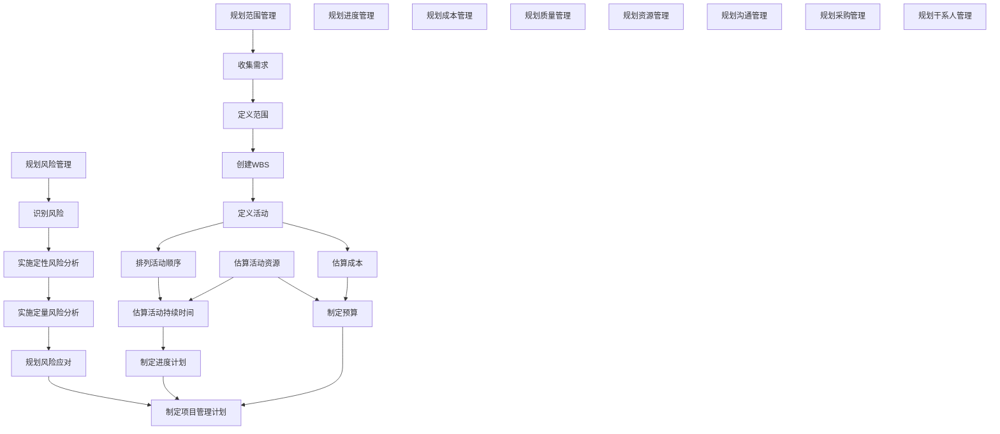

# 课时 118 : 过程：规划干系人参与

| 标题  | 课时  | 章节  |
| --- | --- | --- |
| 进度  | 118  | 112  |

## 规划干系人参与

### 输入

1. **项目章程**
2. **项目管理计划**
   1. 资源管理计划
   2. 沟通管理计划
   3. 风险管理计划
3. **项目文件**
   1. 假设日志
   2. 变更日志
   3. 问题日志
   4. 项目进度计划
   5. 风险登记册
   6. 干系人登记册
4. **协议**
5. **事业环境因素**
6. **组织过程资产**

### 工具与技术

1. **专家判断**
2. **数据收集**
   1. 标杆对照
3. **数据分析**
   1. 假设条件和制约因素分析
   2. 根本原因分析
4. **决策**
   1. 优先级排序/分级
5. **数据表现**
   1. 思维导图
   2. 干系人参与度评估矩阵
6. **会议**

### 输出

1. **干系人参与计划**

## 本节知识点

| 序号 | 知识点 | 重点 |
| :--- | :--- | :--- |
| 1 | 工具 | 标杆对照 假设条件和制约因素分析 根本原因分析 优先级排序/分级 思维导图 |
| 2 | 输出 | 干系人参与计划 |

## 习题解析

以下哪项陈述最能说明干系人是如何参与到一个项目中的？

   - [ ] A. 他们帮助确定项目的进度、交付物和要求。
   - [x] B. 他们帮助确定项目的约束条件和产品的可交付性。
   - [ ] C. 他们帮助确定项目的资源需求和资源限制。
   - [ ] D. 他们批准项目章程，帮助提供假设，并创建管理计划。

> 解析：
> 选 B
> 注意说的是如何参与到项目中，所以这里提到的干系人都是项目外的干系人（如供应商，或者领导），而不是团队内部的
> A: 进度是外部干系人无法决定的 （错）
> B: 这个是对的，约束条件是领导和客户给的， 可交付性也是客户或者领导决定的
> C: 资源需求是项目团队自己定义的（错）
> D: 项目经理才会创建项目管理计划（错）

---

# 课时 119 : 输出：干系人参与计划

| 标题  | 课时  | 章节  |
| --- | --- | --- |
| 进度  | 119  | 113  |

## 干系人参与计划

- 它确定用于促进干系人有效参与决策和执行的策略和行动。

- 干系人参与计划可以是==正式或非正式==的，==非常详细或高度概括==的。

- 项目经理应意识到计划的敏感性，并采取恰当的预防措施。比如抵制项目干系人的信息发布、不同类别的信息，例如==敏感信息、公开信息，一般信息和详细信息为制定项目的沟通过程和计划==奠定了基础。

## 本节知识点

| 序号 | 知识点 | 重点 |
| :--- | :--- | :--- |
| 1 | 干系人参与计划 | 详细或概括 正式与非正式 敏感信息 是制定沟通管理计划的基础 |

## 习题解析

你知道你的组织中的一些团体会对需求提供意见，这可能会影响你制定一个现实的进度的能力。管理干系人的期望是很重要的，但要达到干系人的满意，对某些团体来说比对其他团体更重要。以下所有的都是团队干系人管理工作的一部分，除了以下哪项？

   - [ ] A. 确定干系人的需求
   - [ ] B. 识别干系人
   - [x] C. 给予干系人附加价值
   - [ ] D. 管理干系人的期望

> 解析
> C 不是管理干系人和新的任务，选 C

---

# 课时 120 : 规划过程组知识点总结

| 标题  | 课时  | 章节  |
| --- | --- | --- |
| 进度  | 110  | 114  |

## 规划过程组知识点总结

---

# 课时 121 : 规划过程组：闯关题6

## 8-规划过程组（106小节-113小节）闯关题

卖方的一位项目经理被她的管理层告知，项目组应该尽一切可能获得奖励金。合同中激励条款的主要目的是什么？

A.	降低买方的成本。

B.	帮助卖方控制成本。

C.	实现目标的同步化。

D.	通过将风险转移给买方来减少卖方的风险。

> 正确答案：C ， 回答正确

> 解析：
激励条款的主要目的是实现目标的同步化，即通过一定的激励机制，使买卖双方在项目执行过程中朝着共同的目标努力。例如，通过设置奖励机制，鼓励卖方按时、高质量地完成项目任务，同时也能满足买方对项目进度、质量等方面的要求，从而实现双方目标的一致性。
A 选项：降低买方成本可能是激励条款带来的一个结果，但不是其主要目的。激励条款的设计初衷不仅仅是为了让买方受益，更重要的是促进双方共同实现项目目标。
B 选项：帮助卖方控制成本也不是激励条款的核心目的。虽然激励条款可能会对卖方的成本控制有一定的影响，但它主要关注的是双方目标的达成，而不仅仅是卖方成本的控制。
D 选项：激励条款并不是为了将风险转移给买方来减少卖方的风险。相反，它是为了促进双方共同应对风险，通过合理的激励措施，让双方都积极主动地采取措施来降低风险，提高项目成功的可能性。

发起人和项目经理正在讨论项目经理计划在项目中使用哪种类型的合同。发起人指出，执行单位付给设计团队很多钱来进行设计。项目经理担心买方的风险越小越好，因此建议采用固定价格合同。对买方来说，固定价格合同的一个优点是什么？

A.	成本风险较低。

B.	成本风险较高。

C.	风险很小。

D.	风险由各方共同承担。

> 正确答案：A ， 回答正确
> 解析：
固定价格合同对于买方来说，成本风险较低是其显著优点。在这种合同类型下，合同价格在一开始就已确定，不随实际成本的变化而调整（除非发生合同范围变更等特殊情况）。因此，买方能够确切地知道自己需要承担的成本，便于进行预算控制和成本管理，不用担心因卖方成本超支而带来额外的费用。
选项 B： “成本风险较高” 错误。
选项 C： “风险很小” 表述不准确，因为固定价格合同只是降低了成本风险，并非所有风险都很小。
选项 D： “风险由各方共同承担” 不符合固定价格合同的特点，在固定价格合同中，卖方承担了较大的成本风险，而不是各方共同承担风险。

你的公司有一个紧急情况，需要尽快完成合同工作。在这种情况下，在合同中增加以下哪项是最有帮助的？

A.	一份明确的采购工作说明

B.	关于可以使用哪些分包商的要求

C.	奖励措施

D.	不可抗力条款

> 正确答案：C ， 回答正确
> 解析：
奖励措施可以直接激励承包商采取积极行动来加快工作进度。例如，成本加奖励费用合同中可以设定提前完成项目的奖金，或者根据工作进度和质量给予相应的奖励，能够促使承包商投入更多的资源，如增加人力、延长工作时间、优化工作流程等，从而尽快完成合同工作，满足紧急需求。
A 选项：明确的采购工作说明虽然能让合同双方清楚工作的具体内容和要求，但它主要是为了避免在合同执行过程中出现范围不明确的问题，对于激励承包商加快工作进度、应对紧急情况的作用并不直接。
B 选项：关于分包商的要求主要是对合同执行中分包环节进行规范，确保分包工作符合主合同的要求和标准，与加快合同工作进度以应对紧急情况没有直接关联。
D 选项：不可抗力条款主要是针对不可预见、不可避免且无法克服的客观情况，如自然灾害、战争等对合同履行造成影响的情况进行规定，其目的是确定在这些特殊情况下双方的责任和义务，与紧急情况下加快合同工作进度无关。

项目经理、采购经理和项目发起人正在讨论项目成本，以及是让自己的公司做一些项目工作，还是雇佣另一家公司做所有工作更好。一般来说，在下列哪种情况下，由组织内部完成工作会更好？

A.	有大量的专有数据。

B.	你有专业知识，但你没有可用的人力。

C.	你不需要对工作进行控制。

D.	你的公司资源是有限的。

> 正确答案：A ， 回答正确
> 解析：
在自制外购决策时，专有数据通常涉及公司的核心机密、商业秘密或关键技术等敏感信息。如果将相关工作外包给其他公司，可能会面临专有数据泄露的风险，从而对公司的竞争力和利益造成损害。而由组织内部完成工作，可以更好地控制数据的访问和使用，确保专有数据的安全性和保密性。
B 选项：若有专业知识但缺乏可用人力，那么组织内部可能无法有效地完成工作，此时可能需要考虑外部资源来补充人力不足，所以这种情况更适合雇佣外部公司。
C 选项：如果不需要对工作进行控制，那么雇佣外部公司来做工作可能更为合适，因为外部公司在其专业领域可能更具效率和经验，且组织无需投入过多精力进行管理和控制。
D 选项：公司资源有限，意味着内部缺乏足够的人力、设备、资金等资源来完成项目工作，这种情况下往往需要借助外部公司的资源和能力来确保项目顺利进行。

项目组正在考虑已提交建议书的潜在卖方。一个团队成员支持某个卖家，而另一个团队成员希望将项目授予另一个卖家。项目经理应该提醒团队，为了做出选择，最好关注的是什么？

A.	采购工作说明书

B.	采购审计

C.	供方选择标准

D.	采购管理计划

> 正确答案：C ， 你的答案：D回答错误
> 解析：
供方选择标准是在规划采购阶段制定的，用于评估潜在卖方的建议书。这些标准通常包括技术能力、财务状况、业绩记录、价格等多个方面，为项目团队提供了一套客观、量化的指标，有助于对不同卖方进行全面、公正的比较和评估，从而做出合理的选择。所以该选项正确。
A 选项：采购工作说明书主要描述了采购项目的工作范围、规格、质量要求等内容，它是让卖方了解需要完成的工作内容的文件，虽然对评估卖方有一定的参考作用，但没有提供具体的选择标准，无法直接用于比较和选择不同的卖方。
B 选项：采购审计是在采购过程完成后进行的一项活动，旨在检查采购过程的合规性和有效性，总结经验教训，并不适用于在选择潜在卖方的当下为团队提供决策依据。
D 选项：采购管理计划主要阐述了如何管理采购过程，包括采购的规划、执行、监控等方面的内容，它侧重于采购过程的管理方法和流程，而不是具体的卖方选择标准，不能直接帮助团队在多个潜在卖方中做出决策。

项目经理正试图回忆一个干系人喜欢的沟通方式。她在哪里可以找到这些信息？

A.	RACI图

B.	干系人参与评估矩阵

C.	干系人参与计划

D.	资源管理计划

> 正确答案：C ， 回答正确
> 解析：
干系人参与计划是为有效调动干系人参与项目而制定的计划，其中会详细记录每个干系人的沟通需求、沟通偏好，包括喜欢的沟通渠道、频率、沟通语言等信息，所以项目经理可以在此找到相关信息。
A 选项：RACI 图主要用于明确项目中不同角色在各项任务中的职责，如谁负责（R）、谁批准（A）、谁参与（C）和谁告知（I），并不涉及干系人喜欢的沟通方式等信息。
B 选项：干系人参与评估矩阵主要是用来评估干系人当前的参与程度与期望参与程度的差距，以便制定相应的策略来提升干系人参与度，不包含沟通方式相关内容。
D 选项：资源管理计划主要是关于项目资源的规划、获取、分配和管理的计划，主要涉及人力、物力等资源，与干系人的沟通方式无关。

干系人管理的主要目标是什么？

A.	沟通

B.	协调

C.	满意

D.	关系

> 正确答案：C ， 回答正确
> 解析：
干系人管理就是要识别干系人及其需求和期望，通过一系列的管理活动来满足他们的合理需求，解决他们的问题和关注点，从而提高他们对项目的满意度，确保项目能够获得干系人的支持，最终实现项目目标。所以该选项正确。
A 选项：沟通是干系人管理的重要手段，通过有效的沟通可以让干系人了解项目的进展、问题和决策等，从而提高他们对项目的满意度，但沟通本身并不是最终目标。
B 选项：协调也是干系人管理中的一项重要工作，包括协调干系人之间的利益、需求和期望等，以减少冲突，促进项目的顺利进行，但协调同样是为了实现干系人满意这一目标的手段。
D 选项：建立和维护良好的干系人关系是实现干系人满意的重要途径，良好的关系有助于更好地沟通和协调，但它也是为了达成干系人满意这一主要目标服务的。

你正在计划一个项目，为一个大型医疗中心开发一个网站。该网站将被病人、医务人员、支持人员和保险公司代表使用。哪种工具能最好地帮助你确定干系人对这个项目目前的态度，以及你需要从这些群体中的每一个人那里得到的参与程度？

A.	干系人登记册和干系人参与评估表

B.	趋势分析和需求追踪矩阵

C.	数据分析和资源管理计划

D.	假设和制约因素分析

> 正确答案：A ， 回答正确
> 解析：
干系人登记册用于记录项目中已识别出的干系人基本信息、他们的需求、期望、兴趣和影响水平等，能帮助明确有哪些干系人以及他们对项目的初步态度和可能的关注点。干系人参与评估矩阵则能以直观的方式展示每个干系人当前的参与程度以及项目所期望的参与程度，通过对比两者的差距，可确定需要采取的措施来提升干系人参与度，以满足项目需求。所以该选项符合题目要求。
B 选项：趋势分析主要用于分析项目绩效随时间的变化趋势，以预测未来的绩效情况；需求追踪矩阵用于将需求与后续的设计、开发、测试等工作进行关联和追踪，确保所有需求都能得到满足。这两个工具都与确定干系人对项目的态度和所需参与程度无关。
C 选项：数据分析是一个广泛的概念，在项目管理中有多种数据分析方法用于不同目的，但一般不直接用于确定干系人的态度和参与程度。资源管理计划主要关注项目资源的规划、获取、分配和管理，与干系人管理的这方面内容没有直接关联。
D 选项：假设和制约因素分析主要是识别项目中的假设条件和制约因素，以评估它们对项目的潜在影响，与明确干系人对项目的态度和所需参与程度没有直接的联系。

项目经理聘请项目协调员组织即将召开的项目会议。由于这是一个大型复杂的项目，干系人经常变更，项目协调员对应该邀请谁感到困惑。项目协调员应该邀请谁?

A.	仅限高管级别的人员

B.	高管级别的人员及其他们的直接下属

C.	根据影响/影响力方格识别的干系人

D.	在干系人登记册中识别的干系人

> 正确答案：D ， 你的答案：C回答错误
> 解析：
干系人登记册记录了项目中已识别出的所有干系人信息，包括他们的基本情况、与项目的关系、对项目的潜在影响等。在组织项目会议时，应该邀请在干系人登记册中识别的干系人，因为这些人是与项目有直接或间接关系、可能对项目产生影响或受项目影响的人，他们的参与对于项目的成功至关重要。
A 选项：仅限高管级别的人员过于局限，项目的成功不仅仅取决于高管，其他如普通员工、供应商、客户等干系人也可能对项目产生重要影响，只邀请高管会忽略其他关键干系人的意见和需求。
B 选项：高管级别的人员及其他们的直接下属也不能涵盖所有重要干系人。项目可能涉及多个部门、外部合作伙伴等，仅邀请这部分人员会遗漏其他相关方，不利于项目信息的全面传达和沟通。
C 选项：根据影响 / 影响力方格识别的干系人只是干系人中的一部分，虽然他们是比较重要的干系人，但不能代表所有需要参与会议的干系人。干系人登记册中包含了更全面的干系人信息，包括一些可能影响力较小但仍与项目相关的干系人，他们的参与也可能对项目有一定的帮助。

作为项目经理，你正在制定干系人参与计划。在众多干系人中，你无法像期望的那样分配大量时间与每位干系人互动，因此需要确定优先级。以下哪个干系人在制定干系人参与计划时应被优先考虑重点关注并制定针对性策略？

A.	一位对项目产品有着深厚专业知识，然而对在其所在部门实施该项目兴趣缺缺的干系人。

B.	即将使用项目产品的部门经理，此人向来以抵触变革而闻名。

C.	项目发起人，你之前已与他成功合作过众多项目。

D.	对项目产品较为陌生，但对该产品可能为其工作环境带来积极影响持开放态度的部门员工。

> 正确答案：B ， 你的答案：C回答错误
> 解析：
部门经理作为项目产品的使用者，其对变革的抵触情绪可能会严重阻碍项目的推进。如果不能有效解决他的抵触问题，可能导致项目在实施过程中遇到诸多困难，甚至影响项目的最终交付和使用，所以需要优先重点关注并制定针对性策略来化解其抵触情绪，争取他对项目的支持。
A 选项：该干系人虽对项目实施不感兴趣，但凭借其专业知识，可能在项目产品的技术层面提供帮助。可通过适当沟通和激励措施来提高其参与度，相对而言，其抵触程度和潜在风险不如 B 选项高。
C 选项：项目发起人与项目经理有过多次成功合作经验，通常会对项目提供支持，在干系人管理中属于相对稳定的因素，不需要优先重点关注。
D 选项：该部门员工对项目产品持开放态度，虽然对产品陌生，但愿意接受其积极影响，通过适当的培训和沟通，较容易使其参与到项目中，因此也不是最需要优先重点关注的对象。

