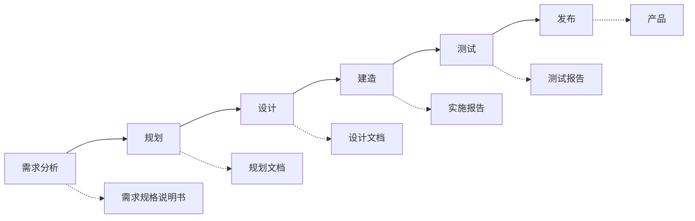
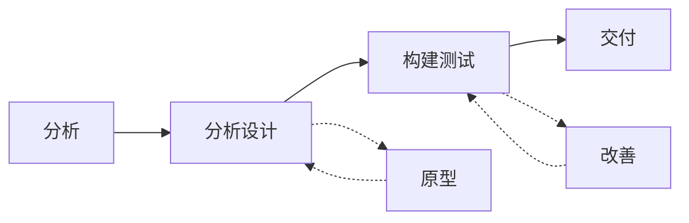

# 第3阶段: 《敏捷实践指南》

# 第1章: 生命周期选择

# 课时 182 : 课前思考

| 标题  | 课时  | 章节  |
| --- | --- | --- |
| 进度  | 182  | 1 |

## 习题解析

产品负责人对范围不清晰，项目需要多次迭代，产品负责人对最后完成期限表示担忧，问项目经理应该采用什么样的方式？

   - [ ] A. 预测型
   - [ ] B. 迭代型  
   - [ ] C. 敏捷型
   - [ ] D. 混合型

> 解析：
> 根据题目描述，这是一个范围不明确、需要多次迭代的项目，同时对交付时间有担忧。这种情况下应该选择能够应对需求变化、允许迭代开发且能够控制时间的项目管理方式。

> 本章会学到以上各种不同的生命周期，让我们来学习一下哪种更适合这个题目吧。

---

# 课时 183 : 预测&迭代&增量&适应型生命周期

| 标题  | 课时  | 章节  |
| --- | --- | --- |
| 进度  | 183  | 2 |

## 预测型生命周期

这是一种更为传统的方法，提前进行大量的计划工作，然后一次性执行；执行是一个连续的行程。

## 瀑布式生命周期流程图

瀑布式生命周期是一种顺序性的项目管理方法，每个阶段产生特定的交付物，为下一阶段提供输入。各阶段按照线性顺序执行，强调文档驱动和阶段门控制。

> 凡事预则立，不预则废

## 迭代型生命周期

这种方法允许对未完成的工作进行反馈，从而改进和修改该工作。

## 迭代式生命周期流程图

迭代式生命周期通过重复的周期来逐步完善产品。在分析设计阶段通过原型来验证和改进设计，在构建测试阶段通过改善来优化实现。这种方法允许在每个迭代中获得反馈并持续改进，比瀑布式更灵活。

> 多次迭代，一次交付

## 增量型生命周期

这种方法向客户提供各个已完成的，可能立即使用的可交付成果。

> 交付生命周期，是将产品拆分成多个系统，每次都交付一个完整的功能
> 关注交付速度
> 多次迭代，多次交付

## 适应型生命周期 （敏捷开发）

这种方法既有迭代，也有增量，便于完善工作，频繁交付。

## 本节知识点

| 序号 | 知识点 | 重点 |
| :--- | :--- | :--- |
| 1 | 预测型生命周期 | 一次规划，一次交付 |
| 2 | 迭代型生命周期 | 应对需求，反复调整 |
| 3 | 增量型生命周期 | 应对市场，多次交付 |
| 4 | 适应型生命周期 | 应对需求和市场，定期交付 |

## 练习题

产品负责人对范围不清晰，项目需要多次迭代，产品负责人对最后完成期限表示担忧，问项目经理应该采用什么方式？

   - [ ] A. 预测型
   - [ ] B. 迭代型  
   - [x] C. 敏捷型
   - [ ] D. 混合型

> 解析：
> 应该选 C
> 题目描述的情况是范围不明确、需要多次迭代且对交付时间有担忧，这种情况下敏捷型生命周期最为适合，因为敏捷方法强调应对变化、快速响应需求，同时通过短迭代周期确保及时交付价值。
> A: 不适应多次修改的需求（需求范围不明确）
> B: 多次迭代容易出现时间延期

---  

# 课时 184 : 多种生命周期示例

| 标题  | 课时  | 章节  |
| --- | --- | --- |
| 进度  | 184  | 3 |

## 多种生命周期示例

共有四种产品和服务：建筑物、社区行动巡查（CAP）培训、老年人服务和网站

## 项目交付节奏和开发方法

| 可交付物 | 交付节奏 | 生命周期 |
| :--- | :--- | :--- |
| 建筑物 | 一次性交付 | 预测 |
| 老年人服务 | 多次交付反馈 | 迭代 |
| 网站 | 定期交付 | 适应 |
| 社区行动巡查培训 | 多次正式交付 | 增量 |

此表格展示了不同类型项目如何根据其特性选择合适的生命周期方法。建筑物等传统项目适用预测型，需要反馈调整的服务类项目适用迭代型，需要快速响应变化的项目适用适应型，而需要分阶段交付的项目适用增量型。

## 习题解析

新建一个系统，部分需求明确，部分需求需要获得更多信息，项目经理首先需要怎么做？

- [x] A. 确定采用什么项目生命周期管理项目
- [ ] B. 采用预测型管理
- [ ] C. 采用敏捷型
- [ ] D. 采用混合型

> 解析：
> 根据题目描述，这是一个需求部分明确、部分不明确的新系统项目。在这种情况下，项目经理首先应该确定采用什么样的项目生命周期来管理项目，而不是直接选择某种特定的生命周期方法。
> A 部分需求明确，部分需求需要获得更多信息 说明应该在一开始确定使用何种生命周期来管理项目，所以应该先选型（正确）
> B 无法照顾到 部分不明确的新系统项目
> C 解决了需求不明确的部分，需求明确的部分没有考虑到
> D 使用混合型的前提也是决定到底使用何种类型的生命周期,执行 A 之后再考虑

---
# 课时 185 : 混合型生命周期

| 标题  | 课时  | 章节  |
| --- | --- | --- |
| 进度  | 185  | 4 |

## 混合型生命周期
预测、迭代、增量和/或敏捷方法的组合就是一种混合方法。
- 敏捷开发后接预测型发布
  > 邀请部分种子用户线试用，
  > 当应用的核心功能完善后,在发布过程用预测
- 在整个生命周期中结合使用敏捷方法和预测法
  > 在规划阶段使用预测方法
  > 在研发阶段和创新部分使用敏捷方法
- 以预测法为主、敏捷方法为辅的方法
  > 大型商业中心，在规划阶段采用预测法
  > 在施工中，以敏捷的方式应对各种不可预期的变化
- 以敏捷方法为主、预测法为辅的方法
  > 互联网公司开发应用
  > 通过用户反馈，开发应用的各种功能
  > 以预测方法来规划整体的路线图和里程碑

## 本节知识点

| 序号 | 知识点 | 重点 |
| :--- | :--- | :--- |
| 1 | 混合型生命周期 | 预测、迭代、增量和/或敏捷方法的组合 |

混合型生命周期是将多种项目管理方法相结合的灵活approach，可以根据项目不同阶段的特点和需求，选择最适合的管理方法组合，实现项目目标的最佳平衡。

> 考试中多以预测性和敏捷型为基础来构成混合型的生命周期

## 习题解析

一个项目希望快速交付，但又希望详细设计，应选择哪种开发类型？

   - [ ] A. 敏捷
   - [x] B. 混合
   - [ ] C. 预测
   - [ ] D. 迭代

> 解析：选 B
> 根据题目描述，项目既要求快速交付又要求详细设计，这是两个看似矛盾的需求。快速交付倾向于敏捷方法，而详细设计倾向于预测型方法。在这种情况下，混合型生命周期是最佳选择，因为它可以将不同方法的优势相结合，在某些阶段采用详细的预测型设计，在其他阶段采用快速的敏捷交付。
> 
---
# 课时 186 : 生命周期选择知识点总结

| 标题  | 课时  | 章节  |
| --- | --- | --- |
| 进度  | 186  | 5 |

## 生命周期选择知识点总结

| 序号 | 知识点 | 重点 |
| :--- | :--- | :--- |
| 1 | 预测型生命周期 | 一次规划，一次交付 |
| 2 | 迭代型生命周期 | 应对需求，反复调整 |
| 3 | 增量型生命周期 | 应对市场，多次交付 |
| 4 | 适应型生命周期 | 应对需求和市场，定期交付 |
| 5 | 混合型生命周期 | 预测、迭代、增量和/或敏捷方法组合 |

这个总结表格完整概括了五种主要的项目生命周期类型及其核心特点，为项目管理者在选择合适的生命周期方法时提供了清晰的参考依据。

---

# 课时 187 : 生命周期选择：闯关题

## 12-敏捷-生命周期选择（1小节-5小节）闯关题

**你正在进行一个项目，该项目涉及开发一种高科技车辆，它将在校园内预定路线的八个站点之间接送学生。你对这个项目的需求了解不多，并且知道随着项目的进展，这些需求会被发现。你想避免错过市场商机，决定在整个项目中逐步上线部分功能，提供商业价值。这将确保从干系人那里得到即时反馈，并能够在进行中进行修正。这说明了什么？**

A.	迭代法

B.	频繁交付法

C.	预测法

D.	敏捷方法

正确答案：D ， 回答正确

> 解析：
题干中 “对需求了解不多”“逐步上线部分功能提供商业价值”“获取即时反馈并进行修正” 等内容，都体现了敏捷方法的特征。A：迭代法侧重于在固定周期内对产品的同一功能或特性进行反复改进和优化，每次迭代会生成一个更完善的版本。而本题重点是逐步推出不同的功能模块以提供商业价值，不是对同一功能的多次迭代，所以 A 选项不符合。
B： 没有这种交付方法，所以 B 选项不正确。
预测法：预测法需要在项目前期对需求有较为明确的理解和详细的规划，然后按照预定的计划进行项目开发。但题干中表明对项目需求了解不多，且需求会随项目进展而发现，不符合预测法的特点，所以 C 选项错误。

**您的团队正在开发一个网站，为想要自行设计居家教育计划的家庭和儿童保育服务提供商提供资源。该网站包含很多功能，每个功能完成时，产品负责人对其进行审核，要么接受，要么告诉团队成员哪里需要修复。若被接受，该功能将由 QA 审核，然后实时部署到网站中。您认为该项目中应使用哪种生命周期或开发方法？**

A.	混合型
B.	增量型
C.	迭代型
D.	以发布为驱动

正确答案：B ， 回答正确

> 解析：
增量型开发方法是将项目划分为多个增量，逐个增量地进行开发、交付和验证。在本题中，网站的功能是逐个完成的，完成一个功能就进行审核，审核通过后再进行下一步的 QA 审核和部署，符合增量型开发方法的特点，即逐步增加功能来实现项目的整体目标，每个功能都可以独立提供价值。
>
> A. 混合型：混合型生命周期是结合了多种不同开发方法的特点，通常用于较为复杂且需求具有不同特性的项目，例如部分需求明确适合采用预测型方法，部分需求不确定适合采用敏捷型方法等。但题干中并没有体现出多种方法结合的特征，只是描述了功能逐个完成、审核和部署的过程，所以不选 A。
>
> C. 迭代型：迭代型开发强调在每个迭代周期内对整个产品进行改进和优化，通常是对已有的功能进行完善和调整，以逐步提高产品的质量和功能完整性。而本题中重点是逐个完成不同的功能并进行审核和部署，不是对整个产品在每个周期内进行全面的迭代改进，所以 C 选项不符合。
>
> D. 以发布为驱动：这不是一种开发方法，所以 D 选项也不合适。

**你的项目团队在前期就对项目的需求有了很好的了解。此时已经知道了交付品的一些具体内容。并非所有的可交付成果都已完全确定。团队希望从已知的需求和具体的可交付成果开始，然后在开发阶段的后期改变他们的方法，逐步交付成果。这描述的是什么开发生命周期？**

A.	预测性

B.	敏捷

C.	混合

D.	增量

正确答案：C ， 你的答案：B回答错误

> 解析：
混合生命周期结合了预测性和敏捷性等多种方法的特点。本题中团队前期对部分需求和可交付成果有清晰的了解，采用了类似预测性的方法开始项目，而在开发阶段后期又采用逐步交付成果的方式，具有敏捷性的特点，符合混合生命周期的定义。
A：预测性生命周期要求在项目早期对项目需求、范围、进度和成本等进行详细的规划和定义，然后按照计划进行执行和控制，通常适用于需求明确、稳定的项目。而本题中明确提到并非所有可交付成果都已完全确定，不符合预测性生命周期的特点，所以 A 选项错误。
B：敏捷方法强调快速响应变化、客户参与和持续交付价值，通常适用于需求不确定、变化频繁的项目。虽然团队后期采用了逐步交付成果的方式，有一定的敏捷特性，但前期对部分需求和可交付成果有很好的了解并以此开始项目，不完全符合敏捷方法的特点，所以 B 选项不准确。
D：增量型开发主要是将项目划分为多个增量，逐个增量地进行开发、交付和验证，强调的是功能的逐步增加和交付。但本题重点强调的是在项目过程中采用了不同的方法，前期有预测性的部分，后期有类似敏捷的部分，不仅仅是功能的增量交付，所以 D 选项不符合题意。

**最常用的四种类型的生命周期是：预测型.迭代型.增量型和敏捷型。以下哪项是增量型生命周期方法的主要重点？**

A.	客户满意度

B.	利用成熟的东西。

C.	交付速度

D.	经常性的反馈

正确答案：C ， 回答正确

>解析：
在增量型生命周期中，项目被分解为多个增量，每个增量都能独立提供一定的功能和价值，并逐步交付给客户。这种方法强调的是快速且持续地将可工作的产品增量交付给客户，以便客户能够尽早获得价值并提供反馈。因此，交付速度是增量型生命周期方法的主要重点之一。通过快速交付增量，项目团队可以更快地响应市场变化和客户需求，提高项目的整体成功率。
A 选项：也是项目成功的重要指标，但它是通过快速交付和不断满足客户需求来实现的，并非增量型生命周期方法的直接重点。
B 选项：在增量型项目中可能会有所涉及，但不是其核心特征和主要重点。
D 选项：在敏捷和增量型生命周期中都很重要，但它是为了更好地调整后续增量的交付，以实现更快更有效地交付价值，本身并非主要重点。

**你正在与客户讨论项目中将要使用的项目生命周期方法。他建议使用迭代生命周期，但他想从你那里了解项目是否能从使用这种方法中获益。你应该告诉客户，项目从迭代生命周期中受益的特点有以下哪些？**

A.	当项目干系人很清楚在整个项目生命周期中的什么时候请求变更时。

B.	当项目的复杂度很高.项目发生频繁变更时，或者当项目范围受制于干系人对所需最终产品的不同看法时。

C.	如果项目范围明确，计划性强。

D.	如果项目优化了交付速度。

正确答案：B ， 你的答案：A回答错误

> 解析：
迭代生命周期强调通过多次迭代来逐步完善产品或服务，适用于需求不太明确、项目复杂度较高且可能发生频繁变更的情况。在迭代过程中，项目团队可以根据每次迭代的反馈，对后续迭代的计划进行调整，更好地应对干系人对最终产品的不同看法以及项目范围的不确定性。
选项 A ：干系人清楚何时请求变更并不是迭代生命周期特有的受益特点，其他生命周期方法在一定程度上也能应对明确的变更请求时间。
选项 C ：项目范围明确、计划性强更适合预测型生命周期，而不是迭代型生命周期。
选项 D ：优化交付速度是增量型生命周期的一个重点，虽然迭代型生命周期也会关注交付的频率，但不是以优化交付速度为主要特点，它更侧重于通过迭代来应对需求的不确定性和复杂性。

---
