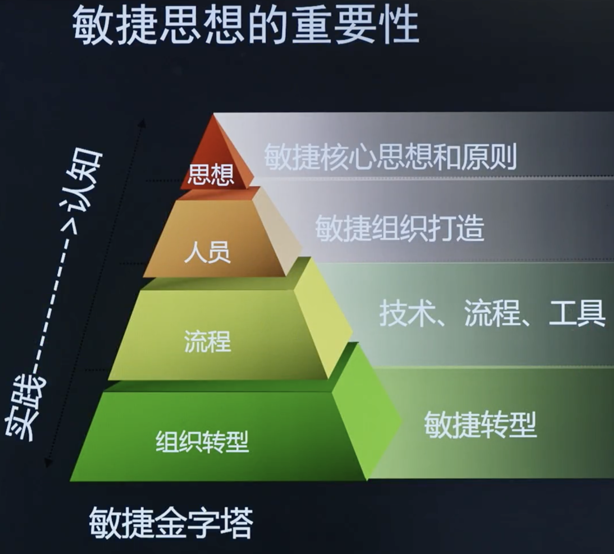
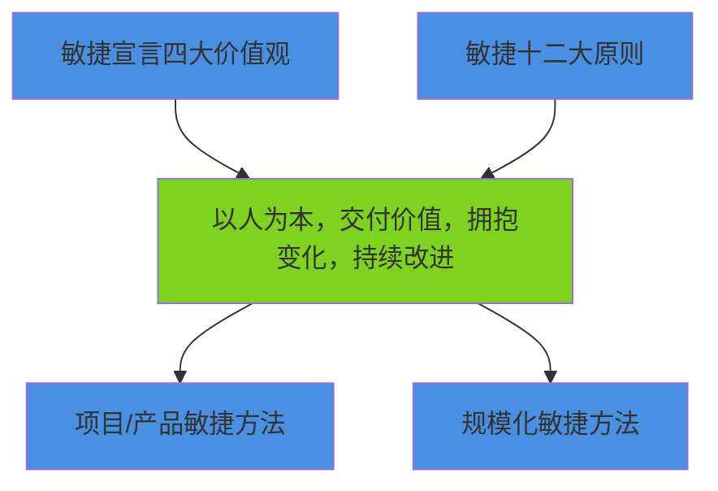

# 第2章: 敏捷思想与原则

# 课时 188 : 课前思考

> 看一下敏捷开发和传统的开发在思维上不同

---

# 课时 189 : 敏捷思想的重要性

| 标题  | 课时  | 章节  |
| --- | --- | --- |
| 进度  | 189  | 7 |

## 敏捷思想的重要性

> 敏捷的组织转型是很重要的一部，没有这步， 单纯的使用敏捷的方法，是无法推动敏捷开发真正落地的，导致转型失败
> 敏捷思想是使用敏捷必先学习的一步

## 敏捷思维模式

- 敏捷是一种思维模式，而敏捷方法是一个囊括了各种框架和方法的涵盖性术语。
- 目前所使用的各种敏捷方法都植根于敏捷思维模式、价值观和原则。

## 敏捷相关知识点

| 序号 | 知识点 | 重点 |
| :--- | :--- | :--- |
| 1 | 敏捷思想 | 为敏捷学习构建起顶层架构 |
| 2 | 各种敏捷方法 | 都植根于敏捷思维、价值观和原则 |

这些知识点强调了敏捷方法的基础理论体系，说明所有具体的敏捷实践都建立在统一的思维框架和价值体系之上。

## 习题解析

在敏捷项目管理中，以下关于敏捷思维模式、敏捷方法及其关系的理解，正确的是哪一个？

- [ ] A. 敏捷方法是一种固定的项目管理流程，一旦确定就不能更改，而敏捷思维模式只是一种理念，对项目实际操作没有影响
- [ ] B. 因为敏捷方法植根于敏捷思维模式，所以只要采用了敏捷方法，就一定能体现敏捷思维模式中的价值观和原则
- [x] C. 不同的敏捷方法，它们都基于敏捷思维模式，强调快速迭代和团队协作
- [ ] D. 敏捷思维模式只适用于软件开发项目，而敏捷方法可广泛应用于各类项目

> 解析：
> 根据题目考查的是敏捷思维模式和敏捷方法的关系理解。
> 正确答案应该是C。
> 不同的敏捷方法（如Scrum、Kanban、XP等）确实都基于统一的敏捷思维模式，并且都强调快速迭代交付和团队协作这些核心原则。

---

# 课时 190 : 敏捷宣言四大价值观

| 标题  | 课时  | 章节  |
| --- | --- | --- |
| 进度  | 190  | 8 |

## 敏捷宣言四大价值观

| 优先考虑 | 关系 | 但不忽视 |
| :--- | :---: | :--- |
| 个体与交互 | 重于 | 过程和工具 |
| 可用的软件 | 重于 | 完备的文档 |
| 客户协作 | 重于 | 合同谈判 |
| 响应变化 | 重于 | 遵守计划 |

敏捷宣言的这四个核心价值观体现了敏捷开发的根本理念：

==尽管右项有其价值，我们更重视左项的价值==

### 敏捷项目管理的核心

==以人为本，交付价值，拥抱变化，持续改进。==

## 敏捷宣言价值观知识点

| 序号 | 知识点 | 重点 |
| :--- | :--- | :--- |
| 1 | 个体与交互 | 重于过程和工具 |
| 2 | 可用的软件 | 重于完备的文档 |
| 3 | 客户协作 | 重于合同谈判 |
| 4 | 响应变化 | 重于遵守计划 |

这四个知识点是敏捷宣言价值观的核心表述，强调了敏捷开发中==人本主义、实用主义、协作精神和适应能力==的重要性。

## 习题解析

在敏捷项目管理中，敏捷宣言包含4大核心原则。以下关于这4大原则的应用场景理解，正确的是哪一个？

- [ ] A. 在一个移动应用开发项目中，开发团队花费大量时间编写详细的需求文档，在项目全程严格遵循文档内容，很少与客户沟通，这体现了"可用的软件重于完备的文档"原则
- [ ] B. 某软件开发项目组，成员各自负责自己的模块，只在项目里程碑时进行简单交流，这违背了"个体与交互重于过程和工具"原则
- [x] C. 一个网站迭代项目，开发团队在每个迭代周期结束时，都会向客户展示可运行的功能模块，获取客户反馈并据此调整后续开发方向，这体现了"客户协作重于合同谈判"原则
- [ ] D. 某敏捷项目在执行过程中，无论遇到什么情况都坚决按照最初制定的计划推进，不接受任何变更，这违背了"响应变化重于遵守计划"原则

> 解析：
> 根据敏捷宣言的四个核心原则分析，正确答案应该是C。
> 选项C描述的场景正确体现了"客户协作重于合同谈判"原则，通过每个迭代周期展示功能模块、获取客户反馈并调整开发方向，体现了与客户的持续协作。其他选项都存在理解错误。

---

#  课时 191 : 敏捷十二大原则（一）

| 标题  | 课时  | 章节  |
| --- | --- | --- |
| 进度  | 191  | 9 |

## 原则1

我们的最高目标是，通过尽早持续交付有价值的软件来满足客户的需求。

## 原则2

可用的软件是衡量进度的首要度量标准。

> 0,1 法则， 如果说你完成 30% 的工作，那就必须拿出 30% 成果向项目组展示
> 不能展示的成果， 都是 0， 可以展示的才能是 1
> 只有可用的软件才是 可展示的成果

## 原则3

要经常交付可用的软件，周期从几周到几个月不等，且越短越好。

## 本节知识点

| 序号 | 知识点 | 重点 |
| :--- | :--- | :--- |
| 1 | 尽早、持续交付有价值软件 | 满足客户需求 |
| 2 | 可用的软件是衡量进度的首要度量标准 |  |
| 3 | 要经常交付可用的软件 | 且越短越好 |

## 习题解析

在一个采用敏捷开发的项目中，团队成员对于项目进度衡量、交付节奏和目标的理解出现了分歧，以下观点正确的是哪一个？

   - [ ] A. 项目进度主要看代码编写量，代码完成得越多，进度就越快
   - [ ] B. 为了确保软件质量，在项目后期集中进行测试和优化，不用频繁交付软件
   - [x] C. 项目的首要目标是满足客户需求，应尽早且持续地交付有价值的软件
   - [ ] D. 交付可用软件的周期越长越好，这样能有更充足的时间完善软件功能

> 解析：
> 应该选 C
> 根据敏捷十二大原则，原则1明确指出："我们的最高目标是，通过尽早持续交付有价值的软件来满足客户的需求"。选项C完全符合这一核心原则。同时，原则2强调"可用的软件是衡量进度的首要度量标准"，否定了选项A；原则3要求"要经常交付可用的软件，且越短越好"，否定了选项B和D。

---
#  课时 192 : 敏捷十二大原则（二）

| 标题  | 课时  | 章节  |
| --- | --- | --- |
| 进度  | 192  | 10 |

## 原则4

对技术的精益求精以及对设计的不断完善将提高敏捷性。

> 质量做的好，一样可以做的快速
> 通过对测试设备的精益求精，可以不断地提升测试效率

## 原则5

简洁，即尽最大可能减少不必要的工作，这是一门艺术。

> 简单直接的表达，更容易被人脑接受
> 需要在项目中化繁为简
> 避免简单问题复杂化

## 原则6

敏捷过程是提倡可持续的开发。
项目发起人、开发人员和用户应该都能够始终保持步调稳定。

> 不要以使用敏捷就需要员工加班
> 敏捷需要按照员工的速率来分配任务的内容， 如：每周 40 个小时，不需要加班
> 将工作维持在能够高标准，高效率的开发

## 本节知识点

| 序号 | 知识点 | 重点 |
| :--- | :--- | :--- |
| 1 | 优化质量将提升敏捷性 |  |
| 2 | 简洁，即尽最大可能减少不必要的工作 |  |
| 3 | 重要干系人应该都能够始终保持步调稳定 |  |

## 习题解析

**以下观点正确的是什么？**

- [ ] A. 为了快速完成项目任务，开发人员可以适当降低对代码质量的要求，等项目后期再集中优化
- [ ] B. 团队认为应该在项目前期尽可能多的规划所有功能细节，以避免后期返工
- [ ] C. 开发团队为了赶进度，连续加班一个月完成了多个迭代任务，虽然很疲惫但保证了项目快速推进
- [x] D. 团队注重对技术的持续优化，在每次迭代中不断完善设计，同时严格把控需求，去除不必要的工作，确保项目各干系人都能稳定地推进项目

> 解析：
> 应该选 D
> 选项D完全符合敏捷十二大原则中的关键要点：1）优化质量将提升敏捷性（技术持续优化）；2）简洁，即尽最大可能减少不必要的工作（严格把控需求，去除不必要工作）；3）重要干系人应该都能够始终保持步调稳定（确保各干系人稳定推进项目）。而其他选项都违反了敏捷原则：A违反了质量优化原则，B违反了敏捷迭代思维，C违反了步调稳定原则。

---

# 课时 193 : 敏捷十二大原则（三）

| 标题  | 课时  | 章节  |
| --- | --- | --- |
| 进度  | 192  | 10 |

## 原则7

项目实施过程中，业务人员与开发人员必须始终通力协作。

> 特性团队，开发人员和产品经理和业务人员组成一个团队，一起完成一个特定的功能
> 敏捷中的产品经理，是一个业务人员的代表。

## 原则8

要善于激励项目人员，给予他们所需的环境和支持，并相信他们能够完成任务。

> 员工需要真正有效的激励。
> 真正下放权利，并提供需要的资金和资源
> 让员工总被动转化为主动追求个人价值

## 原则9

无论是对开发团队还是团队内部，信息传达最具有效的方法都是面对面的交谈。

## 本节知识点

| 序号 | 知识点 | 重点 |
| :--- | :--- | :--- |
| 1 | 业务人员与开发人员必须始终通力协作 |  |
| 2 | 要善于激励项目人员, 给予所需的环境和支持 |  |
| 3 | 信息传达最具有效的方法都是面对面的交谈 |  |

## 习题解析

在一个正在进行的项目中，项目经理针对项目团队协作、人员管理以及信息沟通等方面采取了一系列措施，以下做法符合项目管理最佳实践的是哪一项？

- [ ] A. 业务人员和开发人员分别在不同的办公区域，每周通过邮件沟通一次项目进展
- [ ] B. 项目经理制定了严格的任务分配表，要求团队成员必须按照表格内容执行，不允许成员自主调整工作方式
- [x] C. 当团队成员遇到技术难题时，项目经理积极协调资源，为其提供技术支持和所需环境，并鼓励成员尝试多种解决方案
- [ ] D. 团队每周召开一次线上视频会议进行信息共享，成员将各自工作内容整理成文档在会议中发送给大家

> 解析：
> 应该选 C
> 选项C完全符合敏捷十二大原则中的"要善于激励项目人员，给予所需的环境和支持"。项目经理积极协调资源、提供技术支持和环境，并鼓励成员尝试多种解决方案，体现了对团队的激励和支持。其他选项都违反了敏捷原则：A违反了"业务人员与开发人员必须始终通力协作"原则；B过于严格不允许调整，不符合敏捷灵活性；D虽然是沟通，但不如面对面交谈有效，且文档传递方式效率较低。
---

# 课时 194 : 敏捷十二大原则（四）

| 标题  | 课时  | 章节  |
| ---- | ---- | ---- |
| 进度  | 194  | 12 |

## 原则10

最佳的构架、需求和设计将出自于自组织团队。

> 自组织团队很难打造
> 关键因素：
>
> - 高层支持：资金，政策
> - 组员：既有能力，也有意愿
> - 动机：社会性，技术性。人们愿意去尝试自组织性，挑战困难和新技术.反思和改良：团队会不断地反思和不断地进度
> - 团队的质量: 成员之间可以畅所欲言
> - 专注：团队明白现阶段真正的目标，并专注于此目标

## 原则11

欢迎对需求提出变更，即使在项目开发后期也不例外。敏捷过程要善于利用需求变更，帮助客户获得竞争优势。

> 即便是产品后期，也要欢迎变更，巧妙的利用它，或则变更带来的收益

## 原则12

团队要定期反省怎么做才能更有效，并相应地调整团队的行为。

> 真正愿意倾听和反思的团队
> 不要害怕担责

---

## 敏捷原则

1. 我们的最高目标是，通过尽早持续交付有价值的软件来满足客户的需求；
2. 可用的软件是衡量进度的首要度量标准；
3. 要经常交付可用的软件，周期从几周到几个月不等，且越短越好；
4. 对技术的精益求精以及对设计的不断完善将提高敏捷性；
5. 简洁，即尽最大可能减少不必要的工作，这是一门艺术；
6. 敏捷过程是提倡可持续的开发。项目发起人、开发人员和用户应该都能够始终保持步调稳定；
7. 项目实施过程中，业务人员与开发人员必须始终通力协作；
8. 要善于激励项目人员，给予他们所需的环境和支持，并相信他们能够完成任务；
9. 无论是对开发团队还是团队内部，信息传达最具有效的方法都是面对面的交谈，
10. 最佳的构架、需求和设计将出自于自组织团队；
11. 欢迎对需求提出变更，即使在项目开发后期也不例外。敏捷过程要善于利用需求变更，帮助客户获得竞争优势；
12. 团队要定期反省怎么做才能更有效，并相应地调整团队的行为。

> 1-5： 价值交付
> 6-10：以人为本
> 11：拥抱变更
> 12：持续改进
>

## 本节知识点

| 序号 | 知识点 | 重点 |
| :--- | :--- | :--- |
| 1 | 最佳的构架、 需求和设计将出自于自组织团队 |  |
| 2 | 欢迎对需求提出变更 |  |
| 3 | 团队要定期反省 |  |
| 4 | 敏捷十二原则总结 | **以人为本** **交付价值** **拥抱变化** **持续改进** |

## 习题解析

在一个采用敏捷方法的项目中，团队在项目执行过程中遇到了各种情况，以下团队的应对方式，符合敏捷原则的是哪一项？

- [ ] A. 项目开始时，由项目经理指定技术负责人，单独制定项目架构和设计方案，然后分配给团队成员执行
- [ ] B. 客户在项目开发后期提出了新的需求变更，团队以会影响项目进度为由拒绝了客户
- [x] C. 团队成员发现当前的任务分配方式导致部分成员任务过重，经过讨论后，团队自行调整了任务分配方案
- [ ] D. 团队每两个月进行一次回顾会议，分析项目中出现的问题，但只是总结经验，没有对团队行为做出实际调整

> 解析：
> 应该选 C
> 选项C完全符合敏捷十二大原则中的"最佳的构架、需求和设计将出自于自组织团队"。团队成员发现问题后，通过讨论自行调整任务分配方案，体现了自组织团队的核心特征。其他选项都违反了敏捷原则：A违反了自组织团队原则，由项目经理单独指定方案；B违反了"欢迎对需求提出变更"原则；D虽然有回顾会议，但违反了"团队要定期反省"的实际改进要求，因为没有对团队行为做出实际调整。

---

# 课时 195 : 敏捷方法分类

| 标题  | 课时  | 章节  |
| ---- | ---- | ---- |
| 进度  | 195  | 13 |

## 项目/产品敏捷方法分类

| 敏捷方法 | 重要考点 |
| :--- | :--- |
| Scrum | 三个角色：PO、SM、Team 三个工件：产品订单、迭代订单、增量 五个活动：迭代规划会、每日站会、迭代评审会、迭代回顾会、迭代 |
| 水晶 | ==根据项目规模（项目中涉及的人员数量）以及项目的关键性两个维度来提供不同的敏捷方法选择。== 例如： 透明：C6，D6；（C：Loss of Comfort; D: Loss of Discretionary money） |
| 功能驱动开发（FDD） | 开发整体模型、建立==特征==清单、依特征做规划、依特征做设计、依特征进行建立 |
| 动态系统开发方法（DSDM） | 该框架从==一开始便可设置成本、质量和时间==，然后利用正式的范围优先级来满足这些制约因素的要求。 |
| 敏捷统一过程（AUP） | Agile Unified Process， 以==架构==为中心、注重==数据库设计==、强调与用户的==沟通== |

> 考试中基本以 Scrum 为主
> 其他的知识点以了解为主

## 规模化敏捷方法

| 敏捷方法 | 重要考点 |
| :--- | :--- |
| Scrum of Scrums (SoS) | 是由两个或多个Scrum团队而==不是一个大型Scrum团队==所使用的一种技术。其中一个团队包含三到九名成员来协调其工作。 |
| 大规模敏捷框架 (SAFe®) | 专注于==在项目组合、项目集和团队层==详细设定实践、角色和活动，强调围绕专注于向客户提供持续价值的价值流来组织企业。 |
| 大规模敏捷开发 (LeSS) | 一个多团队Scrum框架，可以应用于由20、100甚至数千个人组成的敏捷团队，所有这些人都共同致力于==一个特定的共享产品==。 |
| 企业Scrum | 是一种旨在通过更整体性组织层而==不是单个产品开发层==来应用Scrum方法的框架。 |
| 规范敏捷 (DA) | 是一种在综合模型中==整合多种敏捷最佳实践==的过程决策框架。 |

> 规模化敏捷方法的知识点以了解为主

## 本节知识点

| 序号 | 知识点 | 重点 |
| :--- | :--- | :--- |
| 1 | 敏捷 | Scrum/水晶/FDD/DSDM/AUP |
| 2 | 规模化 | SoS/SAFe®/LeSS/企业Scrum/DA |

## 习题解析

在大型企业级软件开发项目中，需要采用规模化敏捷方法来协调多个团队进行高效协作。关于以下几种规模化敏捷方法，说法正确的是什么？

- [ ] A. SAFe®（Scaled Agile Framework）是一种轻量级的敏捷方法，它不强调架构的重要性，更注重团队的自主决策
- [ ] B. DA（Disciplined Agile）提供了一套固定的流程和实践，要求所有项目必须严格遵循，缺乏灵活性
- [ ] C. 企业Scrum主要适用于小型项目，在大型项目中无法发挥其优势
- [x] D. SoS（Scrum of Scrums）通过定期召开Scrum of Scrums会议，让各个Scrum团队的代表分享信息、协调工作，解决跨团队的依赖问题

> 解析：
> 应该选 D
> 选项D准确描述了SoS的核心机制和作用。根据规模化敏捷方法的特点：SoS是由两个或多个Scrum团队协作的技术，通过定期会议让团队代表分享信息、协调工作正是其核心特征。其他选项错误：
> A项错误，SAFe®专注于详细设定实践、角色和活动，不是轻量级方法；
> B项错误，DA是整合多种敏捷最佳实践的过程决策框架，具有灵活性；
> C项错误，企业Scrum是通过整体性组织层应用Scrum的框架，适用于大型项目。

---

# 课时 196 : 敏捷思想与原则知识点总结

| 标题  | 课时  | 章节  |
| ---- | ---- | ---- |
| 进度  | 196  | 14 |

## 生命周期选择知识点总结

---

# 课时 197 : 敏捷思想与原则：闯关题

## 13-敏捷-敏捷思想与原则（6小节-14小节）闯关题

**客户表示已经在项目中澄清了需求，因此无需与开发团队集中办公，敏捷团队领导人应该怎么处理？**

A.	建议遵循集中办公的敏捷原则。

B.	使用技术手段实现直接不间断的协作。

C.	要求安排一名助理与开发团队集中办公。

D.	要求与客户召开每周会议，讨论所有问题。

正确答案：A ， 你的答案：B回答错误

> 解析：
集中办公是敏捷开发中的一个重要实践，即使需求已经澄清，集中办公也有助于团队成员之间的高效沟通、快速反馈和紧密协作，能增强团队凝聚力，提高工作效率，及时解决问题和分享知识，对于项目的成功实施有很大帮助，所以敏捷团队领导人应建议遵循这一原则。
> B：虽然技术手段可以辅助协作，但它不能完全替代面对面的沟通和集中办公所带来的协同效果，且题干中没有提及技术手段存在问题，所以该选项不是最佳处理方式。
> C：安排助理集中办公不能从根本上解决团队协作和沟通的问题，助理无法完全代表客户的意见和决策，也不能像客户亲自参与集中办公那样有效地促进信息共享和问题解决。
> D：每周会议的频率相对较低，不能及时解决开发过程中出现的问题，而且讨论所有问题可能效率低下，一些紧急问题无法得到及时处理，不如集中办公能让客户实时参与并解决问题。

**敏捷教练可以怎么做来激励个人和团队自由表达自己的观点?**

A.	与团队开会，解释他们的权利。

B.	创建一个安全的环境。

C.	开始一次教练谈话。

D.	安排定期的团队建设活动。

正确答案：B ， 回答正确

> 解析：
依据敏捷十二原则，“要善于激励项目人员，给予他们所需的环境和支持，并相信他们能够完成任务”。这是激励个人和团队自由表达观点的关键。在安全的环境中，团队成员不用担心因表达不同观点而受到批评、指责或惩罚，能够放心地分享自己的想法和意见，有利于激发团队的创造力和创新精神。
> A. 虽然让团队成员了解自己的权利很重要，但仅仅通过开会解释，可能无法真正让成员感受到可以自由表达观点的氛围，也不能确保他们在实际中愿意表达，因为还可能存在其他阻碍表达的因素，比如团队文化、以往的负面经历等。
> C. 教练谈话可以针对个别成员进行沟通和引导，但对于激励整个团队自由表达观点来说，作用相对有限。它不能像创建安全环境那样，从整体上营造出鼓励表达的氛围，无法确保所有成员都能积极主动地表达自己的观点。
> D. 团队建设活动有助于增强团队凝聚力和成员之间的关系，但不一定能直接激励成员自由表达观点。有些团队建设活动可能侧重于娱乐或团队协作训练，而没有专门针对营造表达观点的氛围进行设计，所以该选项不如创建安全环境直接有效。

**一名产品负责人发现项目的核心专家缺乏敏捷项目的经验，任何信息都需要记录在案，否则不开展下一步工作。但是，产品负责人更喜欢面对面反馈。产品负责人应该怎么做?**

A.	使用专家判断替代该主题专家做决定。

B.	邀请该主题专家参加评审会议，并表明参加会议将获得的好处。

C.	让开发人员使用该主题专家的全部文件作为参考。

D.	让该主题专家直接与开发人员互动，以减少管理费。

正确答案：B ， 回答正确

> 解析：
依据敏捷十二原则，“无论是对开发团队还是团队内部，信息传达最具有效的方法都是面对面的交谈”。这种方式可以让专家逐渐熟悉敏捷项目中的面对面沟通方式，同时通过了解参加会议的好处，激励专家参与到面对面反馈的过程中，有助于弥合专家与产品负责人在沟通方式上的差异。
> A. 这可能会引起核心专家的不满，也不能解决沟通方式差异的问题，还可能导致项目失去该专家的专业知识和经验，不利于项目的顺利进行。
> C. 这只是在一定程度上利用了专家的文件，但没有解决产品负责人希望的面对面反馈问题，也无法让专家适应敏捷项目的工作方式。
> D. 虽然增加了专家与开发人员的互动，但没有明确是哪种互动方式，也没有针对性地解决专家习惯记录信息而不适应面对面反馈的问题，无法满足产品负责人的期望。

**你的团队正在进行机器人项目的开发。产品负责人是个工程师，他告诉你，为用需求排序是在浪费团队的时间，最好的产品应该是全部功能都具备。你需要让他明白以下哪点？**

A.	使关键产品功能的预期货币价值最大化。

B.	交付最高价值的功能是有意义的。

C.	团队也需要休息，因此无法进行全部功能开发。

D.	计算出所有机会和威胁所需的应急储备。

正确答案：B ， 你的答案：C回答错误

> 解析：
敏捷开发强调价值驱动，通过对需求进行排序，先交付最高价值的功能，可以让项目尽早为用户和业务带来收益，同时也能根据用户反馈及时调整后续功能的开发，提高项目的成功率和投资回报率。向产品负责人说明这一点，能让他理解需求排序的重要性，而不是追求全部功能都具备。
> A. 预期货币价值属于定量风险排序的工具，只能用于决策，与题干无关。
> C.这种说法没有从项目管理和产品价值的角度去说服产品负责人，强调的是团队的工作能力和状态，而不是从项目的整体利益和价值实现出发，不能有效让产品负责人认识到需求排序的必要性。
> D. 这与需求排序和产品负责人对产品功能的观点关系不大，主要是关于项目风险管理方面的内容，无法直接解决产品负责人对需求排序的误解，不能让他明白为什么要进行需求排序以及这样做对产品开发的好处。

**你和你的敏捷团队正在为你的组织开发一个新的工作流管理系统，你需要制作详细的软件文档。作为一个敏捷实践者，你应该怎么做？**

A.	把开发所需的文档作为项目的一部分。

B.	拒绝该政策，因为它违背了敏捷宣言。

C.	使用传统的项目管理实践来管理这个项目。

D.	向上级管理层说明为什么你不会在这个项目上开发详细的文档。

正确答案：A ， 回答正确

> 解析：
敏捷并非完全排斥文档，而是强调 “可用的软件胜过详尽的文档”，所以在开发过程中，根据项目实际需要制作必要的详细软件文档是合理的，这可以帮助团队成员更好地理解项目需求、架构和流程，也有利于知识传承和后续的维护升级等工作。
> B. 虽然敏捷宣言强调可用的软件胜过详尽的文档，但并不是说完全不需要文档，不能简单地因为需要制作详细文档就拒绝，而应该根据项目的具体情况来判断文档的必要性和详细程度，所以该选项过于绝对。
> C. 团队是敏捷团队，正在进行敏捷项目开发，突然完全切换到传统项目管理实践，会破坏团队已有的敏捷工作方式和流程，不利于团队的协作和项目的推进，而且也没有必要因为需要制作详细文档就完全改变项目管理方式。
> D. 如前面所述，敏捷项目也可能需要详细文档，不应该直接拒绝开发详细文档，而应该是在满足项目需求的前提下，合理地进行文档开发，所以向管理层说明不开发详细文档是不合适的，可能会导致管理层对项目的误解和不支持。

**一家公司正在启动敏捷转型的工作，作为敏捷教练，你被要求审查公司现有的管理流程是否需要调整，以适应新的项目管理方法。你做的关键调整之一是什么？**

A.	减少与团队开会和计划活动的时间。

B.	随意调整交付期限。

C.	增加客户参与度，让客户确定需求优先级。

D.	提高提供清晰、详细规格的标准。

正确答案：C ， 回答正确

> 解析：
在敏捷项目管理中，客户的参与至关重要。让客户参与确定需求优先级，能够确保团队聚焦于交付对客户最有价值的产品特性，使产品更好地满足市场需求，这是从传统管理流程向敏捷转型的关键调整之一。
> A. 敏捷方法强调频繁的沟通和协作，会议和计划活动是重要的环节，用以确保团队成员对目标和任务达成共识。减少这些时间可能导致信息不畅通，影响团队协作和项目进展，所以这不是关键调整。
> B. 敏捷项目虽然强调灵活性，但交付期限也需要在一定程度上保持相对稳定，以确保项目的可控性和可预测性。随意调整交付期限会给团队和利益相关者带来不确定性，不利于项目的顺利进行，因此不是关键调整。
> D. 敏捷更注重通过频繁的客户反馈和迭代来明确需求，而不是一开始就制定非常详细、精确的规格。过于强调清晰、详细的规格可能会限制项目的灵活性和团队的创造力，不符合敏捷的理念，所以也不是关键调整。

**一位重要的干系人就项目需要完成的需求和产品经理达成了一致。他告诉敏捷团队，未来可能没有机会再和团队进行会面了。作为敏捷教练，你会给出什么建议？**

A.	希望干系人明白，敏捷项目中干系人参与的重要性。

B.	跟干系人告别。

C.	希望干系人离开之前再次澄清他的需求。

D.	询问干系人，以后决定由谁代表他来做项目的关键决策。

正确答案：A ， 回答正确

> 解析：
在敏捷项目中，干系人的持续参与至关重要。他们能够提供反馈、明确需求优先级以及确认产品是否符合预期等。让干系人了解其参与的重要性，有可能促使他调整计划，继续参与项目，这对于项目的成功至关重要。
> B. 这种做法过于消极，没有积极主动地解决问题。干系人的参与对项目有重要价值，直接告别可能导致项目在后续过程中出现需求不明确、方向偏离等问题，影响项目的顺利推进。
> C. 虽然澄清需求很重要，但这并不能解决干系人后续无法参与项目的问题。即使当前需求澄清得很清楚，随着项目的推进，可能还会有新的问题或需求变化，仍然需要干系人的参与和决策。
> D. 这是一种解决方式，但不如选项 A 直接有效。首先应该让干系人明白其参与的重要性，看是否能争取到他继续参与项目。如果实在无法实现，再考虑寻找代表他的人来做决策也不迟。而且寻找代表可能会带来新的问题，如代表对干系人意图的理解偏差等。

**敏捷团队在每次迭代都交付固定的需求。管理层要求团队提高生产力，交付更多需求。敏捷团队应该怎么做?**

A.	确保管理层理解敏捷思想。

B.	加班工作满足该请求。

C.	提高效率以交付更多需求。

D.	在不进行额外工作的情况下，增加估算。

正确答案：A ， 你的答案：D回答错误

> 解析：
敏捷方法强调的是持续交付有价值的产品，而不是单纯追求需求交付的数量。每个迭代中团队交付固定的需求，说明团队有自己稳定的节奏和工作方式。管理层要求交付更多需求，可能是对敏捷思想中关于价值交付、团队自组织以及迭代节奏等概念理解不足。向管理层解释敏捷思想，让他们明白团队的工作模式以及过度追求需求数量可能带来的负面影响，如质量下降、团队压力增大等，有助于管理层做出更合理的决策。
> B. 加班虽然可能在短期内增加需求的交付量，但长期来看，会导致团队成员疲劳，影响工作质量和团队的可持续发展能力，不符合敏捷所倡导的 “可持续发展” 原则。而且，这也可能掩盖团队在工作流程或资源配置上存在的问题，不利于从根本上提高团队的生产力。
> C. 团队目前的迭代节奏是稳定的，在没有充分分析现有工作流程、找出可优化点以及评估团队承受能力的情况下，单纯要求提高效率来交付更多需求，可能会给团队带来过大压力，导致工作质量下降。此外，团队效率的提升通常是一个渐进的过程，需要通过持续改进来实现，而不是通过简单的指令就能快速达成。
> D. 这种做法是不诚实的，它不能真正提高团队的生产力和交付价值，只是人为地改变了需求的估算方式，会误导管理层对团队实际工作能力和项目进展的判断，破坏团队与管理层之间的信任，不符合敏捷的价值观和原则。敏捷团队的生产力不能单纯以故事点的数量来衡量，更重要的是交付的价值以及团队的可持续发展。每个团队的速度是相对稳定的，并且受到多种因素的制约。向管理层解释敏捷的理念，包括团队自组织、持续改进以及注重价值交付而非单纯的工作量增加，能让管理层正确认识团队的工作模式，避免对团队提出不切实际的要求。

**项目管理团队要求你确定新的微波烹饪设备项目的最佳开发周期。在开发过程中，客户价值和质量将被实时纳入。作为一个专业的项目经理，你对这个要求的最合适的回应是什么？**

A.	选择一个适应性的生命周期：敏捷式.迭代式或增量式。关键的干系人将持续参与，并在交付过程中频繁阐述需求。

B.	说明这不是正常的项目经理决策：你愿意与项目发起人讨论这个请求。

C.	画出项目生命周期的连续体，并考虑初期规划工作的风险和成本。

D.	任命一个委员会来调查这个想法，然后对关键的干系人进行访谈，了解高层业务需求。

正确答案：A ， 回答正确

> 解析：
十二大原则：“项目实施过程中，业务人员与开发人员必须始终通力协作。” 题干中强调在开发过程中客户价值和质量要实时纳入，这正符合敏捷式、迭代式或增量式等适应性生命周期的特点。这些生命周期模型允许关键干系人持续参与项目，能够根据客户反馈及时调整和优化产品，确保最终交付的产品符合客户需求，最大程度地实现客户价值，同时保证质量。
> B. 确定项目的开发周期是项目经理的职责之一，项目经理应该具备根据项目特点选择合适生命周期的能力，而不是简单地将问题推给项目发起人，所以该选项不太合适。
> C. 虽然考虑风险和成本很重要，但这没有直接针对题干中客户价值和质量实时纳入的要求，没有突出适应性生命周期在满足这些要求方面的优势，不够全面和准确。
> D. 这种做法相对比较繁琐，且没有直接指向选择合适的项目开发周期。了解高层业务需求是重要的，但更重要的是根据这些需求选择能够实现客户价值和质量实时纳入的开发周期，所以该选项也不是最合适的回应。

**你的组织中的一位执行经理有超过15年的传统瀑布项目和项目集管理经验。从2021年开始，你的组织正在从传统方法论向敏捷方法论转变，而执行经理不相信，让组织项目的干系人与开发人员接触，并能够看到代码是如何构建的，有什么好处。你将使用哪条敏捷原则来说服执行经理解除忧虑？**

A.	围绕有积极性的个人来构建项目。给予他们所需的环境和支持，并相信他们能完成工作。

B.	最好的架构、要求和设计产生于自组织的团队。

C.	持续关注技术上的卓越性和良好的设计能提高敏捷性。

D.	业务人员和开发人员必须在整个项目过程中每天一起工作。

正确答案：D ， 你的答案：B回答错误

> 解析：
该原则强调了业务人员与开发人员紧密合作的重要性。让组织项目的干系人与开发人员接触，干系人能够看到代码是如何构建的，这正是促进业务人员和开发人员紧密合作的一种方式。通过这种方式，干系人可以及时了解项目的进展情况，开发人员也能更好地理解业务需求，有助于提高产品质量，减少误解和偏差，从而说服执行经理解除忧虑。
> A. 此原则主要侧重于强调对个人能力的信任和为其提供良好的工作环境，没有直接涉及到干系人与开发人员接触以及让干系人了解代码构建过程的好处，无法针对性地解除执行经理的忧虑。
> B. 该原则重点在于自组织团队对架构、要求和设计的积极作用，没有突出干系人与开发人员接触的重要性，与执行经理所担忧的问题关联不大。
> C. 此原则强调的是技术和设计方面对敏捷性的影响，没有提及干系人与开发人员的互动以及这种互动带来的好处，不能有效说服执行经理解除忧虑。

---

