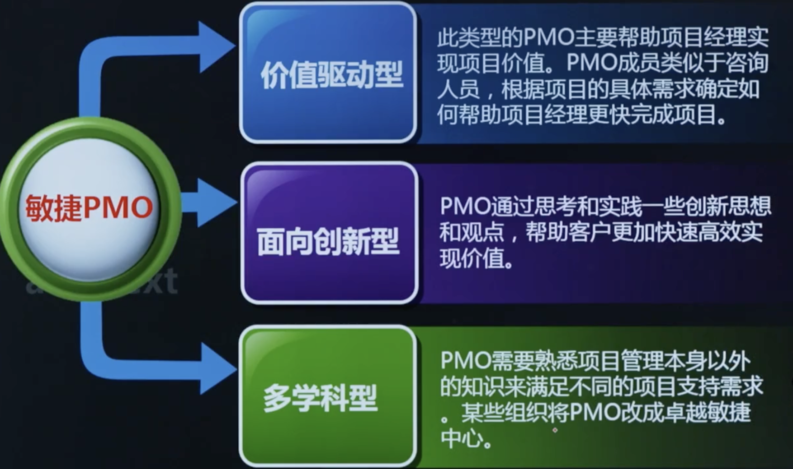
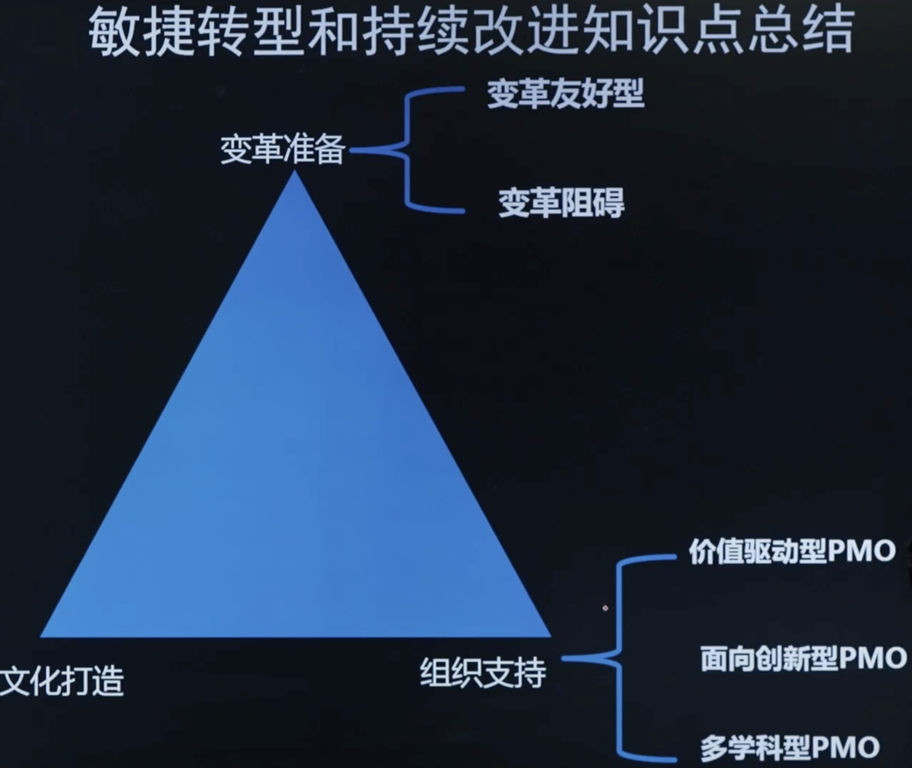

# 第5章: 敏捷转型和持续改进

# 课时 233 : 课前思考

# 课时 234 : 敏捷转型准备&敏捷文化打造

| 标题  | 课时  | 章节  |
| ---- | ---- | ---- |
| 进度  | 234  | 48 |

## 敏捷转型准备

变革友好型特征的示例包括：

- 管理层的变革意愿；
- 组织在员工认知、审核和评估方式上做出改变的意愿；
集中或分散项目、项目集和项目组合管理职能；
- 专注于短期预算和指标而不是长期目标；
- 以及人才管理成熟度和能力。

相反，还有其他一些机构特征可能会成为实现组织敏捷性相关变革的障碍。这些特征示例包括：

- 工作被分解为部门孤岛，从而创造出阻碍加速交付的依赖关系，而不是构建在能力中心指导下的跨职能团队。
- 采购策略基于短期定价策略，而不是长期能力。
- 奖励领导的依据是本地效率而不是端到端项目交付流或整体优化情况（就组织而言）。
- 员工属于特定领域人才，实现技能多元化的工具或激励有限，不重视培养T型专家人才。
- 分散化项目组合使员工同时分配到过多的项目，而无法专注于单个项目。

## 敏捷文化打造

组织审查和修改这些实践的意愿程度将决定采用敏捷方法的速度和效率。但是，
为了解决这些敏捷组织障碍，项目领导可以尝试多种方法来==加速文化兼容性==：

- 积极明确的管理层支持；
- 变革管理实践，==包括沟通和引导==；
- 逐个项目应用敏捷实践
- ==向团队增量地引入敏捷实践==；以及
- 通过采取适用的敏捷技术和实践示范引导。

## 本节知识点

| 序号 | 知识点 | 重点 |
| :--- | :--- | :--- |
| 1 | 变革友好特征 VS 变革阻碍 | 识别组织中有利于敏捷转型的特征和可能阻碍转型的因素 |
| 2 | 加速敏捷文化的方法 | 通过管理层支持 变革管理实践 增量引入敏捷实践等方式推进文化转型 |

## 习题解析

某公司计划向组织敏捷性转型，在评估现有组织特征时，发现了以下一些情况。其中，有助于推动变革实现组织敏捷性的是什么？

   - [x] A. 公司管理层积极支持变革，主动参与各项变革讨论，并愿意为变革投入资源
   - [ ] B. 公司各部门工作高度独立，形成了多个部门孤岛，部门间依赖关系复杂，沟通成本高
   - [ ] C. 采购部门在选择供应商时，仅关注当前采购价格，追求短期成本降低
   - [ ] D. 公司对员工的奖励主要依据员工在本部门内的工作效率，不考虑项目整体交付成果

> 解析：
> 应该选 A
> 管理层的积极支持和变革意愿是组织敏捷性转型的关键变革友好特征。选项B、C、D都是前面提到的变革阻碍因素，包括部门孤岛、短期定价策略和局部效率导向的奖励机制。

---

# 课时 235 : 敏捷转型支持组织

| 标题  | 课时  | 章节  |
| ---- | ---- | ---- |
| 进度  | 235  | 49 |

## 敏捷项目管理办公室

## 本节知识点

| 序号 | 知识点 | 重点 |
| :--- | :--- | :--- |
| 1 | 敏捷PMO | 价值驱动型 面向创新型 多学科型 |

## 习题解析

某企业计划成立敏捷项目管理办公室（PMO）以推动组织的敏捷转型，在讨论敏捷PMO的定位和特性时，有如下观点，其中正确的是什么？

   - [ ] A. 价值驱动型敏捷PMO主要关注项目的成本控制，通过严格监控预算确保项目在成本范围内完成，以此来实现价值最大化
   - [x] B. 多学科型敏捷PMO要求成员具备项目管理、技术、业务等多领域知识，能够为项目提供全方位支持，促进项目的顺利开展
   - [ ] C. 面向创新型敏捷PMO鼓励团队不断尝试新的技术和方法，即使这些尝试可能导致项目进度延迟或成本增加也无需过多考虑
   - [ ] D. 价值驱动型、面向创新型、多学科型这三种类型的敏捷PMO只能单独存在，企业应根据自身特点选择其中一种来建立

> 解析：
> 应该选 B
> 多学科型敏捷PMO的核心特征就是要求成员具备跨领域的综合知识和技能，能够为项目提供全方位的专业支持。
> 选项A错误，价值驱动型PMO关注的是价值交付而非单纯的成本控制；
> 选项C错误，创新需要在可控范围内进行；
> 选项D错误，这三种类型可以结合使用。

---

# 课时 236 : 敏捷转型和持续改进知识点总结

| 标题  | 课时  | 章节  |
| ---- | ---- | ---- |
| 进度  | 236  | 50 |

---
# 课时 237 : 敏捷转型和持续改进：闯关题

## 15-敏捷-敏捷转型和持续改进（47小节-50小节）闯关题

你被一家大型IT公司聘为顾问。你被要求为公司开发一个标准化的项目管理方法。你目前正在考虑整个项目管理的推进方法，其中一端是敏捷，另一端**是瀑布。在你决定选择哪种模式之前，你需要执行以下哪种技术？**

A.	组织文化评估

B.	可行性分析

C.	影响评估

D.	根本原因分析

正确答案：A ， 回答正确

> 解析：
组织转型首先要做的是进行该组织的文化评估。只有在新的方法被选中并得到批准后，才应进行影响评估。根本原因分析和可行性分析与当前的问题无关，而是分别与问题和单个项目有关。B选项属于商业论证，与题干无关；C选项风险才会做影响评估；D选项属于问题处理，与题干无关。

**一家公司开始从传统项目管理向敏捷项目转型。敏捷团队促进者必须适应敏捷管理方法，以下哪项属于传统项目风险管理方法？**

A.	风险燃尽图

B.	产品待办列表中的风险应对措施

C.	风险管理计划

D.	探针

正确答案：C ， 回答正确

> 解析：
风险管理计划是传统项目管理中常用的方法，它通常在项目前期制定，详细规划了如何识别、评估、应对和监控项目中的风险，包括风险的管理流程、角色职责、应对策略等内容。在传统项目中，风险管理计划是一份正式的文档，用于指导整个项目过程中的风险管理活动，所以该选项符合题意。A：风险燃尽图是敏捷项目中用于可视化风险随时间变化情况的工具，它通过图表展示剩余风险的数量或影响程度，帮助团队监控和管理风险，是敏捷项目风险管理的方法。B：产品待办列表是敏捷开发中记录项目需求和任务的工具，将风险应对措施记录在产品待办列表中也是敏捷项目管理中处理风险的一种方式，属于敏捷项目风险管理方法。D：探针是敏捷项目中的一种技术，用于在短时间内对某个问题或方案进行探索和验证，以获取更多信息，帮助团队做出决策，属于敏捷项目管理方法。

**你想建立一个机制，通过项目之间的沟通，促进敏捷团队之间的协调；建立一个平台，实现进度、问题、回顾性发现和改进实验等项目的共享。在这种情况下，你需要以下哪个选项？**

A.	一个敏捷PMO

B.	集中办公

C.	指挥控制中心

D.	外部顾问

正确答案：A ， 回答正确

> 解析：
敏捷 PMO（项目管理办公室）的职责之一是促进项目之间的沟通与协调，为敏捷团队提供支持和指导。它可以建立相关机制和平台，实现进度、问题、回顾性发现和改进实验等信息的共享，有助于整合资源、协调工作流程，促进团队间的协作。B：集中办公主要是将团队成员集中在一个物理空间内工作，有利于团队成员之间的沟通和协作，但它侧重于团队内部的沟通，对于多个项目团队之间的协调以及建立专门的信息共享平台方面，不如敏捷 PMO 全面和有效，所以该选项不太符合题意。C：指挥控制中心通常具有较强的指令性和控制性，更适用于传统的项目管理模式，与敏捷所倡导的团队自主、协作的理念不太相符。敏捷项目更强调团队的自我管理和沟通协作，而非通过指挥控制中心来进行集中管理，所以该选项不正确。D：外部顾问可以为项目提供专业的建议和指导，但他们主要是在特定问题上提供咨询服务，并不负责建立项目之间的沟通机制和信息共享平台，无法满足促进敏捷团队之间协调和信息共享的需求，所以该选项也不合适。

**在使用敏捷方法管理的项目中，由于需求不断变化，风险较高，或有很大的不确定性，范围往往在项目开始时无法确定，或在项目过程中不断变化。在这种情况下，敏捷项目如何处理项目范围？**

A.	在项目开始时制定详尽的产品积压，并在项目过程中确定积压的优先级。

B.	花更多的时间来定义范围和达成一致意见，花更少的时间来建立其不断发现的过程。

C.	花较少的时间来定义范围和达成一致意见，花较多的时间来建立其不断发现的过程。

D.	在项目开始时制定初步的产品积压，并在项目过程中确定积压的优先级。

==正确答案：C ， 你的答案：D回答错误==

> 解析：
敏捷项目承认需求的不确定性和变化性，所以在项目开始时不会花费大量时间去精确定义范围并达成完全一致，而是将更多的时间和精力放在建立一个能够不断发现和适应范围变化的过程上，通过迭代、反馈等机制，逐步明确和调整项目范围。
> A：在敏捷项目中，虽然会有产品积压，但由于需求不断变化，很难在项目开始时就制定出详尽的产品积压，因为很多需求可能还未明确，所以该选项不符合敏捷项目管理的特点。
> B：敏捷项目强调拥抱变化，对于范围的定义不会花过多时间去追求绝对的明确和一致，而是更注重在过程中不断发现和调整，所以 “花更多的时间来定义范围和达成一致意见” 不符合敏捷理念。
> D：仅在项目开始时制定初步的产品积压并确定优先级是不够的，更重要的是要建立一个能让范围不断发现和调整的动态过程，该选项没有突出敏捷项目管理中对范围动态管理的重点，所以不太准确。

**你在网页设计公司工作。你的公司正在为一家大型连锁杂货店设计网站。你将使用敏捷方法论来管理这个项目。你的发起人熟悉这种方法论，并同意使用这种方法。他们告诉你，敏捷项目不需要正式的计划。以下哪项是你的回答？(选两个)**

A.	无论你使用哪种方法论，所有项目都需要计划。

B.	为了了解需求、资源和完成工作所需的努力程度，在敏捷项目开始时需要进行计划。

C.	根据你使用的敏捷方法论的不同，计划要以不同的方法、在不同的时间进行，但计划是必须的。

D.	在敏捷项目开始时需要进行计划，以减少由于需求、范围、进度和成本的不确定性所带来的风险。

正确答案：A,C ， 回答正确

> 解析：
A：计划是项目管理的重要组成部分，无论采用何种方法论，都需要对项目的目标、任务、资源、时间等进行规划和安排，以确保项目能够顺利进行，所以该选项正确。B：虽然在敏捷项目开始时确实需要了解相关信息，但这只是敏捷计划的一部分内容，表述不够全面，不如 A、C 选项能更直接地回应发起人关于敏捷项目不需要正式计划的观点。C：不同的敏捷方法论，如 Scrum、XP 等，在计划的方式、时间和详细程度上有所不同，但都离不开计划这一环节，说明敏捷项目并非不需要计划，只是计划的形式和侧重点不同，该选项正确。D：敏捷项目中计划的作用不仅仅是减少不确定性带来的风险，还包括明确目标、协调团队成员等，此选项比较片面，且没有突出敏捷项目计划的特点。

---
