---

#  名义小组技术&观察&引导&原则法
| 标题  | 课时  | 章节  |
| --- | --- | --- |
| 进度  | 55  | 51  |


## 名义小组技术（结构化的头脑风暴）
- 使不善言辞者也能充分的发表意见

结构化头脑风暴：

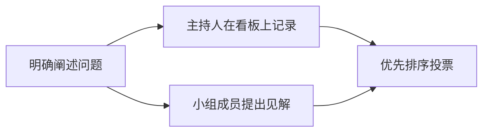
```mermaid

graph LR

A[明确阐述问题] --> B[主持人在看板上记录]
A[明确阐述问题] --> C[小组成员提出见解]
B[主持人在看板上记录] --> D[优先排序投票]
C[小组成员提出见解] --> D[优先排序投票]

```

> 真正发言的就几个人， 不善言辞的人则不会发言
> 目的是让所有人都需要强制发言
>
> 主持人：
> 说明讨论目标
> 给每个人 15 分钟考虑时间
> 每个人都要发言
> 优先排序， 择优录取


## 人际关系与团队技能 -- 观察

观察，也称为“工作跟随”，通常由旁站观察者观察业务专家如何执行工作，
但也可以由“参与观察者”来观察，通过实际执行一个流程或程序，
来体验该流程或程序是如何实施的，以便挖掘隐藏的需求。

> 方式一：旁站式观察
> 方式二：体验式观察


## 人际关系与团队技能 -- 引导

与焦点小组最大的区别在于引导：
* 规模无限制 (焦点小组人数少)
* 跨职能干系人参加 
  * 快速定义跨职能需求
  * 协调干系人差异，<u>**干系人达成共识**</u> （目的在于意见达成一致， 焦点小组在于得到方案）
   

## 原型法

原型法是指在实际制造预期产品之前，先造出该产品的模型，并据此征求对需求的早期反馈。

适用场景：
> 客户需求不够明确，想和客户快速达成一致，适用于新系统或大型复杂系统。

原型法可以测试出不同解决方案所产生的不同结


# 总结

- **名义小组技术**：结构化头脑风暴
- **观察**：旁站式&体验式观察
- **引导**：跨职能干系人达成共识
- **原型法**：复杂项目模型验证


---


# 输出：需求文件&需求跟踪矩阵
| 标题 | 课时 | 章节 |
| --- | --- | --- |
| 进度 | 56 | 52 |


## 需求文件


<u>记录</u> 项目干系人对项目的各种具体需求，渐进明细。
是明确的（可测量和可测试的）、可跟踪的、完整的、相互协调的且主要干系人愿意认可的业务和项目目标、需求、验收标准、假设条件和制约因素等。


**产品功能需求**

* 需求名称
* 需求描述
* 触发条件
* 输入
* 处理步骤
* 输出
* 流程
* 数据字典
* 权限
* 业务规则


**项目需求**

* 项目目
* 项目里程
* 项目进度要
* 项目范
* 项目质量要
* 项目成本要
* 项目风险要
* 项目交付物要
* 项目验收要
* 项目付款要


**产品性能需求**

* 安全
* 性能 （性能需求比较容易忽略）
* 易用性
* 可靠性
* 可维护性
* 可测试性
* 健壮性
* 接口需求


## 需求跟踪矩阵

需求跟踪矩阵。把产品需求从其来源连接到能满足需求的可交付物的一种表格。

使用需求跟踪矩阵，**把每个需求与业务目标或项目目标联系起来**，有助于确保每个需求都具有商业价值。

需求跟踪矩阵提供了在整个项目生命周期中跟踪需求的一种方法，**有助于确保需求文件中被批准的每项需求在项目结束的时候都能交付。**


## 总结

| 知识点 | 重点 |
| :--- | :--- |
| 需求文件 | 记录所有需求的文件 |
| 需求跟踪矩阵 | 每个需求与项目目标关联 |


---


# 过程：范围定义
| 标题  | 课时  | 章节  |
| --- | --- | --- |
| 进度  | 57  | 53  |


## 定义范围


**输入**
1. 项目管理计划
   1. 范围管理计划
1. 项目章程
1. 项目文件
   1. 假设日志
   1. 需求文件
   1. 风险登记册
1. 事业环境因素
1. 组织过程资产


**工具与技术**
1. 专家判断
1. 数据分析
   1. **备选方案分析**
1. 决策
   1. **多标准决盖分析**
1. 人际关系与团队技能
   1. 引导
1. **产品分析**


**输出**


1. 项目范围说明书
2. 项目文件（更新）
   1. 假设日志
   2. 需求文件
   3. 需求跟踪矩阵
   4. 干系人登记册


## 本节知识点

| 知识点 | 重点 |
| :--- | :--- |
| 工具 | 备选方案分析<br>多标准决策分析<br>产品分析 |
| 需求跟踪矩阵 | 项目范围说明书 |


---


# 输出：项目范围说明书
| 标题 | 课时 | 章节 |
| --- | --- | --- |
| 进度 | 58  | 54 |


# 项目范围说明书

项目范围说明书详细描述项目的可交付物，

**在项目规划时被创建**

以及为提交这些可交付物而必须开展的工作。
* 可交付物
* 产品范围描述 （工作过程）
* **验收标准** （试题中出现对可交付物不满意的时候，多半是验收标准没有定义清晰）
* 项目的除外责任

## 本节知识点

| 知识点 | 重点 |
| :--- | :--- |
| 项目范围说明书 | 产品范围描述+可交付物；<br>验收标准+项目除外责任 |


---


# 过程：创建 WBS
| 标题 | 课时 | 章节 |
| --- | --- | --- |
| 进度 | 59  | 55 |


## 创建 WBS 

**WBS** 
> 全称：__Work Breakdown Structure__ 
> 工作分解结构

建立 WBS 的过程
把项目的工作进行分解
负责的事情拆解为简单的事情


**输入**
1. 项目管理计划
   1. 范围管理计划
2. 项目文件
   1. 项目范围说明书
   2. 需求文件
3. 事业环境因素
4. 组织过程资产


**工具与技术**
1. 专家判断
1. 分析
   

**输出**
1. 范围基准
2. 项目文件（更新）
   1. 假设日志
   2. 需求文件


## 范围基准

范围基准是经过批准的范围说明书、WBS和相应的 WBS词典，

只有通过正式的变更控制程序才能进行变更，它被用作比较的基础。


> 范围基准 = 范围说明书 + WBS + WBS词典


> 范围说明书：没有拆解
> WBS：细致的分解，工作过程中不断地进行监控
> WBS 词典：每个分解内容的进一步描述， 避免出现一些含义的歧义


## 本节知识点

| 知识点 | 重点 |
| :--- | :--- |
| 工具 | 分解 |
| 输出 | 范围基准 |


---

# 输出：WBS&WBS 词典
| 标题 | 课时 | 章节 |
| --- | --- | --- |
| 进度 | 59  | 55 |


## WBS

复杂的工作简单化 -> 简单的事情要量化 -> 量化的事情专业化

WBS是工作分解结构（ Work Breakdown Structure ）的缩写
* WBS的组件：控制账户（ Control Account ） ：： 对应一个执行者，负责对应的工作包。方便项目经理控制进度。 注意：控制账户可以接受多个工作包，但是每个工作包只对应一个控制账户
* WBS的组件：工作包（ Work Packages ）用于未来估算
* 每个工作包都是控制账户的一部分，而控制账户则是一个管理控制点。在该控制点上，把范围、预算和进度加以整合，并与挣值相比较，以测量绩效。控制账户拥有两个或更多工作包，但每个工作包只与一个控制账户关联。

> <br>
> <u>简言之，WBS是一种将复杂任务分解为简单任务的方法。</u>
> <br>
> <br>

把底层所有工作逐层向上汇总，确保没有遗漏工作，也没有增加多余的工作
- 全部最底层的工作包全部相加等于最终的可交付物


**WBS的形态展示**

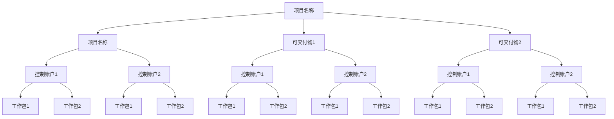
```mermaid

graph TD


A[项目名称] --> B[项目管理]
A[项目名称] --> C[可交付物1]
A[项目名称] --> D[可交付物2]

B[项目名称] --> B1[控制账户1]
B[项目名称] --> B2[控制账户2]
B1[控制账户1] --> B11[工作包1]
B1[控制账户1] --> B12[工作包2]
B2[控制账户2] --> B21[工作包1]
B2[控制账户2] --> B22[工作包2]

C --> C1[控制账户1]
C --> C2[控制账户2]
C1 --> C11[工作包1]
C1 --> C12[工作包2]
C2 --> C21[工作包1]
C2 --> C22[工作包2]

D --> D1[控制账户1]
D --> D2[控制账户2]
D1 --> D11[工作包1]
D1 --> D12[工作包2]
D2 --> D21[工作包1]
D2 --> D22[工作包2]

```

## WBS 分解

系统拆解
- 包括项目管理
- 包括培训（服务）
- 数据
- 设备
- 设施
- 测试与评价
- 实体和交付物


有助于详细的价格估算， 比如报价


## WBS 词典

WBS词典：针对工作分解结构中的每个组件，详细描述可交付物、活动和 **进度信息** 的文件。


| WBS标识 | 组件名称 | 工作描述 |
| --- | --- | ---|
| 1.2 | 中文手稿 | 与手稿有关的范围，它包括一系列的文档，如以下部分所描述 |
| 1.2.1 | 目录 | 一个包含了本书目录的文档。应用与管理类著作相关的模板来生成 |
| 1.2.2 | 引言 | 对本书的介绍 |
| 1.2.3 | 章节 | 由13个文档组成的著作正文。<br>每个文档都是著作中的一张，包括文字、图片、表格、图形、使用技巧框和注脚 |


## 习题：

```
工作分解结构最好被认是谁的沟通的有效辅助工具？
A. 团队
B. 项目经理
C. 客户
D. 干系人
```

答案：**D**

> 解析：
> 团队啊，老板啊， 这些都属于干系人的范围， 其他的选项都比较片面


---

# 章节习题
| 标题 | 课时 | 章节 |
| --- | --- | --- |
| 进度 | 60  |  |


## 错题分析

```
6. 目管理计划应该是现实的，以便于用来管理项目。以下哪项是实现现实的项目管理计划的最佳方法？

A.	发起人根据项目经理的意见创建项目管理计划。

B.	职能经理根据项目经理的输入创建项目管理计划。

C.	项目经理根据高级管理层的意见来制定项目管理计划。

D.	项目经理根据团队的输入来制定项目管理计划。


```

我选了：C

正确项：D

### 解析
> 项目经理作为项目的直接负责人，需要全面协调和管理项目的各个方面。而团队成员是项目的具体执行者，他们对项目工作的具体内容、技术难度、所需资源、时间要求等实际情况最为了解。项目经理根据团队的输入来制定项目管理计划，能够充分考虑到项目执行过程中的各种实际因素，使计划更符合实际情况，具有更高的可行性和可操作性，便于在项目实施过程中进行有效的管理和控制。
选项A. 发起人通常更关注项目的整体目标、战略意义以及资金等宏观层面的问题，虽然他们对项目有重要的决策权，但他们可能并不了解项目的具体细节和执行过程中的实际情况，仅根据项目经理的意见来创建项目管理计划可能会导致计划缺乏可操作性，与实际执行情况脱节。
选项B.职能经理主要负责特定职能领域的工作，如技术、人力资源、财务等，他们可能对自己职能范围内的事情比较熟悉，但缺乏对项目整体的全面视角，而且可能会过于关注本职能部门的利益和需求，从职能部门的角度出发创建的项目管理计划可能无法很好地协调各部门之间的工作，也难以保证计划的全面性和现实性。
选项C. 高级管理层通常具有更宏观的战略眼光和决策权力，但他们可能远离项目的具体执行层面，对项目的实际操作细节和团队的实际能力了解有限。仅根据高级管理层的意见制定计划，可能会使计划过于理想化，缺乏对实际执行过程中可能遇到的问题和困难的考虑，导致计划在实施过程中遇到诸多障碍。

<br>
<br>
<br>

```
9. 要准备好做一个完整的开发和最终确定范围基准的工作，需要你在识别和分析相关方以及收集需求方面做得彻底而及时。制定工作分解结构由（ ）参与可以最好的描述。

A.	职能经理
B.	项目团队
C.	所有的相关方
D.	业务分析员

```

我选了：D

正确项：B

### 解析
> 项目团队成员直接参与项目的执行，对项目的具体工作内容、流程和技术要求等有深入的了解。他们能够根据项目的实际情况，将项目工作合理地分解为具体的任务和可交付成果，确定工作之间的逻辑关系和层次结构，从而制定出详细、准确、可行的 WBS。所以项目团队参与制定 WBS 是最合适的，能够全面考虑项目的各个方面，确保 WBS 的完整性和有效性。
选项A. 职能经理通常负责特定职能领域的工作，他们可能对项目的整体目标和具体工作细节了解不够全面，在制定 WBS 时可能仅从自己的职能角度出发，无法涵盖项目的所有方面，不能很好地完成 WBS 的制定工作。
选项C. 所有相关方虽然都与项目有利益关系，但他们对项目工作的了解程度和专业角度各不相同，让所有相关方都参与 WBS 的制定，可能会导致意见过于分散，难以形成统一、有效的 WBS。而且有些相关方可能并不具备足够的专业知识来对项目工作进行合理分解，反而会影响制定 WBS 的效率和质量。
选项D. 业务分析员主要侧重于对业务需求和流程的分析，虽然能从业务角度提供一定的信息，但对于项目中的技术工作、项目管理流程等方面可能了解有限，无法独自完成一个全面、详细的 WBS 制定工作，在制定 WBS 时需要与项目团队其他成员密切配合。

<br>
<br>
<br>

```
10. 
你所管理的一个公路更新项目似乎有一些遗漏的范围。你对项目范围的理解是，公路要重新铺设。现在，一个建筑工头来问，为什么他发现没有提到在重新铺设的道路上重新画线的问题。他还想知道该项目中是否有更换护栏的工作包。你已经看到了一些已经完成的重铺的道路，上面画着新的线路。以下哪项最可能造成对项目范围说明的误解？


A.	不精确的语言
B.	模式、结构和时间顺序不佳
C.	工作包的大小或工作的细节有差异
D.	细节太多

```

我选了：C

正确项：A

### 解析
> 在项目范围说明中，如果使用了不精确的语言来描述公路重新铺设的工作，就可能导致不同人员对范围的理解产生偏差。例如，仅说 “公路要重新铺设”，没有明确说明是否包括重新画线以及更换护栏等工作内容，没有清晰界定 “重新铺设” 的具体工作边界，这就容易让建筑工头产生疑问，不知道这些工作是否属于项目范围，同时也能解释为什么会出现已经完成重铺的道路上却画了新线（可能有人对范围的理解包含了重新画线），所以不精确的语言最可能造成对项目范围说明的误解，该选项正确。
选项B. 模式、结构和时间顺序主要涉及项目范围说明的组织方式以及各项工作的先后顺序等方面。而题干中主要问题是对 “重新铺设” 工作具体包含内容的理解不一致，并非是范围说明的模式、结构和时间顺序存在问题导致的误解，所以该选项不符合。
选项C. 工作包的大小和工作细节的差异一般会影响到项目的计划、执行和监控等方面，比如资源分配、进度安排等。但对于本题中关于 “重新铺设” 工作是否包含重新画线和更换护栏的范围理解问题，工作包大小和细节差异不是主要原因，主要还是因为对范围描述的语言不清晰，所以该选项不正确。
选项D. 如果项目范围说明细节太多，可能会使阅读者难以抓住重点，但一般不会直接导致对范围的理解出现像本题中这样关于工作内容是否包含的误解。而且题干中并没有体现出是因为细节过多而导致的问题，主要还是描述不精确的问题，所以该选项也不合适。


---
5. 规划过程组

# 过程：规划进度管理
| 标题 | 课时 | 章节 |
| --- | --- | --- |
| 进度 | 62  | 57 |

## 规划进度管理


**输入**
1. 项目管理计划
	1. 范围管理计划
	2. 开发方法
2. 项目章程
3. 事业环境因素
4. 组织过程资产


**工具与技术**
1. 专家判断
1. 数据分析
	1. **备选方案分析**
2. 会议

**输出**
1. 进度管理计划

分两个部分：

- 如何定义进度的步骤和流程
- 制定进度的标准和规则


## 本节知识点

| 知识点 | 重点 |
| :--- | :--- |
| 输出 | 进度管理计划 |


---

5. 规划过程组

# 过程：定义活动

| 标题  | 课时  | 章节  |
| --- | --- | --- |
| 进度  | 63  | 58  |

**输入**
1. 项目管理计划
	1. 进度管理计划
	2. 范围基准
2. 事业环境因素
3. 组织过程资产


**工具与技术**
1. 分解
2. <u>滚动式规则</u>
3. 专家判断
4. 会议

**输出**
1. 活动清单
2. 活动属性
3. <u>里程碑清单</u>
4. 变更请求
5. 项目管理计划（更新）
	1. 进度基准
	2. 成本基准


## 本节知识点

| 知识点 | 重点 |
| :--- | :--- |
| 工具 | 分解<br>滚动式规划 |
| 输出 | 活动清单<br>活动属性<br>里程碑清单 |

---


5. 规划过程组

# 工具：滚动式规划
| 标题 | 课时 | 章节 |
| --- | --- | --- |
| 进度 | 64  | 59 |


滚动式规划。一种用迭代方法进行的规划，对近期要完成的工作进行详细规划，对远期工作只做粗略规划。

未来不确定的因素太多，不要对太长久之后的事情做详细的规划，只对近期的事情做规划， 大局有一个整体的计划

随着项目时间的推进再逐步的完善后继的计划


## 本节知识点

| 知识点 | 重点 |
| :--- | :--- |
| 滚动式规划 | 近细远粗，渐进明细 |


---


5. 规划过程组

# 输出：里程碑清单
| 标题 | 课时 | 章节 |
| --- | --- | --- |
| 进度 | 65  | 60 |


## 里程碑清单

* 项目中的重要时点或事件，历时为0。
* 里程碑清单列出了所有里程碑，并指明每个里程碑是强制性的（如合同要求的）还是选择性的（如根据历史信息确定的）


解析：
>
> 里程碑对应了明确的时间点，所以实际上里程碑的持续时间为 0
>
> **强制性里程碑**： 写在合同中， 和验收和
>
> **选择性里程碑**：项目经理有主导权，根据项目需求来定
>
> 里程碑的数量视情况而定， 不是越多越好


| 知识点 | 重点 |
| :--- | :--- |
| 里程碑清单 | 持续时间为 0，强制和选择性 |


---


5. 规划过程组

# 过程：排列活动顺序
| 标题 | 课时 | 章节 |
| --- | --- | --- |
| 进度 | 66  | 61 |


**输入**
1. 项目管理计划
	1. 进度管理计划
	2. 范围基准
2. 项目文件
   1. 活动清单
   2. 活动属性
   3. 假设日志
   4. 里程碑清单
3. 事业环境因素
4. 组织过程资产


**工具与技术**
1. <u>紧前关系绘图法</u>
2. <u>确定和整合依赖关系</u>
3. <u>提前量和之后两</u>
4. 项目信息管理系统

**输出**
1. 项目进度网络图
2. 活动属性
3. 项目文件（更新）
   1. 活动清单
   2. 活动属性
   3. 假设日志
   4. 里程碑清单


| 知识点 | 重点 |
| :--- | :--- |
| 工具 | 紧前关系绘图法<br>确定和整合依赖关系<br>提前量和滞后量<br>项目管理信息系统 |
| 输出 | 项目进度网络图 |

---

5. 规划过程组

# 工具: 紧前关系绘图法
| 标题 | 课时 | 章节 |
| --- | --- | --- |
| 进度 | 67  | 62 |


## 紧前关系绘图法

**示例：**

| # | 任务 | 前置任务 | 资源 |
| --- | --- | --- | --- |
| 1 | 获取花园材料 | | 房东 |
| 2 | 打扫地块 | | 甲和乙 |
| 3 | 准备土壤 | 1,2 | 甲 |
| 4 | 种花 | 3 | 甲 |
| 5 | 种草 | 2 | 甲 |

> 制约因素会写在 **假设日志** 中
> 也叫 <活动节点法>

## 活动节点法 (Activity-on-Node)

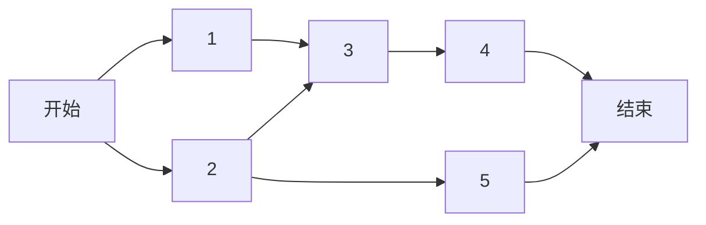
```mermaid

graph LR

A[开始] --> B[1]
A[开始] --> C[2]
B --> D[3]
C --> D
D --> E[4]
C --> F[5]
E --> G[结束]
F --> G[结束]

```

## 紧前关系绘图法使用4种逻辑关系


- **只有紧前活动**...，**紧后活动才能**....的逻辑关系


**FS**: 完成 - 开始
> 先洗锅再炒菜

**SS**: 开始 - 开始
> 主人开始，客人才可以开始

**SF**: 开始 - 完成
> 新系统上线后，旧系统化再下线 （这里需要注意一下和 FS 的区别， 是有前后关系的）

**FF**: 完成 - 完成
> 预案审批先完成，领导最后签字才能跟着一起完成


| 知识点 | 重点 |
| :--- | :--- |
| 紧前关系绘图法：| 节点表示活动，箭线表示逻辑顺序 |
| 4种逻辑关系 | 完成-开始<br>开始-开始<br>完成-完成<br>开始-完成 |

---

5. 规划过程组

# 工具: 确定和整合依赖关系
| 标题 | 课时 | 章节 |
| --- | --- | --- |
| 进度 | 68  | 63 |


## 确定和整合依赖关系

四种依赖关系：

- **强制性依赖关系**：合同要求的或工作的内在性质决定的依赖关系。<u>这种类型的依赖关系通常不能改变。</u>
- **选择性依赖关系**：一种基于最佳实践或项目偏好的关系。这种类型的依赖关系可以改变。
- **外部依赖关系**：项目活动与非项目活动之间的关系。<u>这种类型的依赖关系通常不能改变。</u>
- **内部依赖关系**：一个或多个项目活动之间的关系。这种类型的依赖关系可以改变。


| 知识点 | 重点 |
| :--- | :--- |
| 4种依赖关系 | 强制性依赖<br>选择性依赖<br>外部依赖<br>内部依赖 |


---

5. 规划过程组

# 工具: 提前量和滞后量
| 标题 | 课时 | 章节 |
| --- | --- | --- |
| 进度 | 69  | 64 |


## 提前量和滞后量

提前量。相对于紧前活动，紧后活动可以提前的时间量。
滞后量。相对于紧前活动，紧后活动需要推迟的时间量。

都是针对紧后活动的，提前量和滞后量的使用不能取代进度逻辑关系。


### 滞后 （Lag）


```mermaid

graph LR

A[活动 A] -- 2天 --> B[活动 B]

```

活动 A 完成 2 天后，活动 B 才能开始


> 刷油漆，第一遍刷完，必须干了 2 天后再刷第二遍


### 提前 （Leading）


```mermaid

graph LR

A[活动 A] --  -2天 --> B[活动 B]

```

活动 A 完成 2 天前，活动 B 就开始

> 当前流程进度到审核阶段，后继流程就可以开始了


| 知识点 | 重点 |
| :--- | :--- |
| 提前量 | 提前紧后活动的开始时间，压缩进度 |
| 滞后量 | 推迟紧后活动的开始时间，延后进度 |


## 习题

滞后是指什么？
A.一项活动在不耽误项目完成日期的情况下可以推迟的时间量。
B.一项活动在不推迟其后续活动的早期开始日期的情况下可以推迟的时间量
C.等待的时间
D.前进和后退

正确选（ C ）

A: 滞后有可能会导致延期的
B: 滞后是指针对紧后活动而言的， 题目中是针对紧前的，因此不对
C: 没毛病
D: 定义错误


---

5. 规划过程组

# 过程: 估算活动持续时间
| 标题 | 课时 | 章节 |
| --- | --- | --- |
| 进度 | 70  | 65 |


## 估算活动持续时间

**输入**
1. 项目管理计划
	1. 进度管理计划
	2. 范围基准
2. 项目文件
   1. 活动属性
   2. 活动清单
   3. 假设日志
   4. 经验教训登记册
   5. 里程碑清单
   6. 项目团队派工单
   7. 资源分解结构
   8. 资源日历
   9. 资源需求
   10. 风险登记
3. 事业环境因素
4. 组织过程资产

**工具与技术**
1. 专家判断
2. ==类比估算==
3. ==参数估算==
4. ==三点估算==
5. ==自下而上估算==
6. 数据分析
   7. 备选方案分析
   8. ==储备分析==
9. 决策
   10. 投票
11. 会议


**输出**

1. 持续时间估算
2. 估算依据
3. 项目文件（更新）
   1. 活动属性
   2. 假设日志
   3. 经验教训登记册

## 估算持续时间时需要考虑的其他因素


- **收益递減规律。**<br>在保持其他因素不变的情况下，增加一个用于确定单位产出所需投入的因素（如资源）会最终达到一个临界点，在该点之后的产出或输出会随着增加这个因素而递减。

- **资源数量。**<br>增加资源数量，使其达到初始数量的两倍不一定能缩短一半的时间，因为这样做可能会因风险而造成持续时间增加；<br>在某些情况下，如果增加太多活动资源，可能会因知识传递、学习曲线、额外合作等其他相关因素而造成持续时间增加。

- **技术进步。**<br>在确定持续时间估算时，这个因素也可能发挥重要作用。<br>例如，通过采购最新技术，制造工厂可以提高产量，而这可能会影响持续时间和资源需求。

- **员工激励。**<br>项目经理还需要了解“学生综合征”（即拖延症）和帕金森定律，<br>前者指出，人们只有在最后一刻，即快到期限时才会全力以赴：<br>后者指出，只要还有时间，工作就会不断扩展，直到用完所有的时间。

## 本节知识点

| 知识点   | 重点                                   |
| :---- | :----------------------------------- |
| 工具    | 类比<br>参数<br>三点<br>自下而上估算、备选方案<br>储备分 |
| 考虑的因素 | 收益递减规律<br>资源数量<br>技术进步<br>员工激励       |


思考

> 为了提升项目进度
> 不能一味的增加成本
> - 考虑使用新技术
> - 为员工设定更加激进的截止日期


---

5. 规划过程组

# 工具：类比&参数&三点&自下而上估算

| 标题  | 课时  | 章节  |
| --- | --- | --- |
| 进度  | 71  | 66  |


## 类比估算

- 从 ==以前类似活动的实际历时估算== 未来活动的历时，自上而下的估算方法。
- 是 ==专家判断== 的一种形式。
- 优点：方法建议，省时省力，费用最低。
- 缺点：信息量模糊，估算准确度低。
- 一般应用在项目的早期阶段。


## 参数估算

- 是指 ==利用数据之间的统计关系== 以及其他变量（如建筑施工中的平方英尺）来估算诸如成本、预算和持续时间等活动参数。

- 在下述情况下非常可靠：
	- 用于建立模型的历史信息是准确的；
	- 在模型中使用的参数是很容易量化；
	- 模型可按比例调整。

比如按照基础的步行速度，估算旅游不同景点的时间


## 三点估算

- 通过考虑估算中的 ==不确定性和风险==，可以提高活动持续时间估算的准确性。
- 概念源自计划评审技术（**PERT**）
- 一种概率方法，通常比类比估算准确。
- **PERT**公式：
   ```
	期望值= ( 最乐观 ＋ 4 x 最可能 ＋ 最悲观 ) / 6
   ```

   > 项目经理给到的 Deadline


## 自下而上估算

将活动进一步细分，然后估算资源需求。接着再把这些资源需求汇总起来，得到每一个活动的资源需求。

**优点**：估算比较准确，符合实际。

**缺点**：信息采集量大，耗时费工成本高。

> 如果无法以合理的可信度对活动进行估算，则需使用自下而上估算。

## 本节知识点

| 知识点    | 重点          |
| :----- | :---------- |
| 类比估算   | 参考相似数据、专家判断 |
| 参数估算   | 参考模型、统计计算   |
| 三点估算   | 考虑风险、公式计算   |
| 自下而上估算 | 最准确、耗资源     |

---

5. 规划过程组

# 工具: 储备分析

| 标题  | 课时  | 章节  |
| --- | --- | --- |
| 进度  | 72  | 68  |


## 储备分析

- 需要考虑应急储备（时间储备或缓冲时间），并将其纳入项目进度计划中，应对不确定性和风险。
- 可以是活动持续时间估算值的某一百分比、固定的时间段、或者通过定量分析来确定

> 比如：
> 汇报时间的时候预留 Buffer。 
> 去机场提前一段时间等等等。
> 都是按照百分比来定缓冲时间
> 缓冲应该在规划的时候定下来，在计划中定好


## 本节知识点

| 知识点  | 重点        |
| :--- | :-------- |
| 储备分析 | 应对风险，定量分析 |

---

# 三点估算的计算（选修）

| 标题  | 课时  | 章节  |
| --- | --- | --- |
| 进度  | --  | 68  |

## 三点估算的计算

1. Pert公式：期望值=（最乐观+4最可能＋最悲观）/6
2. 三角分布公式：期望值=（最乐观＋最可能＋最悲观）/3
3. 标准差：sigma =（最悲观-最乐观）/6，是实际时间偏离预期时间的度量，越小确定性越高

> 一般用 Pert 去计算
> 标准差越小，期望值准确性越高


## 例题

如果活动A完成的悲观时间为4天，最可能时间为3天，乐观时间为2天，那么通过期望值公式计算，完成活动A的期望值就为3天，标准差为0.33333天。

这里符合正态分布曲线

![[img/Pasted image 20250914102220.png]]

> 在2.67-3.33天之间完成活动 A 的概率约等于68.26%（1个标准差）


![[img/Pasted image 20250914102228.png]]
> 在2.33-3.67天之间完成活动A的概率约等于95.46%（2个标准差）

依次类推，2-4天之间概率约等于99.73%（3个标准差）；1.67-4.33天的概率约等于99.99%（4个标准差）


> 常考的就是 68.26% （1个标准差）和 95.46 （2个标准差）
> 后面的：2-4 天99.73% （3个标准差）和 1.67 - 4.33 天 99.99% （4个标准差） 有印象即可


## 本节知识点

| 知识点    | 重点          |
| :----- | :---------- |
| Pert | 期望值=（最乐观＋4最可能＋最悲观）/6|
| 三角  | 期望值=（最乐观＋最可能＋最悲观）/3   |
| 标准差 | sigma =（最悲观-最乐观）/6  |
| 用正态统计分布图 | 期望值两边 (+/-)1σ 范围内完成，概率为68.26%；(+/-)2σ 范围内完成，概率为 95.46%     |


---


5. 规划过程组

# 过程：制定进度计划

| 标题  | 课时  | 章节  |
| --- | --- | --- |
| 进度  | 73  | 69  |


## 制定进度计划

**输入**
1. 项目管理计划
	1. 进度管理计划
	2. 范围基准
2. 项目文件
   1. 活动属性
   2. 活动清单
   3. 假设日志
   4. 估算依据
   5. 持续时间估算
   6. 经验教训登记册
   7. 里程碑清单
   8. 项目进度网络图
   9. 项目团队派工单
   10. 资源日历
   11. 资源需求
   12. 风险登记册
3. 协议
4. 事业环境因素
5. 组织过程资产

**工具与技术**

1. 进度网络分析 
2. ==关键路径法==
3. ==资源优化==
4. ==数据分析==
   1. 假设情景分析
   2. 模拟
5. 提前量和滞后量
6. ==进度压缩==
7. 项目管理信息系统
8. 敏捷发布规划


**输出**

1. ==进度基准==
2. ==项目进度计划==
3. 进度数据
4. 项目日历 （体现项目的工作日志）
5. 变更请求
6. 项目管理
   1. 进度管理技术
   2. 成本基准
7. 项目文件（更新）
   1. 活动属性
   2. 假设日志
   3. 持续时间估算
   4. 经验教训登记册
   5. 资源需求
   6. 风险登记


## 本节知识点

| 知识点    | 重点          |
| :----- | :---------- |
| 工具 | 进度网络分析<br>关键路径法<br>资源优化<br>假设情景分析<br>模拟<br>提前量和滞后量<br>进度压缩 |
| 输出 | 进度基准<br>项目进度计划 |


## 习题解析

你是一个新产品开发项目的项目经理，该项目在工作分解结构中有四个层次。网络图和持续时间估算已经建立，进度计划表也已经制定并压缩。你接下来应该做哪项进度管理活动？

- [ ] A.控制进度
- [ ] B.确定依赖性
- [ ] C.类似地估算进度
- [x] D.获得批准

> 答案选择: D
>
> A: 在监控阶段才需要控制进度
> B: 在制定项目计划之前就应该完成的内容，排列活动顺序
> C: 在制定项目计划之前就应该完成的内容，持续时间估算 
> D: 因此选择此项

---


5. 规划过程组

# 工具：关键路径法

| 标题  | 课时  | 章节  |
| --- | --- | --- |
| 进度  | 74  | 70  |


## 关键路径法


不考虑任何资源限制的情况下，项目整个历时最长的路径为关键路径。

- 代表可以完成项目的最短时间量。
- 可能存在一条或多条关键路径，越多风险越大。
- 对关键路径进行工期压缩要考虑次关键路径的产生

### 擒贼先擒王

找到持续时间最长的路径就是关键路径

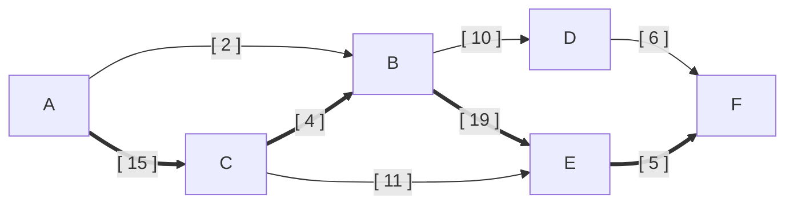
```mermaid

graph LR

A -- [ 2 ] --> B
A == [ 15 ]==> C
B -- [ 10 ] --> D
B == [ 19 ] ==> E
C == [ 4 ] ==> B
C -- [ 11 ]--> E
D -- [ 6 ]--> F
E == [ 5 ] ==> F

```

> 项目中，执行最慢的组员或者资源， 有时候并没有主动反馈相关的信息，但往往是问题的卡点


## 本节知识点

| 知识点    | 重点          |
| :----- | :---------- |
| 关键路径法 | 项目最长路径, 代表最短工期|


## 习题解析

一位项目经理在项目规划的中途被告知，她得到的关于影响其项目所需结束日期的新规定的数据是不准确的。
她可能需要做一些调整，但她认为她仍然可以管理这个项目，在法规生效之前完成它。
她通过分析具有最小调度灵活性的活动顺序来确认这一点。她使用的是什么技术？

- [x] A.关键路径法
- [ ] B.流程图
- [ ] C.顺序图法
- [ ] D.工作分解结构


> 解析
> 什么叫 ==具有最小调度灵活性的活动顺序==：就是关键路径上的关键活动
> 这些活动具备最小灵活性，一旦改变，会影响项目进度
> 因此选 A

---


5. 规划过程组

# 关键路径法计算（选修）

| 标题  | 课时  | 章节  |
| --- | --- | --- |
| 进度  | --  | 71  |

## 浮动时间（时差）

总浮动时间是在不延误项目完成日期或违反进度制约因素的前提下，进度活动可以从其最早开始日期推迟或拖延的时间量。

自由浮动时间是在不延误任何紧后活动最早开始日期或违反进度制约因素的前提下，某进度活动可以推迟的时间量。


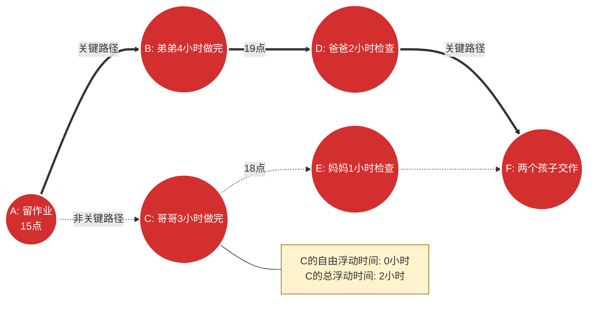
```mermaid
flowchart LR
    %% 第一列
    A((A: 留作业<br/>15点))
    
    %% 第二列
    B((B: 弟弟4小时做完))
    C((C: 哥哥3小时做完))
    
    %% 第三列  
    D((D: 爸爸2小时检查))
    E((E: 妈妈1小时检查))
    
    %% 第四列
    F((F: 两个孩子交作))
    
    %% Note位于C下方
    Note[C的自由浮动时间: 0小时<br/>C的总浮动时间: 2小时]
    
    %% 连接关系
    A ==>|关键路径| B
    A -.->|非关键路径| C
    B ==>|19点| D
    C -.->|18点| E
    D ==>|关键路径| F
    E -.-> F
    
    %% Note位于C下方
    C --- Note
    
    %% 设置位置关系以确保A和F水平对齐
    A ~~~ F
    
    %% 样式设置
    classDef criticalNode fill:#d32f2f,stroke:#fff,stroke-width:3px,color:#fff
    classDef normalNode fill:#d32f2f,stroke:#fff,stroke-width:2px,color:#fff
    classDef noteStyle fill:#fff3cd,stroke:#856404,stroke-width:1px
    
    class A,B,D,F criticalNode
    class C,E normalNode
    class Note noteStyle
```


# 关键路径法计

1. 使用正推法计算最早开始日期（ES），最早结束日期（EF）。
2. 使用逆推法计算最迟开始日期（LS）），最迟结束日期（LF）。
3. 总浮动时间 
   ```
   总浮动时间 = 本活动的最迟完成时间-本活动的最早完成时间。

   或

   总浮动时间 =  本活动的最迟开始时间-本活动的最早开始时间。
   ```
4. 自由浮动时间 = 紧后活动最早开始的最小值-本活动最早完成时间.


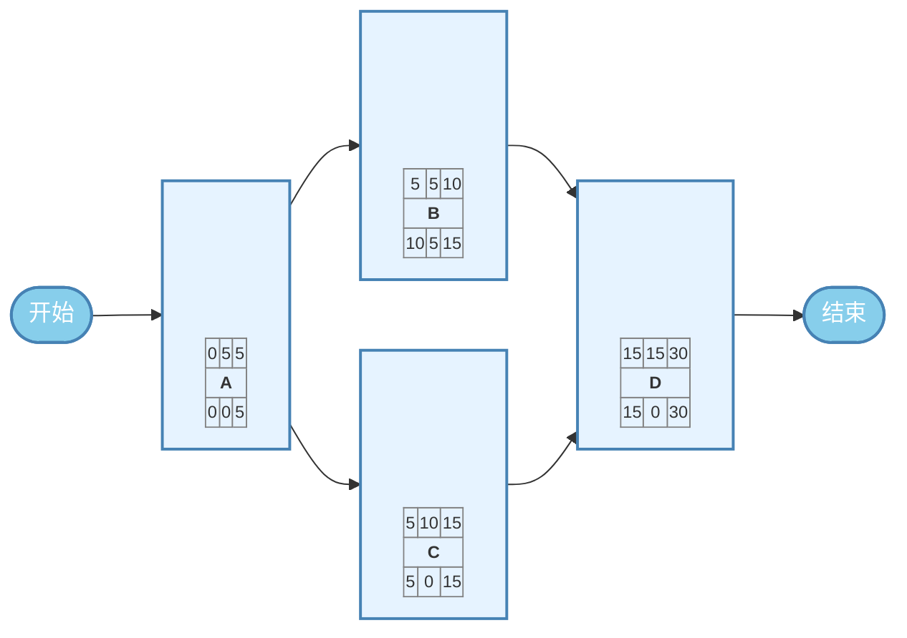
```mermaid
flowchart LR
    Start([开始]) --> A["<table border='1' style='border-collapse:collapse;font-size:12px'>
    <tr><td>0</td><td>5</td><td>5</td></tr>
    <tr><td colspan='3' style='text-align:center;font-weight:bold'>A</td></tr>
    <tr><td>0</td><td>0</td><td>5</td></tr>
    </table>"]
    
    A --> B["<table border='1' style='border-collapse:collapse;font-size:12px'>
    <tr><td>5</td><td>5</td><td>10</td></tr>
    <tr><td colspan='3' style='text-align:center;font-weight:bold'>B</td></tr>
    <tr><td>10</td><td>5</td><td>15</td></tr>
    </table>"]
    
    A --> C["<table border='1' style='border-collapse:collapse;font-size:12px'>
    <tr><td>5</td><td>10</td><td>15</td></tr>
    <tr><td colspan='3' style='text-align:center;font-weight:bold'>C</td></tr>
    <tr><td>5</td><td>0</td><td>15</td></tr>
    </table>"]
    
    B --> D["<table border='1' style='border-collapse:collapse;font-size:12px'>
    <tr><td>15</td><td>15</td><td>30</td></tr>
    <tr><td colspan='3' style='text-align:center;font-weight:bold'>D</td></tr>
    <tr><td>15</td><td>0</td><td>30</td></tr>
    </table>"]
    
    C --> D
    
    D --> End([结束])

    %% 样式设置
    classDef startEnd fill:#87CEEB,stroke:#4682B4,stroke-width:2px,color:#fff
    classDef activity fill:#E6F3FF,stroke:#4682B4,stroke-width:2px
    
    class Start,End startEnd
    class A,B,C,D activity
```

## 图例说明


| 最早开始时间<br>ES | 工期 | 最早完成时间<br>EF|
| --- | --------- | --- |
| |     活动名称       | |
| 最迟开始时间<br>**LS**</br> | 自由时差 | 最迟完成时间<br>**LF**</br> |


> 解析
> 正推法：
> A 活动中，项目开始按 0 天计算，也有的按 1 天开始的
> B 活动中，最早完成时间按照 A 活动的 最晚完成时间 + B 的工期 = 10 天
> C 活动中，自由时差是 0， 因为工期比 B 多了 5 天
> D 活动中，D是 B，C 的紧后活动，因此 D 的最早开始时间就是 B，C的最早完成时间的最大值。按照最迟完成时间计算，计算 = 15 + 15 = 30
>
> 逆推法：
> 按照项目的截止时间 30 天，以 D 的工期计算 D 的开始时间为 15 天
> 然后根据 B，C 的最早开始时间中最小的一个，来反推 A 的最迟完成时间
> 
> 当老板说，这个项目今天马上开始干，问多长时间做完的时候， 一般会用 **正推法**
> 当老板说，这个项目 30 天需要完成，问项目什么时间开始最合适，一般会用 **逆推法**

记忆几个公式
> B 点 最迟开始时间 - 最早开始时间 = 5
> B 点 最迟完成时间 - 最早完成时间 = 5
> 都可以计算 B 点的自由浮动时间 （下减上）


## 本节知识点

| 知识点    | 重点          |
| :----- | :---------- |
| 总浮动时间 | 总浮动时间   = 本活动的最迟完成时间 - 本活动的最早完成时间 |
| 自由浮动时间 | 自由浮动时间 = 紧后活动最早开始的最小值 - 本活动最早完成时间 |
| 正推法 | 使用正推法计算最早开始日期（ES），最早结束日期（EF） |
| 逆推法 | 使用逆推法计算最迟开始日期（LS），最迟结束日期（LF） |


## 习题解析

作为项目经理尽职调查的一部分，他审查进度，随着开始时间的临近，关注每项活动。
他还监测活动的进展情况。他目前正在关注一项活动，
该活动的最早开始时间（ES）为第3天，最迟开始时间（LS）13天，
最早结束（EF）9天，最晚结束（LF）19天。
在所有的情况下，这项活动怎么样？

- [ ] A.是在关键路径上
- [ ] B.具有滞后性
- [ ] C.进展顺利
- [x] D.不在关键路径上

> 解析：
> 尝试按照表格填表
> | 3 | 6 | 9 |
> |    活动      |
> | 13 | 10 | 19 |
> 
> 计算自由浮动时间 LS - ES: 13- 3 或者  LF - EF: 19 -9 = 10 
> 说明 自由浮动时间 > 0, 那么这个活动不在关键路径上
> 数据看不出是否有滞后，题目也没有说进展顺利
> 因此选 D

---


5. 规划过程组

# 工具：资源优化&数据分析&进度压缩

| 标题  | 课时  | 章节  |
| --- | --- | --- |
| 进度  | 75  | 72  |

## 资源优化

资源优化用于调整活动的开始和完成日期，以调整 ==计划使用的资源，使其等于或少于可用的资源。==

| # | 资源平衡 | 资源平滑 |
| --- | --- | --- |
| 定义 | • 平衡资源需求和资源供给<br> • 根据资源制约对开始和结束日期调整| • 对活动进行调整<br>• 使得资源需求不超过预定的资源限制|
| 特点 | • 往往导致关键路径改变 | • 不会改变关键路径，完工日期也不会延迟<br>• 向关键路径要时间，向非关键路径要资源 |


> 为了防止专家被过度使用，公司一般用成本来进行调整


## 数据分析

- 假设情景分析：这种分析技术对各种情景进行评估，预测它们对项目目标的影响。
  - ==考虑各种各样的情景。== 一 `如果 XXX, XXX 会`。
  - 进度计划在不利条件下的可行性。-- `应急应对计划`
- 模拟。这种分析技术通过模型来表明各种不确定性因素的综合影响，从而评估这些因素对目标的潜在影响。
  - ==蒙特卡洛模拟== 是一种使用计算机模型的多次代来识别风险和不确定性的潜在影响的方法，
    以发现可能因某一决定或做法导致的一系列成果的概率分布情况。


> 都是考虑风险的技术
> 风险，影响大会导致次略和处理的优先级不同 
> 模拟是对风险的量化分析
> 根据不同的影响， 针对的技术也不一样


## 进度压缩

- 赶工。通过增加资源，以最小的成本代价来压缩进度工期的一种方法
- 快速跟进。一种进度压缩方法，将正常情况下按顺序进行的活动或阶段改为至少部分按并行方式开展。

> PMI 里面是允许加班的
> 或者追加资源：比如从 4 小时，改为一天 3 班倒
> 赶工，通常会增加资源
>
> 快速跟进可能会比赶工的成本还要大

**正常的项目开发流程**


```mermaid

flowchart LR

Start([开始]) --> A[A 10天]  --> B[B 5天] --> Ene([结束]) 
```

**赶工**


```mermaid

flowchart LR

Start([开始]) --> A[A 5天]  --> B[B 5天] --> Ene([结束]) 
```

**快速跟进**

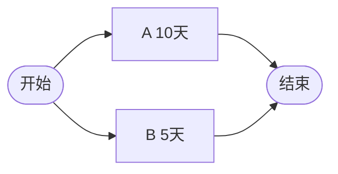
```mermaid

flowchart LR

Start([开始]) --> A[A 10天]  
Start --> B[B 5天] 
A --> Ene([结束])
B --> Ene 
```


## 本节知识点

| 知识点    | 重点          |
| :----- | :---------- |
| 资源优化 | 资源优化的目的是合理使用资源。<br>其中资源平衡会改变关键路径，资源平滑不会改变关键路径。 |
| 假设情景分析 & 蒙特卡洛模拟 | 考虑风险对进度的影响 |
| 赶工 | 花费成本增加资源，追赶进度 |
| 快速跟进 | 不花成本追赶进度，或花费很多成本用于返 |


## 习题解析

团队正在进行一个项目，开发或采购一个定制的软件包，供一家新的连锁比萨店的送货司机使用。
这个项目有多个干系人。
因为有其他正在进行的设计、建造和装备实体餐厅的项目，你被告知不需要急于完成这项软件开发工作。
如果项目时间和成本不像每月使用的资源数量那么重要，以下哪项是最好的做法？

- [ ] A.进行蒙特卡洛分析
- [ ] B.快速跟进该项目
- [x] C.进行资源优化
- [ ] D.分析生命周期成本

> 我的选择： C
> 我的思路：题目并没有反馈进度上出现问题，因此无需赶工或者快速跟进。
> 也没有风险的描述。而是希望某个活动不需要太早进行，可以针对这个活动进行资源优化

> 老师解析
> 关键点：不需要急于完成此工作
> 进度可以延后，但是使用的资源必须严格控制
> 换句话说就是：可以减少资源保证使用的资源不要超过资源使用要求 --> 资源优化
>
> A：风险分析
> B：时间和成本你都有影响
> D：不属于生命周期分析的内容
> 最后选 C

---

# 输出：项目进度计划&进度基准

| 标题  | 课时  | 章节  |
| --- | --- | --- |
| 进度  | 76  | 73  |


## 项目进度计划
| 计划类别 | 优点 | 缺点 | 适用场景 |
| :--- | :--- | :--- | :--- |
| 横道图（条形图、甘特图）| 显示出活动的预期持续时间，<br>时间感强| 精确性差，<br>可能水平方向长 | 经常用于向管理层汇报
| 网络图（带日期显示 ）,<br>纯逻辑图，<br>逻辑横道图,<br>时标逻辑图| 显示项目的网期信息络逻辑关系，<br>纯逻辑关系强 | 图幅大 | 适合团队内部使用，<br>了解工作之间逻辑关系 |
| 里程碑图 | 仅标识主要可交付物和<br>关键外部接口的计划，<br>简单清晰 | 信息量比较小，<br>不适合实际执行| |


## 进度基准
进度计划在项目管理团队认可与批准之后，成为过度基准。
- 进度基准是经过批准的进度模型
 
进度计划和进度基准的区别：
1. 颗粒度不同
2. 变更方式不同

> 讲解：
> 进度基准的实际意义在于，用项目基准和项目当前的状态进行比对的文件，有点类似于找不同
> 注意：进度基准 它不是进度计划
> 进度计划的内容更详细
> 基准不用太详细，仅是用于比对的文件
> 进度计划颗粒度小，进度基准颗粒度大
> 进度计划随时按照项目进度调整，但是进度基准不能随意更改一定要走变更流程


## 本节知识点

| 知识点    | 重点          |
| :----- | :---------- |
| 项目进度计划 | 横道图、网络图、里程碑图|
| 进度基准 | 经过批准的进度计划 |


## 习题解析

项目经理负责一个大型软件开发项目，在项目执行过程中，遇到了以下与进度相关的情况，
关于项目进度计划和进度基准，以下说法正确的是什么？


- [ ] A. 项目进度计划编制完成后，就成为了进度基准，不能再进行修改
- [x] B. 项目进度计划是详细描述项目活动的开始时间、结束时间不相互关系的文件，而进度基准是经过批准的项目进度计划，5有在变更控制流程下才能更新
- [ ] C. 因为项目进度计划和进度基准都是关于项目进度的，所以项目执行过程中，发现进度偏差时，可以随意调整进度计划及进度基准来符合实际情况
- [ ] D. 进度基准比项目进度计划更详细，包含了项目活动的资源分配、成本估算等信息

> 我的选择：B
> 我的思路：A：不能更改，明显错误，C:进度基准不能随意调整， D:进度基准表不如进度计划详细。因此选 B

---


# 过程规划组：闯关题2

| 标题  | 课时  | 章节  |
| --- | --- | --- |
| 进度  | 77  | --  |


## 错题分析：

2. 你已经确定了一群不同的相关方，你将需要以各种方式报告信息，以满足他们不同的沟通需求。什么时候你会使用里程碑图而不是条形图？

   - [ ] A.	项目规划
   - [ ] B.	向团队成员报告
   - [x] C.	向高级管理层报告
   - [ ] D.	风险分析

> 正确答案：C ， 你的答案：A回答错误

> **解析：**
> 替换一下前面的解析和A的解析【解析】对于一般管理层，条形图通常比较适用。但此题的特殊性在于考里程碑的适用场景。更高级别的管理层有时更关注项目的关键节点、重大事件以及整体进度的把控，他们不需要了解具体的工作细节。里程碑图能够突出显示项目中的重要里程碑，如项目启动、关键评审点、交付节点等，让高级管理层快速了解项目的整体进度和关键阶段，便于他们从宏观层面进行决策和把控。
选项A：在项目规划阶段，条形图和里程碑图都有各自的用途。条形图可详细展示各项任务的时间安排和进度，便于项目团队对工作进行具体的规划和协调。里程碑图则更侧重于标记出项目中的关键节点和重要事件，用于确定项目的整体框架和关键阶段。但总体来说，在项目规划时，二者并无绝对的优劣之分，具体使用哪种图取决于项目规划的详细程度和重点需求，所以 A 选项不准确。


7. 虽然客户同意原来的项目进度，但他们现在要求提前完成项目。他们受到了自己客户的压力。项目经理的发起人认为提前完成项目不仅是一个可行的选择，而且对你的组织来说也是一个好主意，因为这将使你能够更快开始另一个项目。在试图更快完成项目的过程中，项目经理看了每个活动赶工的相关成本；赶工的最佳方法还包括看___________

   - [x] A.	每项活动赶工的风险影响
   - [ ] B.	客户对哪些活动需要赶工的看法
   - [ ] C.	发起人对哪些活动需要赶工以及以何种顺序赶工的看法
   - [ ] D.	活动将在哪个项目生命周期阶段发生

> 正确答案：A ， 你的答案：C回答错误
> 
> **解析**
> 赶工可能会对项目带来各种风险，例如增加人力资源可能导致沟通协调成本增加、人员疲劳可能引发质量问题、加快活动进度可能导致一些原本不关键的路径变为关键路径从而增加项目整体风险等。只有综合考虑赶工成本和风险影响，才能做出更合理、更全面的决策，确保赶工措施不会给项目带来难以承受的负面影响，甚至导致项目失败。
B 选项：客户对哪些活动需要赶工的看法虽然有一定的参考价值，但客户可能并不了解项目的具体技术细节、活动逻辑关系和内在风险等，他们的看法更多是基于自身需求和期望，不一定能从项目实际操作和整体利益的角度出发，所以不能仅仅依据客户的看法来确定赶工方案，B 选项不准确。
C 选项：发起人对哪些活动需要赶工以及以何种顺序赶工的看法同样具有一定的影响力，但发起人可能更侧重于项目的商业利益和宏观目标，对于项目具体活动的技术可行性、风险等细节可能了解不够深入。仅仅依据发起人的看法可能会忽略一些实际操作中的问题和风险，不是确定赶工方案的最全面依据，C 选项也不合适。
D 选项：活动将在哪个项目生命周期阶段发生对于安排项目整体计划和资源分配等有一定的意义，但对于确定赶工的最佳方法来说，不是最关键的因素。赶工主要考虑的是如何在尽可能短的时间内完成项目，同时控制成本和风险，而活动所处的生命周期阶段并不能直接决定赶工的可行性和效果，D 选项不符合要求。


9. 你是一个500万美元的软件开发项目的项目经理。在与你的项目团队合作开发网络图时，你注意到有一系列的活动可以并行工作，但必须按照特定的顺序完成。这些活动需要什么类型的活动排序方法？
   - [x] A. 紧前关系绘图法
   - [ ] B.	箭头图示法
   - [ ] C.	关键路径法
   - [ ] D.	操作图示法

> 正确答案：A ， 你的答案：C回答错误

> **解析**
> 紧前关系绘图法（Precedence Diagramming Method，PDM）也叫前导图法，是用节点表示活动，用箭线表示活动之间的逻辑关系，能够很好地表示活动之间的先后顺序和依赖关系，适用于有一系列活动可以并行工作，但又必须按照特定顺序完成的情况。
B 选项：箭头图示法不属于PMP考试常见的标准活动排序方法，故 B 选项错误。
C 选项：关键路径法（Critical Path Method，CPM）主要是用于确定项目的关键路径，即项目中最长的路径，它是在活动排序完成后，用于分析项目进度的方法，而不是用于活动排序本身，C 选项不符合题意。
D 选项：操作图示法并不是项目管理中常见的标准活动排序方法，没有这种专门用于活动排序的方法，D 选项错误。


13.  你最近被指派管理一个营销项目，为一个可持续发展项目树立品牌。尽管你的工作才刚刚开始，发起人对在项目期间达到计划中的里程碑的可能性感到担忧。他们想知道你将如何进行估算。类比估算是_______
   - [ ] A.	使用自下而上的估算技术
   - [ ] B.	在项目执行过程中最经常使用
   - [x] C.	使用自上而下的估算技术
   - [ ] D.	使用实际详细的历史成本来计算估算

> 正确答案：C ， 你的答案：D回答错误
>
> 解析
> 类比估算就是利用过去类似项目的实际成本和其他数据来估算当前项目的成本等参数，是从项目的整体出发，利用类似项目的经验进行估算，属于自上而下的估算技术。
A 选项：自下而上估算技术是先对每个工作包或活动进行详细的成本估算，然后将这些估算汇总起来得到项目总成本估算，与类比估算的方法不同，所以 A 选项错误。
B 选项：类比估算通常在项目的早期阶段，当详细信息有限时使用，而不是在项目执行过程中最经常使用，项目执行过程中更多使用的是基于实际进展情况的估算方法，所以 B 选项错误。
D 选项：类比估算并非使用实际详细的历史成本来精确计算估算，而是基于类似项目的大致情况进行类比和推断，实际详细的历史成本用于更详细的参数估算等方法中，所以 D 选项错误。


15. 以下哪三项是错误的？（选择3个）

   - [ ] A.	关键路径有助于证明项目将需要多长时间。
   - [x] B.	只能有一条关键路径。
   - [X] C.	每当结束日期改变时，网络图就需要重新绘制。
   - [X] D.	一个项目不可能有负浮动时间。
   - [ ] E.	关键路径可能会有多条。
   - [ ] F.	关键路径可能存在正浮动时间。

> 正确答案：B,C,D ， 你的答案：B,C,F回答错误
>
> **解析**
> A 选项：关键路径是项目网络图中最长的路径，它决定了项目的最短工期，所以关键路径有助于证明项目将需要多长时间，该选项是正确的描述。
B 选项：一个项目中可能存在多条关键路径，即有多条路径的总时长都达到了项目的最短工期，并非只能有一条关键路径，该选项是错误的描述，可以选。
C 选项：结束日期改变并不一定意味着网络图需要重新绘制。只有当结束日期的改变影响到活动之间的逻辑关系或活动的持续时间等与网络图相关的因素时，网络图才会重新绘制，该选项是错误的描述，可以选。
D 选项：负浮动时间意味着项目进度已经落后于计划基准，需要采取措施进行调整，所以说项目可能有负浮动时间，该选项有错误的描述，可以选。
E 选项：如前面所述，关键路径可能会有多条，该选项是正确的描述。
F 选项：关键路径上的活动总浮动时间为零，存在正浮动时间，表示其上的活动有时间缓冲，所以该选项是正确的描述。


---


# 过程：规划成本管理

| 标题  | 课时  | 章节  |
| --- | --- | --- |
| 进度  | 78  | 74  |


## 规划成本管理

**输入**
1. 项目管理计划
	1. 进度管理计划
	2. 风险管理计划
2. 项目章程
4. 事业环境因素
5. 组织过程资产

**工具与技术**

1. 专家判断
2. 数据分析
3. 会议


**输出**

1. ==成本管理计划==


## 直接成本和间接成本

- 直接成本：直接为项目服务的各种资源投入，容易计入单一项目
- 间接成本：支撑项目运作和服务的各种过程成本投入，难以计入单一项目。
- 固定成本：总额不随业务量发生任何变动的那部分成本。
- 可变成本：总额会随着业务量的变动而成正比例变动的成本


|直接成本| 间接成本|
| :--- | :--- |
| 1.人员工资<br>2.人员差旅费<br>3.项目相关的采购发生<br>4.围绕项目市场活动费<br>5.围绕项目外包等 | 1.市场人员分摊<br>2.人事部门分摊<br>3.财务部门分摊<br>4.企业公共的一些税金 |

## 沉没成本
- 由于过去的决策已经发生了的，而不能由现在或将来的任何决策改变的成本。
- 时间，金钱，精力各方面都是沉没成本。

> 拿得起放得下

## 机会成本


- 为了得到某一样东西而要放弃其他东西中的最大价值。

- 你放弃的东西必须仍然是你能力和机会得到的，才能谈上机会成本。

> 鱼和熊掌不可兼得


## 生命周期成本法

- 生命周期成本法将产品或项目从最初的构思、设计、开发，到生产、运营、维护，直至最终报废或处置的整个过程视为一个完整的生命周期。
它强调在==决策过程==中，不仅要考虑初始的购置成本或建设成本，还要全面考虑后续使用过程中的==运营成本、维护成本==、维修成本、飲源消耗成本以及最终的处置成本等==所有与该产品或项目相关的成本。==

- 覆盖产品或项目从生到死的全部阶段，避免了只关注当期成本而忽视长期成本的局限性，有助于做出更全面更准确的决策。


| 知识点    | 重点          | 备注 |
| :----- | :---------- | :----- |
| 输出 | 成本管理计划|
| 直接成本 | 容易计入单一项目 |
| 间接成本 | 难以计入单一项目 |
| 固定成本 | 业务量变化也不变的成本 |
| 可变成本 | 业务量变化跟着变化的成本 |
| 沉没成本 | 拿得起，放得下 | 决策时不要考虑已经发生的成本 |
| 机会成本 | 鱼和熊掌不能兼得 |
| 全生命周期成本法 | 从构思到报废的成本考虑 |

## 习题解析


项目“生产准备成本”是以下哪一个例子？
- [ ] A.可变成本
- [x] B.固定成本
- [ ] C.间接成本
- [ ] D.机会成本


> 生产准备成本： 设备调试，准备。 直接成本，不随项目进展可变， 因此属于项目固定成本。 因此选择 B


---

# 过程：估算成本

| 标题  | 课时  | 章节  |
| --- | --- | --- |
| 进度  | 79  | 75  |


## 估算成本


**输入**
1. 项目管理计划
   1. 成本管理计划
   1. 质量管理计划
	1. 范围基准
2. 项目文件
   1. 经验教训登记册
   2. 项目进度计划
   3. 资源需求
   4. 风险登记册
3. 事业环境因素
4. 组织过程资产

**工具与技术**

1. 专家判断
2. 类比估算
3. 参数估算
4. 自下而上估算
5. 三点估算
6. 数据分析
   1. 备选方案分析
   2. 储备分析
   3. 质量成本
7. 项目管理信息系统
8. 决策
   1. 投票


**输出**

1. ==成本估算==
3. 估算依据
4. 项目文件（更新）
   1. 假设日志
   2. 经验教训登记册
   3. 风险登记

| 知识点    | 重点          | 备注 |
| :----- | :---------- | :----- |
| 工具 | 类比参数<br>三点<br>自下而上估算、备选方案<br>储备分析、质量成本、投票 |
| 输出 | 成本估算、估算依据 |


## 习题解析

在项目的早期，你和发起人讨论应该使用什么估算技术。你想要一种专家判断的形式，但发起人主张采用类比估算。最好的做法是什么？
- [x] A.同意类比估算，因为它是一种专家判断的形式。
- [ ] B.建议采用生命周期成本法作为折衷方案。
- [ ] C.确定发起人为什么想要一个如此精确的估算
- [ ] D.试图说服发起人允许专家判断，因为它通常正确


> 我选择 C，
> 正确答案 A
> A: 类比估算本身就是专家判断的一种，你和发起人的观点不冲突
> B: 根本不是折中方案， 和题目也没有关系
> C: 类比不是精确估算，错误
> D: 专家判断也不必类比更准确, 错误

---

# 输出：成本估算

| 标题  | 课时  | 章节  |
| --- | --- | --- |
| 进度  | 80  | 76  |


## 成本估算

- 对完成项目活动所需资金进行近似估算的过程
- ==考虑时间和应急储备==
- 通常用货币单位，==有时用其他计量单位（人时或人日）==
- 项目成本管理重点关注完成项目活动所需资源的成本，但同时也应考虑项目决策对项目产品、服务或成果的使用成本、维护成本支持成本的影响。
  例如，限制设计审查的，数可降低项目成本，但可能增加由此带来的产品运营成本。


## 成本估算等级

| 估算类型 | 何时做 | 目的 | 精度 |
| --- | --- | --- | --- |
| 粗略量级估算/<br>概率估算 | 可行性研究 | 选项决策提供成本估算 | -25%~+75% |
| 确定性估算 | 项目实施前 | 为采购提供详情，估算实际成本 | -5%~+10% |


> 成本估算尽量多估算， 不要少估算


| 知识点    | 重点          | 备注 |
| :----- | :---------- | :----- |
| 成本估算 | 考虑应急储备和使用维护成本 |
| 粗略量级估： | -25% ~ +75% |
| 确定性估算： | -5% ~ +10% |

## 习题解析

[**多选**]
你在估算一个项目的成本时遇到困难。以下哪四项能说明造成你困难的可能的原因？（选4项）

- [x] A.范围定义不充分
- [x] B.所需资源的不可得性
- [x] C.缺少以前项目的历史记录
- [x] D.缺少公司流程
- [ ] E.清晰的成本约束


> 我选: A, B, C, E
> 正确: A, B, C, D
> A: 范围不明确无法准确去估算成本
> B: 资源搞不新清楚，无法获得
> C: 没有依据，也会造成困难
> D: 缺少必要的流程会造成
> E：这是可以给成本估算带来正向的结果的选项，不会带来困难（排除）

---

# 过程：制定预算

| 标题  | 课时  | 章节  |
| --- | --- | --- |
| 进度  | 81  | 77  |

## 制定预算

**输入**
1. 项目管理计划
   1. 成本管理计划
   1. 质量管理计划
	1. 范围基准
2. 项目文件
   1. 成本估算
   2. 估算依据
   3. 项目进度计划
   4. 风险登记册
3.  商业文件
   1. 商业论证
   2. 收益管理计划
4. 协议
5. 事业环境因素
6. 组织过程资产

**工具与技术**
1. 成本汇总
2. 数据分析
   1. ==储备分析==
3. 专家判断
4. 历史信息审核
5. ==资金限制平衡==
6. 融资

**输出**

1. ==成本基准==
3. ==项目资金需求==
4. 项目文件（更新）
   1. 成本估算
   2. 项目进度计划
   4. 风险登记


| 知识点    | 重点          | 备注 |
| :----- | :---------- | :----- |
| 工具 | 成本汇总、储备分析、资源限制平衡、融资 |
| 输出： | 成本基准、项目资金需求|

## 习题解析

项目经理正在建立一个衡量项目成本绩效的基准。这是一个什么过程？
A.成本管理
B.估算成本
C.制定预算
D.控制成本

> 我：C
> 正确：C
> 指定预算的输出是成本基准， 其他都不符合议题


----

# 工具：储备分析 & 资源限制平衡

| 标题  | 课时  | 章节  |
| --- | --- | --- |
| 进度  | 82  | 78  |


## 储备分析

* 应急储备：未规划但可能发生的变更提供的补贴，
  这些变更由风险登记册中所列的已知风险产生。

* 管理储备：未规划的变更而预留的预算。
  支出管理储备前，需获得批准。==应对未知风险。==

* 管理储备不是项目成本基准的一部分，但在项目总预算中，
  当动用时，就要把动用的管理储备增加到成本基准里，从而导致成本基准变更。

> 已知风险：前期可以预测的风险，一般动用应急储备
> 未知风险：不可预测的风险，不能随便动用，需要动用管理储备，一般需要审批
> 管理储备不能用来考核项目经理绩效，因此不能计算到项目总预算中。
> 当发生变化的时候经过审批需要加到成本基准中

## 资金限制平衡
* 根据对项目资金的限制，来平衡资金支出。
* 如果不满足，需要调整项目范围，或者调整项目进度计划。
* 可在进度计划中添加强制日期来实现。

> 项目真的有资金限制的时候, 明确标注资金有限制。可以灵活的调整项目范围或进度计划


| 知识点    | 重点          | 备注 |
| :----- | :---------- | :----- |
| 储备分析 | 已知风险应急储备，未知风险管理储备|
| 资金限制平衡 | 调整范围和进度来解决资金限制 |


## 练习题
你正在领导一个项目，引入一个新的医疗预约应用程序。
当你在制定计划，详细说明团队将如何应对可能影响项目的事件时，
你和团队确定需要的成本应急储备的数量。成本应急储备应该是什么？

A.保密，以防止管理层不允许储备金的出现
B.添加到每个活动中，以便 客户提供一个更短的关键路径
C.由管理层维护，以弥补成本超支的损失
D.添加到项目的成本中以考虑到风险

> 我：D
> 正确：D
> 成本应急储备，应对已知风险
> A：储备金管理层应该知道
> B: 关键路径是进度管理，与成本无关
> C: 这个是管理储备相关的意义

---


# 输出：成本基准、项目资金需求

| 标题  | 课时  | 章节  |
| --- | --- | --- |
| 进度  | 83  | 79  |

## 成本基准
• 是经过批准且按时间段分配资金的项目预算（BAC），只有通过正式的变更控制程序才能变更，用作与实际结果进行比较的依据。
• 成本基准是不同进度活动经批准的预算的总和。

> 要按时间段分别配资金


## S曲线
由于成本基准中的成本估算与进度活动直接关联，因此就可按时间段分配成本基准，得到一条S曲线。

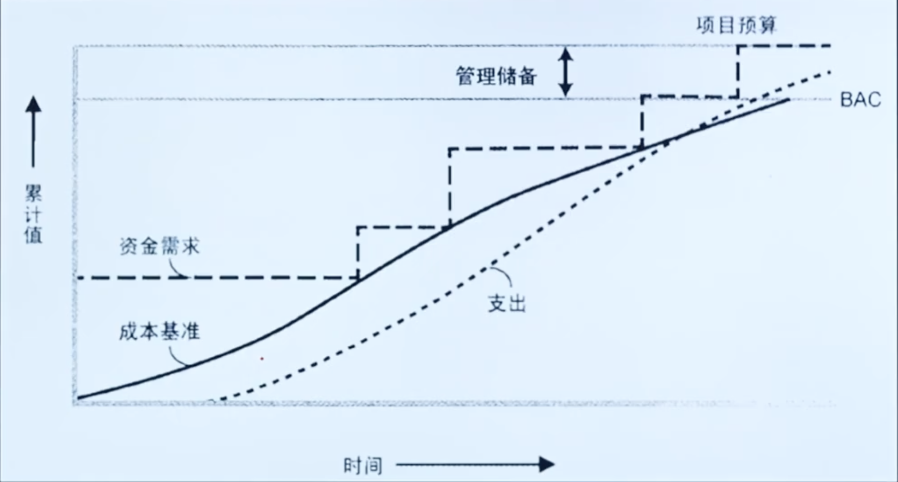

> 实线： 呈 S 型，两头慢，中间比较陡。 顶端达到了 BAC （成本预算总额） + 管理储备
> 虚线：实际支出。可能在项目的早期和中期低于项目预算， 项目后期和预算会有交点
> 阶梯线：资金需求：项目经理问老板要的钱。每个阶段来要钱，阶梯状

## 项目资金需求
- 根据成本基准，确定总资金需求和阶段性资金需求。
- 成本基准中既包括预计的支出，也包括预计的债务。
- 如果有管理储备，总资金需求等于成本基准加上管理储备。

## 项目预算的构成
项目预算和成本基准的各个组成部分，如图所示。

- 先汇总各项目活动的成本估算及其应急储备，得到相关工作包的成本；

- 然后汇总各工作包的成本估算及其应急储备，得到控制账户的成本；

- 接着再汇总各控制账户的成本，得到成本基准。成本基准再增加管理储备成为项目总预算。


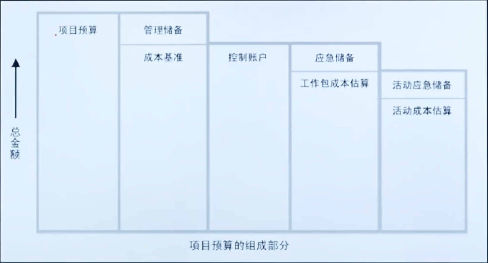

> 从右往左看

| 知识点    | 重点          | 备注 |
| :----- | :---------- | :----- |
| 成本基准 | 经过批准的（成本估算＋应急储备）|
| 项目资金需求 | 成本基准+管理储备 |


练习题
一些干系人对如何计算项目的成本预测感到困惑。他们还担心是否有足够的资金来支付风险应对的费用。
你计划在即将召开的团队会议上发给干系人的报告中）分享信息，以消除困惑。
你正在参考干系人和沟通管理计划，以确定如何最好地与干系人沟通。
你要解释的是，成本基准和成本预算之间的差异可以最好地描述是什么？

A.管理储备
B.应急准备金
C.项目成本估算
D.费用账户

> 选 A
> 成本基准 和 成本预算（项目总预算） 之间的差异就是 管理储备 

---


# 过程：规划质量管理

| 标题  | 课时  | 章节  |
| --- | --- | --- |
| 进度  | 84  | 80  |

## 规划质量管理


**输入**
1. 项目章程
   1. 项目管理计划
   2. 需求管理计划
   3. 风险管理计划
   4. 干系人参与计划
   5. 范围基准
2. 项目文件
   1. 假设日志
   2. 需求文件
   3. 需求跟踪矩阵
   4. 风险登记册
   5. 干系人登记册
3. 事业环境因素
4. 组织过程资产

**工具与技术**

1. 专家判断
2. 数据收集
   1. ==标杆对照==
   2. 头脑风暴
   3. 访谈
3. 数据分析
   1. ==成本收益分析==
   2. ==质量成本==
4. 决策
   1. 多标准决策分析
5. 数据表现
   1. ==流程图==
   2. ==逻辑数据模型==
   3. ==矩阵图==
   4. ==思维导图==
6. 测试与检查的规划
7. 会议

**输出**

1. ==质量管理计划==
1. ==质量测量指标==
2. **项目管理计划（更新）**
   1. 风险管理计划
   2. 范围基准
3. **项目文件（更新）**
   1. 经验教训登记册
   2. 需求跟踪矩阵
   3. 风险登记册
   4. 干系人登记册


| 知识点    | 重点       | 备注 |
| :----- | :---------- | :----- |
| 工具 | 标杆对照<br>头脑风暴<br>成本收益分析<br>质量成本<br>流程图<br>矩阵图<br>测试与检查的规划|
| 输出 | 质量管理计划<br>质量测量指标 |

> 质量管理计划: 针对过程指定指标
> 质量测量指标: 针对结果执行指标

## 习题


## 习题解析

在为一个新的医疗设备的设计和制造进行质量规划时，该团队发现需要将差异保持在最低限度，因为最终产品必须是尽可能高的质量。他们正在研究类似项目的做法，以了解如何实现这一要求。该团队正在使用以下哪项技术？

   - [x] A. 标杆对照
   - [ ] B. 流程图
   - [ ] C. 思维导图
   - [ ] D. 成本收益分析

> 解析：
> 应该选 A
> 根据题目描述"研究类似项目的做法"，这是典型的标杆对照技术的应用，因此答案应该是A


---

5.规划过程组

# 工具：成本收益分析&质量成本

| 标题  | 课时  | 章节  |
| --- | --- | --- |
| 进度  | 85  | 81  |


## 成本收益分析

对每个质量活动进行成本收益分析，就是要比较其可能成本与预期收益，期望回报大于投入。通过边际分析得到拐点。

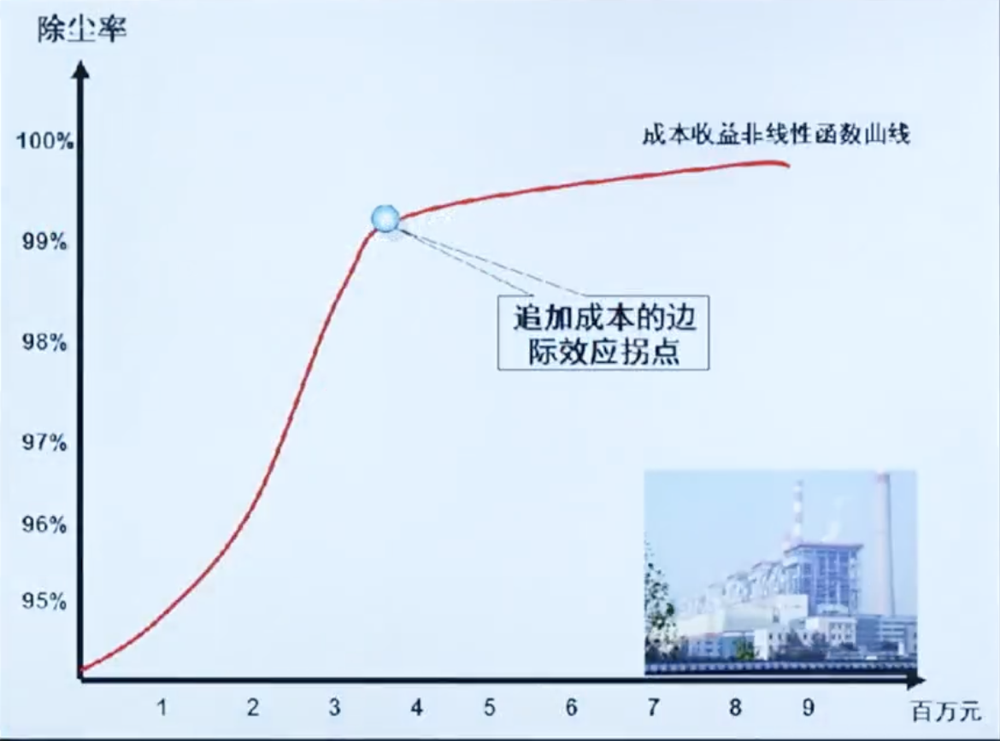

**关键概念：追加成本的边际效应拐点**

- 在拐点之前，成本投入能带来显著的收益提升
- 达到拐点后（如图中约99%除尘率处），继续投入大量成本只能带来微小的改进
- 这就是边际效应递减规律的体现

### 实际应用

在质量管理中，需要找到成本和收益的最佳平衡点：
- 不是追求100%的完美质量（成本过高）
- 而是找到合理的质量水平（如99%），在此点上投入产出比最优
- 超过拐点后的质量改进往往不具有经济性


## 数据分析-质量成本

质量成本（COQ）。在整个产品生命周期所产生的以下所有成本，即：为预防产品或服务不符合要求而进行的投资，为评估产品或服务是否符合要求而产生的成本，以及因产品或服务未达到要求而带来的损失。

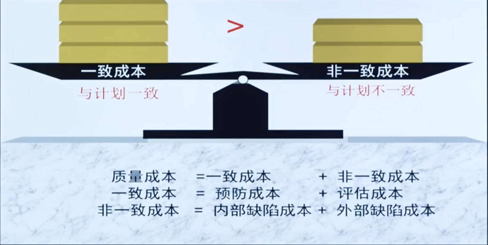

### 质量成本构成

| 成本类型 | 组成部分 | 说明 |
| :--- | :--- | :--- |
| **一致成本** | 预防成本 + 评估成本 | 为确保质量而主动投入的成本 |
| **非一致成本** | 内部缺陷成本 + 外部缺陷成本 | 因质量问题而产生的损失成本 |

**质量成本公式：**
- 质量成本 = 一致成本 + 非一致成本
- 一致成本 = 预防成本 + 评估成本
- 非一致成本 = 内部缺陷成本 + 外部缺陷成本

> **预防胜于检查**
> 
> 关键理念：与计划一致 vs 与计划不一致
> - 左侧（一致成本）：主动投入，用于预防和评估
> - 右侧（非一致成本）：被动损失，因缺陷产生的成本
> - 目标：通过增加预防成本，减少缺陷成本，实现总成本最优化
>
> 预防成本比检查成本低


### 质量成本详细分类

#### 一致成本
- **预防成本**（培训、流程文档化、设备、供货商调查）
- **评价成本**（测试、检查）

#### 非一致成本
- **内部**（自己人发现，例如返工、废品）
- **外部**（客户发现，保修、业务流失）

> **关键理解：**
> - 一致成本是主动投入，用于预防和检测质量问题
> - 非一致成本是被动损失，因质量缺陷而产生的成本
> - 内部缺陷成本：在产品交付给客户之前发现的缺陷成本 （保修，废品）
> - 外部缺陷成本：在产品交付给客户之后发现的缺陷成本，影响更大


## 本节知识点

| 知识点 | 重点 | 备注 |
| :--- | :--- | :--- |
| 成本收益分析 | 边际分析 | 找到投入产出比的最佳平衡点 |
| 质量成本 | 质量成本=一致成本（预防+评价）+非一致成本（内部+外部） | 通过增加预防投入减少缺陷损失 |


## 习题解析

在一个设计和生产餐厅厨房使用的新工具的项目中，成本已被确定为最优先的制约因素。项目组在其质量计划中包括对这些工具的随机抽样。虽然成本是一个关键因素，但产品也必须符合高质量标准。以下哪些是不一致成本的例子（选3个）？

   - [x] A. 返工
   - [ ] B. 质量培训  
   - [x] C. 废品
   - [x] D. 保修费用

> 解析：
> 应该选 A、C、D
> 根据质量成本的分类，不一致成本包括内部缺陷成本和外部缺陷成本。
> - A. 返工 - 属于内部缺陷成本（不一致成本）
> - B. 质量培训 - 属于预防成本（一致成本）
> - C. 废品 - 属于内部缺陷成本（不一致成本）
> - D. 保修费用 - 属于外部缺陷成本（不一致成本）


---
5.规划过程组

# 工具：流程图&逻辑数据模型&矩阵图&思维导图

| 标题  | 课时  | 章节  |
| --- | --- | --- |
| 进度  | 86  | 82  |


## 数据表现--流程图

- 用来图形化一个过程，对发生的**问题查找原因**。
- 流程图有助于项目团队预测可能发生的问题。

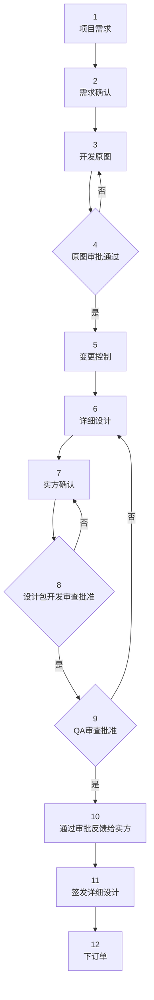
```mermaid
flowchart TD
    A[1<br>项目需求] --> B[2<br>需求确认]
    B --> C[3<br>开发原图]
    C --> D{4<br>原图审批通过}
    D -->|否| C
    D -->|是| E[5<br>变更控制]
    E --> F[6<br>详细设计]
    F --> G[7<br>实方确认]
    G --> H{8<br>设计包开发审查批准}
    H -->|否| G
    H -->|是| I{9<br>QA审查批准}
    I -->|否| F
    I -->|是| J[10<br>通过审批反馈给实方]
    J --> K[11<br>签发详细设计]
    K --> L[12<br>下订单]
```

### 流程图三要素
- **活动**：过程中的具体步骤
- **决策点**：判断条件和分支
- **过程顺序**：活动的执行顺序

> **关键用途：**
> 1. 可视化展现工作流程
> 2. 识别潜在的质量问题
> 3. 优化过程设计
> 4. 便于团队理解和沟通

## 数据表现--其他工具

### 逻辑数据模型
- 逻辑数据模型把组织数据可视化，以商业语言加以描述，不依赖任何特定技术
- 逻辑数据模型可用于识别会出现数据完整性或其他质量问题的地方

### 矩阵图
- 矩阵图在行列交叉的位置展示因素、原因和目标之间的关系强弱
- 根据可用来比较因素的数量，项目经理可使用不同形状的矩阵图：
  - L型
  - T型
  - Y型
  - X型
  - C型
  - 屋顶型矩阵
- 在本过程中，它们有助于识别对项目成功至关重要的质量测量指标

### 质量思维导图
- 质量思维导图技术可以有助于快速收集项目质量要求、制约因素、依赖关系和联系


| 工具类型 | 主要用途 | 关键特点 |
| :--- | :--- | :--- |
| 流程图 | 问题查找原因 | 可视化过程，识别潜在问题 |
| 逻辑数据模型 | 数据可视化 | 识别数据完整性问题，不依赖特定技术 |
| 矩阵图 | 关系强弱展示 | 多种形状（L/T/Y/X/C/屋顶型），识别关键质量指标 |
| 质量思维导图 | 需求收集 | 快速收集质量要求、制约因素、依赖关系 |

## 本节知识点

| 知识点 | 重点 | 备注 |
| :----- | :---------- | :----- |
| 流程图 | 查找问题原因、预测 | 图形化过程，识别潜在问题 |
| 逻辑数据模型 | 组织数据可视化 | 不依赖特定技术，识别数据完整性问题 |
| 矩阵图 | 多个因素之间的关系强弱 | 6种形状（L/T/Y/X/C/屋顶型），识别质量测量指标 |
| 质量思维导图 | 整合项目质量相关因素 | 快速收集质量要求、制约因素和依赖关系 |

二维象限矩阵，将内容进行分类
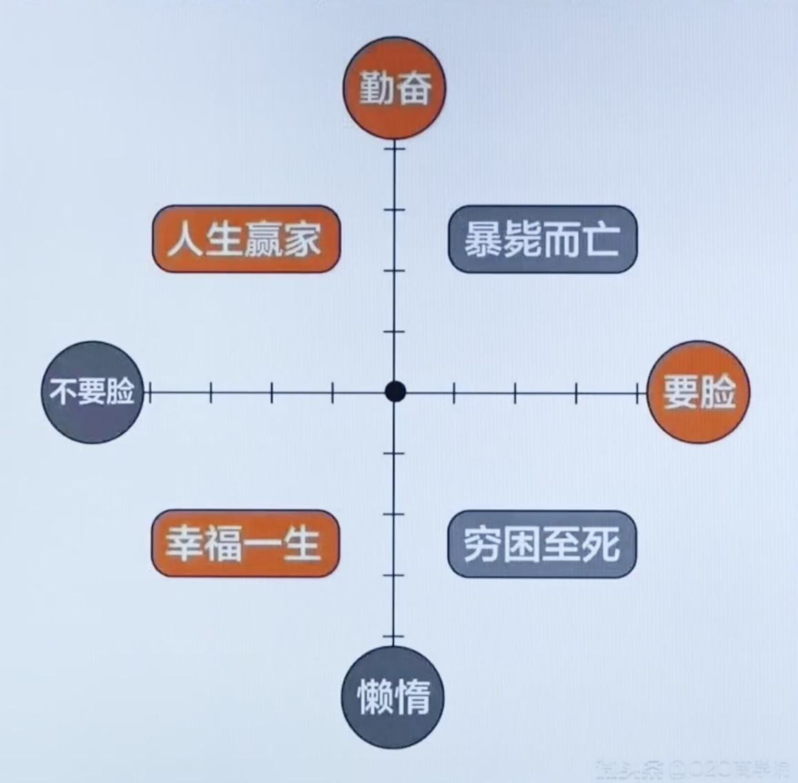

L 型矩阵
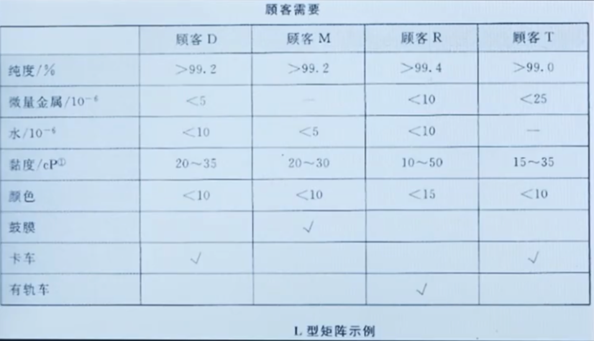

Y 型矩阵
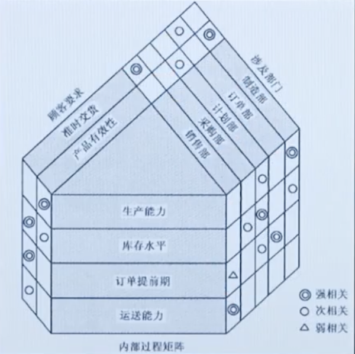


## 练习题

### 题目1：质量管理工具选择

**题目：**
你正在管理一个大型软件开发项目，需要确保软件质量符合高标准。在规划质量管理过程中，团队成员对使用何种工具来梳理质量流程和相关要素产生了讨论。以下关于各工具用途的描述，正确的是哪一个？

A. 为了展示软件从需求分析、设计、编码到测试各个阶段的流程以及各阶段间的决策点，应该使用矩阵图

B. 要分析不同质量检测方法与不同功能模块之间的对应关系，最好采用矩阵图

C. 若想全面梳理与软件质量相关的各类概念，如质量准则、测试流程、人员职责等，流程图最为合适

D. 为了清晰呈现软件中各类数据之间的关系，包括实体、属性、实体间的关联，使用流程图会更有效

**答案：B**

**解析：**
- **A选项错误**：展示软件开发各阶段的流程和决策点应该使用**流程图**，而非矩阵图。流程图专门用于展示过程步骤、顺序和决策点
- **B选项正确**：矩阵图用于展示两个或多个因素之间的关系强弱。分析质量检测方法与功能模块的对应关系正是矩阵图的典型应用场景
- **C选项错误**：全面梳理各类概念及其关联应该使用**质量思维导图**，而非流程图。思维导图适合整合和展示概念性内容
- **D选项错误**：展示数据之间的关系（实体、属性、关联）应该使用**逻辑数据模型**，而非流程图。逻辑数据模型专门用于数据结构分析

**知识点回顾：**

| 工具名称 | 主要用途 | 典型应用场景 |
|---------|---------|------------|
| 流程图 | 展示过程步骤和决策点 | 软件开发流程、业务流程、问题诊断 |
| 矩阵图 | 展示多个因素之间的关系强弱 | 需求与功能对应、职责分配、风险评估 |
| 质量思维导图 | 整合质量相关概念和要素 | 需求收集、知识梳理、问题分析 |
| 逻辑数据模型 | 展示数据结构和关系 | 数据库设计、系统架构、数据完整性分析 |
 

---

# 过程：规划资源管理

| 标题  | 课时  | 章节  |
| --- | --- | --- |
| 进度  | 87  | 83  |

## 规划资源管理

规划资源管理是定义如何估算、获取、管理和利用团队以及实物资源的过程。


**输入**
1. 项目章程
2. 项目管理计划
   1. 质量管理计划
   2. 范围基准
3. 项目文件
   1. 项目进度计划
   2. 需求文件
   3. 风险登记册
   4. 干系人登记册
4. 事业环境因素
5. 组织过程资产

**工具与技术**
1. 数据表现
   1. ==层级型==
   2. ==责任分配矩阵==
   3. ==文本型==
2. ==组织理论==
3. 专家判断
4. 会议

**输出**
1. ==资源管理计划==
2. ==团队章程==
3. 项目文件（更新）
   1. 假设日志
   2. 风险登记册

## 本节知识点

| 知识点 | 重点 | 备注 |
| :--- | :--- | :--- |
| 工具 | 数据表现（层级型、责任分配矩阵、文本型）<br>组织理论 | |
| 输出 | 资源管理计划<br>团队章程 | |


## 习题解析

你刚刚被指派从另一位即将离开公司的项目经理那里接管一个项目。前任项目经理告诉你，该项目正在按计划进行，但只是因为他不断地推动团队的工作。作为新的项目经理，你应该做的第一件事是什么？

   - [ ] A. 检查风险状况
   - [ ] B. 检查成本绩效
   - [ ] C. 确定管理策略
   - [ ] D. 告诉团队你的目标

> 解析：
> 应该选 C
> 团队积极性不高
> 当接管一个项目时，新项目经理首先需要确定合适的管理策略。前任经理提到必须不断推动团队工作才能保证项目按计划进行，这暗示团队可能需要特定的管理方式。在深入了解风险、成本等具体细节之前，先确定整体的管理策略和方法是最重要的，这将为后续的项目管理工作奠定基础。


---
5.规划过程组

# 工具：层级型&责任分配矩阵&文本型

| 标题  | 课时  | 章节  |
| --- | --- | --- |
| 进度  | 88  | 84  |


## 数据表现

无论使用什么方法来记录团队成员的角色，目的都是要确保每个工作包都有明确的责任人，确保全体团队成员都清楚地理解其角色和职责。

- **角色**：在项目中，某人承担的职务或分配给某人的职务，如土木工程师、商业分析师和测试协调员。
- **授权**：使用项目资源、==做出决策、签字批准、验收可交付物并影响他人开展项目工作的权利。== 例如，下列事项都需要具有明确职权的人来做决策：选择活动的实施方法，质量验收标准，以及如何应对项目偏差等。
- **职责**：为完成项目活动，项目团队成员必须履行的职责和工作。

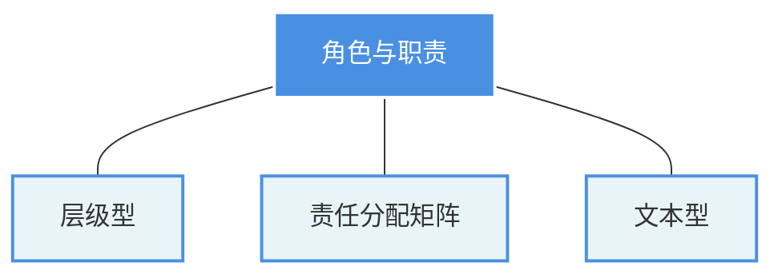
```mermaid
graph TD
    A[角色与职责] 
    A --- B[层级型]
    A --- C[责任分配矩阵]
    A --- D[文本型]
    
    style A fill:#4A90E2,stroke:#fff,stroke-width:2px,color:#fff
    style B fill:#E8F4F8,stroke:#4A90E2,stroke-width:2px
    style C fill:#E8F4F8,stroke:#4A90E2,stroke-width:2px
    style D fill:#E8F4F8,stroke:#4A90E2,stroke-width:2px
```


---

## 层级型

组织分解结构：此图表是对项目组织的一种层级描述，展示了项目活动与执行这些活动的组织单元之间的关系。

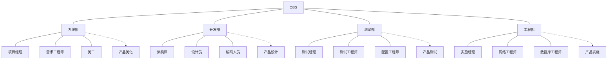
```mermaid
graph TD
    OBS[OBS] --- 系统部
    OBS --- 开发部
    OBS --- 测试部
    OBS --- 工程部
    
    系统部 --- 项目经理
    系统部 --- 需求工程师
    系统部 --- 美工
    
    开发部 --- 架构师
    开发部 --- 设计员
    开发部 --- 编码人员
    
    测试部 --- 测试经理
    测试部 --- 测试工程师
    测试部 --- 配置工程师
    
    工程部 --- 实施经理
    工程部 --- 网络工程师
    工程部 --- 数据库工程师
    
    系统部 -.-> 产品美化
    开发部 -.-> 产品设计
    测试部 -.-> 产品测试
    工程部 -.-> 产品实施
```

> 组织架构图： 标记了人员，权力（角色）. 它没有具体的职责描述
> 组织分解结构：是有职责描述的


## 责任分配矩阵（RACI/RAM）

RACI矩阵是一种常见的方法，用于显示执行、担责、咨询或知情，且与项目活动、决策和可交付物有关的干系人。
==在大型项目中，可以制定多个层次的RAM，
例如，
高层次的RAM可定义项目团队、小组或部门负责WBS中的哪部分工作，而低层次的RAM则可在各小组内为具体活动分配角色、职责和职权。==

- **谁负责（R = Responsible）**，负责执行任务的角色，具体负责控制项目、解决问题。（ ==执行人，不唯一==）
- **谁批准（A = Accountable）**，对任务负全责的角色，只有经其同意项目才能得以进行。( ==负责人，唯一== )
- **咨询谁（C = Consulted）**，在任务实施前或中提供指定性意见的人员。
- **告知谁（I = Informed）**，及时被通知结果的人员，不必向其咨询、征求意见。

| 类型 | 张三 | 李四 | 王五 | 赵刚 |
| :--- | :--- | :--- | :--- | :--- |
| 活动1 | R | C | C | C |
| 活动2 | C | R | C | I |
| 活动3 | C | ==R== | ==R== | I |
| 活动4 | C | I | I | C |
| 活动5 | I | I | I | R |

> 解决分工混乱的问题
> RACI 是  RAM 的具体使用工具
> 如果 考试中同时出现了 RACI 矩阵和 RAM ，可以首选 RACI 的选项


## 文本型

文本型文件通常以概述的形式，提供诸如职责、职权、能力和资格等方面的信息。这种文件有多种名称，如职位描述、角色一职责一职权表，该文件可作为未来项目的模板，特别是在根据当前项目的经验教训对其内容进行更新之后。

| key | value | key | value |
| --- | --- | --- | --- |
| 职位代码 | --- | 职位名称 | --- |
| 直接上级 | --- | 直接下级 |--- |
| 职位类型 | --- | 可轮换岗位 |--- |
| 岗位职责 | --- |
| 技能要求 | --- |
| 主体内容 | --- |
| 参与内容 | --- |
| 工作输入 | --- |
| 工作输出 | --- |
| 岗位绩效标准 | --- |

## 本节知识点

| 序号 | 知识点 | 重点 |
| :--- | :--- | :--- |
| 1 | 层级型 | 组织分解结构（OBS） |
| 2 | 责任分配矩阵 | RACI矩阵 |
| 3 | 文本型 | 文件形式提供角色与职责 |


## 习题解析

你刚刚被任命为一个大型电信项目的项目经理。这个为期一年的项目已经完成了一半左右。该项目组由5名销售人员和20名你公司的员工组成。你想了解谁在项目中负责做什么。你会在哪里找到这些信息？

   - [x] A. 责任分配矩阵
   - [ ] B. 资源直方图
   - [ ] C. 柱状图
   - [ ] D. 项目组织图

> 解析：
> 应该选 A
> 责任分配矩阵（如RACI矩阵）是用来明确项目中每个人的具体责任和角色的工具，能够清晰地显示谁负责做什么工作，这正是题目中项目经理想要了解的信息。资源直方图主要显示资源使用情况，柱状图是数据展示工具，项目组织图主要显示组织结构层级关系，都不能具体说明各成员的工作职责。

---


# 工具：组织理论

| 标题  | 课时  | 章节  |
| --- | --- | --- |
| 进度  | 89  | 85  |


## 资源管理计划和团队章程

### 资源管理计划包括：

* 识别资源
* ==获取资源==
* ==角色和职责==
* 项目组织图
* 项目团队资源管理
* 培训
* 团队建设
* 资源控制
* 认可计划

找谁获取资源

### 团队章程包括：

* 团队价值观
* 沟通指南
* ==决策标准和过程==
* 冲突处理过程
* ==会议指南==
* ==团队共识==

包含了很多的规则
提升团队的时期

**公开明确规则和分工，提高生产力**

## 本节知识点

| 序号 | 知识点 | 重点 |
| :--- | :--- | :--- |
| 1 | 资源管理计划 | 项目经理的遵守准则<br>职责分工 |
| 2 | 团队章程 | 建立基本规则并让团队成员遵守 |

## 习题解析

你负责一个重要的工程项目，团队成员来自不同部门且专业背景各异。在项目执行初期，团队协作出现问题，成员职责不清，沟通效率低下。为解决这些问题，你首先应该怎么做？

   - [x] A. 参考资源管理计划，明确各成员的角色与职责分配
   - [ ] B. 重新制定项目进度计划，调整任务安排
   - [ ] C. 召开紧急会议，强调团队纪律
   - [ ] D. 依据团队章程，组织团队建设活动

> 解析：
> 题目描述了团队协作问题，成员职责不清、沟通效率低下的情况。根据题目情境，这是典型的团队管理和角色职责问题，需要明确各成员的角色与职责分配来解决。
> D 选项：主要是解决团队没有规则，或不遵守规则， 导致团队士气低下的原因

---


# 过程：估算活动资源

| 标题  | 课时  | 章节  |
| --- | --- | --- |
| 进度  | 90  | 86  |


## 估算活动资源

**输入**
1. 项目管理计划
   1. 资源管理计划
   2. 范围基准
2. 项目文件
   1. 活动清单
   2. 活动属性
   3. 假设日志
   4. 成本估算
   5. 资源日历
   6. 风险登记册
3. 事业环境因素
4. 组织过程资产

**工具与技术**
1. 专家判断
2. 自下而上估算
3. 类比估算
4. 参数估算
5. 数据分析
   1. 备选方案分析
6. 项目管理信息系统
7. 会议

**输出**
1. ==资源需求==
2. ==估算依据==
3. ==资源分解结构==
4. 项目文件（更新）
   1. 活动属性
   2. 假设日志
   3. 经验教训登记册

> 估算活动资源 本质上应该属于进度管理的过程


## 本节知识点

| 序号 | 知识点 | 重点 |
| :--- | :--- | :--- |
| 1 | 工具 | 类比/参数/自下而上估算<br>备选方案分析 |
| 2 | 输出 | 资源需求<br>估算依据<br>资源分解结构 |


## 习题解析

在一个软件开发项目里，"编写代码"活动需要估算资源。以下哪项是进行这项估算时必须考虑的？

   - [ ] A. 项目团队办公室的位置
   - [x] B. 代码编写所使用的编程语言
   - [ ] C. 项目发起人的个人喜好
   - [ ] D. 团队成员的业余爱好

> 解析：
> 应该选 B
> 在估算"编写代码"活动资源时，编程语言是必须考虑的关键因素，因为不同编程语言的复杂度、开发效率、所需技能水平都不同，直接影响资源需求估算。其他选项与活动资源估算无直接关系。

---

# 输出：资源需求、估计依据和资源分解结构

| 标题  | 课时  | 章节  |
| --- | --- | --- |
| 进度  | 91  | 87  |

## 资源需求、估算依据和资源分解结构

* **资源需求**：工作包中的每项活动所需的资源类型和数量。

* **资源分解结构**：按资源类别和类型而划分的资源层级结构。


### 资源分解结构示例

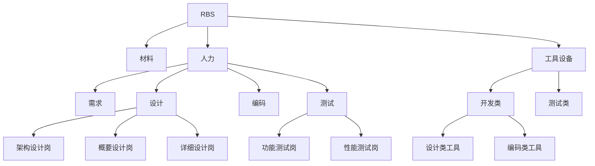
```mermaid
graph TD
    A[RBS] --> B[材料]
    A --> C[人力]
    A --> D[工具设备]
    
    C --> E[需求]
    C --> F[设计]
    C --> G[编码]
    C --> H[测试]
    
    D --> I[开发类]
    D --> J[测试类]
    
    F --> K[架构设计岗]
    F --> L[概要设计岗]
    F --> M[详细设计岗]
    
    H --> N[功能测试岗]
    H --> O[性能测试岗]
    
    I --> P[设计类工具]
    I --> Q[编码类工具]
```

> RBS: Resource Breakdown Structure
> 按照资源类别和类型划分的层级结构
> 来看一下它和其他分解表的区别：
> 
> WBS： 工作分解结构。 
> - 项目的范围管理，进度管理，成本管理。
> - 有助于团队理解项目的整体内容
> - 明确各部工作间的逻辑关系
> - 为指定项目进度和监控项目提供了依据
>
> RBS：资源分解结构
> - 主要用于 人力资源 和 实物资源的管理
> - 帮助项目识别和分析项目所需各种资源需求，避免资源的短缺或者浪费
> - RBS 对应的资源还在需求阶段
>
> OBS: 组织结构分解矩阵：
> - 能够清晰的展示组织结构，人员以及他们之间职责的一些关联关系
> - 以部门为单位，明确各部门的职责和分工
> - OBS 对应的资源已经在项目中了


## 本节知识点

| 序号 | 知识点 | 重点 |
| :--- | :--- | :--- |
| 1 | 资源需求 | 每项活动所需的资源类型和数量 |
| 2 | 估算依据 | 提供估算的信息支持 |
| 3 | 资源分解结构 | 资源层级结构（RBS） |


## 习题解析

你正在负责一个大型建筑项目，项目包含多个复杂的施工任务，如地基建设、主体结构搭建、内部装修等。在项目规划阶段，你需要对项目所需资源进行全面管理。以下关于资源需求、估算依据、资源分解结构的说法，正确的是？

   - [ ] A. 资源需求仅需考虑人力资源，材料和设备可在项目执行过程中按需采购
   - [ ] B. 估算依据主要来源于项目经理的个人经验，不需要参考历史项目数据
   - [x] C. 资源分解结构是按照资源类别和类型，对资源需求进行层级展现的工具，有助于规划和管理资源
   - [ ] D. 资源需求确定后就不能更改，否则会影响整个项目进度

> 解析：
> 应该选 C
> 资源分解结构（RBS）确实是按照资源类别和类型对资源需求进行层级展现的工具，有助于项目的资源规划和管理。选项A错误，资源需求应包含人力、材料、设备等所有类型；选项B错误，估算依据应参考历史数据和多种信息源；选项D错误，资源需求可以通过变更控制程序进行调整。

> A: 不能仅凭个人经验，不能采用按需采购（否则来不及）
> B：历史项目数据也需要考虑
> D: 资源需求在项目执行中是可以根据项目情况进行调整的，可以更改

---

# 规划过程组：闯关题3

| 标题  | 课时  | 章节  |
| --- | --- | --- |
| 进度  | 92  | --  |


一个经理注意到，一个项目经理正在与一些团队和一些相关方举行会议，讨论项目的质量。项目进度已经被压缩，成本节约。团队在项目中努力工作，并根据项目经理制定的奖励制度获得了奖励。总的来说，有一种强烈的团队意识。经理建议说，在日程安排如此紧凑的情况下，项目经理没有足够的时间来召开关于质量的会议。以下哪项最能说明为什么该经理是错误的？

- [x] A.	质量的提高会导致生产力的提高，成本效益的提高，以及成本风险的降低。

- [ ] B.	质量的提高会导致生产力的提高，成本效益的降低，以及成本风险的增加。

- [ ] C.	质量的提高会导致生产力的提高，成本效益的提高，以及成本风险的提高。

- [ ] D.	质量的提高会导致生产力的提高，成本效益的降低，以及成本风险的降低。

> 解析：
提高质量能减少缺陷和返工，进而提高生产力，降低因质量问题导致的成本增加风险，同时实现成本效益的提升。
B 选项：质量提高会使成本效益提高而非降低，成本风险降低而非增加，所以 B 选项错误。
C 选项：质量提高会使成本风险降低而非提高，所以 C 选项错误。
D 选项：质量提高会使成本效益提高而非降低，所以 D 选项错误


质量是什么？

- [ ] A.	满足并超过顾客的期望

- [ ] B.	增加额外的内容以使顾客满意

- [x] C.	项目满足要求的程度

- [ ] D.	对管理目标的符合性


> 解析：
项目满足要求的程度，这准确地阐述了质量的概念。质量就是指产品、服务或过程满足规定要求的程度，包括符合标准、规范、性能指标等各种要求。
选项 A：满足并超过顾客的期望，这是质量的一个重要体现，但不是对质量的准确、全面定义。质量不仅仅是针对顾客期望，还包括满足各种规定的要求等。所以 A 选项错误。
选项 B：增加额外的内容以使顾客满意，额外的内容不一定是质量的范畴，质量强调的是对既定要求的满足，而不是随意增加额外内容。所以 B 选项错误。
选项 D：对管理目标的符合性，管理目标可能包含多个方面，不一定直接等同于质量要求，质量是对具体产品或服务相关要求的满足程度，范围相对更窄、更具体。所以 D 选项错误。


资源直方图显示了什么，而责任分配矩阵却没有？

- [x] A.	时间

- [ ] B.	活动

- [ ] C.	相互关系

- [ ] D.	每项活动的负责人
  
> 解析：
资源直方图是一种可视化工具，用于展示项目中资源在不同时间点的使用情况，它以时间为横轴，展示资源的使用量或可用性随时间的变化趋势。
而责任分配矩阵（RAM）主要用于明确项目中的各项活动与团队成员之间的责任关系，重点在于展示谁负责什么活动，即每项活动的负责人，以及活动之间的相互关系等，但不涉及时间维度的信息。
所以资源直方图能显示时间，而责任分配矩阵没有，其他选项活动、相互关系、每项活动的负责人都是责任分配矩阵可以展示的内容。


你刚刚被任命为一个大型电信项目的项目经理。这个为期一年的项目已经完成了一半左右。该项目组由5名销售人员和20名你公司的员工组成。你想了解谁在项目中负责做什么。你会在哪里找到这些信息？

- [x]  A.	责任分配矩阵
- [ ] B.	资源直方图
- [ ] C.	柱状图
- [ ] D.	项目组织图

> 解析：
它明确地展示了项目中的各项活动与团队成员之间的责任对应关系，通过该矩阵可以清楚了解到谁负责项目中的具体工作，符合了解 “谁在项目中负责做什么” 的需求。

B. 资源直方图：主要用于展示项目资源在不同时间的使用情况，重点是资源的用量与时间的关系，而不是人员与工作任务的对应关系，所以无法满足需求。所以 B 选项错误。

C. 柱状图：可用于展示各种数据的分布或对比情况，但通常不直接体现项目中人员的职责分配信息，与题目所求内容无关。所以 C 选项错误。

D. 项目组织图：主要展示项目团队的组织结构和汇报关系，侧重于团队的层级架构，不能清晰呈现每个成员具体负责的工作任务。所以 D 选项错误。

它明确地展示了项目中的各项活动与团队成员之间的责任对应关系，通过该矩阵可以清楚了解到谁负责项目中的具体工作，符合了解 “谁在项目中负责做什么” 的需求。

B. 资源直方图：主要用于展示项目资源在不同时间的使用情况，重点是资源的用量与时间的关系，而不是人员与工作任务的对应关系，所以无法满足需求。所以 B 选项错误。

C. 柱状图：可用于展示各种数据的分布或对比情况，但通常不直接体现项目中人员的职责分配信息，与题目所求内容无关。所以 C 选项错误。

D. 项目组织图：主要展示项目团队的组织结构和汇报关系，侧重于团队的层级架构，不能清晰呈现每个成员具体负责的工作任务。所以 D 选项错误。


在项目的前半部分，有五个团队成员离开去了其他项目而没有被替换，两个团队成员没有通知你就去度假了，其他团队成员对他们要完成的工作表示不确定。在这种情况下，如果你在项目的后半部分更新以下哪项内容是最好的？

- [ ] A.	沟通管理计划 
- [ ] B.	资源直方图
- [x] C.	资源管理计划
- [ ] D.	责任分配矩阵

> 解析：
该计划涵盖了如何规划、获取、管理和控制项目资源，包括人力资源。在这种团队成员变动频繁且工作任务不确定的情况下，需要更新资源管理计划，重新评估资源需求、分配和管理策略，以确保项目后半部分的顺利进行。

A. 沟通管理计划：主要涉及项目中沟通的方式、频率、渠道等内容，虽然团队成员的变动可能会对沟通产生影响，但不能直接解决团队成员不确定工作内容以及资源变化的问题。所以 A 选项错误。

B. 资源直方图：是用于展示资源在不同时间的使用情况的图表，它不能从根本上解决团队成员对工作内容不确定以及资源管理方面的问题，只是对资源使用情况的一种直观呈现。所以 B 选项错误。

D. 责任分配矩阵：主要明确各项活动与团队成员之间的责任关系，但它没有涉及资源的获取、管理等方面，对于团队成员的变动以及由此引发的一系列资源管理问题，不能全面解决。所以 D 选项错误。

---


# 过程：规划沟通管理

| 标题  | 课时  | 章节  |
| --- | --- | --- |
| 进度  | 93  | 88  |


---

# 过程：规划沟通管理

## 规划沟通管理

**输入**
1. 项目章程
2. 项目管理计划
   1. 资源管理计划
   2. 干系人参与计划
3. 项目文件
   1. 需求文件
   2. 干系人登记册
4. 事业环境因素
5. 组织过程资产

**工具与技术**
1. 专家判断
2. ==沟通需求分析==
3. ==沟通技术==
4. ==沟通模型==
5. ==沟通方法==
6. 人际关系与团队技能
   1. 沟通风格评估
   2. 政治意识
   3. 文化意识
7. 数据表现
   1. ==干系人参与度评估矩阵==
8. 会议

**输出**
1. ==沟通管理计划==
2. 项目管理计划（更新）
   1. 干系人参与计划
3. 项目文件（更新）
   1. 项目进度计划
   2. 干系人登记册

## 沟通类型

| 类型 | 正式 | 非正式 |
| :--- | :--- | :--- |
| 口头 | 演示<br>项目审查会议<br>情况介绍<br>产品演示<br>头脑风暴 | 对话<br>特别讨论 |
| 书面 | 进展报告<br>项目文件<br>商业论证 | 便条<br>电子邮件<br>即时消息/短信<br>社交媒体 |

> 口头和书面都分为正式和非正式


## 书面沟通5C原则
• Correct：正确的语法和拼写。
• Concise：简洁的表述和无多余字。
• Clear：清晰的目的和表述（适合读者的需要）
• Complete：连贯的思维逻辑。
• Courteous：受控的语句和想法承接。

## 本节知识点

| 序号 | 知识点 | 重点 |
| :--- | :--- | :--- |
| 1 | 工具 | 沟通需求分析/技术/模型/方法/风格评估<br>干系人参与度评估矩阵 |
| 2 | 输出 | 沟通管理计划 |
| 3 | 沟通类型 | 正式书面/口头<br>非正式书面/口头 |
| 4 | 书面沟通5C | Correct/Concise/Clear/<br>Complete/Courteous |


## 习题解析

一个团队成员在最近的几次团队会议上都迟到了，而且他提交的最后两个交付物也不合格。项目经理决定他不能再等待事情的改善，必须与该团队成员解决这个问题。解决这个问题的最佳沟通方式是什么？

   - [ ] A. 正式的书面沟通
   - [ ] B. 正式的口头沟通
   - [ ] C. 非正式的书面交流
   - [x] D. 非正式的口头交流

> 解析：
> 应该选 D
> 对于团队成员表现问题，非正式的口头交流是最佳选择。这种方式允许项目经理与团队成员直接面对面沟通，更容易建立理解，了解问题根源，并共同寻找解决方案。非正式的沟通有助于保持良好的工作关系，避免过于严厉的处理方式。

---

# 课时 94 : 工具：沟通需求分析&沟通技术&沟通模型

| 标题  | 课时  | 章节  |
| --- | --- | --- |
| 进度  | 94  | 89  |


# 沟通需求分析

分析沟通需求，确定项目干系人的信息需求，包括所需信息的类型和格式，以及信息对干系人的价值。

常用于识别和确定项目沟通需求的信息包括（但不限，
- 干系人登记册及干系人参与计划中的相关信息和沟通需求，
- 潜在沟通渠道或途径数量，包括一对一、一对多和多对多；
- 组织结构图；
- 项目组织与干系人的职责、关系及相互依赖；
- 开发方法；
- 项目所涉及的学科、部门和专业；
- 有多少人在什么地点参与项目；
- 内部信息需要（如何时在组织内部沟通）；
- 外部信息需要（如何时与媒体、公众或承包商沟通）；
- 法律要求


# 沟通技术

用于项目干系人之间传递信息的特定工具、系统或计算机程序等。用于在项目干系人之间传递信息的方法很多。信息交换和协作的常见方法包括对话、会议、书面文件、数据库、社交媒体和网站。

可能影响沟通技术选择的因素包括：
- ==信息需求的紧迫性。== 信息传递的紧迫性、频率和形式可能因项目而异，可能因项目阶段而异。
- 技术的可用性和可靠性。用于发布项目沟通工件的技术，应该在整个项目期间都具备兼容性和- 可得性，且对所有干系人都可用。
- ==易用性。沟通技术的选择应适合项目参与者，而且应在合适的时候安排适当的培训活动。==
- ==项目环境。== 需要考虑的因素有：
  - 团队是面对面还是在虚拟环境中会面和运作？
  - 团队位于同一个时区还是多个时区？
  - 团队是否使用多种语言来沟通？
  - 是否有其他的项目环境因素可能会限制沟通的效率，如文化的各个面？
- ==信息的敏感性和保密性。== 需要考虑的一些方面有：
  - 须传达的信息是否具有敏感性或机密性。如果是，可能需要采取合理的安全措施。
  - 组织是否为员工制定社交媒体政策，以确保行为适当、信息安全和知识产权保护？

> 项目出现突发情况，需要根据项目的紧迫性来选择合适的沟通方式：如电话，微信
> 易用性， 针对不同的人使用不同的工具
> 项目环境：向全员发送变更信息
> 根据项目的保密性，选择带有加密功能的沟通方式

# 沟通模型


## 沟通模型

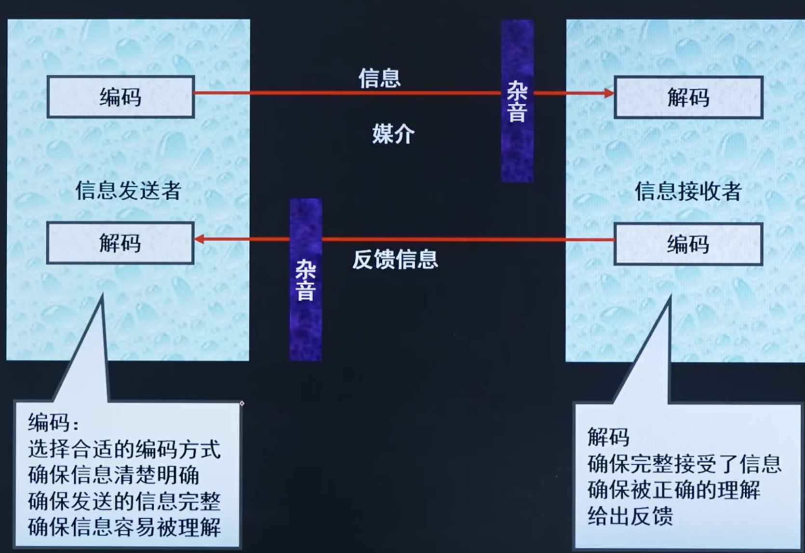

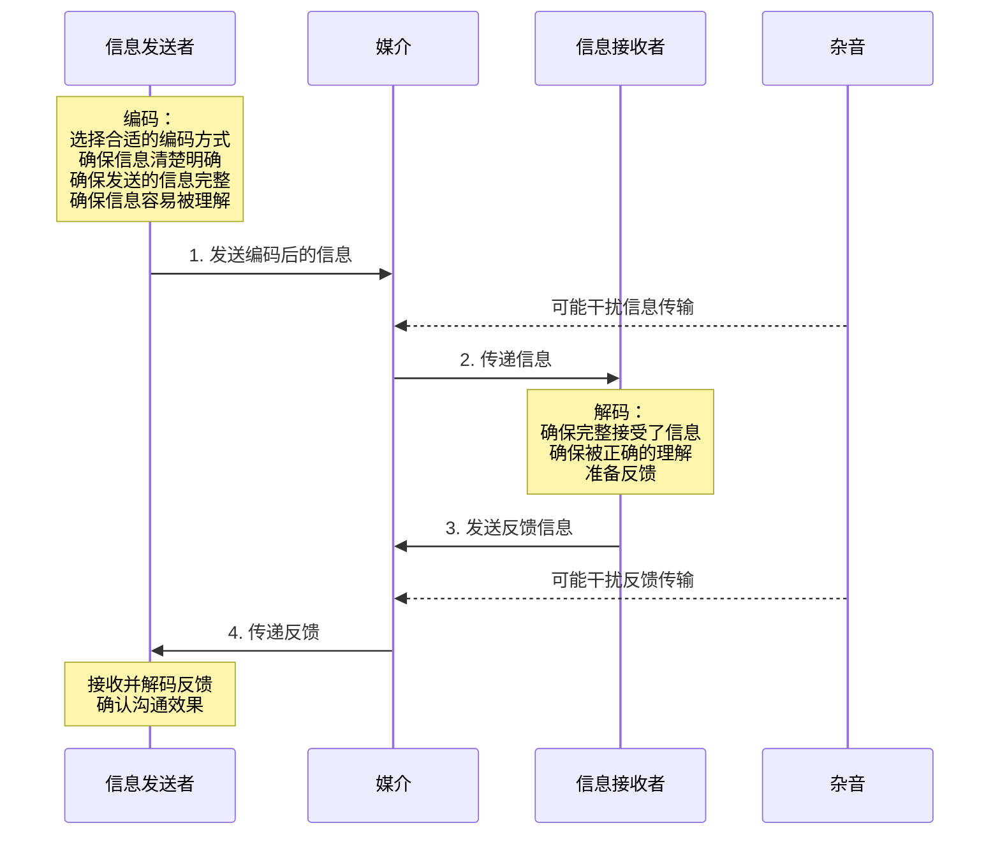
```mermaid
sequenceDiagram
    participant 发送者 as 信息发送者
    participant 媒介 as 媒介
    participant 接收者 as 信息接收者
    participant 杂音 as 杂音

    Note over 发送者: 编码：<br/>选择合适的编码方式<br/>确保信息清楚明确<br/>确保发送的信息完整<br/>确保信息容易被理解
    
    发送者->>媒介: 1. 发送编码后的信息
    杂音-->>媒介: 可能干扰信息传输
    媒介->>接收者: 2. 传递信息
    
    Note over 接收者: 解码：<br/>确保完整接受了信息<br/>确保被正确的理解<br/>准备反馈
    
    接收者->>媒介: 3. 发送反馈信息
    杂音-->>媒介: 可能干扰反馈传输
    媒介->>发送者: 4. 传递反馈
    
    Note over 发送者: 接收并解码反馈<br/>确认沟通效果
```

### 沟通模型要素

**编码过程**：
- 选择合适的编码方式
- 确保信息清楚明确
- 确保发送的信息完整
- 确保信息容易被理解

**解码过程**：
- 确保完整接受了信息
- 确保被正确的理解
- 给出反馈

**关键流程**：
1. 信息发送者编码并发送信息
2. 媒介传递信息（可能受杂音干扰）
3. 信息接收者接收并解码信息
4. 信息接收者编码并发送反馈
5. 媒介传递反馈（可能受杂音干扰）
6. 信息发送者接收并解码反馈


## 本节知识点

| 序号 | 知识点 | 重点 |
| :--- | :--- | :--- |
| 1 | 沟通需求分析 | 确定干系人沟通需求是首选 |
| 2 | 沟通技术 | 通过沟通的环境选择沟通技术 |
| 3 | 沟通模型 | 发送方编码、接收方解码、杂音 |


## 练习题
当发送方与接收方沟通时，什么情况下沟通效果通常会增强？
- [ ] A.说话的时候
- [ ] B.在和对方说话时使用手势
- [ ] C.说话缓慢
- [x] D.表现出对他人观点的关注

> 解析
> 这道题有发送方和接收方，应该属于沟通模型
> D: 只有你去了解对方观点的立场，才有可能去选择合适的编码方式， 确保信息被理解， 才能保证信息传递的正确性
> 其他的几个都不能保证信息传递的正确性

---

# 课时 95 : 工具：沟通方法&干系人参与评估矩阵

| 标题  | 课时  | 章节  |
| --- | --- | --- |
| 进度  | 95  | 90  |

## 沟通方法
| 方式 | 内容 | 
| :----- | :------ |
| 互动沟通 | 确保参与者对话题达成共识最有效的方法<br>会谈、电话会议、视频会议 |
| 推式沟通 | 确保信息发送，但不确保信息送达或理解<br>信件、备忘录、报告、电子邮件、传真、语音邮件、新闻稿。 |
| 拉式沟通 | 用于信息量很大或受众很多情况，受众群体不聚焦。<br>企业内网、电子在线课程、知识库 |

## 干系人参与度评估矩阵

### 沟通目标
比较所有干系人的当前参与程度与计划参与程度：执行鸿沟和评估鸿沟

|干系人|不知晓|抵制|中立|支持|领导|
|---|---|---|---|---|---|
|干系人1|C|||D|
|干系人2|||C|D|
|干系人3||||D C|

- C: Current
- D: Desired （将来）


## 本节知识点

| 序号 | 知识点 | 重点 |
| :--- | :--- | :--- |
| 1 | 推式、拉式、互动 | 推式：确保信息被发送<br>拉式：接收人多<br>互动：双向共识 |
| 2 | 干系人参与度评估矩阵 | 参与度鸿沟对比 |


# 练习题
项目经理需要向项目团队成员发送月度项目进度报告，以确保他们了解项目的最新进展。这种沟通方式属于以下哪种类型？
A. 互动沟通
B. 拉式沟通
C. 推式沟通
D. 非正式沟通

> 我选 C
> 发送报告属于推式沟通所以选 C

---

# 选修： 项目沟通计算（选修）

| 标题  | 课时  | 章节  |
| --- | --- | --- |
| 进度  | --  | 91  |


## 沟通渠道计算


> 沟通渠道的计算公式为：**n(n-1)/2**
>
> 其中 **n** 为团队干系人数量。


**5个人的团队示例（渠道数=10）：**

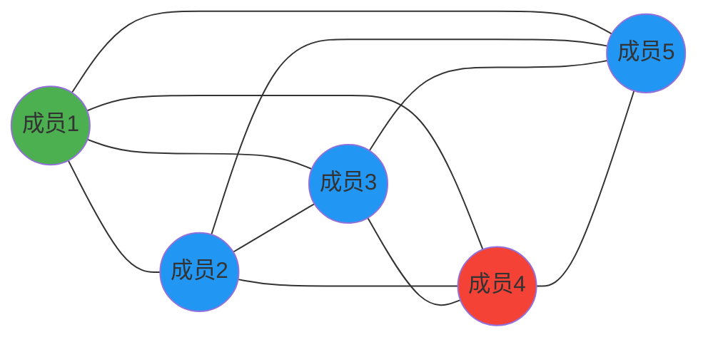
```mermaid
graph LR
    A((成员1)) --- B((成员2))
    A --- C((成员3))
    A --- D((成员4))
    A --- E((成员5))
    B --- C
    B --- D
    B --- E
    C --- D
    C --- E
    D --- E
    
    style A fill:#4CAF50
    style B fill:#2196F3
    style C fill:#2196F3
    style D fill:#F44336
    style E fill:#2196F3
```

**3个人的团队示例（渠道数=3）：**

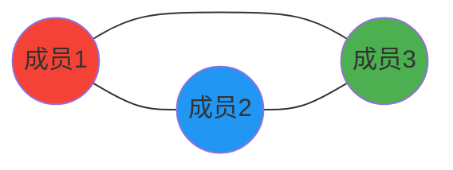
```mermaid
graph LR
    F((成员1)) --- G((成员2))
    F --- H((成员3))
    G --- H
    
    style F fill:#F44336
    style G fill:#2196F3
    style H fill:#4CAF50
```

> 随着团队规模的增大，沟通渠道数量呈指数级增长，这说明了大型团队沟通管理的复杂性。


> 题目中可能会有 “除了项目经理” 之类的字样， 这里按照实际的人数计算，
> 比如 “除了项目经理还有 5 人”， 然后按照公式计算 5 * (5 - 1) / 2

| 序号 | 知识点 | 重点 |
| :--- | :--- | :--- |
| 沟通渠道的计算公式为 | **n(n-1)/2** |

## 练习题
沟通是一个项目成功的关键。作为项目经理，你有三个干系人，你需要与他们沟通。因此，你有六个沟通渠道。现在又增加了一个新的干系人，你也需要与之沟通。你现在有多少个沟通渠道？
A.7
B.10
C.12
D.16

> 选 B
> 原 4 人， 现在新增到 5 人， 套公式 = 10

---

# 课时 96 : 输出：沟通管理计划

| 标题  | 课时  | 章节  |
| --- | --- | --- |
| 进度  | 96  | 92  |

## 沟通管理计划
内容包括：
* 沟通的信息，这些信息沟通的原因。
* 包括一些具体的沟通需求等。
* 沟通特点：
   - 有效率的沟通：只提供所需的信息。
   - 有效果的沟通：正确的格式，正确的时间导致正确的影响。

> 任何的沟通方式都写在了沟通管理计划中， 比如：紧急的事情用打电话或者即时通讯工具
> 任何沟通都可以按照沟通管理计划进行处理

| 序号 | 知识点 | 重点 |
| :--- | :--- | :--- |
| 沟通管理计划 | 指导有效率和效果的沟通 |

## 练习题
该项目有13个团队成员，影响到组织中超过15个部门。因为到目前为止，项目已经完成了20%，而且团队从五个受影响的部门获得了成功的绩效报告，所以项目经理举办了一个派对来庆祝。项目经理邀请了所有部门的主要干系人参加聚会，以便给那些提供良好评价的人一个非正式的机会，将好的东西传达给那些尚未受项目影响的部门。在聚会上，项目经理四处走动，试图发现任何可以帮助她使项目更加成功的相关信息。她碰巧听到其中一个部门的经理在论关于建立更多的项目定期会议。对该项目经理来说，最好的做是首先做什么？

A. 将聚会的效果记录在项目的经验教训中
B. 审查项目沟通管理计划的有效性
C. 召开所有干系人的会议，讨论他们关心的问题
D. 确保经理有一份沟通管理计划的副本，以便提醒他这种关注应该被送到项目经理那里

> 我选 D
> 正确选：B
> 听到项目经理想要更多的会议，说明在现在的项目沟通管理中存在不足
> 通过审查沟通管理化，评估当前的管理计划是否合理。以便更好的调整项目管理计划
> A: 有意义，但不是当下最紧迫和最好的做法
> C: 在没有对当前的沟通管理化进行审查的时候，召开干系人会议可能没有办法针对性解决问题，导致会议效率低下
> D: 没有从根本上解决问题的本质，只是一种被动的应对方法，不能主动的优化管理

---

# 课时 97 : 规划过程组：闯关题4

| 标题  | 课时  | 章节  |
| --- | --- | --- |
| 进度  | 97  | ---  |


新的项目经理有一个团队，英语不是其中几个成员的第一语言。他在与团队成员讨论工作活动时，经常使用他前公司的技术术语，而这些团队成员并不熟悉。沟通障碍最可能的结果是（）。

- [ ] A.	项目被推迟
- [ ] B.	信任水平得到提高
- [x] C.	产生误解
- [ ] D.	高级管理层不满意

在下列哪个情况下，需要与客户进行正式的书面沟通？

- [ ] A.	发现有缺陷

- [x] B.	客户要求进行合同中未包括的额外工作

- [ ] C.	该项目出现了包括改变关键路径的进度滑坡

- [ ] D.	该项目有成本超支 (错选)

> 解析：
这种情况涉及到合同范围的变更，需要明确双方的权利和义务，以避免后续可能出现的纠纷。正式的书面沟通可以记录客户的要求、项目团队的回应以及双方达成的一致意见，是非常必要的，所以该选项正确。
A 选项：发现缺陷后，一般先在项目团队内部探讨缺陷的性质、影响及解决方案。对于一些不太严重的缺陷，可能仅在团队内部处理，无需告知客户。即使是较严重的缺陷，通常也会先通过会议、电话等口头方式与客户初步沟通，了解客户意见，再视具体情况决定是否采用正式书面沟通来详细说明缺陷情况、处理方案及对项目的影响等。所以 A 选项错误。
C 选项：项目出现进度滑坡时，项目团队首先会对内部进行分析，制定纠正措施。与客户沟通时，可能先通过口头或会议形式及时告知情况和应对计划，不一定一开始就采用正式的书面沟通，除非客户有要求或者情况非常严重且复杂，需要详细的书面说明。所以 C 选项错误。
D 选项：成本超支时，项目团队会先在内部分析原因，考虑应对策略。与客户沟通时，也会先以较为灵活的方式告知情况，探讨解决方案，不一定马上进行正式的书面沟通，除非问题严重且需要书面文件来明确责任和处理方式。所以 D 选项错误。


在选择如何向企业干系人传达项目进展信息时，最重要的因素是什么？

- [ ] A.	该方法是预测性的、变化驱动的，还是混合性的 (错选)

- [x] B.	干系人希望你提供多少信息

- [ ] C.	团队以前使用过哪些报告方法，并熟悉这些方法

- [ ] D.	你有多少时间可以分配给报告任务

> 解析：
根据干系人或团体的需要和利益来计划你的沟通是很重要的。在这种情况下，你要向商业干系人报告，所以他们的需求是最重要的。开发团队可以用任何有效的方式与你沟通他们的绩效数据，因为你将把它转化为最有效的方法，将信息传达给目标受众。项目方法和你能花费的时间也将是考虑因素，但它们不会是要考虑的最重要因素。


当你接替前任项目经理的位置时，一个为期一年的大型电信项目已经完成了一半。该项目涉及三个不同的销售商和一个30人的项目团队。你想看看项目的沟通要求，以及正在使用什么技术来帮助项目沟通。你将在哪里找到这些信息？

- [ ] A.	干系人管理计划

- [ ] B.	信息发布计划

- [ ] C.	横道图

- [x] D.	沟通管理计划


项目管理计划中已经记录了对一些项目交付物的更改。这些变更以及其他项目信息已经按照沟通管理计划进行了分发。一个干系人在听到一个项目交付物的文件变更后，向项目经理表示惊讶。所有的干系人都收到了关于变更的通知。项目经理应该怎么做？

- [ ] A.	确定为什么该干系人没有收到信息，并让他知道信息的发布时间

- [ ] B.	询问职能经理，为什么干系人不了解他的责任

- [x] C.	审查沟通管理计划，如有必要，进行修改

- [ ] D.	在下一次指导委员会会议上处理这一情况，这样其他人就不会错过已公布的变化


两个人正在为完成一个工作包需要做什么而争论。除了正在说话的内容，如果项目经理想知道发生了什么，她应该最关注的是（）。

- [ ] A.	正在说什么，什么时候说

- [ ] B.	正在说什么，谁在说，以及一天中的时间 (错选)

- [ ] C.	身体上的举止，以及该讨论是在什么时候进行的

- [x] D.	他们声音的音调和语气，以及他们的手势

> 解析：
非语言交流是所有交流中的一个主要部分。包括语言交流（音调和语气）以及手势的选择是最佳选择。

一个项目经理有一个由四个国家的人组成的项目小组。该项目对公司非常重要，项目经理对其成功很关心。项目工期是可以接受的。他应该使用什么类型的沟通方式？

- [ ] A.	非正式的口头交流

- [x] B.	正式的书面交流

- [ ] C.	正式的口头交流

- [ ] D.	非正式的书面交流

一个团队成员正在参观其中一个供应商的生产工厂。在项目经理可能给该团队成员打的任何电话中，以下哪项是最重要的事情？

- [x] A.	要求团队成员重复项目经理所说的话

- [ ] B.	审查所有干系人的联系信息列表 (错选)

- [ ] C.	要求团队成员寻找变更请求

- [ ] D.	回顾即将到来的会议日程

> 解析：
有很多选择都是合理正确的。寻找最直接的需求。在这里，该团队成员是在一个制造环境中。这意味着沟通很可能会被噪音所阻挡。项目经理最好要求团队成员重复他说的话，以确保团队成员正确地听到项目经理传达的内容。

该项目有13个团队成员，影响到组织中超过15个部门。因为到目前为止，项目已经完成了20%，而且团队从五个受影响的部门获得了成功的绩效报告，所以项目经理举办了一个派对来庆祝。项目经理邀请了所有部门的主要干系人参加聚会，以便给那些提供良好评价的人一个非正式的机会，将好的东西传达给那些尚未受项目影响的部门。在聚会上，项目经理四处走动，试图发现任何可以帮助她使项目更加成功的相关信息。她碰巧听到其中一个部门的经理在谈论关于建立更多的项目定期会议。对该项目经理来说，最好的做法是首先。

- [ ] A.	将聚会的效果记录在项目的经验教训中

- [x] B.	审查项目沟通管理计划的有效性

- [ ] C.	召开所有干系人的会议，讨论他们关心的问题

- [ ] D.	确保经理有一份沟通管理计划的副本，以便提醒他这种关注应该被送到项目经理那里


---

# 课时 98 : 过程：规划风险管理.

| 标题  | 课时  | 章节  |
| --- | --- | --- |
| 进度  | 98  | 93  |


## 规划风险管理

**输入**
1. 项目管理计划
   1. 所有组件
2. 项目章程
3. 项目文件
   1. 干系人登记册
4. 事业环境因素
5. 组织过程资产

**工具与技术**
1. 数据分析
   1. 干系人分析
2. 专家判断
3. 会议

**输出**
1. ==风险管理计划==


## 风险管理
- 旨在提高积极事件（机会）的概率和影响。
- 降低项目消极事件（威胁）的概率和影响。
- 项目风险源于任何项目中都存在的不确定性。
- 已发生的消极项目风险被视为问题。
- 组织和干系人的风险态度受多种因素影响，分为3大类（风险偏好、风险承受力、风险临界值）。

> 消极风险：还没有发生的问题（还没有那么倒霉）
> 积极事件（机会）：同时也是存在的
> 在衡量风险的过程中， 都是以自己的角度去观察和衡量。每个干系人的角度和态度实际上都不一样
> 必须要关注关键干系人对于风险的态度

## 本节知识点

| 序号 | 知识点 | 重点 |
| :--- | :--- | :--- |
| 1 | 工具 | 干系人分析 |
| 2 | 输出 | 风险管理计划 |
| 3 | 风险概念 | 风险两面性<br>风险和问题<br>干系人风险态度 |

## 练习题
一个项目出现了一些问题，但现在似乎得到了控制。在过去的几个月里，几乎所有的储备都被使用了，而且大部分被预测到的事件的负面影响都发生了。现在只剩下四个活动，其中两个在关键路径上。管理层现在通知项目经理，为了获得额外的利润，提前两周完成项目符合执行组织的最佳利益。作为回应，项目经理就团队要做的一些工作“出了招标书，希望能找到另一家可能更快完成工作的公司。该项目经理可以说是在试图与以下哪项合作？
- [ ] A.储备
- [x] B.机会
- [ ] C.确认范围
- [ ] D.威胁

> 我选 B
> 项目经理正在选择一个积极的影响。即机会

---

# 课时 99 : 输出：风险管理计划

| 标题  | 课时  | 章节  |
| --- | --- | --- |
| 进度  | 99  | 94  |

## 风险管理计划
风险管理计划：此计划是项目、项目集或项目组合管理计划的组件，说明风险管理活动将被如何 ==结构化== 安排与实施。
- 不包括某具体风险的应对。
- 风险登记册不是风险管理计划的组成部分。

> 如果是风险流程或者规则出现了问题， 才会更新风险管理计划
> 如果识别到了一个新的风险，则需要更新到 ==《风险登记册》==
>


## RBS（风险分解结构）

RBS是Risk Breakdown Structure的缩写，用于系统化地分类和组织项目风险。

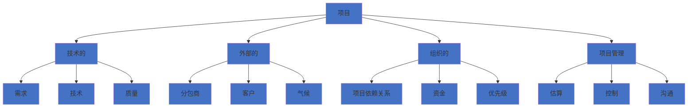
```mermaid
graph TD
    A[项目] --> B[技术的]
    A --> C[外部的]
    A --> D[组织的]
    A --> E[项目管理]
    
    B --> B1[需求]
    B --> B2[技术]
    B --> B3[质量]
    
    C --> C1[分包商]
    C --> C2[客户]
    C --> C3[气候]
    
    D --> D1[项目依赖关系]
    D --> D2[资金]
    D --> D3[优先级]
    
    E --> E1[估算]
    E --> E2[控制]
    E --> E3[沟通]
    
    style A fill:#4472C4
    style B fill:#4472C4
    style C fill:#4472C4
    style D fill:#4472C4
    style E fill:#4472C4
    style B1 fill:#4472C4
    style B2 fill:#4472C4
    style B3 fill:#4472C4
    style C1 fill:#4472C4
    style C2 fill:#4472C4
    style C3 fill:#4472C4
    style D1 fill:#4472C4
    style D2 fill:#4472C4
    style D3 fill:#4472C4
    style E1 fill:#4472C4
    style E2 fill:#4472C4
    style E3 fill:#4472C4
```

> RBS帮助项目团队系统化地识别和分类风险，确保风险识别的全面性和结构化。


## 本节知识点

| 序号 | 知识点 | 重点 |
| :--- | :--- | :--- |
| 1 | 风险管理计划 | 不包括某具体风险的应对 |
| 2 | RBS | 不同类别的风险分解 |


## 练习题
在项目执行阶段，项目经理发现团队成员对如何处理项目中的风险存在不同理解，导致风险应对措施执行混乱。经过调查，发现是风险管理计划存在缺陷。以下哪项最有可能是风险管理计划中缺失的关键内容？
- [ ] A. 风险登记册
- [ ] B. 风险概率和影响矩阵
- [x] C. 风险责任人的具体职责描述
- [ ] D. 项目进度计划中的风险预留时间

> 正确： C 风险管理计划中必要明确的具体责任人的职责描述
> A: 记录风险详细信息的文档, 并不在风险管理计划中
> B: 用于评估风险等级，但就算团队成员对于风险等级理解一致，没有明确的风险处理责任人，依然会混乱。
> D: 属于预留的时间储备， 和团队成员执行混乱并无直接的关系
>
---

# 课时 100 : 过程：识别风险

| 标题  | 课时  | 章节  |
| --- | --- | --- |
| 进度  | 100  | 95  |


## 识别风险

**输入**
1. 项目管理计划
   1. 需求/进度/成本/质量/资源/风险管理计划
   2. 范围/进度/成本基准
2. 项目文件
   1. 假设日志/成本估算/持续时间估算/问题日志/经验教训登记册/需求文件/资源需求/干系人登记册
3. 协议
4. 采购文档
5. 事业环境因素
6. 组织过程资产

**工具与技术**
1. 专家判断
2. 数据收集
   1. 头脑风暴
   2. 核对单
   3. 访谈
3. 数据分析
   1. 根本原因分析
   2. ==假设条件和制约因素分析==
   3. ==SWOT分析==
   4. 文件分析
4. 人际关系与团队技能
   1. 引导
5. 提示清单
6. ==会议==

**输出**
1. ==风险登记册==
2. 风险报告
3. 项目文件（更新）
   1. 假设日志
   2. 问题日志
   3. 经验教训登记册


## 本节知识点

| 序号 | 知识点 | 重点 |
| :--- | :--- | :--- |
| 1 | 工具 | 头脑风暴<br>核对单<br>根本原因/假设条件和制约因素/SWOT/文件分析<br>提示清单 |
| 2 | 输出 | 风险登记册<br>风险报告 |

# 练习题
项目经理正在领导一个软件开发项目，项目团队成员来自不同部门，技术背景各异。在项目执行过程中，客户突然提出一项新的功能需求，该需求与现有技术架构存在一定冲突。为了识别该变更可能带来的风险，项目经理组织了一次头脑风暴会议。在会议中，以下哪种做法最有助于全面识别风险？
- [ ] A. 项目经理先阐述自己对风险的看法，引导团队成员讨论
- [x] B. 要求每个成员在规定时间内独立思考并写下自己想到的风险，然后依次分享
- [ ] C. 让技术能力最强的成员主导发言，其他成员补充
- [ ] D. 按照部门顺序依次发言，每个部门只从自身角度提出风险

> 我选 C， 排除法
> 正确选：B  避免成员之间相互影响
> A: 项目经理先阐述，会影响大家的想法
> C: 还是会忽略其他成员的意见
> D: 各部门值关注自己的领域， 忽视跨部门的风险
---

# 课时 101 : 工具：假设条件和制约因素分析-SWOT分析-会议

| 标题  | 课时  | 章节  |
| --- | --- | --- |
| 进度  | 101  | 96  |

## 假设条件和制约因素分析
- 每个项目及其项目管理计划的构思和开发都基于一系列的假设条件，并受一系列制约因素的限制。这些假设条件和制约因素往往都已纳入范围基准和项目估算。

- 开展假设条件和制约因素分析，来探索假设条件和制约因素的有效性，确定其中哪些会引发项目风险。
  
- 从假设条件的不准确、不稳定、不一致或不完整，可以识别出威胁，通过清除或放松会影响项目或过程执行的制约因素，可以创造出机会。

- RAID是项目管理中用于识别和评估项目中的风险、假设、问题和依赖关系。RAID分别代表：风险（Risk）、假设（Assumptions）、问题（Issues）和依赖关系（Dependencies）。

> 如果考试中出现了项目经理指定项目计划的背景，那么，假设和条件和制约因素分析就是一个备选项。
> 


## SWOT分析

SWOT分析是一种战略规划工具，用于评估项目或组织的优势、劣势、机会和威胁。

### SWOT分析矩阵

以下可以想象成一个二维矩阵
| x/y | **内因 (x- )** | **外因(x+)** |
| :---: | :---: | :---: |
| **积极 (y+)** | <br>**Strength<br>（强势）**  | <br>**Weakness<br>（弱点）**<br>  |
| **消极 (y-)** | <br>**Opportunity<br>（机会）**<br>  | <br>**Threat<br>（威胁）**<br>  |

### 分析维度说明

- **内因**：组织内部可控制的因素
  - **强势（Strength）**：内部优势和核心竞争力
  - **弱点（Weakness）**：内部不足和需要改进的地方

- **外因**：外部环境因素，通常不可直接控制
  - **机会（Opportunity）**：外部有利环境和发展机遇
  - **威胁（Threat）**：外部风险和潜在威胁

> SWOT分析帮助项目团队全面评估内外部环境，制定相应的风险应对策略。


## 会议
- 为了开展风险识别工作，项目团队可能要召开专门的会议（通常称为风险研讨会）。在大多数风险研讨会中，都会开展某种形式的头脑风暴。根据风险管理计划中对开展风险管理过程的要求，还有可能采用其他风险识别技术。
<br>

- 配备一名经验丰富的引导者将会提高会议的有效性；确保适当的人员参加风险研讨会也至关重要。对于较大型项目，可能需要邀请==项目发起人、主题专家、卖方、客户代表，或其他项目干系人==参加会议；而对于较小型项目，可能仅限部分项目团队成员参加。

> 这类会议一般叫做：风险研讨会
>
> 对于大型会议，还会邀请到：项目发起人、主题专家、卖方、客户代表，或其他项目干系人

## 本节知识点

| 序号 | 知识点 | 重点 |
| :--- | :--- | :--- |
| 1 | 假设条件和制约因素分析 | 识别威胁<br>创造机会<br>RAID |
| 2 | SWOT分析 | 强势<br>弱点<br>威胁<br>机会 |
| 3 | 风险研讨会 | 重要干系人都要参与 |

## 练习题
在一个新的智能手机研发项目中，项目经理需要全面识别项目可能面临的风险。以下对识别风险工具的运用，做法正确的是哪一项？
- [ ] A. 项目团队通过查阅过往类似智能手机项目的文档，对成本超支，技术难题等问题进行梳理，这是在使用 SWOT 分析
- [ ] B. 团队讨论项目优势在于有经验丰富的研发人员，劣势是竞争对手可能抢先发布类似产品，机会是市场对高性能手机需求大，威胁是关键零部件供应不稳定，这属于假设条件和制约因素分析
- [ ] C. 针对项目进度可能延迟的问题，团队深入探究是因为任务分配不合理、资源不足还是技术难题等，这是在使用SWOT 分析
- [x] D. 为确定项目是否能按时完成，团队分析项目计划中设定的时间期限以及可利用资源等限制条件，这运用的是假设条件和制约因素分析

> 我选 D
> A: 这不是 SWOT 分析, 这是文件分析
> B: 这不是 假设分析，这是 SWOT
> C: 这是 根本原因 分析，这不是 SWOT
> D: 这是假设分析


---

# 课时 102 : 输出：风险登记册

| 标题  | 课时  | 章节  |
| --- | --- | --- |
| 进度  | 102  | 97  |


## 风险登记册示例

风险登记册是记录已识别风险的详细信息的文档，包含风险描述、影响、原因和潜在对策等关键信息。

| 风险ID | 描述 | 识别人 | 可能后果 | 潜在原因 | 潜在对策 |
| :--- | :--- | :--- | :--- | :--- | :--- |
| 1 | 人员不够 | | 项目延期 | 估计不足 | 增加人手 |
| 2 | 主管领导不在 | | 项目延期 | 外出开会 | 了解行程，领导授权 |
| 3 | 预算没通过 | | 影响项目质量 | 预算过高 | 压缩预算 |
| 4 | 护照办理不下来 | | 项目延期 | 资料不齐、政策了解不够 | 事先了解所需资料 |
| 5 | 行前会议室冲突 | | 无法召开行前会 | 会议室日程紧张 | 事先确定日期和会议室 |
| 6 | 没规定上机票 | | 项目延期 | 航班不合适 | 事先分析航班 |
| 7 | 酒店不符要求 | | 降低住宿质量 | 酒店虚假宣传 | 多渠道分析 |
| 8 | 工作交接不能按时进行 | | 出国延期 | 交接人不在（外出、病假） | 了解交接人 |
| 9 | 暴动 | | 延期或取消安全 | 泰国政局动荡 | 延期或取消 |
| 10 | 传染病 | | 项目延期 | 泰国出现新疫情 | 延期或取消 |

> 此表格展示了项目风险识别的实际应用，每个风险都有明确的ID、描述、潜在影响和应对措施，有助于项目团队系统化地管理项目风险。


> 问题： 在项目早期，刚和同事识别完风险，要不要根据潜在的风险，分析每个可能的风险潜在的原因和对策？
> 答案：要的
> 需要带着解决方案找老板
>
> 风险登记册是渐进明细，进行更新的。
> 每次识别到新的风险，就要先更新风险登记册
> 每做一个步骤，都要先更新文件，然后再执行后续的工作


## 本节知识点

| 序号 | 知识点 | 重点 |
| :--- | :--- | :--- |
| 1 | 风险登记册 | 文件先行<br>潜在原因和对策<br>持续更新 |

练习题
在一个跨国项目中，项目经理正在依据风险登记册来监控项目风险。在风险登记册中，下列哪一项信息对于识别风险应对措施是否按计划有效执行最为关键？
- [ ] A. 风险的触发条件
- [ ] B. 风险责任人及其职责
- [ ] C. 已识别风险的应对措施描述
- [ ] D. 风险的状态更新记录

> 我选 B。 主要：风险应对措施是否按计划有效执行。 这应该是风险责任人及其职责
> 正确选：D
> A: 提醒团队风险即将要发生，而不是判断是否按计划执行
> B: 不能直接提现应对措施的执行效果
> C: 只是描述，无法表明应对的措施是否有效
> D: 通过比对风险的状态变化，可以直观的辨认风险应对是否按计划执行

---

# 课时 103 : 过程：实施定性风险分析

| 标题  | 课时  | 章节  |
| --- | --- | --- |
| 进度  | 103  | 98  |


## 实施定性风险分析

**输入**
1. 项目管理计划
   1. 风险管理计划
2. 项目文件
   1. 假设日志
   2. 风险登记册
   3. 干系人登记册
3. 事业环境因素
4. 组织过程资产

**工具与技术**
1. 专家判断
2. 数据收集
   1. 访谈
3. 数据分析
   1. 风险数据质量评估
   2. 风险概率和影响评估
   3. 其他风险参数评估
4. 人际关系与团队技能
   1. 引导
5. 风险分类
6. 数据表现
   1. ==概率和影响矩阵==
   2. ==层级型==
7. 会议

**输出**
1. 项目文件（更新）
   1. 假设日志
   2. 问题日志
   3. 风险登记册
   4. 风险报告


> 解析
> 对风险进行量化分级
> 风险登记册中对每个风险进行分类和排序
> 

## 本节知识点

| 序号 | 知识点 | 重点 |
| :--- | :--- | :--- |
| 1 | 工具 | 概率和影响评估/矩阵<br>其他风险参数评估/层级型<br>风险数据质量评估<br>风险分类 |

## 练习题
该项目是为了解决客户对一家大型在线零售商的服务台满意度低的问题而设立的。你和你的团队正在考虑各种方案，包括升级计算机系统和软件程序，增加服务台工作人员，以及改善服务台培训。你意识到这些变化的影响将很难衡量，而且你发现评估团队所确定的风险和应对措施的确切成本影响是一个挑战。你应该在下列哪一项进行评估？
- [ ] A. 量化基础
- [ ] B. 数值基础
- [x] C. 定性的基础
- [ ] D. 计量经济学基础

> 我选：C
> 正确：C
> 题干明确标识： 你意识到这些变化的影响将很难衡量， 所以可以用定性

---

# 课时 104 : 工具：概率和影响矩阵&层级型

| 标题  | 课时  | 章节  |
| --- | --- | --- |
| 进度  | 103  | 99  |


## 概率和影响矩阵

概率和影响矩阵是定性风险分析的重要工具，用于评估风险的概率和对项目目标的影响程度。

### 概率和影响矩阵表格（带颜色标识）

| 概率 | **威胁** |  |  |  |  | **机会** |  |  |  |  |
| :---: | :---: | :---: | :---: | :---: | :---: | :---: | :---: | :---: | :---: | :---: |
| | **0.05** | **0.10** | **0.20** | **0.40** | **0.80** | **0.80** | **0.40** | **0.20** | **0.10** | **0.05** |
| **0.90** | 🟢<br>0.05 | 🟡<br>0.09 | 🔴<br>0.18 | 🔴<br>0.36 | 🔴<br>0.72 | 🔴<br>0.72 | 🔴<br>0.36 | 🔴<br>0.18 | 🟡<br>0.09 | 🟢<br>0.05 |
| **0.70** | 🟢<br>0.04 | 🟢<br>0.07 | 🟡<br>0.14 | 🔴<br>0.28 | 🔴<br>0.56 | 🔴<br>0.56 | 🔴<br>0.28 | 🟡<br>0.14 | 🟢<br>0.07 | 🟢<br>0.04 |
| **0.50** | 🟢<br>0.03 | 🟢<br>0.05 | 🟡<br>0.10 | 🔴<br>0.20 | 🔴<br>0.40 | 🔴<br>0.40 | 🔴<br>0.20 | 🟡<br>0.10 | 🟢<br>0.05 | 🟢<br>0.03 |
| **0.30** | 🟢<br>0.02 | 🟢<br>0.03 | 🟢<br>0.06 | 🟡<br>0.12 | 🔴<br>0.24 | 🔴<br>0.24 | 🟡<br>0.12 | 🟢<br>0.06 | 🟢<br>0.03 | 🟢<br>0.02 |
| **0.10** | 🟢<br>0.01 | 🟢<br>0.01 | 🟢<br>0.02 | 🟢<br>0.04 | 🟡<br>0.08 | 🟡<br>0.08 | 🟢<br>0.04 | 🟢<br>0.02 | 🟢<br>0.01 | 🟢<br>0.01 |

**对目标的影响（比率标度）（如费用、时间或范围）**

### 风险等级说明

- 🔴 **高风险**：数值 ≥ 0.18（红色区域）- 需要立即关注和应对
- 🟡 **中等风险**：数值在 0.08-0.14 之间（黄色区域）- 需要监控和准备应对
- 🟢 **低风险**：数值 ≤ 0.07（绿色区域）- 接受风险，简单监控

### 使用说明

1. **威胁评估**：左侧威胁部分，红色区域表示需要优先应对的威胁
2. **机会评估**：右侧机会部分，红色区域表示应积极利用的机会
3. **风险优先级**：颜色越深（红色），优先级越高

> 此矩阵通过颜色编码帮助项目团队快速识别高优先级的风险，并制定相应的应对策略。


> 为什么在概率影响矩阵上， 0.18 以上的会被标记为高风险？
> 很多企业内部的评估标准都是根据主观判断得来，
> 因此观概率分析矩阵叫做 ==定性== 分析，而不是 定量

## 层级型
气泡图能显示三维数据。在气泡图中，把每个风险都绘制成一个气泡，并用x轴值、y轴值和气泡大小来表示风险的三个参数。如图示例，其中，X轴代表可监测性，Y轴代表邻近性，影响值则以气泡大小表示。

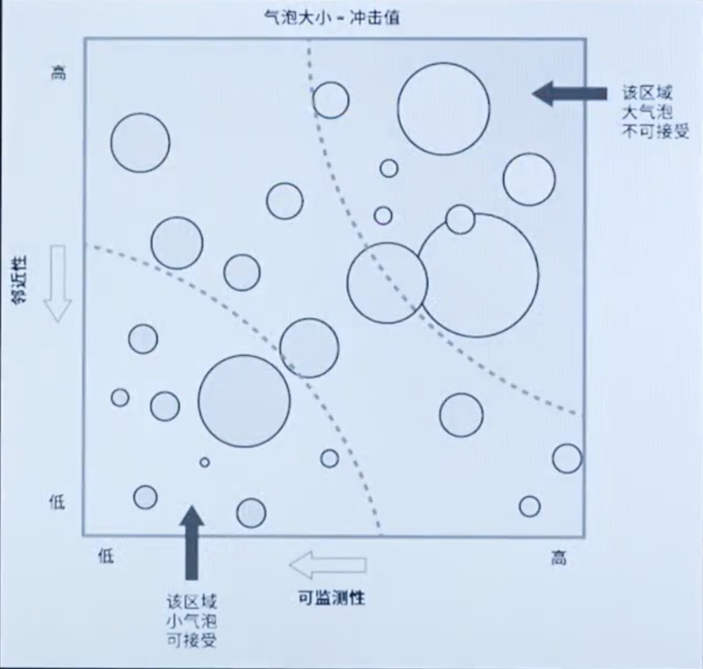


> 从三维数据来建立这个层级图

## 本节知识点

| 序号 | 知识点 | 重点 |
| :--- | :--- | :--- |
| 1 | 概率和影响矩阵 | 通过概率和影响对风险进行高中低分类 |
| 2 | 层级型 | 通过监测性、邻近性、气泡大小对风险分类 |


## 练习题
一位项目经理分析了风险数据的质量，并要求各干系人确定一些风险的概率和影响。他即将进入风险管理的下一个过程。根据这些信息，该项目经理忘了做什么？

A. 评估风险分析的趋势。
B. 识别触发器。
C. 提供一个标准化的风险评级矩阵。
D. 建立一个后备计划。

> 我选：C
> 正确：
> 羡慕经理正处于定性分析阶段
> A，B, D 都是风险识别的后续计划

---

# 课时 105 : 过程：实施定量风险分析
| 标题  | 课时  | 章节  |
| --- | --- | --- |
| 进度  | 105  | 100  |

## 实施定量风险分析

**输入**
1. 项目管理计划
   1. 风险管理计划
   2. 范围基准
   3. 进度基准
   4. 成本基准
2. 项目文件
   1. 假设日志
   2. 成本估算
   3. 成本预测
   4. 持续时间估算
   5. 里程碑清单
   6. 资源需求
   7. 风险登记册
   8. 风险报告
   9. 进度预测
3. 事业环境因素
4. 组织过程资产

**工具与技术**
1. 专家判断
2. 数据收集
   1. 访谈
3. 人际关系与团队技能
   1. 引导
4. ==不确定性表现方式==
5. 数据分析
   1. ==模拟==
   2. ==敏感性分析==
   3. ==决策树分析==
   4. ==影响图==

**输出**
1. 项目文件（更新）
   1. 风险报告

> 定量风险分析是对风险进行量化评估的过程
> 使用数值方法来评估风险对项目目标的影响
> 通过数据分析工具提供更精确的风险评估结果


> 定量风险分析为啥没有风险登记册的输出？
> 因为 定量风险分析是一个比较复杂的分析，会浪费大量的人力和物力，因此最好在重要的风险上去做。
> 


## 本节知识点

| 序号 | 知识点 | 重点 |
| :--- | :--- | :--- |
| 1 | 工具 | 访谈<br>引导<br>不确定性表现方式<br>模拟（蒙特卡洛）<br>敏感性分析（龙卷风图）<br>决策树分析<br>影响图 |
| 2 | 输出 | 更新风险报告 |


## 练习题
项目经理正在对一个新的电商平台开发项目进行定量风险分析，下列哪项是开展定量风险分析的前提条件？

A. 已经制定了项目管理计划
B. 完成了风险识别和定性风险分析
C. 确定了风险应对策略
D. 建立了风险监控机制


> 我选：B
> 正确：B
> 先做风险管理计划，风险识别和定性风险分析，再做量化。
> A: 只需要完成风险管理计划就好了，不需要其他的计划
> C: 属于后继的步骤
> D: 风险管理计划中要描述的内容， 属于非常靠前的工作内容。不是定量分析的前提条件

---

# 课时 106 : 过程：规划风险应对

| 标题  | 课时  | 章节  |
| --- | --- | --- |
| 进度  | 106  | 101  |

## 规划风险应对

**输入**
1. 项目管理计划
   1. 资源管理计划
   2. 风险管理计划
   3. 成本基准
2. 项目文件
   1. 经验教训登记册
   2. 项目进度计划
   3. 项目团队派工单
   4. 资源日历
   5. 风险登记册
   6. 风险报告
   7. 干系人登记册
3. 事业环境因素
4. 组织过程资产

**工具与技术**
1. 专家判断
2. 数据收集
   1. 访谈
3. 人际关系与团队技能
   1. 引导
4. ==威胁应对策略==
5. ==机会应对策略==
6. ==应急应对策略==
7. ==整体项目风险应对策略==
8. 数据分析
   1. 备选方案分析
   2. 成本收益分析
9. 决策
   1. 多标准决策分析

**输出**
1. 变更请求
2. 项目管理计划（更新）
   1. 进度管理计划
   2. 成本管理计划
   3. 质量管理计划
   4. 资源管理计划
   5. 采购管理计划
   6. 范围/进度/成本基准
3. 项目文件（更新）
   1. 假设日志
   2. 成本预测
   3. 经验教训登记册
   4. 项目进度计划
   5. 项目团队派工单
   6. 风险登记册
   7. 风险报告

> 规划风险应对是为项目目标增加机会、减少威胁而制定风险应对策略和行动的过程
> 重点关注四种应对策略：威胁应对、机会应对、应急应对和整体项目风险应对

## 本节知识点

| 序号 | 知识点 | 重点 |
| :--- | :--- | :--- |
| 1 | 应对策略 | 威胁应对策略<br>机会应对策略<br>应急应对策略<br>整体项目风险应对策略 |
| 2 | 数据分析 | 备选方案分析<br>成本收益分析 |
| 3 | 输出 | 变更请求<br>更新多个管理计划和基准 |

---

# 课时 106 : 工具：模拟&敏感性分析&决策树分析

| 标题  | 课时  | 章节  |
| --- | --- | --- |
| 进度  | 106  | 101  |

## 模拟
这种分析技术通过模型来表明各种不确定性因素的综合影响，从而评估这些因素对目标的潜在影响。==蒙特卡洛模拟是一种使用计算机模型的多次迭代来识别风险和不确定性的潜在影响的方法==，以发现可能因某一决定或做法导致的一系列成果的概率分布情况。

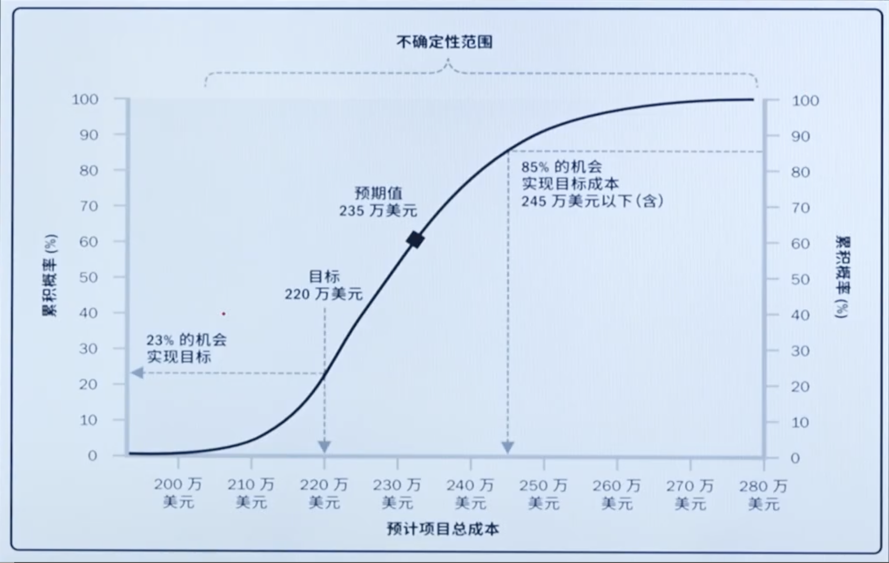

> 利用计算机大量的模拟，来模拟所有的风险和成本

## 敏感性分析
敏感性分析。这种分析技术旨在将项目成果的变化与定量风险分析模型中要素的变化建立关联，来确定哪些单个项目风险或其他不确定性来源对项目成果的潜在==影响最大。==
- ==考察每个因素的变化会对目标产生多大影响==
- ==龙卷风图==
  
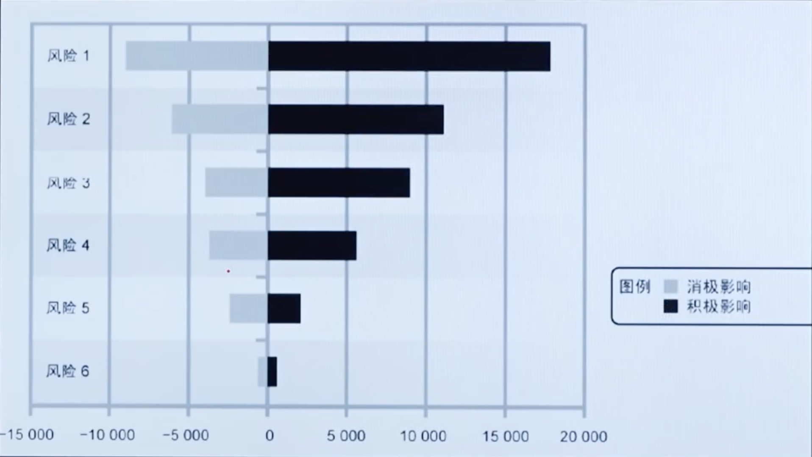

# 决策树分析
- 决策树分析。决策树分析是一种图形和计算方法，==用来评估与一个决策相关的多个选项在不确定情形下的可能后果。== 决策树可以使用从预期货币价值分析中生成的信息来填充
决策树的各个分支
- 计算公式：`EMV (Expected Monetary Value) = P*V`
   **P**: Percentage (百分比)
   **V**: Value （价值）
- 机会的 **EMV** 通常表示为正值，威胁的 **EMV** 则表示为负值


> 所有参与决策的人的态度都需要保证风险中立
> 


## 本节知识点
| 序号 | 知识点 | 重点 |
| :--- | :--- | :--- |
|1|蒙特卡洛模拟|用计算机模型的多次迭代量化评估风险的影响|
|2|敏感性分析|通过考察每个因素变化定量排序|
|3|决策树分析|通过计算EMV=P*V进行决策|

## 练习题
蒙特卡洛分析被用来做什么？
A. 获得项目中所涉及的风险的指示。
B. 估算一个活动的长度。
C. 模拟项目中可能出现的质量问题。
D. 向管理层证明需要额外的工作人员。

> 我选：C
> 正解：A
> 通过多次模拟新项目中单个项目风险对项目目标的影响，从而获得项目中针对风险的应对指示
> B: 可以模拟活动的进度，但不是单单只估算长度的
> C: 蒙特卡洛是模拟对系项目目标的影响，而不是对质量的影响，错
> D: 没有资源方面的证明

---

# 课时 107 : 过程：规划风险应对

## 规划风险应对

**输入**
1. 项目管理计划
   1. 资源管理计划
   2. 风险管理计划
   3. 成本基准
2. 项目文件
   1. 经验教训登记册
   2. 项目进度计划
   3. 项目团队派工单
   4. 资源日历
   5. 风险登记册
   6. 风险报告
   7. 干系人登记册
3. 事业环境因素
4. 组织过程资产

**工具与技术**
1. 专家判断
2. 数据收集
   1. 访谈
3. 人际关系与团队技能
   1. 引导
4. ==威胁应对策略==
5. ==机会应对策略==
6. ==应急应对策略==
7. ==整体项目风险应对策略==
8. 数据分析
   1. 备选方案分析
   2. 成本收益分析
9. 决策
   1. 多标准决策分析

**输出**
1. 变更请求
2. 项目管理计划（更新）
   1. 进度管理计划
   2. 成本管理计划
   3. 质量管理计划
   4. 资源管理计划
   5. 采购管理计划
   6. 范围/进度/成本基准
3. 项目文件（更新）
   1. 假设日志
   2. 成本预测
   3. 经验教训登记册
   4. 项目进度计划
   5. 项目团队派工单
   6. 风险登记册
   7. 风险报告

## 本节知识点

| 序号 | 知识点 | 重点 |
| :--- | :--- | :--- |
| 1 | 工具 | 访谈<br>引导<br>威胁/机会/应急/整体项目应对策略<br>备选方案/成本收益/多标准决策分析 |
| 2 | 输出 | 变更请求 |


## 练习题
以下关于规划风险应对过程的输入输出描述，正确的是哪一个？
A. 项目进度计划不是规划风险应对过程的输入，因为它主要与项目进度管理相关，和风险应对关系不大
B. 风险登记册是规划风险应对过程的重要输入，其中包含已识别的风险、风险分析结果等信息，为制定应对策略提供依据
C. 规划风险应对过程的输出只有风险应对计划，它详细描述了针对每个风险的应对措施
D. 项目文件更新不属于规划风险应对过程的输出，因为项目文件通常在项目结束阶段才会更新

> 我选：B
> 正解：B
> A: 项目进度计划是重要输入， 有的风险可能导致进度延期
> B: B 正确
> C: 并不是只有， 还有变更请求
> D: 项目文件可在规划阶段就进行更新

# 课时 108 : 工具：威胁&机会应对策略

| 标题  | 课时  | 章节  |
| --- | --- | --- |
| 进度  | 107  | 103  |


## 威胁应对策略

| 名称 | 特点 | 情景 |
| :--- | :--- | :--- |
| 规避 Avoid | 改变计划或范围，==完全消除威胁== | 去掉WBS中有风险的工作包或取消项目 |
| 减轻 Mitigate | ==降低概率或后果== | 雇佣有经验的雇员 |
| 转移 Transference | ==转给第三方==<br>向风险承担者==支付风险费用==，对处理风险的==财务后果最有效== | 购买保险、第三方保或外包对处理 |
| 接受 Acceptance | ==准备应急时间、应急储备金、资源== | 有风险不能回避 |
| 上报 Escalate | 威胁==不在项目范围内==，或提议的应对措施==超出了项目经理的权限== | 出现不可抗力 |

> 考试中一般不会选择上报的选项


## 机会应对策略

| 名称 | 特点 | 情景 |
| :--- | :--- | :--- |
| 开拓 Exploit | 消除不确定性，==确保机会肯定出现==。<br>可能包括：缩短完工时间，或采用全新技术或技术升级来节约项目成本 | 分配最有能力的资源给项目 |
| 分享 Share | 将风险责任==分配给最能为项目利益抓住机会的第三方== | 建立风险共担的合作方式和团队 |
| 提高 Enhance | ==提高==积极风险的概率或其==积极影响== | 为尽早完成增加资源 |
| 接受 Accept | ==预留时间、资金或资源==，以便在机会出现时==加以利用== |   |
| 上报 Escalate | 机会==不在项目范围内==，或提议的应对措施==超出了项目经理的权限== | 出现不可抗力 |


## 本节知识点

| 序号 | 知识点 | 重点 |
| :--- | :--- | :--- |
| 1 | 威胁应对策略 | 规避<br>减轻<br>转移<br>接受<br>上报 |
| 2 | 机会应对策略 | 开拓<br>分享<br>提高<br>接受<br>上报 |


## 练习题
在哪个风险管理过程中，决定转移风险？
A. 识别风险
B. 实施风险应对措施
C. 规划风险应对措施
D. 监测风险

> 我选：B
> 正解：C
> 转移风险属于威胁应对策略， 属于规划风险应对的策略
>
---

# 课时 109 : 工具：整体项目风险应对策略&应急应对策略

| 标题  | 课时  | 章节  |
| --- | --- | --- |
| 进度  | 109  | 104  |

## 整体项目风险应对策略
风险应对措施的规划和实施不应只针对单个项目风险，还应针对整体项目风险。

**风险应对策略环形图**

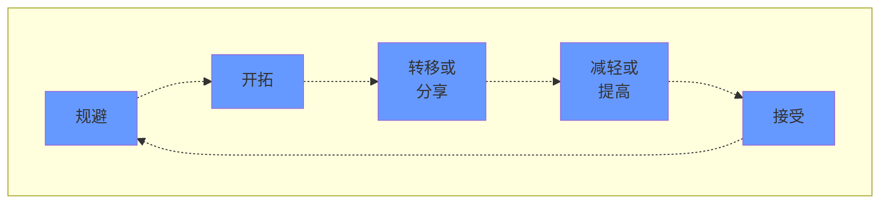
```mermaid
graph TB
    subgraph " "
        A[规避]
        B[开拓]
        C[转移或<br>分享]
        D[减轻或<br>提高]
        E[接受]
    end
    
    A -.-> B
    B -.-> C
    C -.-> D
    D -.-> E
    E -.-> A
    
    style A fill:#6699ff
    style B fill:#6699ff
    style C fill:#6699ff
    style D fill:#6699ff
    style E fill:#6699ff
```

## 应急应对策略
- 可以设计一些仅在特定事件发生时才采用的应对措施。
- 确信风险的发生会有==充分的预警信号（触发器）==，就应该制定应急应对策略。
- 又称为 “==应急计划==” 或 “==弹回计划==”（在风险发生并且主要应对措施无效时使用）。

> 已知已知风险  
> - 第一个已知是可识别的风险事件
> - 第二个已知是可分析风险发生的概率和对项目的影响，
> - 也就是说可以将风险分出 高，中，低
> 
> 已知未知风险
> - 可识别的风险事件
> - 无法准确的分析出风险的概率和对目标的影响
>
> 针对 已知已知风险 -> 应对计划 （在风险出现前使用）
> 
> 针对 已知未知风险 -> 应急计划 （在风险**刚**转变成问题的时候使用）
> - 在风险转变为问题的时候，需要一个触发器，来触发应急计划
> 
> 风险发生并且主要应对措施无效时， 有一个 **弹回计划** ， 用于执行补救措施


| 序号 | 知识点 | 重点 |
| :--- | :--- | :--- |
| 1 | 整体项目风险应对策略 | 规避<br>开拓<br>减轻<br>提高<br>转移<br>分享<br>接受 |
| 2 | 应急应对策略 | 预警信号（触发器）<br>应急计划<br>弹回计划 |


## 习题解析

你已经确定了你的项目中的几个风险，购买保险是可能的。你的公司使用的保险公司已经报出了合理的费率，你的分析表明，在这些情况下，购买保险作为一个应急计划是有意义的。你的组织对风险的门槛很低，但希望保持成本，因为这个项目的产品的利润率很低。购买保险的策略最好被认为是风险的一个例子？

   - [ ] A. 升级
   - [x] B. 转移
   - [ ] C. 接受
   - [ ] D. 逃避

> 解析：
> 应该选 B
> 购买保险是典型的风险转移策略。通过向保险公司支付保费，将风险的财务后果转移给第三方（保险公司），这正是转移策略的核心特点。题目中明确提到"购买保险作为一个应急计划"，这符合转移策略的定义。

# 课时 110 : 风险控制流程

| 标题  | 课时  | 章节  |
| --- | --- | --- |
| 进度  | 110  | 105  |


## 风险控制流程

```mermaid
flowchart TD
    A[风险] --> B[已知风险]
    A --> C[未知-未知]
    A --> D[次生风险]
    A --> E[残余风险] 
    A --> F[弹回计划]
    
    B --> G[已知-已知]
    B --> H[已知-未知]
    
    G --> I[分析风险]
    H --> J[分析风险制定策略]
    
    I --> K[执行应对策略/应对计划和项目成本]
    J --> L[已发生]
    C --> M[已发生]
    
    L --> N[分析问题查阅登记册]
    N --> Q[应急应对策略/<br>应急应对计划<br>和应急储备]
    M --> O[分析问题]
    
    O --> P[权变措施<br>管理储备]
    O --> B

    Q --> R[变更]
    P --> R
    
    style A fill:#f9f9f9
    style B fill:#fff2cc
    style C fill:#fff2cc
    style D fill:#fff2cc
    style E fill:#fff2cc
    style F fill:#fff2cc
    style G fill:#fff2cc
    style H fill:#fff2cc
    style I fill:#fff2cc
    style J fill:#fff2cc
  
    style L fill:#fff2cc
    style M fill:#fff2cc
    style N fill:#fff2cc
    style O fill:#fff2cc
    
```

> 此生风险：由于某种风险应对策略的使用而导致的新风险
> 残余风险：采取所有可能的应对策略之后，仍然残留下来的风险

| 序号 | 知识点 | 重点 |
| :--- | :--- | :--- |
| 1 | 已知已知风险 | 问题发生前执行应对计划<br>花费项目成本<br>无变更 |
| 2 | 已知未知风险 | 问题发生后执行应急计划<br>花费应急储备<br>应急计划可能产生变更 |
| 3 | 未知风险 | 问题发生后执行权变措施<br>经过批准花费管理储备<br>产生变更 |


## 习题解析

你当时正在进行一个为期两年的项目，在全国各地的外地办事处部署新技术。就在升级即将完成时，一场飓风造成了停电。当电力恢复后，所有的项目报告和历史数据都丢失了，没有办法检索到它们。为了防止这个问题，应该怎么做？

   - [ ] A. 购买保险
   - [ ] B. 计划设立一个储备基金
   - [x] C. 监测天气并有一个应急计划
   - [ ] D. 将安装工作安排在飓风季节之外

> 解析：
> 应该选 C 
> 此风险为已知未知风险，应该规划应急计划
> 题目的核心问题是数据丢失，需要预防性措施。监测天气并制定应急计划是减轻策略的体现，应急计划应包括数据备份、异地存储等措施，能够有效防止因自然灾害导致的数据丢失。
> A: 购买保险无法恢复丢失的数据，不能防止问题发生，仅是转移了风险
> B: 设立储备基金也无法防止数据丢失，仅是接受了风险，但无法影响停电的概率
> D: 而避开飓风季节并不现实且无法完全规避风险。可能对项目精度产生巨大的负面影响。不是最优的选择

# 课时 111 : 规划过程组：闯关题5

如果一个项目有60%的机会获得10万美元的利润，40%的机会出现10万美元的损失，那么这个项目的预期货币价值（EMV）是。

- [ ] A.	100,000美元的利润

- [ ] B.	损失60,000美元

- [x] C.	20,000美元的利润

- [ ] D.	损失40,000美元

> 解析：
预期货币价值的计算方法是EMV=概率x影响。我们需要计算正值和负值，然后将它们相加。0.6 x $100,000 = $60,0000.4 x -$100,000= -$40,000预期货币价值=60,000美元-40,000美元=20,000美元利润


你的团队已经想出了434个风险和这些风险的16个主要原因。该项目是该团队共同完成的一系列项目中的最后一个。发起人非常支持，并且投入了大量的时间来确保项目工作的完成和所有关键干系人的签字。在项目规划期间，团队无法想出有效的方法来减轻或转移风险。这不是可以外包的工作，也不能删除。什么会是最好的解决方案？

- [x] A.	接受这个风险。

- [ ] B.	继续调查减轻风险的方法。

- [ ] C.	寻找避免风险的方法。

- [ ] D.	寻找转移风险的方法。

> 解析：
“接受这个风险” 是一种可行的选择。题目中提到团队无法想出有效的方法来减轻或转移风险，且工作不能外包也不能删除，这意味着没有其他更好的规避风险的途径。在这种情况下，接受风险是合理的。
B 选项：与题目所给条件矛盾。题目中明确说明团队已经尝试过且无法想出有效的方法，所以 B 选项错误。
C 选项：与题目所给条件矛盾。因为题目中已经表明风险无法避免，所以 C 选项错误。
D 选项：“寻找转移风险的方法” 同样不符合题目条件，题目中已经说明团队无法想出有效的转移风险的方法，且工作不能外包，这就限制了转移风险的途径，所以继续寻找转移风险的方法在当前情况下是不可行的，所以 D 选项错误。


项目经理刚刚被雇用来管理一个提高会计部门数据处理效率的项目，他最关心的是管理项目的风险。项目周期很短，发起人的期望很高。以下哪项最能帮助项目经理对项目的风险进行初步评估？

- [ ] A.	敏感性分析

- [ ] B.	在项目规划过程中的项目范围说明书

- [ ] C.	对企业环境因素的审查

- [x] D.	与一个从事类似项目的项目经理的谈话

> 解析：
> 与从事类似项目的项目经理谈话，属于定性风险分析的工具“访谈”。能够直接获取类似项目曾经遇到过的风险情况，包括风险的类型、发生的概率以及影响程度等。由于是类似项目，具有较高的参考价值，可以帮助新项目经理快速、有效地对当前项目的风险进行初步评估，借鉴他人的经验教训，提前做好应对准备。
> 
> A 选项：敏感性分析通常用于分析项目中不同因素对项目结果的影响程度，一般是在项目有了一定的数据和模型基础上进行的，对于刚启动、周期短的项目，缺乏足够数据来进行敏感性分析，难以起到对风险初步评估的作用。
>
> B 选项：项目范围说明书主要是明确项目的范围边界、可交付成果等内容，虽然对项目风险评估有一定的参考价值，但它侧重于界定项目的工作内容，而不是直接针对风险的初步评估，无法全面地帮助项目经理识别和评估风险。
> 
> C 选项：审查企业环境因素可以了解项目所处的外部环境，但这些因素较为宽泛，不能直接聚焦于项目本身的具体风险，对于快速、初步地评估项目风险的针对性不强


一个项目的成本超支，进度延后。该项目有625个工作包，将在6年内完成。团队成员没有经验，而且该项目在计划方面得到的支持很少。以下哪项是最好的做法？

- [x] A.	更新风险识别和分析。

- [ ] B.	花更多的时间改进成本估算。

- [ ] C.	删除尽可能多的工作包。

- [ ] D.	重新组织责任分配矩阵。

> 解析：
项目成本超支、进度延后，且团队成员经验不足、计划支持少，这些情况都表明项目存在较多不确定因素和风险。更新风险识别和分析，有助于全面梳理项目中可能存在的风险，找出导致成本超支和进度延后的潜在因素，以便制定相应的应对措施，是较为全面和根本的解决方法。
B 选项：花更多时间改进成本估算虽然可以使成本估算更准确，但这只是解决了项目中的一个方面，无法直接解决进度延后以及团队经验不足等问题，不能从整体上改善项目的状况。
C 选项：删除尽可能多的工作包可能会影响项目的最终目标和交付成果，而且不一定能有效解决成本超支和进度延后的问题，还可能引发其他风险，不是一个好的解决办法。
D 选项：重新组织责任分配矩阵可能会在一定程度上明确团队成员的职责，但对于解决当前项目面临的成本超支、进度延后以及团队经验不足等核心问题，作用相对有限。


在项目执行过程中，一个团队成员正在与一个供应商协调，并发现了一个不在风险登记册中的风险。你从供应商那里订购的重型设备似乎比预期的要大，而且它们可能无法全部放入团队租赁的仓库中，直到需要时再存放。你应该怎么做？

- [ ] A.	进一步了解该团队成员是如何识别风险的，因为你已经进行了详细的分析，但没有发现这种风险。

- [ ] B.	不考虑这个风险，因为风险是在项目计划期间确定的。

- [ ] C.	告知客户这个风险。

- [x] D.	分析该风险。

> 解析：
当发现不在风险登记册中的风险时，首先应该记录并分析该风险。分析内容包括风险发生的可能性、对项目目标（如进度、成本、质量等）的潜在影响等。通过分析，可以更好地了解风险的性质，为后续制定应对策略提供依据，是合理的首要步骤。
A 选项：虽然了解团队成员如何识别风险有一定意义，但当前更重要的是对新发现的风险本身进行处理，而不是过度纠结发现的方式。在已经发现风险的情况下，重点应放在评估风险的影响和可能性，以便采取相应措施，所以该选项不是首要做法。
B 选项：不考虑这个风险是不正确的做法。项目执行过程中情况是动态变化的，即使在项目计划期间没有识别到该风险，当新风险出现时，也应该积极应对，否则可能会对项目造成不良影响，比如设备无法存放可能影响项目进度。
C 选项：在告知客户之前，项目经理首先应该对风险进行分析，评估其影响和可能的应对措施。直接告知客户而没有经过分析，可能会引起客户不必要的担忧，且无法提供有效的解决方案，所以不应直接告知客户。


在项目执行过程中，对项目所需的编程工作最有经验的团队成员通知你，他已经接受了另一家公司的新职位，并且已经给出了两周的通知。这是一个重大的问题，没有包括在风险登记册中。你应该先做什么？

- [ ] A.	赶紧联系HR找替代人员。

- [ ] B.	重新评估 "识别风险 "过程。

- [x] C.	寻找问题的任何意外影响。

- [ ] D.	告诉管理层。

> 解析：
当遇到这种未在风险登记册中的重大问题时，首先要寻找问题的任何意外影响。比如，该成员的离职可能导致关键编程工作停滞，影响项目进度；其带走的技术经验和知识可能需要花费时间和成本来弥补；可能还会对团队士气产生影响等。只有全面了解这些影响，才能为后续采取正确的应对措施提供依据，因此是首先应该做的。
A 选项：赶紧联系 HR 找替代人员是后续需要考虑的措施，但不是首要任务。在采取具体行动之前，需要先明确该成员离职会对项目产生哪些具体影响，例如对项目进度、成本、质量等方面的影响，以便更有针对性地与 HR 沟通替代人员的要求和时间节点等，所以该选项不是首先要做的。
B 选项：重新评估 “识别风险” 过程对于未来项目风险管理有一定意义，但不能解决当前面临的紧急问题。当务之急是应对核心成员即将离职这一现实情况，了解其对项目造成的直接和潜在影响，而不是立刻关注风险识别流程的改进，所以该选项不合适。
D 选项：告诉管理层是必要的，但应该在对问题进行初步分析，了解其影响之后。如果没有掌握相关信息就向管理层汇报，可能无法准确传达问题的严重性和影响范围，不利于管理层做出有效的决策，所以该选项应在 C 选项之后进行。


一个项目团队正在创建一个项目管理计划，当管理层要求他们识别项目风险并尽快提供某种形式的定性输出。该项目组应该提供什么？

- [ ] A.	风险触发器

- [x] B.	按优先顺序排列的风险清单

- [ ] C.	应急储备

- [ ] D.	实现时间和成本目标的概率

> 解析：
按优先顺序排列的风险清单是定性风险分析的主要输出之一。通过对识别出的风险进行定性评估，包括评估风险发生的可能性和影响程度等，然后按照一定的方法对风险进行排序，能够让项目团队和管理层快速了解哪些风险是需要优先关注和处理的，符合管理层要求尽快提供某种形式定性输出的期望。
A 选项：风险触发器是指风险发生的条件或信号，通常在风险应对规划中确定，而不是在定性风险分析后直接提供的主要输出。它是在识别出风险并对其进行评估后，进一步考虑如何监控和应对风险时才重点关注的内容，所以不符合管理层要求尽快提供定性输出的需求。
C 选项：应急储备是在确定风险应对策略后，为了应对可能出现的未知风险或已知风险的不确定性而预留的时间或资金等资源。它不是定性风险分析的直接输出，而是在风险应对计划制定过程中考虑的内容，需要在对风险进行详细分析和评估后才能确定，所以在此场景下不合适。
D 选项：实现时间和成本目标的概率通常是通过定量风险分析得出的结果，需要运用数学模型和统计方法对风险进行量化分析，而不是定性分析的输出。管理层要求尽快提供定性输出，所以该选项不符合要求。


一个项目经理正在创建一个风险应对计划。然而，每当建议一个风险应对措施时，就会发现另一个风险是由该应对措施引起的。以下哪项是该项目经理要做的最好的事情？

- [ ] A.	让更多的人参与到识别风险的过程中，因为风险已经被遗漏。

- [ ] B.	确保项目工作得到更好的理解。

- [ ] C.	花更多的时间确保风险应对措施被明确定义。

- [x] D.	记录新的风险并继续规划风险应对措施的过程。

> 解析：
当发现风险是由应对措施引起时，首先应该记录新的次生风险，这样可以对项目的风险情况有准确的记录和跟踪。然后继续规划风险应对措施的过程，针对这个新风险分析其影响、可能性等，制定合适的应对方案，以减少该风险对项目的负面影响。这是处理这种情况的合理且首要的步骤，所以该选项是最好的做法。
A 选项：让更多人参与到识别风险的过程中，虽然从长远来看有助于更全面地识别风险，但对于当前已经由应对措施引发的新风险，这并不能直接解决当下的问题。此时首要任务是处理已经出现的新风险，而不是扩大风险识别的人员范围，所以该选项不是最好的做法。
B 选项：确保项目工作得到更好的理解，这与处理因应对措施引发的新风险之间没有直接的关联。更好地理解项目工作可能对整体项目管理有帮助，但不能直接针对这个新出现的风险进行有效处理，所以该选项不合适。
C 选项：花更多时间确保风险应对措施被明确定义，这对于未来预防类似情况有一定作用，但对于已经产生的新风险，重点是先记录并分析它，然后制定相应的应对策略，而不是再次强调明确定义应对措施，所以该选项不是当前最紧迫的行动。


在识别风险的过程中，项目经理和干系人使用各种方法来识别风险，并创建了一个长长的风险列表。然后，项目经理确保所有的风险都被理解，并确定了触发因素。后来，在规划风险应对过程中，他把干系人确定的所有风险，确定了减轻风险的方法。他做错了什么？

- [ ] A.	项目经理应该等到执行定性风险分析过程时再让干系人参与进来。

- [x] B.	更多的人应该参与到规划风险应对的过程中。

- [ ] C.	项目经理应该创造权变措施。

- [ ] D.	触发器应该在实施风险应对措施过程中才会被识别。

> 解析：
规划风险应对过程应该让更多的人参与进来，不仅仅是项目经理和之前参与识别风险的干系人。因为不同的人可能具有不同的专业知识和经验，能够从多个角度评估风险应对措施的有效性和可行性，提供更多样化的建议和方案。只由项目经理确定减轻风险的方法可能会导致应对措施不够全面或有效，该选项正确。
A 选项：让干系人参与风险识别过程是良好的实践，有助于全面地识别风险，并且在定性风险分析过程中也通常需要干系人参与，所以项目经理在识别风险过程中让干系人参与是正确的，该选项说法错误。
C 选项：权变措施是针对未知风险事件而制定的应对计划，通常在风险发生时根据实际情况临时制定，而不是在规划风险应对过程中就必须创造，所以该选项不是项目经理做错的地方。
D 选项：触发器应该在识别风险过程中或之后尽早被识别，以便能够及时监测风险的发生，而不是在实施风险应对措施过程中才识别，所以该选项说法错误。

由于团队会议的模板似乎并不存在，你正在创建一个模板，你认为它也可以用于未来的项目。你想使议程模板通用化，以包括所有项目经理会使用的主题。在所有的团队会议中，以下哪项必须被包含在议程中？

- [x] A.	对项目风险的讨论

- [ ] B.	当前活动的状况

- [ ] C.	确定新的活动

- [ ] D.	对项目进度的审查

> 解析：
虽然B.当前活动状况、C.确定新活动和D.对项目进度的审查也是项目团队会议中可能涉及的重要内容，但它们并非在所有团队会议中都必须包含。例如，在一些简短的日常碰头会议中，可能重点关注当前活动状况，而不一定每次都详细审查项目问题或确定新活动。而项目风险的讨论对于项目的顺利推进至关重要，应在所有团队会议中都予以包含，以确保项目能够及时应对各种不确定性。

---

# 课时 112 : 过程：规划采购管理
| 标题  | 课时  | 章节  |
| --- | --- | --- |
| 进度  | 112  | 106  |


## 规划采购管理

**输入**
1. 项目章程
2. 商业文件
   1. 商业论证
   2. 收益管理计划
3. 项目管理计划
   1. 范围管理计划
   2. 质量管理计划
   3. 资源管理计划
   4. 范围基准
4. 项目文件
   1. 里程碑清单
   2. 项目团队派工单
   3. 需求文件
   4. 需求跟踪矩阵
   5. 资源需求
   6. 风险登记册
   7. 干系人登记册
5. 事业环境因素
6. ==组织过程资产==

**工具与技术**
1. 专家判断
2. 数据收集
   1. 市场调研
3. 数据分析
   1. ==自制或外购分析==
4. ==供方选择分析==
5. 会议

**输出**
1. 采购管理计划
2. ==采购策略==
3. 招标文件
4. 采购工作说明书
5. ==供方选择标准==
6. 自制或外购决策
7. 独立成本估算
8. 变更请求
9. 项目文件更新
   1. 经验数据
   2. 里程碑清单
   3. 需求文件
   4. 需求跟踪矩阵
   5. 风险登记册
   6. 干系人登记册
10. 组织过程资产更新


## 本节知识点

| 序号 | 知识点 | 重点 |
| :--- | :--- | :--- |
| 1 | 工具 | 市场调研<br>自制或外购分析<br>供方选择分析 |
| 2 | 输出 | 采购管理计划<br>采购策略<br>招标文件<br>采购工作说明书<br>供方选择标准<br>独立成本估算 |


## 习题解析

一个项目经理正在创建一个招标书（RFP）。他处于采购过程的哪个部分？

   - [ ] A. 实施采购
   - [x] B. 规划采购管理  
   - [ ] C. 控制采购
   - [ ] D. 决策或购买分析

> 解析：
> 应该选 B
> 招标书（RFP - Request for Proposal）是规划采购管理过程的输出之一。在规划采购管理阶段，项目经理需要制定采购管理计划、采购策略，并准备招标文件（包括RFP）等。因此，创建招标书属于规划采购管理过程。

---

# 课时 113 : 输入：组织过程资产之成本补偿类合同
| 标题  | 课时  | 章节  |
| --- | --- | --- |
| 进度  | 113  | 107  |


## 组织过程资产--合同类型

```mermaid
graph TB
    A[总价合同] --- B[成本补偿类合同]
    C[工料合同] --- D[不确定交付和数量合同]
    A --- C
    B --- D
    
    style A fill:#b3d9ff
    style B fill:#b3d9ff
    style C fill:#b3d9ff
    style D fill:#b3d9ff
```

> 成本补偿类合同：报销花销
> 工料合同：实报实销


## 成本加固定费用合同

==酬金不变==

| 项目 | 合同 | 实际(Actual) | 备注 |
| :--- | :--- | :--- | :--- |
| 估计(目标)成本 | 100 000 | 150 000 | 目标酬金是依据股价成本的百分比为基础的固定费 |
| 目标酬金(10%) | 10 000 | 10 000 | 目标酬金是依据股价成本的百分比为基础的固定费 |
| 目标总价 | 110 000 | 160 000 | 目标酬金是依据股价成本的百分比为基础的固定费 |


## 成本加激励费用合同

==奖励成本节约，反对成本浪费==

| 无最高限价 | 合同 | 实际(Actual) |  | 备注 |
| :--- | :--- | :--- | :--- | :--- |
|  |  | 第一种情况 | 第二种情况 |  |
| 估计(目标)成本 | 100 000 | 80 000 | 120 000 | 奖励以估计值为基础，在第二种情况下，实际成本高于估计值 20 000。（风险）|
| 目标酬金 | 10 000 | 10 000 | 10 000 |  |
| 分担比率 | 80:20 | 4 000 | -4 000 | 分担额是（-20000）的20% |
| 付款 | 110 000 | 94 000 | 126 000 |  |
| 获利 | 10 000 | 14 000 | 6 000 |  |


## 成本加奖励费用合同

==买方考核绩效==

- 为卖方报销履行合同工作所发生的一切合法成本，但只有在满足合同中规定的某些宽泛的主观的绩效标准的情况下，才能向卖方支付大部分费用。

- 买方根据自己的主观判断来决定给卖方奖励费用，卖方通常无议申诉。


## 本节知识点

| 序号 | 知识点 | 重点 |
| :--- | :--- | :--- |
| 1 | 成本加固定费用 | 成本实报实销<br>酬金不变 |
| 2 | 成本加激励费用 | 奖励成本节约<br>反对成本浪费 |
| 3 | 成本加奖励费用 | 买方考核绩效 |


## 习题解析

你的项目经理建议你需要保护组织免受财务风险。在计划一个新的项目时，你意识到与履行合同所需的工作有关的范围定义有限。什么是最好的合同类型？

   - [ ] A. 固定价格
   - [ ] B. 成本加成本百分比
   - [ ] C. 时间和材料
   - [x] D. 成本加固定费用

> 解析：
> 应该选 D
> 在范围定义有限的情况下，成本加固定费用合同是最佳选择。这种合同类型能够保护买方（组织）免受财务风险，因为：
> 1. 成本部分实报实销，避免了固定价格合同在范围不明确时的变更风险
> 2. 费用部分固定，避免了成本加成本百分比合同中成本越高费用越高的问题
> 3. 相比时间和材料合同，提供了更好的成本可预测性


