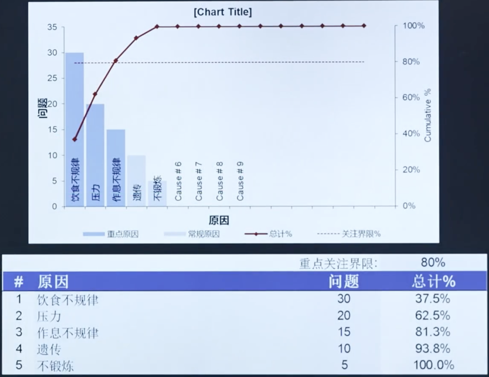
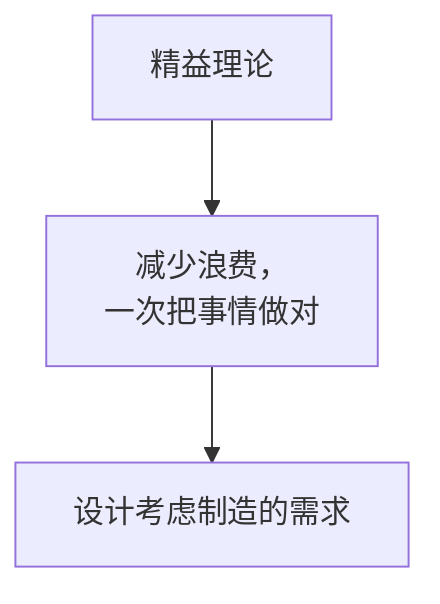
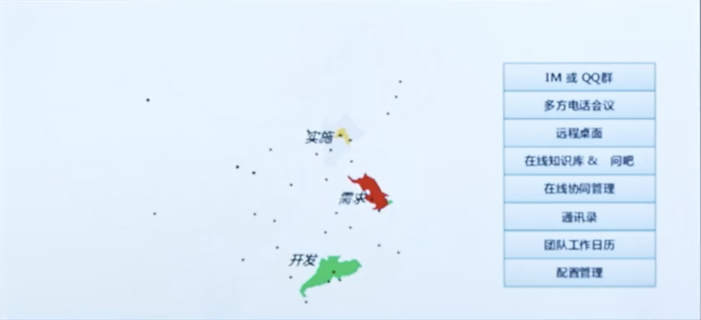
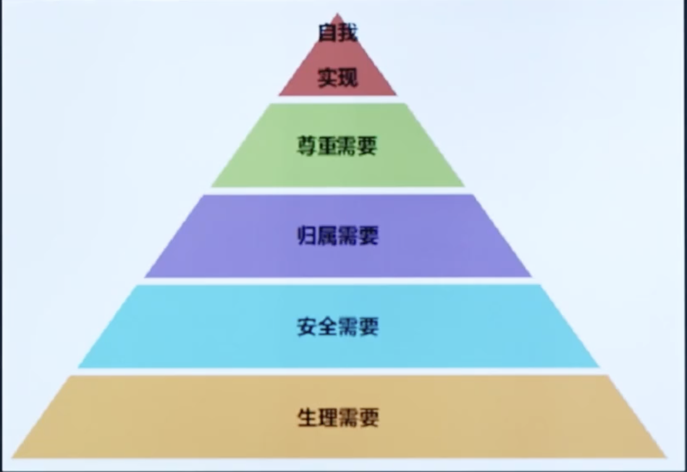
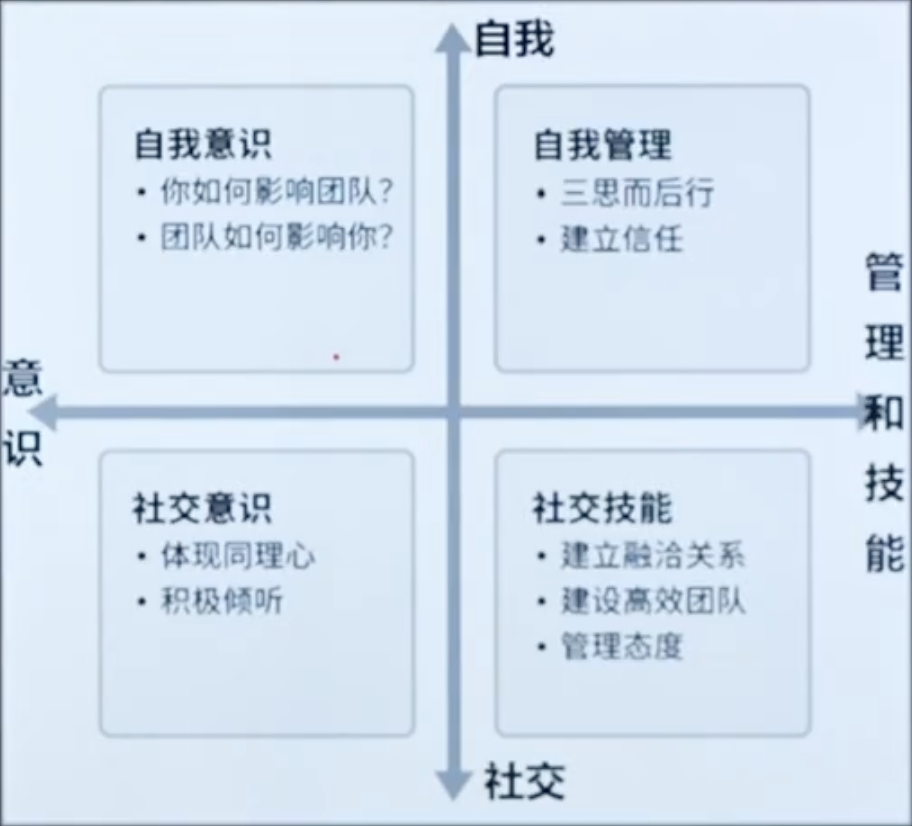
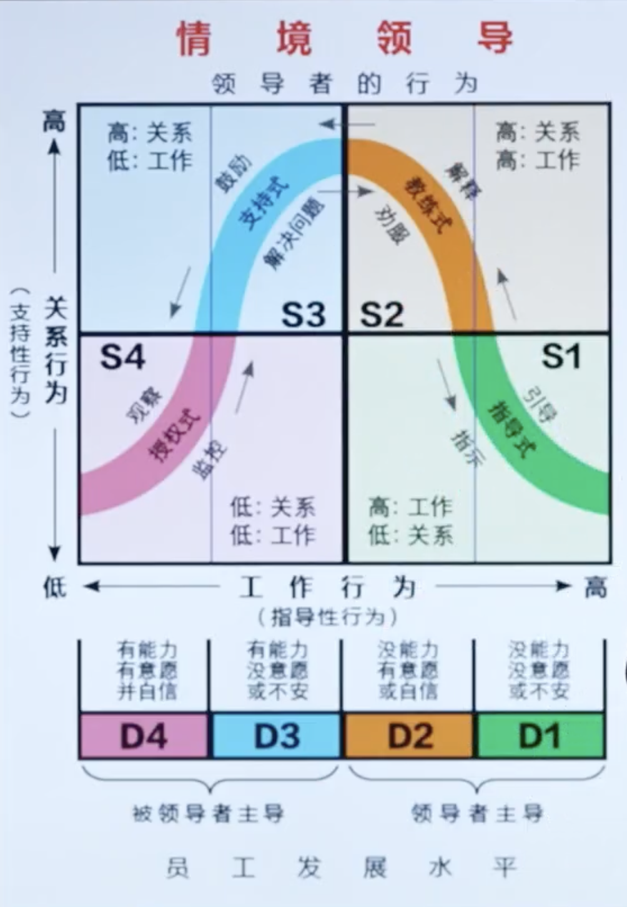
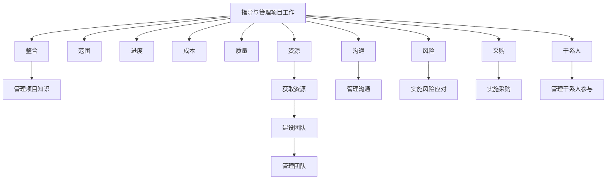

# 6.执行过程组
# 课时 122 : 课前思考题

## 章节导入思考题

## 习题解析

知识管理是项目经理的一项重要责任。这个责任包括管理项目中的两种知识：隐性和显性。以下哪些定义是正确的？

   - [ ] A. 隐性知识是基于事实的，可以很容易地通过语言和符号进行交流。
   - [ ] B. 隐性知识可能需要解释或背景来为这些信息的接受者信。
   - [ ] C. 隐性知识包括情感、经验和能力。
   - [ ] D. 通过PPT分享经验是隐性知识的一个例子。

> 计划驱动执行, 监控保障纠偏
> 项目经理在执行过程中，进需要再监控组执行监控的工作

---

- TBD

---

# 课时 126 : 过程：指导与管理项目工作

| 标题  | 课时  | 章节  |
| --- | --- | --- |
| 进度  | 126  | 119  |

- TBD

## 本节知识点

| 序号 | 知识点 | 重点 |
| :--- | :--- | :--- |
| 1 | 信息管理 | 分享显性知识 信息整理 |
| 2 | 知识管理 | 分享隐性知识 知识整合 |

---

# 课时 127 : 过程：管理质量

| 标题  | 课时  | 章节  |
| --- | --- | --- |
| 进度  | 127  | 120  |

## 管理质量

### 输入

1. **项目管理计划**
   1. 质量管理计划
2. **项目文件**
   1. 经验教训登记册
   2. 质量控制测量结果
   3. 质量测量指标
   4. 风险报告
3. **组织过程资产**

### 工具与技术

1. **数据收集**
   1. ==核对单==
2. **数据分析**
   1. 备选方案分析
   2. 文件分析
   3. 过程分析
   4. 根本原因分析
3. **决策**
   1. 多标准决策分析
4. **数据表现**
   1. 亲和图
   2. ==因果图==
   3. ==流程图==
   4. ==直方图==
   5. 矩阵图
   6. ==散点图==
5. ==审计==
6. ==面向X的设计==
7. **问题解决**
8. **质量改进方法**

### 输出

1. **质量报告**
2. **测试与评估文件**
3. **变更请求**
4. **项目管理计划（更新）**
   1. 质量管理计划
   2. 范围基准
   3. 进度基准
   4. 成本基准
5. **项目文件（更新）**
   1. 问题日志
   2. 经验教训登记册
   3. 风险登记册

## 本节知识点

| 序号 | 知识点 | 重点 |
| :--- | :--- | :--- |
| 1 | 工具 | 核对单 备选方案/文件/过程/根本原因分析 审计 面向X设计 问题解决 质量改进方法 |
| 2 | 输出 | 质量报告 测试与评估文件 |

## 习题解析

在一个建筑项目中，项目经理发现近期完成的部分工程存在质量缺陷，为了避免类似问题再次发生，提升整体项目质量，以下哪项活动属于管理质量过程？

   - [ ] A. 要求施工人员返工处理有质量缺陷的部分
   - [x] B. 分析质量缺陷产生的根本原因，制定并执行质量改进措施
   - [ ] C. 对后续施工过程进行更加严格的质量检查，增加检查频次
   - [ ] D. 与供应商重新协商原材料的质量标准，提高采购质量要求

> 正解：B
> A: 做质量控制
> B: 管理质量过程 （正确）
> C: 属于监控过程组
> D: 属于规划质量管理，并不是流程标准的改进

---

# 课时 128 : 工具：核对单&因果图&直方图&散点图

| 标题  | 课时  | 章节  |
| --- | --- | --- |
| 进度  | 128  | 121 |

## 数据收集-核对单

- 核对单是一种结构化工具，通常具体列出各项内容，用来核实所要求的一系列步骤是否已经执行；

- 需涵盖在范围基准中定义的验收标准。

### 核对单示例表格

例如：
**文件标识**：[ ]-FR-CODE-CHECKLIST-YY
| 编号 | 问题 | 是 | 否 | 不适用 | BUG# | 备注 |
| :--- | :--- | :---: | :---: | :---: | :---: | :--- |
| **变量（Attribute）和常量声明块（VC）** |
| 1 | 变量和常量的命名是否与约定保持一致？ | □ | □ | □ | | |
| 2 | 是否存在容易混淆的相似的变量和属性名？ | □ | □ | □ | | |
| 3 | 变量和属性是否书写正确？ | □ | □ | □ | | |
| 4 | 变量和属性是否被正确的初始化？ | □ | □ | □ | | |
| 5 | 非局部变量是否能用局部变量替换？ | □ | □ | □ | | |
| 6 | 所有的for循环的增量变量是否都在循环顶部声明？ | □ | □ | □ | | |
| 7 | 是否有应该命名为常量的文字常量？ | □ | □ | □ | | |
| 8 | 变量和属性是否可以用常量替换？ | □ | □ | □ | | |
| 9 | 属性是否可以用本地变量？ | □ | □ | □ | | |
| 10 | 所有的属性是否都有正确的访问限制符（private, protected, public）？ | □ | □ | □ | | |
| 11 | 是否有静态属性应该是非静态service-ver？ | □ | □ | □ | | |

## 数据表现-因果图

用于分析根本原因或主要原因

## 数据表现-直方图

用垂直的条形图，显示特定情况的发生次数。

用数字和柱形的相对高度，直观表示引发问题的最普遍原因。

## 数据表现-散点图

数据点越接近某斜线，两个变量之间的关系就越密切。

## 本节知识点

| 序号 | 知识点 | 重点 |
| :--- | :--- | :--- |
| 1 | 核对单 | 核实验收标准 |
| 2 | 因果图 | 分析根本原因或主要原因 |
| 3 | 直方图 | 数据分布 分析问题普遍原因 |
| 4 | 散点图 | 分析两个变量之间的关系 |

## 练习题
在汽车零部件制造项目的规划质量过程中，团队需要分析产品质量问题。以下关于因果图、散点图和直方图的应用场景，描述正确的是哪一个？
- [ ] A. 团队发现产品尺寸偏差较大，想探究是设备老化、人员操作失误还是原材料质量问题导致的，应使用散点图
- [x] B. 为了直观展示不同型号零部件的次品数量分布情况，团队应使用直方图
- [ ] C. 团队想了解生产线上温度与产品抗压强度之间是否存在关联，应使用因果图
- [ ] D. 为分析上个月产品缺陷数量随时间的变化趋势，团队应使用因果图

> A: 这是因果图（鱼骨图）
> B: 这是直方图
> C: 这是散点图
> D: 英国图不能展示随时间变化的原因

---

# 选修： 帕累托图（选修）
| 标题  | 课时  | 章节  |
| --- | --- | --- |
| 进度  | 128  | 122 |

帕累托图是一种特殊的直方图

- 和鱼骨图（因果图）类似，用于定位问题的主要原因
- 和因果图的区别是， 因果图还会找到主要原因

**重点关注界限：80%**

| # | 原因 | 问题 | 总计% |
| :--- | :--- | :--- | :--- |
| 1 | 饮食不规律 | 30 | 37.5% |
| 2 | 压力 | 20 | 62.5% |
| 3 | 作息不规律 | 15 | 81.3% |
| 4 | 遗传 | 10 | 93.8% |
| 5 | 不锻炼 | 5 | 100.0% |

- 注意 帕累托图每一项是前几项的总和
- 利用 2:8 原则， 识别少数对问题影响较大的主要原因（约 20% 的数量）
- 优先解决这些原因即可大幅度解决当前的问题

## 本节知识点

| 序号 | 知识点 | 重点 |
| :--- | :--- | :--- |
| 1 | 帕累托图 | 寻找关键原因 二八原则 直方图特例 |

## 习题解析

在电子产品组装项目中，质量团队收集了过去一个月内产品缺陷的数据，发现共有10种不同类型的缺陷。为确定应优先解决哪些缺陷以最大程度提升产品质量，质量团队打算使用一种质量管理工具。以下关于该工具的说法，正确的是？

   - [ ] A. 选择因果图，通过监控生产过程来发现异常波动，进而减少缺陷
   - [x] B. 采用帕累托图，它能按照缺陷发生频率对缺陷类型进行排序，帮助找出造成大部分缺陷的少数关键原因
   - [ ] C. 使用亲和图，将各种缺陷分类归纳，从而直观地看到各类缺陷的占比情况
   - [ ] D. 运用流程图，梳理产品组装流程，找出可能导致缺陷产生的环节

> 解析：
> 应该选 B  
> 目标是确定“应优先解决哪些缺陷”，需要按发生频率排序并聚焦少数关键原因，这正是帕累托图（80/20 原则）的用途。
> 因果图也可以解决这个问题。看一下实际的答案
> A 实为控制图的用途；
> C 的亲和图用于分组聚类想法而非占比；
> D 流程图用于过程梳理，不提供优先级排序。

---

# 课时 129 : 工具：审计&面向X的设计

| 标题  | 课时  | 章节  |
| --- | --- | --- |
| 进度  | 129  | 123 |

## 审计
质量审计是用来==确定项目活动是否遵循了组织和项目的政策、过程与程序的一种结构化的、独立的过程==。

- 质量审计可能是计划安排的或随机的，由内部或外部审计师进行。
  
- 质量审计可以带来质量成本的降低，并提高发起人或客户对项目产品的接受度。

> 用第三方人员来介入并检查工作的结果
> 可以是外部的也可以是内部的
> 项目组应该欢迎随机检查

## 面向X的设计
DfX (Design for X)中的 “X” 可以是产品开发的不同方面，
例如可靠性、调配、装配、制造、成本、服务、可用性、安全性和质量。

> 目的就是一次性把事情作对
> 经常会考虑用户思维的倒推设计

## 本节知识点（续）

| 序号 | 知识点 | 重点 |
| :--- | :--- | :--- |
| 1 | 审计 | 审核过程遵守情况 识别问题 提出改进 确认变更实施情况 分享良好实践 |
| 2 | 面向X的设计 | 优化设计各个方面 提升产品 |

## 习题解析

在你的项目中，有几个执行活动正在进行。你开始担心你的团队成员所做的进度报告的准确性。你怎样才能验证是否有问题？

   - [x] A. 进行一次质量审计
   - [ ] B. 创建风险量化报告
   - [ ] C. 进行回归分析
   - [ ] D. 进行蒙特卡洛分析

> 解析：
> 应该选 A  
> 质量审计用于独立检查项目活动是否遵循既定流程与标准，可抽查数据来源、取样与记录，核对实际与报告一致性，从而验证进度报告的准确性。  
> B 为定量风险分析的产物，不能验证报告准确性；
> C 回归分析用于建立变量关系并做预测；（复盘专用）
> D 蒙特卡洛用于不确定性模拟，与校验进度报告无关。（风险的内容）

---

# 课时 130 : 执行过程组：闯关题1

## 9-执行过程组（115小节-123小节）闯关题

关于项目的知识管理，下列说法正确的是哪一个？

A.	知识管理主要是将知识记录下来用于分享

B.	本项目生成的知识可用来支持组织运营或未来的项目

C.	知识管理主要是管理现有知识

D.	显性知识易于分享，是知识管理的重点

正确答案：B ， 回答正确

> 解析：
项目生成的知识是组织的宝贵财富，可以用于支持组织的运营，帮助解决实际问题，也可以为未来的项目提供经验教训和参考，避免重复犯错，提高项目成功率。
A 选项：知识管理不仅仅是将知识记录下来用于分享，还包括知识的创造、获取、存储、传播、应用和更新等多个环节，是一个更全面的管理过程。
C 选项：知识管理不仅包括对现有知识的管理，还涉及到新知识的创造和挖掘，以及对知识的整合、转化等，以适应不断变化的环境和需求。
D 选项：虽然显性知识易于分享，但隐性知识同样重要，它往往蕴含着个人或团队的独特经验、技能和洞察力等，对项目的成功也起着关键作用，所以知识管理不能只侧重于显性知识，而应兼顾显性知识和隐性知识。

在你的项目中，有几个执行活动正在进行。你开始担心你的团队成员所做的进度报告的准确性。你怎样才能验证是否有问题？

A.	进行一次质量审计

B.	创建风险量化报告

C.	进行回归分析

D.	进行蒙特卡洛分析

正确答案：A ， 回答正确

> 解析：
质量审计是对项目活动和过程进行结构化审查的方法，通过质量审计可以检查团队成员的工作过程和成果，包括进度报告的准确性。审计人员可以审查相关文档、记录，与团队成员沟通，核实报告中的信息是否与实际工作进展相符，从而验证进度报告是否存在问题。
B 选项：风险量化报告主要是对项目风险进行定量分析，评估风险发生的概率和影响程度，以确定风险的优先级和应对策略，与验证进度报告的准确性无关。
C 选项：回归分析是一种统计方法，用于项目总结和复盘，在这种情况下，它并不能直接帮助验证进度报告的准确性。
D 选项：蒙特卡洛分析是一种通过模拟来评估项目风险和不确定性的方法，主要用于分析项目进度、成本等方面的风险分布，而不是用于验证进度报告的准确性。

你是一个重大信息系统项目的项目经理。质量部门的人过来找你，说要开始对你的项目进行质量审计。这个团队在尽快完成项目的压力下，反对进行审计。你应该向团队解释，质量审计的目的是什么？

A.	检查项目交付物问题的原因

B.	检查客户是否遵循了质量流程

C.	识别低效和无效的政策

D.	检查团队提交的费用的准确性

正确答案：C ， 你的答案：A回答错误

> 质量审计是一种独立的结构化审查，其目的是识别项目中正在实施的活动是否符合组织的政策、过程和程序。质量审计可以识别项目中低效和无效的政策、过程和程序，有助于发现改进的机会，提高项目绩效，这是质量审计的重要目的之一。
A 选项：检查项目交付物问题的原因是质量控制的一部分内容，主要通过质量工具和技术来分析问题产生的根源，而不是质量审计的主要目的。
B 选项：质量审计主要关注项目团队自身是否遵循质量流程，而不是检查客户是否遵循质量流程。客户通常不直接参与项目内部的质量流程执行，质量审计的重点是项目团队的工作。
D 选项：检查团队提交费用的准确性属于成本管理范畴，与质量审计的目的无关，质量审计主要关注质量相关的活动和流程，而非费用方面的审查。

你正处于一个大型设施建设项目的中期。结构钢已经就位，供热管道正在安装，这时一位高级经理通知你，他担心项目不能达到质量标准。在这种情况下，你应该怎么做？

A.	向高级管理人员保证，在计划质量管理过程中，已经确定该项目将达到质量标准。

B.	类比估算未来的结果。

C.	让质量团队参与进来。

D.	检查上次质量管理计划的结果。

正确答案：C ， 回答正确

> 解析：
让质量团队参与进来，可以确定项目是否符合质量标准，并能及时发现潜在的质量问题，提出改进措施，从而有效回应高级经理的担忧。
A 选项：仅向高级管理人员保证在计划质量管理过程中确定了项目将达到质量标准，这只是口头承诺，没有实际行动来验证和解决当前的质量担忧，无法真正打消高级经理的顾虑。
B 选项：类比估算主要用于成本和时间估算等方面，通过与类似项目进行类比来估计当前项目的情况，而对于直接评估和确保当前项目的质量标准，类比估算并不是最有效的方法。
D 选项：检查上次质量管理计划的结果有一定的作用，但上次计划的结果只能反映过去的情况，不能代表当前项目中期的实际质量状况，可能无法全面解决高级经理对当前项目质量的担忧。所以让质量团队参与进来进行实时的质量评估更为关键。

问题日志在哪个管理过程首次被创建? 

A.	管理团队  

B.	指导与管理项目工作

C.	结束项目或阶段  

D.	监控项目工作

正确答案：B ， 你的答案：D回答错误

> 解析：
“指导与管理项目工作” 过程是为实现项目目标而执行项目管理计划中确定的工作。在执行过程中，会遇到各种问题，需要及时记录并跟踪，因此在此过程中首次创建问题日志，用来记录这些问题，以便后续进行处理和监控。
A 选项：“管理团队” 过程重点在于跟踪团队成员的表现，提供反馈，解决问题并协调变更，以优化项目绩效。此时问题日志已存在，用于记录团队相关问题及解决情况，并非首次创建。
C 选项：“结束项目或阶段” 过程主要是完成项目或阶段的所有活动，正式结束项目或阶段。此时主要工作是总结经验教训、完成项目收尾工作，问题日志在此阶段是作为项目文档进行整理和归档，而非首次创建。
D 选项：“监控项目工作” 过程是跟踪、审查和调整项目进展，以实现项目管理计划中确定的绩效目标。在该过程中会使用问题日志来记录和跟踪项目中发现的问题，但不是问题日志首次创建的过程。

---

# 课时 131 : 过程：获取资源

| 标题  | 课时  | 章节  |
| --- | --- | --- |
| 进度  | 131  | 124 |

## 获取资源（ITTO）

### 输入
1. 项目管理计划
   - 资源管理计划
   - 采购管理计划
   - 成本基准
2. 项目文件
   - 项目进度计划
   - 资源日历
   - 资源需求
   - 干系人登记册
3. 事业环境因素
4. 组织过程资产

### 工具与技术
1. ==预分派==
2. 人际关系与团队技能
   - ==谈判==
3. ==虚拟团队==
4. 决策
   - 多标准决策分析

### 输出
1. 物质资源分配单
2. 项目团队派工单
3. ==资源日历==
4. 变更请求
5. 项目管理计划（更新）
   - 资源管理计划
   - 成本基准
6. 项目文件（更新）
   - 经验教训登记册
   - 项目进度计划
   - 资源分解结构
   - 资源需求
   - 风险登记册
   - 干系人登记册
7. 事业环境因素（更新）
8. 组织过程资产（更新）

> 在获取资源的过程中，在获取资源的过程中 “事业环境因素” 可能会改变。比如团队被改变
## 本节知识点（获取资源·要点速记）

| 序号 | 知识点 | 重点 |
| :--- | :--- | :--- |
| 1 | 工具 | 预分派 谈判 虚拟团队 多标准决策分析 |
| 2 | 输出 | 物质资源分配单 项目团队派工单 资源日历 事业环境因素更新 |

## 习题解析

在项目的获取资源过程中，项目经理主要关注的是什么？

   - [x] A. 识别所需资源
   - [ ] B. 管理团队绩效
   - [ ] C. 控制资源使用
   - [ ] D. 释放项目资源

> 解析：
> 应该选 A  
> 获取资源的核心目标是确保按需求获得合适的人力与物理资源（类型、数量、时间窗、能力要求匹配）。  
> B 属于“管理团队”过程；C、D 属于“控制资源”过程，非获取阶段的主要关注点。

---

# 课时 132 : 工具：预分派&谈判&虚拟团队

| 标题  | 课时  | 章节  |
| --- | --- | --- |
| 进度  | 132  | 125 |

## 预分派
硕分派指事先确定项目的实物或团队资源，可生下列情况下发生：
• 在竟标过程中承诺分派特定人员进行项目工作
• 项目取决于特定人员的专有技能；
• 在完成资源管理计划的前期工作之前，制定项目章程过程或其他过程已经指定了某些团队成员的工作分派。

## 谈判

有许多谈判模型。其中一个模型是 Steven Covey 的“双赢思维”原则。
这一原则适用于所有互动场景，而不仅仅适用于谈判，但此处是以谈判为背景进行阐述。在谈判中，可能会有不同的结果：

- 在谈判中，可能出现的结果：
  - ==双赢==：最佳结果，所有参与方都感到满意。
  - ==赢-输 / 输-赢==：竞争取向的一方获胜、他方受损；也可能出于道德立场，个别人选择成就对方而“输掉”谈判。
  - ==双输==：本可实现双赢，但当竞争压过合作时出现此结果，所有人的结局都更糟。

- 更容易实现双赢的条件：
  - ==个性==：参与的各方都很成熟，表现出正直，并且都认为每个人都有的价值。
  - ==信任==：双方相互信任，就如何运作达成一致意见，并勇于担责。。
  - ==方法==：各方都愿意从对方的角度看待当前情形。各方共同努力识别关键的问题和顾虑。他们确定了可接受的解决方案，并确定了实现可接受解决方案的选项。

> 用规则代替猜疑
> 用担责代替甩锅

## 虚拟团队

- 虚拟团队。在不同地点工作但具有共同目标的人群，他们主要通过电话和其他电子通信方式彼此互动。
- 现代沟通技术（如电子邮件、电话会议、社交媒体、网络会议和==视频会议==等）使虚拟团队可行。
- 沟通规划更加重要。虚拟团队可以利用技术来营造在一起的团队环境，以供团队==存储文件、使用在线对话==来讨论题，以及保持团队统一日历。

> 考试：一个虚拟团队， 遇到了紧急事件，去找用于实时通讯的方案

## 本节知识点（预分派·谈判·虚拟团队）

| 序号 | 知识点 | 重点 |
| :--- | :--- | :--- |
| 1 | 预分派 | 竞标过程 项目章程制定 专有技能 |
| 2 | 谈判 | 双赢 一赢一输 双输 个性 信任 方法 |
| 3 | 虚拟团队 | 沟通最重要 现代沟通技术 |

## 习题解析

在一个跨国软件开发项目中，项目经理需要获取各类资源以保证项目顺利开展。项目中有关键模块需要熟悉特定语言与框架的开发人员，公司内部有类似项目经验的团队成员已被预先分配到该项目。同时，还需额外测试人员，因内部人力紧张，项目经理需与其他项目的职能经理协商调配；并计划招募部分远程办公的软件工程师。以下关于获取资源工具的说法，正确的是哪一项？

   - [ ] A. 公司内部有类似项目经验的团队成员预先分配到该项目，这运用的是谈判工具
   - [ ] B. 项目经理与其他项目的职能经理协商调配测试人员，这属于预分派
   - [x] C. 招募远程办公的软件工程师组建虚拟团队，可突破地域限制获取人才
   - [ ] D. 谈判主要用于从外部供应商获取物资资源，不能用于人力资源调配

> 解析：
> 应该选 C  
> - 预先把内部成员指定到项目属于“预分派（Pre-assignment）”，所以 A 错。  
> - 与其他经理协商调配资源属于“谈判（Negotiation）”，因此 B 为谈判而非预分派。  
> - 谈判既可用于内部人员/设备/预算协调，也可用于外部采购合同，D 的说法过窄，错误。  
> - 题干强调“计划招募远程办公的软件工程师”，对应“虚拟团队（Virtual Teams）”，突破地域限制，故 C 正确。

---

# 课时 133 : 输出：资源日历

| 标题  | 课时  | 章节  |
| --- | --- | --- |
| 进度  | 133  | 126 |

## 资源日历
- 资源日历识别了每种具体资源可用时的工作日、班次、正常营业的上下班时间、周末和公共假期。在规划活动期间，潜在的可用资源信息（如团队资源、设备和材料）用于估算资源可用性。资源日历还规定了在项目期间确定的团队和实物资源何时可用、可用多久。这些信息可以在活动或项目层面建立，这考虑了诸如资源经验和/或技能水平以及不同地理位置等属性。
- 资源直方图：以图表的形式展示了在项目的不同时间段内，各种资源（如人力资源、设备资源等）的需求或使用水平。它将时间作为横轴，资源数量或使用强度作纵轴，通过柱状图等形式来呈现每个时间段内所需资源的具体情况。

> 资源日历：设备或者人的上班表 （看时间）
> 资源直方图：每个资源的热力表 （看数量）
> 考试：多项目共享一个资源的时候， 需要关注资源日历相关的内容

## 本节知识点

| 序号 | 知识点 | 重点 |
| :--- | :--- | :--- |
| 1 | 资源日历 | 团队成员的可用情况信息 |
| 2 | 资源直方图 | 项目所需资源需求情况 |

## 习题解析

项目经理必须公布一个项目进度。活动、开始/结束时间和资源已经确定。项目经理接下来应该做什么？

   - [ ] A. 根据沟通管理计划，分发项目进度
   - [x] B. 确认资源的可用性
   - [ ] C. 完善项目管理计划以反映更准确的成本计算信息
   - [ ] D. 发布一个说明进度的横道图

> 需要确定资源是否可用，可以通过查阅资源日历
> A：得先确定资源（人）能来，才可以分发进度
> C: 和题干无关
> D: 先确定资源已经就位，再发布横道图
> 虽然活动、开始/结束时间和资源已经确定，但在公布项目进度之前，项目经理需要确认资源的实际可用性（通过资源日历）。资源的计划分配和实际可用性可能存在差异，只有确认了资源的可用性，才能保证进度计划的可行性和准确性。

---

# 课时 134 : 过程：建设团队

| 标题  | 课时  | 章节  |
| --- | --- | --- |
| 进度  | 134  | 127 |

## 建设团队

建设团队是==提高工作能力==，促进团队成员互动，改善团队==整体氛围==，以提高项目绩效的过程。本过程的主要作用是：改进团队协作，增强人际关系技能，激励员工，==减少摩擦==，以及提升整体项目绩效。

| 输入 | 工具与技术 | 输出 |
| :--- | :--- | :--- |
| 1. 项目管理计划 1）资源管理计划  2. 项目文件 - 经验教训登记册 - 项目进度计划 - 项目团队派工单 - 资源日历 - 团队章程  3. 事业环境因素 4. 组织过程资产 | 1. 虚拟团队 2. 沟通技术 3. 人际关系与团队技能： - 冲突管理 - 影响力 - ==激励== - 谈判 - 团队建设 4. ==培训== 5. ==集中办公== 6. ==认可和奖励== 7. 个人和团队评估 | 1. ==团队绩效评价== 2. 变更请求 3. 项目管理计划（更新） - 资源管理计划 4. 项目文件（更新） - 经验教训登记册 - 项目进度计划 - 项目团队派工单 - 资源日历 - 团队章程 5. [内容被遮挡] |

## 建设团队-文化差异

- 项目经理在全球化环境和富有文化多样性的项目中工作。
- 项目管理团队应该==利用文化差异==，在整个项目生命周期中==致力于发展和维护项目团队==，并促进在==相互信任==的氛围中充分协作。
- ==具有文化意识==并==采取后续行动==，能够最小化因项目干系人社区内的文化差异而导致的==理解错误==和==沟通错误==。

## 本节知识点

| 序号 | 知识点 | 重点 |
| :--- | :--- | :--- |
| 1 | 工具 | 虚拟团队 冲突管理 激励 团队建设 培训 集中办公 认可与奖励 个人和团队评估 |
| 2 | 输出 | 团队绩效评估 事业环境因素更新 |
| 3 | 文化差异 | 促进信任合作 也可制造协作障碍 |

## 习题解析

在一个跨国项目中，团队成员来自多个国家和地区，文化背景差异显著。项目经理在建设团队时，采取了一系列措施来应对文化差异带来的挑战。以下做法中，最恰当的是哪一个？

   - [ ] A. 制定统一的团队规章制度，要求所有成员严格遵守，消除文化差异的影响
   - [ ] B. 组织团队建设活动时，选择具有普遍性的活动形式，如户外拓展，避免因文化差异导致部分成员不适应
   - [x] C. 开展文化多样性培训，让团队成员了解不同文化背景下的沟通方式、工作习惯和价值观，促进相互理解和包容
   - [ ] D. 按照文化背景将团队成员分组，让同一文化背景的成员负责相关工作任务，减少文化冲突

> 解析：
> 应该选 C
> 根据PMBOK指南中建设团队过程的要求，项目管理团队应该利用文化差异，在整个项目生命周期中致力于发展和维护项目团队，并促进在相互信任的氛围中充分协作。具有文化意识并采取后续行动，能够最小化因项目干系人社区内的文化差异而导致的理解错误和沟通错误。选项C通过开展文化多样性培训，正是体现了这一理念，有助于团队成员相互理解和包容，建立信任合作的氛围。

---

# 课时 135 : 塔克曼阶梯理论

| 标题  | 课时  | 章节  |
| --- | --- | --- |
| 进度  | 135  | 128 |

## 塔克曼阶梯理论

此模型中的项目团队文化开始于形成阶段，并会在其余的发展阶段不断演进。虽然此模型显示了一个线性进展的过程，但项目团队可能会在这些阶段之间来回反复。此外，并非所有项目团队都能达到成熟阶段，有些甚至无法达到规范阶段。

> 考试记忆：5 个阶段的名称和特点

## 本节知识点

| 序号 | 阶段 | 特征 |
| :--- | :--- | :--- |
| 1 | 形成 | 相互独立 |
| 2 | 震荡 | 士气下降 |
| 3 | 规范 | 开始协同 |
| 4 | 成熟 | 相互依靠 |
| 5 | 解散 | 成员离开 |

## 习题解析

一个由来自六个国家的团队成员组成的虚拟团队正在完成一个项目。在不同的地点，团队成员在争论哪个办公室将主导这个项目，对会议的时间安排有不同意见，并质疑那些他们以前没有合作过的人的能力。这个团队处于塔克曼阶梯的哪个阶段？

   - [ ] A. 形成阶段
   - [ ] B. 改革中
   - [x] C. 震荡阶段
   - [ ] D. 资源配置

> 解析：
> 应该选 C
> 根据塔克曼阶梯理论，震荡阶段的典型特征包括：团队成员之间出现冲突、争论权力和主导地位、对其他成员的能力产生质疑、团队士气下降等。题目中描述的"争论哪个办公室将主导项目"、"对会议时间安排有分歧"、"质疑他人能力"都是震荡阶段的典型表现，因此答案是C。

---

# 课时 136 : 工具：激励.

| 标题  | 课时  | 章节  |
| --- | --- | --- |
| 进度  | 136  | 129 |

## 马斯洛-需求层次
马斯洛的需求层次理论，在一定程度上反映了人类行为和心理活动的共同规律。马斯洛从人的需要出发探索人的激励和研究人的行为，抓住了问题的关键。

## 赫茨伯格-双因素理论

引起人们工作动机的因素主要有两个：一是保健因素，二是激励因素。

- 只有激励因素才能够给人们带来满意感
- 保健因素只能消除人们的不满，但不会带来满意感

| 激励因素 | 保健因素 |
| :--- | :--- |
| 成就 | 公司政策 |
| 承认 | 与监督者的关系 |
| 工作本身 | 工作条件 |
| 责任 | 工资 |
| 晋升 | 同事关系 |
|  | 个人生活 |
|  | 与下属关系 |

## 麦格雷戈XY理论

- **X**：假设个人之所以工作，完全是为了获得收入。
- **Y**：假设个人有将工作做好的内在动机。
- **亚伯拉罕·马斯洛版本的Z**：个人的动机是自我实现、价值观和更强的使命感。
- **威廉·大内版本的Z**：通过创造关注员工及其家人福利的终身工作来激励员工。这种管理方式旨在提高生产率、士气和满意度。

| X理论 | Y理论 |
| :--- | :--- |
| 人们没有进取心，没有责任心，为求安全 | 人们在为力所能及的自己所关心的组织目标时，可以进行自我控制 |
| 好逸恶劳是人的天性，工作是不愉快的，如果可能，人们是尽量逃避劳动 | 在工作中运用智力和体力与休息或娱乐一样自然，人对工作感兴趣与否主要取决于工作对他是否是一种惩罚 |
| 对于问题的解决几乎没有创新能力 | 解决问题需要创造力，在现代社会中，一般人的智慧和才能没有得到充分发挥，人有自我实现的需求，这种需求与人们期待的组织目标是一致的 |
| 需要动机保持在生理和安全的水平 | 需要动机不仅保持在生理和安全水平，而且还有更高的层次 |
| 严格控制，经常威胁利诱 | 如果获得适当的奖励，他们愿意承担责任，真正的适应自我约束承担责任 |

## 麦克米兰-成就动机理论

- **权力的需要**（官儿迷）
- **归属的需要**（老好人）
- **成就的需要**（CEO）

| 高成就动机者 | 低成就动机者 |
| :--- | :--- |
| 事业心强 | 缺乏事业心 |
| 具有冒险精神 | 渴望稳定 |
| 现实主义者 | 理想主义 |
| 设立具有挑战性的目标 | 设立基本的目标 |
| 不喜欢做容易达成的工作 | 喜欢做有把握的事情 |
| 寻求能发挥独立解决问题的工作 | 喜欢和别人合作 |
| 希望得到明确的反馈了解自己是否进步 | 满足与目前状态 |

## 本节知识点

| 序号 | 知识点 | 重点 |
| :--- | :--- | :--- |
| 1 | 马斯洛需求 | 生理 安全 归属 尊重 自我实现 |
| 2 | 赫茨伯格双因素 | 保健因素和激励因素 |
| 3 | 麦格雷戈XY理论 | X为人性本恶 Y为人性本善 Z为个人动机的来源 |
| 4 | 麦克米兰成就动机 | 权力需要 归属需要 成就需要 |

## 习题解析

在一个软件开发项目中，团队成员小李工作表现出色，项目经理为了激励他，提出可以满足他的一个需求。根据马斯洛需求理论，以下哪种激励措施最有可能对小李产生持续且有效的激励作用？

   - [ ] A. 给予小李一等丰厚的奖金
   - [ ] B. 为小李提供更舒适的办公桌椅
   - [x] C. 让小李参与公司核心项目的决策，并在团队中担任技术指导角色
   - [ ] D. 为小李安排一次豪华的带薪休假

> 解析：
> 应该选 C
> 根据马斯洛需求层次理论，对于工作表现出色的员工，通常基本的生理和安全需求已经得到满足。选项C让小李参与决策并担任指导角色，满足了他的尊重需求和自我实现需求，这是最高层次的需求，能够产生持续且有效的激励作用。而选项A、B、D分别对应金钱、舒适环境和休息，属于较低层次的需求。

---

# 课时 137 : 工具：集中办公&认可与奖励&培训

| 标题  | 课时  | 章节  |
| --- | --- | --- |
| 进度  | 137  | 130 |

## 集中办公&认可与奖励&培训

| 名称 | 特点 |
| :--- | :--- |
| 集中办公 | • 既可以是在项目关键时期临时性的，也可以贯穿整个项目 • 有时称为作战室，紧密组阵 |
| 认可与奖励 | • 个人奖励会破坏团队凝聚力 • 整个项目生命周期尽可能给予奖励 • 可以正式或非正式的方式做出奖励决定，但在决定认可与奖励时，应考虑文化差异和需求。 |
| 培训 | • ==第一步先确定培训所需的能力和要素== • 根据培训需求确定培训方案：资源管理计划 • 为培训分配资源：培训成本通常应该包括在项目预算中，但==如果增加的技能有利于未来的项目，则由执行组织承担== • ==通过培训可以提高团队绩效== • 衡量培训效果 |

> 尽量不要采取个人奖励，应该采用团队奖励
>

## 本节知识点

| 序号 | 知识点 | 重点 |
| :--- | :--- | :--- |
| 1 | 集中办公 | 临时或贯穿整个项目 作战室 |
| 2 | 认可与奖励 | 奖励考虑文化差异和个人需求 |
| 3 | 培训 | 增加技能 根据参训者需求开展 培训后要衡量效果 成本提前规划 |

## 习题解析

一个团队成员在项目中表现不佳，因为他没有系统开发工作的经验，但没有比他更有资格做这项工作的人了。对于项目经理来说，什么是最好的解决方案？

   - [ ] A. 与职能部门经理协商，确定团队成员的项目完成奖励
   - [ ] B. 获得一个对开发工作更熟练的新资源
   - [x] C. 安排该团队成员接受培训
   - [ ] D. 拨出一些项目进度储备

> 解析：
> 应该选 C
> 题目明确说明没有更合适的人选，因此选项B不现实。选项A的奖励措施无法解决技能不足的根本问题。选项D的进度储备只是时间缓冲，不能提升成员能力。选项C安排培训是最佳解决方案，既能提升团队成员的技能，又能解决项目需求，符合人力资源管理中通过培训提升团队绩效的原则。

---

# 课时 138 : 输出；团队绩效评价

| 标题  | 课时  | 章节  |
| --- | --- | --- |
| 进度  | 138  | 131 |

## 团队绩效评价
如果项目团队成员能够形成自己的工作方式，甚至能够确立自己的工作时间和节奏，则愿意寻求自主权的项目团队成员将表现得更为出色。

因此，==根据个人偏好对激励方法进行裁剪==有助于实现最佳的个人和项目团队绩效。

评价团队有效性的指标可包括：
- [x] 个人技能的改进，从而使成员更有效地完成工作任务；
- [x] 团队能力的改进，从而使团队成员更好地开展工作；
- [x] 团队成员离职率的降低；
- [x] 团队凝緊力的加强，从而使团队成员公开分享信息和经验并互相帮助来提高项目绩效。可以通过情绪图和士气的衡量来评估团队绩效。

## 本节知识点

| 序号 | 知识点 | 重点 |
| :--- | :--- | :--- |
| 1 | 团队绩效评价 | 要根据个人需求和兴趣进行制定 |
| 2 | 评价高绩效团队 | 个人技能改进和离职率下降 团队能力改进和凝聚力加强 |

## 练习题
在项目执行阶段，关于团队绩效评价，以下说法正确的是哪一个？
- [ ] A. 团队绩效评价是项目结束后才开展的工作
- [ ] B. 团队绩效评价只看项目成果，不关注团队成员协作
- [ ] C. 项目经理可以通过团队绩效评价了解团队优势与不足
- [ ] D. 团队绩效评价不需要参考团队成员意见

> 选 C
> A: 绩效评价在项目开始的时候就可以开始执行了
> B: 需要关注团队成员协作
> C: 正确
> D: 需要参考成员意见，可提供更多的视角
>

---

# 课时 139 : 过程：管理团队

| 标题  | 课时  | 章节  |
| --- | --- | --- |
| 进度  | 139  | 132 |

## 管理团队过程

### 输入

1. **项目管理计划**
   1. 资源管理计划

2. **项目文件**
   1. 问题日志
   2. 经验教训登记册
   3. 项目团队派工单
   4. 团队章程

3. **工作绩效报告**

4. **团队绩效评价**

5. **事业环境因素**

6. **组织过程资产**

### 工具与技术

1. **人际关系与团队技能**
   1. ==冲突管理==
   2. 制定决策
   3. ==情商==
   4. 影响力
   5. ==领导力==

2. **项目管理信息系统**

### 输出

1. **变更请求**

2. **项目管理计划（更新）**
   1. 资源管理计划
   2. 进度基准
   3. 成本基准

3. **项目文件（更新）**
   1. 问题日志
   2. 经验教训登记册
   3. 项目团队派工单

4. **事业环境因素（更新）**

| 序号 | 知识点 | 重点 |
| :--- | :--- | :--- |
| 1 | 工具 | 冲突管理 制定决策 情商 影响力 领导力 |
| 2 | 输出 | 变更请求 事业环境因素更新 |

## 习题解析

在一个大型设备安装项目中，项目团队成员来自不同部门，工作风格和专业背景差异较大。在项目执行过程中，部分成员之间出现了意见分歧和沟通不畅的问题，影响了项目进度。作为项目经理，你应该采取以下哪种措施来有效管理团队？

   - [ ] A. 组织一次团队建设活动，加强成员之间的感情交流
   - [ ] B. 制定严格的团队规章制度，对违反规定的成员进行严厉惩罚
   - [x] C. 与出现问题的成员分别进行私下沟通，了解他们的想法和诉求，协调解决矛盾
   - [ ] D. 召开团队会议，公开批评出现问题的成员，强调团队协作的重要性

> 解析：
> 应该选 C
> 根据PMP中的冲突管理最佳实践，项目经理应该首先了解冲突的根本原因，通过私下沟通的方式了解各方观点和诉求，然后协调解决。这种方法既保护了团队成员的自尊，又能有效解决问题。
> 选项A虽然有助于团队建设，但不能直接解决当前的冲突问题；
> 选项B过于严厉可能加剧矛盾；
> 选项D公开批评会损害团队士气。

---

# 课时 140 : 工具：冲突管理

| 标题  | 课时  | 章节  |
| --- | --- | --- |
| 进度  | 140  | 133 |

## 冲突管理
* 冲突不可避免。冲突分为两类；正面和负面。
* 冲突发生后，首先分析冲突发生的原因和背景再制定解决策略。
* 负面冲突先团队成员负责解决，如果升级，项目经理将充当调解者（mediator）。
* 项目中冲突的四大来源：进度、项目优先级、资源和技术意见。
* 如果破坏性冲突继续存在，则可使用正式程序包括采取惩戒措施。

## 冲突发展阶段
冲突的发展通常经历五个阶段：前因条件阶段、感知冲突阶段、爆发冲突阶段、冲突解决阶段、后冲突阶段。

- 前因条件阶段：这是冲突的萌芽期，此时冲突还属于次要矛盾，对冲突的存在还没有觉醒。在这个阶段，冲突产生的温床已经存在，随着环境的变化，潜伏的冲突可能会消失，也可能被激化。
冬
- 感知冲突阶段：在这个阶段，已经感觉到了冲突的存在，但还没有意识到冲突的重要性。如果这时及时采取措施，可以将未来可能爆发的冲突缓和下去。
- 爆发冲突阶段：此时冲突已经造成了情绪上的影响，可能会对不公的待遇感到气愤，也可能对需要进行的选择感到困惑。不同的个人对冲突的感觉是不同的，这与当事人的个性、价值观等因素有关。
- 冲突解决阶段：需要对冲突做出处理，处理的方式是多种多样的可能包括协商、调解、仲裁等方式，目的是解决冲突双方的分歧和。
对抗。
- 后冲突阶段：冲突解决后，可能会留下一些后遗症，如信任的丧失、关系的紧张等。此时需要采取措施来修复关系，恢复团队的和谐与协作。

## 冲突解决方式
通过重点关注个人之间的相对权力和维持良好关系的愿望，描述了以下六种解决冲突的方法：

- 面对/解决问题。面对冲突是指将冲突视为要解决的问题。当冲突双方之间的关系很重要，并且每一方都对另一方解决问题的能力有信心时，就会采用这种解决冲突的方法。

- 合作。合作涉及将与冲突有关的多种观点包含进来。合作的目标是了解各种观点，从多个角度看待事情。当参与者之间已建立信任并且有时间达成共识时，这是一种有效的方法。项目经理可以引导项目团队成员之间采用这种解决冲突的方法。
  
- 妥协。在某些冲突中，各方都不会完全满意。在这些情况下，寻求妥协是最佳方法。妥协涉及给予和接受的意愿。这使所有各方都能得到他们想要的东西，并避免冲突升级。当涉事各方拥有平等的“权力”时，通常就会采用这种方法。项目经理可能会与技术经理就项目团队成员是否可以参与项目工作达成妥协。
  
- 缓和/包容，当实现总体目标比分歧更重要时，缓和和包容是有用的方式，这种方法可使各方之间关系保持和谐，并产生善意。当个人的相对职权或权力存在差异时，也会使用这种方法。例如，当与发起人有分歧时，这种做法可能是适当的。由于发起人地位高于项目经理或项貝团队成员，而项目经理或项目团队成员希望与发起人保持良好的关系，因此采取包容的姿态可能是合适的
  
- 强迫。在没有足够的时间进行合作或解决问题时，会使用强迫这种方法。在这种情况下，一方会强迫另一方接受自己的意愿。因为强迫的一方比另一方拥有更大的权力。如果存在需要==立即解决==的健康和安全方面的冲突，则可以采用强迫这种方法。
  
- 撒退/回避。有时问题会自行消失，有时讨论会变得激烈，对此人们需要一个冷静期。在这两种情况下，撤退是适当的方法。在无法取胜的情况下也会使用“撤退”，例如遵守监管机构的某一要求，而不是质疑该要求。

| 序号 | 知识点 | 重点 |
| :--- | :--- | :--- |
| 1 | 冲突 | 两面性 先私下再扩大 先调查再解决 |
| 2 | 五个阶段 | 前因条件阶段 感知冲突阶段 爆发冲突阶段 冲突解决阶段 后冲突阶段 |
| 3 | 六种解决策略 | 面对/解决问题 合作 妥协 缓和/包容 强迫 撤退/回避 |

## 习题解析

两个干系人通过一系列的电子邮件对一个可交付成果是否符合验收标准产生了分歧。其中一个干系人想要不同的标准，但在规划时做的成本效益分析并不支持交付该水平的性能。干系人一致认为，更高的性能水平是不需要的，也是不符合成本效益的。一个团队成员刚刚告诉你，她的工作出现了问题。她正在进行的工作必须在今天完成，否则就会出现项目失败。有电子邮件分歧的干系人之一来找你抱怨对方。你说"我现在不能处理这个问题"。你在使用以下哪种技巧？

   - [x] A. 合作/解决问题
   - [ ] B. 强迫/命令
   - [ ] C. 撤退/回避
   - [ ] D. 妥协/调节

> 解析：
> 应该选 C
> 在这个情境中，项目经理说"我现在不能处理这个问题"，这是典型的撤退/回避策略。虽然项目经理有紧急的工作需要处理，但从冲突管理角度来看，这种做法是在回避冲突而非积极解决。撤退/回避是指暂时离开实际或潜在冲突情况，或推迟问题以便更好地准备或让其他人解决冲突。

---

# 课时 141 : 工具：情商&领导力
| 标题  | 课时  | 章节  |
| --- | --- | --- |
| 进度  | 141  | 134 |

## 情商
有多种模型可用于定义和解释情商。它们集中在四个关键领域：
- 自我意识。自我意识是进行现实的自我评估的能力。它包括了解我们自己的==情绪==、目标、动机、优势和劣势。
- 自我管理。自我管理（也称为“自我调节”）是控制破坏性感受和冲动并使它们改变方向的能力。它是在采取行动之前进行思考以及暂缓合促判断和冲动决策的能力。
- 社交意识。社交意识涉及体现同理心以及理解并考虑他人的感受。这包括读懂非语言暗示和肢体语言的能力。
- 社交技能。社交技能是情商的其他维度的巅峰。它涉及管理项目团队等群体、建立社～网络、寻找与各种干系人的共同基础以及建立融治关系。

某些情商模型还包括第五个方面—动机。在这种情况下，动机是关于理解驱动和激厅的因素。

## 领导力
- 情境领导力模型是一系列领导力模型中的一种。正如项目团队对过程、方法、生命周期和开发方法进行裁剪一样，项目团队也会对领导风，格进行裁剪。情境领导力模型描述了裁剪领导者的领导风格以满足个人和项目团队需要的方法。
- Ken Blanchard 的情境领导力® II 通过将胜任力和承诺作为两大主要
变量来测量项目团队成员的发展情况。胜任力是能力、知识和技能的组合。承诺涉及个人具有的信心和动机。随着个人的胜任力和承诺不断演变，领导风格会经历从指导到教练到支持再到授权的变化，以满足个人的需要。

| 序号 | 知识点 | 重点 |
| :--- | :--- | :--- |
| 1 | 情商五方面 | 自我意识 自我管理 社交意识 社交技能 动机 |
| 2 | 情境领导力 | 指导式 教练式 支持式 授权式 |

## 习题解析

一位团队成员错过了最近两次团队会议。他指定的几个交付物完成得很晚，而且不是所有的质量都可以接受。他要求与项目经理会面，并解释说他一直在处理一些个人问题，他意识到这些问题已经影响了他的工作。虽然这对项目经理来说是个问题，因为他不得不平息其他团队成员的不满，甚至承担了一些团队成员的责任，但项目经理还是对这个团队成员表示关心。他与该团队成员合作，重新安排他的工作，让他有很长的周末来处理他的个人情况，并仍然按时完成他的活动。这就是一个什么例子？

   - [ ] A. 成就动机理论
   - [ ] B. Y理论管理
   - [x] C. 情商
   - [ ] D. 解决问题

> 解析：
> 应该选 C
> 这个案例展现了项目经理运用情商的典型例子。情商包括自我意识、自我管理、社交意识和社交技能等方面。项目经理在面对团队成员的个人问题时，展现了社交意识（理解他人的情况）和社交技能（有效沟通并找到平衡的解决方案），既照顾了团队成员的个人需要，又保证了项目的进展。这体现了高情商的管理方式。

---

# 课时 142 : 执行过程组：闯关题2

## 9-执行过程组（124小节-134小节）闯关题

在一个矩阵组织的项目计划中，项目经理确定需要额外的人力资源。她会向谁申请这些资源？

A.	项目管理办公室的经理

B.	职能经理

C.	团队成员

D.	项目发起人

正确答案：B ， 你的答案：A回答错误

> 解析：
在矩阵式组织中，资源是由职能经理进行管理和分配的。项目经理需要额外人力资源时，通常需要向职能经理提出申请，因为职能经理负责掌控和协调本职能部门内的人力资源，决定人员的工作分配和任务安排。
A 选项：项目管理办公室（PMO）的经理主要负责对项目进行整体的管理和监督，提供项目管理的支持和指导，协调多个项目之间的资源分配等，但一般不直接管理项目所需的具体人力资源，所以项目经理不会向其直接申请额外资源。
C 选项：团队成员本身是项目中执行工作的个体，他们没有权力调配其他人力资源加入项目，所以项目经理不会向团队成员申请额外资源。
D 选项：项目发起人主要负责为项目提供资金、支持和审批项目的关键决策等，通常不直接参与项目资源的日常管理和分配，因此也不是项目经理申请额外人力资源的对象。

以下马斯洛需求层次结构的最高层级是什么？

A.	生理需求

B.	生存需求

C.	社会需求

D.	尊重需求

正确答案：D ， 回答正确

> 解析：
马斯洛需求层次理论将人类需求像阶梯一样从低到高按层次分为五种，分别为生理需求、安全需求、社会需求、尊重需求和自我实现需求。

该项目预计需要四年时间。项目组成员不会在项目开始时全部加入，而是根据需要加入和离开团队。从历史上看，与此类似的项目是不稳定的，工作也很紧张。因此，团队成员之间的冲突几乎是不可避免的。以下哪种解决冲突的方法会产生最持久的解决方案？

A.	强迫/命令

B.	缓解/包容

C.	妥协/调节

D.	合作/解决问题

> 正确答案：D ， 回答正确
> 解析：
合作 / 解决问题是通过与冲突各方开诚布公地讨论，找到冲突的根源，并共同寻求解决办法，使各方的需求都能得到满足。这种方法能够彻底解决冲突的根源问题，让团队成员达成共识，从而产生最持久的解决方案，尤其适用于复杂、长期且冲突不可避免的项目，如本题中预计需要四年时间且历史上类似项目不稳定、工作紧张的情况。
A 选项：强迫 / 命令是一种以牺牲一方利益为代价，强制推行某种解决方案的方法。这种方法虽然能迅速解决冲突，但只是暂时压制了问题，被强制的一方可能会心怀不满，在未来的工作中可能会再次引发冲突，所以不能产生持久的解决方案。
B 选项：缓解 / 包容强调通过求同存异来暂时缓解冲突。它没有彻底解决冲突的根源问题，只是将矛盾暂时搁置，当类似问题再次出现时，冲突仍可能爆发，因此也难以产生持久的解决方案。
C 选项：妥协 / 调节是冲突双方各让一步，达成一个双方都能部分接受的解决方案。这种方法虽然在一定程度上解决了冲突，但双方的需求都没有得到完全满足，可能会对项目的整体效果产生一定影响，也不是最持久的解决方式。

项目中最常见的冲突原因是进度、项目优先级和什么？

A.	个性问题

B.	资源

C.	成本

D.	管理

正确答案：B ， 回答正确

> 解析：
了解项目中冲突的四大来源（进度、项目优先级、资源和技术意见），这样你就可以准备好回答与冲突来源有关的问题以及如何处理这些问题。

15在每个项目团队会议上，项目经理要求每个团队成员描述他们正在做的工作，然后将新的活动分配给团队成员。这些会议的长度增加了，因为有许多不同的活动需要分配。这可能是由于以下所有的原因而发生的，除了以下哪一项？

A.	缺少WBS

B.	缺乏责任分配矩阵

C.	缺少资源平衡

D.	缺乏团队对项目规划的参与

正确答案：C ， 回答正确

> 解析：
资源平衡主要是指在项目中对资源的使用进行优化，以确保资源的合理分配和利用，避免资源的过度分配或闲置。题干中主要描述的是任务分配和会议时间延长的问题，与资源平衡关系不大。
A 选项：如果缺少工作分解结构（WBS），项目经理就无法清晰地将项目工作分解为具体的、可管理的任务，导致在会议上难以系统地分配工作，容易出现任务分配混乱、会议时间延长的情况。
B 选项：缺乏责任分配矩阵（RAM），就无法明确每个团队成员在各项任务中的角色和职责，可能会出现任务分配不明确、成员职责重叠或空白等问题，从而使会议中讨论和分配工作的时间增加。
D 选项：缺乏团队对项目规划的参与，团队成员对项目目标和任务缺乏清晰的理解和认同感，在会议上可能会对任务分配提出较多疑问或异议，导致会议时间延长。同时，由于没有团队成员的参与，项目经理可能不了解每个成员的能力和特点，从而难以合理地分配任务。

一个项目有几个团队。团队C过去曾多次错过最后期限。这导致D团队不得不多次撞上关键路径。作为D组的组长，你应该与谁会面？

A.	C组的组长

B.	项目经理

C.	项目经理和管理层

D.	项目经理和团队的领导者

正确答案：D ， 你的答案：A回答错误

> 解析：
与项目经理和团队的领导者会面是最合适的。项目经理能够从项目整体的角度进行协调和决策，而各团队领导者可以共同探讨如何改进沟通协作、优化工作流程，以避免团队 C 的延误对 D 团队及整个项目关键路径产生影响，从而确保项目顺利进行。
A 选项：只与 C 组组长会面可能无法全面解决问题。虽然 C 组是直接导致问题的团队，但项目经理对整个项目的进度和协调负有最终责任，且其他团队的领导者可能也需要参与进来共同探讨解决方案，所以仅与 C 组组长会面是不够的。
B 选项：与项目经理会面是必要的，但不够全面。项目经理需要了解情况并采取措施进行协调，但团队之间的沟通和协作也很重要，其他团队领导者的参与可以更好地从整体上解决问题，避免类似情况再次发生。
C 选项：与管理层会面可能为时尚早。首先应该与直接相关的项目经理和团队领导者沟通，共同分析问题、制定解决方案。如果问题无法得到有效解决，再考虑向上级管理层汇报，寻求更高层次的支持和协调。

项目经理和团队对这个新项目感到很兴奋。这是项目经理作为项目经理的第一个任务，团队认为他们将能够完成以前从未尝试过的工作。有29人对产品描述做出了贡献，团队由9位在各自领域经验丰富的专家组成。在规划的过程中，三个高技能的技术团队成员对其中两个可交付成果的范围有不同意见。一个人指着WBS草案说，应该再增加两个工作包。另一个人说，某个工作包甚至不应该被完成。第三个团队成员同意他们两人的意见。项目经理应该如何最好地处理这个冲突？

A.	她应该听取不同的意见，确定最好的选择，并执行该选择

B.	她应该推迟进一步的讨论，与每个人见面，并确定最好的方法

C.	她应该听取意见分歧，鼓励逻辑性讨论，并促进达成协议

D.	她应该帮助团队专注于他们所同意的要点，并通过使用放松技巧和共同关注的团队建设来建立团结

正确答案：C ， 你的答案：D回答错误

解析：
合作解决问题。听取意见分歧，鼓励逻辑性讨论，并促进达成协议，这种方式能够充分尊重团队成员的意见，让大家通过理性的讨论来分析问题，共同寻找解决方案，有助于增强团队的凝聚力和协作能力，使问题得到更彻底的解决，是比较好的处理方式。
A 选项：强迫。由项目经理直接确定最好的选择并执行，没有充分发挥团队成员的主观能动性，可能会导致部分成员的意见不被重视，影响团队的积极性和凝聚力，也不利于问题的彻底解决。
B 选项：撤退。推迟进一步讨论并与每个人单独见面确定最好的方法，虽然能了解每个成员的想法，但效率较低，且可能无法全面考虑到团队成员之间的互动和整体情况，也不利于团队成员之间直接沟通和解决问题。
D 选项：缓解。帮助团队专注于同意的要点，使用放松技巧和团队建设来建立团结，虽然有助于缓解团队气氛和增强团队凝聚力，但没有直接针对冲突的核心问题进行解决，可能会使冲突被暂时掩盖，而不是真正得到解决。

某安装项目的成本节约，进度正常。有14个团队成员，每个团队成员都对最终的项目管理计划有投入。客户已经无异议地接受了到目前为止完成的三个可交付成果，而且自项目开始以来，责任分配矩阵没有改变。该项目是在一个矩阵环境中完成的，而且该项目不需要合同。尽管发起人对项目的状况很满意，但团队中的一个成员总是抱怨他的项目工作花了很多时间。以下哪项是项目经理要做的最好的事情？

A.	审查项目的奖励制度

B.	尝试改善项目的进度表现

C.	与客户见面，试图延长进度

D.	获得客户的正式书面认可

正确答案：A ， 回答正确

> 解析：
团队中有成员总是抱怨项目工作花费时间多，这可能是因为现有的奖励制度不能很好地激励他，或者没有体现出他的工作价值。审查项目的奖励制度，评估其合理性和有效性，有可能解决该成员的抱怨问题，提高团队成员的积极性和满意度，是比较合适的做法。
B 选项：项目目前进度正常，并没有进度方面的问题需要改善。而且题干中成员的抱怨主要是关于工作时间，而非进度，所以改善项目进度表现不能解决当前的问题。
C 选项：项目进度正常且客户已无异议地接受了已完成的可交付成果，说明项目的进度安排是合理的，没有必要与客户见面试图延长进度。此外，延长进度也不能解决团队成员抱怨工作时间长的问题。
D 选项：客户已经无异议地接受了到目前为止完成的三个可交付成果，此时获得客户的正式书面认可并不能解决团队成员抱怨的问题，与解决当前的核心问题无关。

你刚刚发现，你的项目的一个主要分包商总是迟迟不提供交付物。该分包商找到你，要求你继续接受迟到的交付物，以换取项目成本的降低。这个提议是以下哪一项策略的一个例子？

A.	面对

B.	妥协

C.	缓解

D.	强迫

正确答案：B ， 回答正确

>
> 解析：
“妥协” 策略是指冲突双方通过协商，各让一步，以达成一种双方都能接受的解决方案。在本题中，分包商提出以降低项目成本来换取继续接受迟到的交付物，这是双方在交付时间和成本上各做了一定的让步，符合妥协策略的特点。
A 选项：“面对” 策略是指直接面对冲突，通过正视问题、分析原因来解决冲突，通常涉及到找出问题的根源并寻求彻底的解决方案，而题干中是通过双方各让一步来达成协议，并非直接面对问题的根源，所以 A 选项错误。
C 选项：“缓解” 策略是指通过强调共同点、淡化差异来减少冲突的紧张程度，但并没有真正解决冲突的核心问题。本题中双方是通过具体的利益交换来达成协议，并非单纯地缓解紧张气氛，所以 C 选项错误。
D 选项：“强迫” 策略是指以牺牲一方利益为代价，强制推行另一方的观点或方案，通常是凭借权力或权威来解决冲突。而本题中是双方协商达成的结果，并非一方强迫另一方，所以 D 选项错误。

项目的许多工作包已经成功地完成了，发起人也提出了一些改进建议。当一个关键路径活动的后续活动遭遇重大挫折时，该项目正按计划满足苛刻的最后期限。该活动有14天的浮动期，由四个人完成。如果需要的话，还有两个团队成员具有协助有问题的活动的技能。项目经理发现，另外三个团队成员正试图从项目中撤出，因为他们觉得这个项目不能成功。当项目经理进行调查时，她发现这些团队成员有一些问题没有得到解决。以下哪项是改善项目的最佳做法？

A.	让团队成员立即协助有问题的活动

B.	调查为什么项目的进度是积极的

C.	看看谁能代替这三个团队成员

D.	创建一个问题日志

正确答案：D ， 你的答案：B回答错误

> 创建问题日志是改善项目的最佳做法。通过创建问题日志，可以系统地记录团队成员存在的问题、关键路径活动后续活动的挫折等各种问题，便于对问题进行梳理、分析和跟踪，从而有针对性地制定解决方案，逐步解决影响项目推进的各种因素，有助于项目的顺利进行。
A 选项：让团队成员立即协助有问题的活动，虽然可以解决当前关键路径活动后续活动的挫折问题，但没有解决另外三个团队成员试图撤出项目的根本原因，即他们的问题没有得到解决，可能会导致团队成员积极性不高，甚至引发更多问题。
B 选项：项目进度目前是按计划进行的，只是关键路径活动的后续活动遭遇挫折，调查进度积极的原因对解决当前面临的主要问题，即团队成员想撤出和关键活动挫折问题，没有直接帮助。
C 选项：直接考虑替换团队成员是一种比较激进的做法，且没有深入了解团队成员想撤出的原因，可能会破坏团队氛围，也不能从根本上解决问题，不利于项目的长期稳定推进。

---

# 课时 143 : 过程：管理沟通

| 标题  | 课时  | 章节  |
| --- | --- | --- |
| 进度  | 142  | 135 |

## 管理沟通
### 输入
- 项目管理计划
  - 资源管理计划
  - 沟通管理计划
  - 干系人参与计划

- 项目文件
  - 变更日志
  - 问题日志
  - 经验教训登记册
  - 质量报告
  - 风险报告
  - 干系人登记册

- 干系人登记册
- 工作绩效报告
- 事业环境因素
- 组织过程资产

### 工具与技术
- 沟通技术
- ==沟通技能==
  1. 沟通胜任力
  2. 反馈
  3. 非语言
  4. 演示
- 沟通方法
- 项目管理信息系统
- 项目报告
- 人际关系与团队技能
  1. 积极倾听
  2. 冲突管理
  3. 文化意识
  4. 会议管理
  5. 人际交往
- 政治意识
- 会议

### 输出
- 项目沟通记录
- 项目管理计划（更新）
    1. 沟通管理计划
    2. 干系人参与计划
- 项目文件（更新）
  1. 问题日志
  2. 经验教训登记册
  3. 项目进度计划
  4. 风险登记册
  5. 干系人登记册
  6. 组织过程资产（更新）

## 本节知识点

| 序号 | 知识点 | 重点 |
| :--- | :--- | :--- |
| 1 | 工具 | 沟通技术 沟通技能 沟通方法 项目报告 |
| 2 | 输出 | 项目沟通记录 |

## 习题解析

在一个软件开发项目中，团队成员经常错过重要的项目信息更新，导致工作衔接出现问题。作为项目经理，你打算如何改善沟通管理，以下哪个做法属于管理沟通过程？

   - [ ] A. 重新评估项目干系人的沟通需求
   - [x] B. 定期整理项目文档并发送给相关人员
   - [ ] C. 识别潜在的沟通障碍
   - [ ] D. 分析沟通问题对项目进度的影响

> 选 B
>
> A: 属于规划沟通管理过程，确定干系人的沟通方式，不是管理沟通过程
> B: 属于管理沟通管理过程
> C: 沟通问题识别，属于沟通管理前期的工作，风险管理
> D: 侧重于修复和解决
>
---

 # 课时 144 : 工具：沟通技能

| 标题  | 课时  | 章节  |
| --- | --- | --- |
| 进度  | 144  | 136 |

## 沟通技能
适用于本过程的沟通技能包括（但不限于）：
- ==沟通胜任力==。经过裁剪的沟通技能的组合，有助于明确关键信息的目的、建立有效关系、实现信息共享和采取领导行为。
- ==反馈==。反馈是关于沟通、可交付物或情况的反应信息。反馈支持项目经理和团队及所有其他项目干系人之间的互动沟通。例如，指导、辅导和磋商。
- ==非口头技能==。例如，通过示意、语调和面部表情等适当的肢体语言来表达意思。镜像模仿和眼神交流也是重要的技能。团队成员应该知道如何通过说什么和不说什么来表达自己的想法。
 - ==演示==。演示是信息和/或文档的正式交付。向项目干系人日确有效地演示项目信息可包括（但不限于）：
    - 向干系人报告项目进度和信息更新；
    - 提供背景信息以支持决策制定；
    - 提供关于项目及其目标的通用信息，以提升项目工作和项目团队的形象；
    - 提供具体信息，以提升对项目工作和目标的理解和支持力度。

> 沟通技能在信息发布的时候使用的技巧， 因此不在沟通规划阶段，而是在沟通管理技能

> 如果能用实际物品演示， 绝对不用 PPT 

## 本节知识点

| 序号 | 知识点 | 重点 |
| :--- | :--- | :--- |
| 1 | 沟通技能 | 沟通胜任力 反馈 非口头技能 演示 |

## 练习题

## 习题解析

项目经理希望团队成员今天通过电子邮件提交可交付成果。在一天结束时，项目经理联系团队成员，通知他尚未收到。团队成员道歉并解释说，他无法通过电子邮件发送可交付成果，而是通过信件发送。团队成员继续提醒项目经理，他在电话交谈中通知项目经理，这将发生。项目经理问："当时我告诉你，由于手机覆盖率差，我听不清楚你说的话。这就是我们的谈话，对吧？"团队成员回答："是的，"。可以采取什么措施来避免这个问题？

   - [ ] A. 口头沟通
   - [ ] B. 在电话后添加到问题日志中
   - [ ] C. 更好地注意确定沟通要求
   - [x] D. 沟通过程中的反馈

> 正确：D
> A: 电话也属于口头沟通，但是依然出现了错误的结果，口头沟通信息容易失真
> B: 发生问题以后的处理方案，并不能有效的避免这个问题发生
> C: 沟通需求是指沟通方式，对象，频率。和沟通信息出现了偏差没有关系
> D: 沟通反馈可以确保沟通过程的内容确实被对方理解和接收

---
# 课时 145 : 过程：实施风险应对

| 标题  | 课时  | 章节  |
| --- | --- | --- |
| 进度  | 145  | 137 |

## 实施风险应对

| 输入 | 工具与技术 | 输出 |
| :--- | :--- | :--- |
| 1. 项目管理计划    1. 风险管理计划 2. 项目文件    1. 经验教训登记册    2. 风险登记册    3. 风险报告 3. 组织过程资产 | 1. 专家判断 2. 人际关系与团队技能    1. 影响力 3. 项目管理信息系统 | 1. 变更请求 2. 项目文件（更新）    1. 问题日志    2. 经验教训登记册    3. 项目团队派工单    4. 风险登记册    5. 风险报告 |

| 序号 | 知识点 | 重点 |
| :--- | :--- | :--- |
| 1 | 工具 | 影响力 |
| 2 | 输出 | 变更请求 |

## 练习题
在一个城市轨道交通建设项目中，项目经理识别出了多个风险。其中，由于施工场地地下管线复杂，可能导致施工进度延误，项目经理为此制定了风险应对计划。当项目施工过程中，确实遇到了地下管线错综复杂的情况，严重景响了施工进度，此时项目经理应该怎么做？
- [ ] A. 立即召开紧急会议，重新评估风险影响
- [x] B. 按照既定的风险应对计划，执行事先制定的应对措施如联系专业管线探测团队进行探测和迁移
- [ ] C. 向上级领导汇报，等待指示
- [ ] D. 暂停施工，优先处理地下管线问题，但不参考风险应计划，临时决定应对方案

> 正确选 B
> A: 在风险已经发生时，应该立即执行风险应对计划， 否则会耽误应对时机
> B: 执行了风险应对计划，正确
> C: 不应上报，耽误应对时机
> D: 右先执行应对计划，不应不参考

---

# 课时 146 : 过程-实施采购

| 标题  | 课时  | 章节  |
| --- | --- | --- |
| 进度  | 146  | 138 |

## 实施采购

| 输入 | 工具与技术 | 输出 |
| :--- | :--- | :--- |
| 1. 项目管理计划    1. 范围管理计划    2. 需求管理计划    3. 沟通管理计划    4. 风险管理计划    5. 采购管理计划    6. 配置管理计划    7. 成本基准 2. 项目文件    1. 经验教训登记册    2. 项目进度计划    3. 需求文件    4. 风险登记册    5. 干系人登记册 3. 采购文档 4. 卖方建议书 5. 事业环境因素 6. 组织过程资产 | 1. ==投标人会议== 2. 数据分析    1. ==建议书评价== 3. 专家判断 4. ==广告== 5. 人际关系与团队技能    1. ==谈判== | 1. 选定的卖方 2. 协议 3. 变更请求 4. 项目管理计划（更新）    1. 需求管理计划    2. 质量管理计划    3. 沟通管理计划    4. 风险管理计划    5. 采购管理计划    6. 范围基准    7. 进度基准    8. 成本基准 5. 项目文件（更新）    1. 经验教训登记册    2. 需求文件    3. 需求跟踪矩阵    4. 资源日历    5. 风险登记册    6. 干系人登记册 6. 组织过程资产（更新） |

| 序号 | 知识点 | 重点 |
| :--- | :--- | :--- |
| 1 | 工具 | 投标人会议 建议书评价 广告 谈判 |
| 2 | 输出 | 选定的买方 协议 |

## 练习题
买方和卖方有许多共同的目标，但买方的一些目标对卖方没有好处。同样地，卖方有时也会有与买方的目标相冲突
。如果合同谈判不恰当，这些都会对项目产生负面影响。
合同谈判的主要目标是什么？
- [ ] A.从对方那里获得最大的利益。
- [x] B.维护合作关系。
- [ ] C.获得最高的金钱回报。
- [ ] D.确定目标并坚持下去。

> 选 B
> A: 过于功利化
> B: 正确
> C: 过于追求金钱
> D: 双方的目标可能一开始并不一致，过分坚持不利于合同谈妥
>
--- 

# 课时 147 : 工具：投标人会议&建议书评价&广告&谈判

| 标题  | 课时  | 章节  |
| --- | --- | --- |
| 进度  | 147  | 139 |

## 投标人会议

* 会议的目的是保证所有潜在卖方对本项采购（包括技术要求和合同要求）都有清楚且一致的理解。
* 公平！！！
* 如果独立估算和卖方报价二者之间存在明显差异，则可能表明采购工作说明书存在缺陷或模糊，或者潜在卖方误解了或未能完全响应采工作说明书。

> 考试中，要么是甲方没有定义清楚，要么是乙方没有读明白

## 建议书评价

* 确定它们是否对包含在招标文件包中的招标文件、采购工作说明书、供方选择标准和其他文件，都做出了完整且充分的响应。
* 管理层批准。

## 广告

* 广告是就产品、服务或成果与用户或潜在用户进行的沟通。
* 在大众出版物（如指定的报纸）或专门行业出版物上刊登广告，往往可以扩充现有的潜在卖方名单。

> 考试中出现投标方不够多， 需要扩充投标方的提示时， 一般使用 广告的策略

## 谈判

* 协议签署之前，保证协议措辞反映双方一致意
* 谈判过程以及形成买卖双方均可执行的合同文件而结束。
* 项目经理可以不是采购谈判的主谈人，可列席并在必要时澄清项目的技术、质量和管理要求

> 这里是和已中标的供应商进行谈判
> 如果发现供应商价格高，交付时间长， 可以选择谈判这个工具

## 本节知识点

| 序号 | 知识点 | 重点 |
| :--- | :--- | :--- |
| 1 | 投标人会议 | 投标前答疑会 |
| 2 | 建议书评价 | 评判各供应商的能力和态度 |
| 3 | 广告 | 扩充现有的潜在卖方名单 |
| 4 | 谈判 | 协议签署之前，双方达成一致意见 |

## 习题解析

以下哪项是项目经理在实施采购过程中要做的事情？

   - [ ] A. 评估风险
   - [ ] B. 选择一个合同类型
   - [ ] C. 进行市场调查
   - [x] D. 回答卖家，关于采购文件的问题

> 解析：
> 应该选 D
> 在实施采购过程中，项目经理需要与潜在卖方进行沟通，回答他们关于采购文件的问题，这是投标人会议的重要内容，确保所有潜在卖方对采购要求有清楚且一致的理解。
> A: 风险评估的流程
> B: 规划采购过程
> C: 规划采购的工具
> D: 这是投标人会议，这是实施采购的工具

---
# 课时 148 : 过程：管理干系人参与

| 标题  | 课时  | 章节  |
| --- | --- | --- |
| 进度  | 148  | 140 |

## 管理干系人参与

管理干系人参与是为了满足干系人需要与期望，解决问题，并促进其合理参与项目活动，与干系人进行沟通和协作的过程。本过程的主要作用是，让项目经理提升干系人的支持，降低干系人的抵制。

### 输入、工具与技术、输出

| 输入 | 工具与技术 | 输出 |
| :--- | :--- | :--- |
| **1. 项目管理计划** • 沟通管理计划 • 风险管理计划 • 干系人参与计划 • 变更管理计划  **2. 项目文件** • 变更日志 • 问题日志 • 经验教训登记册 • 干系人登记册  **3. 事业环境因素**  **4. 组织过程资产** | **1. 专家判断**  **2. 沟通技能** • 反馈  **3. 人际关系与团队技能** • 冲突管理 • 文化意识 • 谈判 • 观察/交谈 • 政治意识  **4. 基本规则**  **5. 会议** | **1. 变更请求**  **2. 项目管理计划（更新）** • 沟通管理计划 • 干系人参与计划  **3. 项目文件（更新）** • 变更日志 • 问题日志 • 经验教训登记册 • 干系人登记册 |

> 考试中发现干系人不参与，反对意向，可以选择管理干系人参与项

## 本节知识点

| 序号 | 知识点 | 重点 |
| :--- | :--- | :--- |
| 1 | 工具 | 反馈 基本规则 观察/交谈 |
| 2 | 输出 | 变更请求 |

## 习题解析

在一个城市公园升级改造项目中，涉及到周边居民、政府部门、环保组织等多个干系人。项目实施过程中，周边居民对施工噪音和扬尘问题表示强烈不满，已经向当地媒体投诉。作为项目经理，此时你应该怎么做？

   - [ ] A. 忽视居民投诉，专注项目施工进度，等项目完成后再解决
   - [ ] B. 立刻召开新闻发布会，向媒体澄清项目的重要性，争取媒体支持
   - [x] C. 与周边居民代表进行面对面沟通，倾听他们的诉求，制定解决方案并及时反馈
   - [ ] D. 向政府部门汇报居民投诉情况，让政府部门出面解决

> 解析：
> 应该选 C
> 这是管理干系人参与过程的典型应用。面对干系人的不满和投诉，项目经理应该采用直接沟通的方式，倾听干系人诉求，制定解决方案并及时反馈。这体现了管理干系人参与过程中的观察/交谈、反馈等工具与技术的应用。
> A: 忽视居民投诉，会使问题恶化
> B: 无法真正化解矛盾， 还有可能使问题恶化
> C: 管理干系人的做法，正确
> D: 作为项目经理直接甩锅， 不合适

---

# 课时 149 : 执行过程组知识点总结

| 标题  | 课时  | 章节  |
| --- | --- | --- |
| 进度  | 149  | 141 |

## 执行过程组知识点总结

#### 对事

- 指导与管理项目工作
- 实施采购
- 管理项目知识
- 实施风险应对
- 管理质量

#### 对人

- 获取资源
- 建设团队
- 管理沟通
- 管理团队
- 管理干系人参与

---

# 课时 150 : 执行过程组：闯关题3

## 9-执行过程组（135小节-140小节）闯关题

当你开始与卖家就一台设备进行谈判时，一个项目的预算很紧张。卖方告诉你设备的价格是固定的。你的经理告诉你要与卖方谈判成本。你的评估是，这台设备的价格被抬高了。你的最佳行动方案是什么？

A.	做出真诚的努力，找到减少成本的方法。

B.	推迟谈判，直到你能说服你的经理改变主意。

C.	保持谈判，但只就项目的其他方面进行谈判。

D.	取消谈判。

正确答案：A ， 回答正确

> 解析：
做出真诚的努力找到减少成本的方法是合适的。因为项目预算紧张，且评估设备价格被抬高了，虽然卖方称价格固定，但仍有谈判空间。例如，可以从设备的交付时间、售后服务、配件提供等方面与卖方协商，争取在不改变设备价格的基础上，通过其他方式降低总体成本。或者通过协商延长付款期限等方式，缓解项目资金压力，从侧面降低成本。同时，这也符合经理要求与卖方谈判成本的指示，是积极解决问题的做法。
B 选项：推迟谈判直到说服经理改变主意不可取。首先，推迟谈判会浪费时间，可能导致项目进度延误。其次，经理要求谈判成本是基于项目的实际情况考虑，在没有充分理由的情况下很难说服经理改变主意。而且，即使说服经理，也不能解决设备价格过高的问题，无法有效应对项目预算紧张的状况。
C 选项：保持谈判但只就项目其他方面进行谈判，而不涉及设备成本，这与经理的要求相悖，也无法解决项目预算紧张的核心问题。设备价格是影响项目成本的关键因素，忽略设备成本的谈判，不能从根本上缓解预算压力，对项目的顺利推进没有实质性帮助。
D 选项：取消谈判是一种消极的做法。在项目预算紧张且设备价格被评估为过高的情况下，直接取消谈判意味着放弃了争取降低成本的机会，后续可能会面临更高的成本支出，甚至可能影响项目的完成。所以，不到万不得已，不应采取这种方式。

项目组正在评估已提交建议书的潜在卖方的答复。一个团队成员为某个卖家争辩，而另一个团队成员希望将项目授予另一个卖家。该团队处于采购过程的哪个环节？

A.	规划采购管理

B.	控制采购

C.	谈判合同

D.	实施采购

正确答案：D ， 你的答案：A回答错误

> 解析：
实施采购过程包括获取卖方应答、选择卖方并授予合同的过程。项目组评估潜在卖方的答复，就是在实施采购过程中对卖方进行选择的环节，团队成员对于不同卖家的争辩也符合这一阶段的特点，故该选项正确。
A 选项：规划采购管理是确定项目的哪些需求可通过采购来满足的过程，主要涉及制定采购管理计划、确定采购策略、编制采购文件等，重点在于规划和准备，而不是评估卖方答复，所以该选项不符合。
B 选项：控制采购是管理采购关系、监督合同执行情况，并根据需要实施变更和采取纠正措施的过程，此时合同已经签订，而题目中还在评估卖方答复，尚未进入合同执行阶段，所以该选项错误。
C 选项：谈判合同是在选定卖方后，与卖方就合同条款进行协商并达成一致的过程，在评估卖方答复阶段还未到谈判合同这一步，所以该选项也不正确。

经过一番努力，项目的采购工作说明书已经完成。然而，即使在获得了采购工作说明书已经完成的共识后，项目经理也不确定它是否真正解决了所有买家的需求。项目经理即将参加投标人会议。他向你请教在会议期间应该做什么。以下哪项是你能给他的最好建议？

A.	你不需要参加这个会议，采购经理会举行这个会议。

B.	确保你就项目范围进行谈判。

C.	确保你给所有卖家提问的机会。

D.	让项目发起人处理会议，这样你就可以在谈判会议上当好人。

正确答案：C ， 回答正确

> 解析：
确保给所有卖家提问的机会是正确的做法。投标人会议是一个与潜在供应商沟通交流的平台，通过让卖家充分提问，可以及时发现采购工作说明书中可能存在的问题或不明确的地方，以便进一步完善，同时也能让卖家更好地理解项目要求，提高投标文件的质量，从而选出更符合项目需求的供应商。
A 选项：项目经理需要参加投标人会议。虽然采购经理可能会组织会议，但项目经理作为项目的负责人，对项目的需求和目标最为了解，能够解答与项目相关的具体问题，确保供应商准确理解项目要求，所以该选项不正确。
B 选项：投标人会议的主要目的是让潜在供应商了解项目需求和采购工作说明书的内容，澄清疑问，而不是进行项目范围的谈判。项目范围在采购工作说明书中已经明确，在投标人会议上一般不进行谈判，所以该选项不合适。
D 选项：让项目发起人处理会议是不合适的。项目经理是项目的直接负责人，应该积极参与投标人会议，与潜在供应商进行沟通，了解他们的关注点和疑问，而不是将责任推给项目发起人。并且，在会议中也不应该抱着 “当好人” 的心态，而应该以项目利益为重，确保会议的顺利进行和目标的达成，所以该选项错误。

你正在管理一个跨地区的大型项目，团队成员分布在不同国家和时区。在项目执行过程中，频繁出现信息传递不及时、误解指令的情况，严重影响了项目进度。为了改善这种状况，以下哪种沟通方法最为合适？

A.	增加每周团队电话会议的次数

B.	建立一个详细的项目沟通计划，明确信息传递的渠道、频率和责任人

C.	为每个地区的团队指定一名沟通协调员，负责本地与其他地区的沟通

D.	利用项目管理软件中的即时通讯功能，让团队成员随时交流

正确答案：B ， 你的答案：D回答错误

> 解析：
建立详细的项目沟通计划是最为合适的方法。明确信息传递的渠道、频率和责任人，可以规范整个项目的沟通流程，使信息能够按照既定的规则有序地传递给相关人员，减少信息混乱和误解的可能性。通过合理安排沟通渠道和频率，能够确保不同地区和时区的团队成员都能及时获取所需信息，同时明确责任人可以增强沟通的责任意识，提高沟通效率，从而有效改善当前的沟通状况，保证项目进度。
A 选项：增加每周团队电话会议的次数，虽然可以增加沟通的频率，但对于跨地区、不同时区的团队来说，组织电话会议可能存在时间安排上的困难，而且会议中信息的传递和理解效果也难以保证，不能从根本上解决信息传递不及时和误解指令的问题。
C 选项：为每个地区的团队指定一名沟通协调员，在一定程度上可以缓解沟通问题，但这只是一种局部的解决方案，缺乏整体的规划和协调机制。沟通协调员之间也需要进行有效的沟通和协作，如果没有明确的沟通计划，仍然可能出现信息传递不畅的情况，而且可能会增加管理成本。
D 选项：利用项目管理软件中的即时通讯功能，虽然方便团队成员随时交流，但信息可能会比较零散，重要信息容易被淹没在大量的聊天记录中，导致信息传递不及时和容易被忽视。同时，对于一些复杂的指令和信息，即时通讯可能无法准确传达其含义，容易造成误解。

你负责一个建筑项目，在项目执行期间，团队识别出一个风险：由于当地天气原因，可能导致关键施工设备无法按时到达施工现场，从而延误工期。针对该风险，团队之前制定了风险应对计划，即与设备租赁公司签订加急运输协议，确保设备能按时送达。然而，当执行该应对计划时，发现租赁公司因车辆调度问题，无法履行加急运输协议。此时，你作为项目经理，应该怎么做？​

A.	立即与其他设备租赁公司联系，寻求替代方案，同时评估延误对项目进度的影响​

B.	要求团队重新进行风险评估，因为原有的应对计划失效了​

C.	向项目发起人汇报租赁公司违约情况，等待指示​

D.	按照合同条款，对设备租赁公司进行索赔

正确答案：A ， 你的答案：B回答错误

> 解析：
这是最为恰当的做法。当原定的风险应对措施无法实施时，首先要采取积极主动的态度去解决当前的问题。立即联系其他设备租赁公司寻求替代方案，能够尽快解决关键施工设备无法按时到达的问题，减少对项目进度的影响。同时评估延误对项目进度的影响，有助于全面了解情况，为后续可能的调整和决策提供依据。
B 选项：虽然原有的应对计划失效，但此时重点应是解决当前关键设备无法按时到达的紧急问题，而不是马上要求团队重新对其他风险进行评估。重新评估其他风险并不能解决眼前的危机，可能还会分散团队精力，延误解决问题的最佳时机，故 B 选项不正确。
C 选项：项目经理应该在遇到问题时积极主动地采取行动，发挥自身的管理职责，先尝试自行解决问题，而不是将问题完全抛给发起人，等待其决策，这样会导致问题解决的效率低下，所以 C 选项不合适。
D 选项：按照合同条款对设备租赁公司进行索赔是后续可以考虑的措施，但在当下，这并不能解决关键施工设备无法按时到达的问题，无法避免项目工期的延误。应先确保设备能够及时到位，保证项目顺利进行，再去处理索赔事宜，所以 D 选项不正确。

