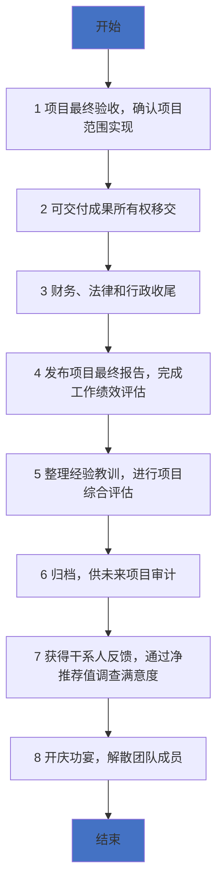

# 第8章: 项目管理生命周期--收尾过程组

# 课时 177 : 课前思考

| 标题  | 课时  | 章节  |
| --- | --- | --- |
| 进度  | 177  | 166 |

> 正式开始学习收尾过程组
> 以下思考题开始我们的学习

## 习题解析

在关闭项目或阶段过程中，以下所有情况都会发生？（选择3项）

- [x] A. 创建经验教训
- [x] B. 正式验收
- [x] C. 绩效报告
- [ ] D. 进行成本-效益分析
- [ ] E. 更新WBS词典

> 解析：
> 应该选 A、B、C
> 在关闭项目或阶段过程中，主要活动包括：创建经验教训总结项目知识、进行正式验收确认可交付成果、编制最终绩效报告。而成本-效益分析通常在规划阶段进行，WBS词典的更新主要在执行过程中发生。

----
# 课时 178 : 过程：结束项目或阶段.

| 标题  | 课时  | 章节  |
| --- | --- | --- |
| 进度  | 178  | 167 |

## 结束项目或阶段

| 输入 | 工具与技术 | 输出 |
| :--- | :--- | :--- |
| **1. 项目章程**  **2. 项目管理计划** &nbsp;&nbsp;&nbsp;&nbsp;1. 所有组件  **3. 项目文件** &nbsp;&nbsp;&nbsp;&nbsp;1. 假设/变更/问题日志 &nbsp;&nbsp;&nbsp;&nbsp;2. 估算基础 &nbsp;&nbsp;&nbsp;&nbsp;3. 经验教训登记册 &nbsp;&nbsp;&nbsp;&nbsp;4. 里程碑清单 &nbsp;&nbsp;&nbsp;&nbsp;5. 项目沟通记录 &nbsp;&nbsp;&nbsp;&nbsp;6. 质量检测/测量结果 &nbsp;&nbsp;&nbsp;&nbsp;7. 质量/风险报告 &nbsp;&nbsp;&nbsp;&nbsp;8. 需求文件 &nbsp;&nbsp;&nbsp;&nbsp;9. 风险登记册  **4. 验收的可交付物**  **5. 商业文件** &nbsp;&nbsp;&nbsp;&nbsp;1. 商业论证 &nbsp;&nbsp;&nbsp;&nbsp;2. 收益管理计划  **6. 协议**  **7. 采购文档** | **1. 专家判断**  **2. 数据分析** &nbsp;&nbsp;&nbsp;&nbsp;1. 文件分析 &nbsp;&nbsp;&nbsp;&nbsp;2. 回归分析 &nbsp;&nbsp;&nbsp;&nbsp;3. 趋势分析 &nbsp;&nbsp;&nbsp;&nbsp;4. 偏差分析  **3. 会议** | **1. 最终产品、服务或结果移交**  **2. 最终报告**  **3. 项目文件（更新）** &nbsp;&nbsp;&nbsp;&nbsp;1. 经验教训登记册  **4. 组织过程资产（更新）** |

## 收尾流程

> 这里考试上也类似于之前的流程考试，告知当前项目的阶段和背景，要求选择下一个正确的步骤是哪个。
> 步骤都是需要记忆的
> 第一步中的 **可交付成果验收** 在确认范围过程中就一直有在执行， 监控过程组在整个项目生命周期中不停的执行
> 第二步，签字确认后，所有权进行移交
> 第三步，路费报销，合同结款，争议解决等
> 第四步，最终报告发布，通知所有人，项目结束
> 第五步，总结经验教训，组织经验总结应该在生命周期一直做
> 第六步，项目文件需要归档，整理
> 第七步，问卷调查，净推荐值（你愿意用多少分向朋友推荐这个 App）等手段来进行成果评估
> 第八步，庆功宴，主要用于团队解散，规划好团队成员的去向，提升成员的信任度

| 序号 | 知识点 | 重点 |
| :--- | :--- | :--- |
| 1 | 工具 | 文件/回归/偏差/趋势分析 |
| 2 | 输出 | 最终产品、服务或结果移交 最终报告 经验教训登记册 |
| 3 | 收尾流程 | 先验收 后移交 再收尾 发报告 勤总结 来归档 问客户 后解散 |

## 习题解析

在关闭项目或阶段过程中，以下所有情况都会发生？（选择3项）

- [x] A. 创建经验教训
- [x] B. 正式验收
- [x] C. 绩效报告
- [ ] D. 进行成本-效益分析
- [ ] E. 更新WBS词典

> 解析：
> 应该选 A、B、C
> 在关闭项目或阶段过程中，主要活动包括：创建经验教训总结项目知识、进行正式验收确认可交付成果、编制最终绩效报告。
> 而成本-效益分析通常在规划阶段进行，
> WBS词典的更新主要在执行过程中发生。

---

# 课时 179 : 输出：最终报告&经验教训登记册

| 标题  | 课时  | 章节  |
| --- | --- | --- |
| 进度  | 179  | 168 |

## 最终报告&经验教训登记册

### 最终报告 / Final report

==项目绩效汇总==，其中包括关于最终产品、服务或结果如何满足商业计划所述业务需求的概述。如果在项目结束时未能满足业务需求，则指出需求满足程度并预计业务需求何时能够得到满足。

### 经验教训登记册 / Lessons learned register

用于记录在项目中所获知识的项目文件，已用于当前项目，并列入经验教训知识库。经验教训登记册在项目早期创建，作为管理项目知识过程的输出。因此，在整个项目期间，它可以作为很多过程的输入，也可以作为输出而不断更新。==参与工作的个人和团队也参与撰获经验教训==。

## 本节知识点

| 序号 | 知识点 | 重点 |
| :--- | :--- | :--- |
| 1 | 最终报告 | 项目绩效总结 |
| 2 | 经验教训登记册 | 项目的干系人整理经验教训 |

## 习题解析

以下关于经验教训登记册的说法，正确的是哪一个？

- [ ] A. 经验教训登记册只在项目结束时编写
- [ ] B. 经验教训登记册只能由项目经理来填写
- [x] C. 经验教训登记册可以为未来项目提供参考
- [ ] D. 经验教训登记册不需要更新

> 解析：
> 应该选 C
> 经验教训登记册在项目早期就开始创建，在整个项目期间持续更新，参与项目的所有干系人都可以参与撰写，其主要目的就是为当前项目和未来项目提供参考和指导。
>
---

# 课时 180 : 收尾过程组知识点总结

| 标题  | 课时  | 章节  |
| --- | --- | --- |
| 进度  | 180  | 169 |

## 收尾流程组知识点总结

### 收尾流程

> 主要对应收尾流程的 #2， #4， #5
> 重点还是记忆整个收尾的流程
---

# 课时 181 : 收尾过程组：闯关题

## 11-收尾过程组（166小节-169小节）闯关题

**客户已经接受了已完成的项目范围。然而，项目管理办公室要求的经验教训还没有完成。这个项目的状态是什么？**

A.	该项目是不完整的，因为它需要被重新规划。

B.	该项目是不完整的，直到所有的项目和产品交付物都完成并被接受。

C.	该项目是完整的，因为客户已经接受了可交付的产品。

D.	该项目是完整的，因为它已经到达了它的到期日。

正确答案：B ， 回答正确

> 解析：
项目管理办公室要求的经验教训总结是项目的一项重要交付物。虽然客户已经接受了已完成的项目范围，但只要还有未完成的项目和产品交付物，项目就不能被认为是完整的。经验教训的总结对于组织积累知识、改进未来项目的执行具有重要意义，是项目收尾阶段的必要工作之一。
选项 A 中说项目需要重新规划在题干中没有依据；
选项 C 只考虑了客户对可交付产品的接受，忽略了经验教训这一交付物；
选项 D 中题干未提及项目到达到期日，且即使到达到期日，只要有未完成的交付物，项目也不能算完整。

**一个项目的客户告诉项目经理，他们已经没有钱来支付这个项目了。项目经理应该先做什么？**

A.	将更多的工作转移到计划的后期，以便有时间让客户得到资金。

B.	关闭项目或阶段。

C.	停止工作。

D.	释放项目组的一部分人。

正确答案：B ， 你的答案：A回答错误

> 解析：
当客户明确表示没有钱支付项目时，这意味着项目失去了关键的资金支持，继续进行下去会面临巨大风险。关闭项目或阶段是较为合适的第一步，需要按照既定的收尾流程来处理，如整理项目文档、进行项目总结、妥善处理项目资源等，以确保项目的结束是有序的，同时也能及时止损，避免进一步的资源浪费和成本增加。
选项 A 将工作转移到后期并不能解决客户资金短缺的根本问题，而且可能会导致项目成本进一步增加，同时还可能影响项目的整体进度和质量。
选项 C 直接停止工作虽然能暂时避免成本继续增加，但没有考虑到项目收尾的一系列事宜，可能会给后续带来诸多麻烦，如合同纠纷、资源闲置等问题。
选项 D 释放项目组的一部分人也只是部分解决资源闲置问题，没有从整体上处理项目因资金问题而面临的困境，并且可能会影响项目的后续处理工作。

**在获得项目可交付成果的最终验收时，为促进项目收尾，项目经理应该立即执行下列哪一项？**

A.	与团队成员总结经验教训

B.	通过收集客户对项目的反馈，衡量客户的满意度

C.	为项目文件和资料存档，保留组织知识

D.	将可交付成果的所有权转移到任命的干系人

正确答案：D ， 你的答案：B回答错误

> 解析：
在获得项目可交付成果的最终验收后，应首先将可交付成果的所有权转移给任命的干系人，这标志着项目的正式结束和成果的正式移交，是项目收尾阶段的关键步骤。其他选项虽然也是项目收尾阶段的重要工作，但在顺序上应排在交付成果所有权转移之后。具体分析如下：
A 选项：与团队成员总结经验教训是项目收尾的重要环节，有助于积累知识和改进未来项目，但它并非在获得最终验收后立即要做的事情，而是在完成成果移交等主要工作后进行。
B 选项：收集客户反馈、衡量客户满意度也是项目收尾的一部分，可帮助评估项目的整体效果，但同样应在C选项后面开展。
C 选项：项目文件和资料存档是项目收尾的必要工作，可保留组织知识，但它也不是在获得验收后最紧急要做的，应在A选项后面再进行系统的整理和存档。

**以下哪项是结束项目或阶段过程的工具与技术?**

A. 项目管理信息系统  

B. 偏差分析

C. 多标准决策分析  

D. 挣值分析

正确答案：B ， 你的答案：D回答错误

> 解析：
偏差分析是结束项目或阶段过程中对项目绩效进行评估的工具与技术。
A 选项：项目管理信息系统主要用于项目执行过程中对信息的收集、整理、存储和传递，帮助项目经理和团队成员进行项目管理和决策。
C选项：多标准决策分析通常用于在多个方案中进行选择，在项目的规划、选择等阶段使用较多，也不是结束项目或阶段过程的工具与技术。
D 选项：挣值分析是一种具体的数据分析技术，主要用于在项目执行过程中衡量项目的进度和成本绩效。

**项目收尾时，应该对谁开展满意度调查?**
A.	客户

B.	发起人

C.	项目团队成员

D.	主要干系人

正确答案：D ， 你的答案：A回答错误

> 解析：
项目收尾时开展满意度调查的目的是全面了解项目干系人对项目整体情况的评价和意见，以便总结经验教训，为未来项目提供参考。主要干系人包括客户、发起人、项目团队成员、供应商、监管机构等，他们都与项目有着密切的关系，并且在项目过程中有着不同的利益和期望。对主要干系人进行满意度调查能够更全面、客观地评估项目的成功程度和影响，所以应选择 D 选项。而 A、B、C 选项都只是主要干系人中的一部分，不够全面。

---