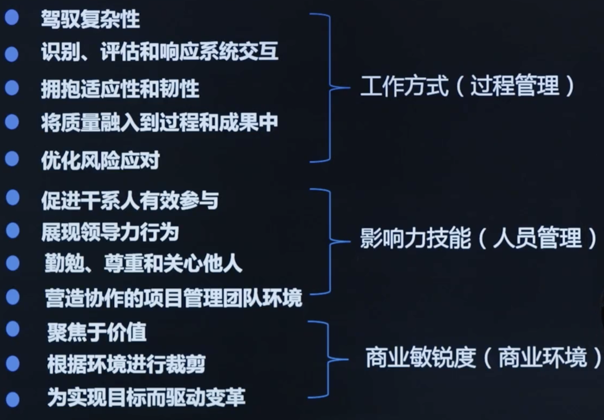

# 第4阶段: 《项目管理知识体系第七版》

# 第1章: 项目管理原则

## 课时 238 : 课前思考

# 课时 239 : 项目管理1-2

| 标题  | 课时  | 章节  |
| ---- | ---- | ---- |
| 进度  | 239  | 2 |

原则1

## **原则一：成为勤勉、尊重和关心他人的管家**

具体解读：

管家式管理（stewardship）是对项目管理工作者的核心要求和生动的隐喻。将项目管理工作者形容成“管家”，考生需要特别注意四个核心关键词：正直诚信、关心、可信、合规。

合规：管家需==遵守==其组织内外得到适当授权的法律、规则、法规和==要求==。
如果管家在行动或计划==是否符合既定准则方面==遇到了相互冲突的准则或问题，他们需要==寻求适当的建议和指导。==

## 管家式管理

在遵守内部和外部准则的同时，管家应以负责任的方式行事，以正直、关心和可信的态度开展活动。他们应对其所支持的项目的财务、社会和环境影响做出广泛承诺。

▶ 管家式管理包括在组织内部和外部的职责。

▶ 管家式管理包括：

- 正直；
- 关心；
- 可信；
- 合规。

▶ 承诺整体观的管家式管理会考虑财务、社会、技术和可持续性的环境意识。

> 考试的时候体现在 合规 上。 

原则2

## 原则二：营造协作的项目团队环境

具体解读：

此条原则对应考纲中“人员”的部分。此条原则有三个关键词：**团队共识、组织结构** 和 **过程**。

## 团队

项目团队由具有多样的技能、知识和经验的个人组成。与独自工作的个人相比，协同工作的项目团队可以更有效率且有效果地实现共同目标。

▶ 项目是由项目团队交付的。

▶ 项目团队在组织和职业文化和准则的范围内开展工作，通常会建立自己的本地文化。

▶ 协作的项目团队环境有助于：

- 与其他组织文化和指南保持一致；
- 个人和团队的学习和发展；
- 为交付期望成果做出最佳贡献。

## 本节知识点

| 序号 | 知识点 | 重点 |
| :--- | :--- | :--- |
| 1 | 原则一 | 正直诚信、关心、可信、合规 |
| 2 | 原则二 | 营造协作的项目团队环境 |

## 习题解析

某项目经理负责一个跨国项目，项目涉及多个国家的业务和法规要求。在项目执行过程中，以下哪种做法符合合规要求？

- [ ] A. 为了节省成本，在部分国家使用当地一些未经授权但价格低廉的软件工具，只要不被发现就没问题
- [x] B. 项目团队定期收集并更新各个国家相关业务和法规的信息，确保项目活动始终符合当地要求
- [ ] C. 当项目在不同国家的法规要求出现冲突时，项目经理自行决定按照对项目进度最有利的法规执行
- [ ] D. 对于一些繁琐且对项目核心业务影响不大的法规，项目经理决定先忽略，等项目结束后再考虑是否合规

> 解析：
> 应该选 B
> 管家式管理要求项目管理者遵守组织内外得到适当授权的法律、规则、法规和要求。项目团队定期收集并更新各国相关业务和法规信息，确保项目活动始终符合当地要求，是符合合规原则的正确做法。

---

# 课时 240 : 项目管理原则 3-4

| 标题  | 课时  | 章节  |
| ---- | ---- | ---- |
| 进度  | 240  | 3 |

原则3

## **原则三：有效地干系人参与**

具体解读：

如果想让干系人更好地参与到项目中，需要识别干系人、制定干系人参与计划、管理干系人参与、监督干系人参与。
并通过一些工具和方法让干系人更好的支持项目。

> 注意客户的喜好，和客户同频，拉进个人关系，从而搞好关系

## 干系人

积极主动地让干系人参与进来，使他们的参与达到促使项目成功和客户满意所需的程度。

▶ 干系人会影响项目、绩效和成果。

▶ 项目团队通过争取其他干系人参与为他们服务。

▶ 干系人参与积极推动价值交付。

原则4

## **原则四：聚焦于价值**

具体解读：

价值实现是项目成功的最终指标和驱动因素，而不是完成项目的某项任务本身。
做完项目，项目不一定能够成功，产生价值，才叫真的成功。
价值、收益和成果的关系是：价值通过收益的实现作基础，收益以成果的实现作为载体。

## 价值

对项目是否符合商业目标以及预期收益和价值持续进行评估并作出调整。

▶ 价值是项目成功的最终指标。

▶ 价值可以在整个项目进行期间、项目结束时或项目完成后实现。

▶ 价值以及对价值具有促进作用的收益可以从定性和/或定量的角度来定义。

▶ 聚焦于成果可使项目团队能够支持创造价值的预期收益。

▶ 项目团队评估进展并进行适应性调整，从而使期望的价值最大化。

> 价值以收益的实现为基础，收益以成果的实现为载体

## 本节知识点

| 序号 | 知识点 | 重点 |
| :--- | :--- | :--- |
| 1 | 原则三 | 有效地干系人参与 |
| 2 | 原则四 | 聚焦于价值 |

## 习题解析

一个团队很难吸引客户参与。客户很少响应问题，频繁的不参与评审和演示，但是仍然期望着产品能够按时交付以及满足期望。项目经理应该做什么？

   - [x] A. 告诉客户参与项目活动的重要性
   - [ ] B. 让团队通过专家判断做出具有教育意义的决定
   - [ ] C. 停止开发，进行需求的收集
   - [ ] D. 请求其他干系人进行必要的客户反馈

> 解析：
> 应该选 A
> 根据原则三"有效地干系人参与"，项目经理需要积极主动地让干系人参与进来，使他们的参与达到促使项目成功和客户满意所需的程度。当客户参与度不足时，首先应该沟通并告知客户参与项目活动的重要性，让客户理解其参与对项目成功的关键作用。

---

# 课时 241 : 项目管理原则 5-6

| 标题  | 课时  | 章节  |
| ---- | ---- | ---- |
| 进度  | 241  | 4 |

原则5

## 原则五：识别、评估和响应系统交互

具体解读：
项目不是孤立存在的，在组织中它可能在某一个项目集中，项目集可能又在一个项目组合里面。这就导致项目经理不能只在项目层面思考项目，要在整个系纺体系中思考项目。

### 系统思考

从整体角度识别、评估和响应项目内部和周围的动态环境，从而积极地影响项目绩效。

▶ 项目是由多个相互依赖且相互作用的活动域组成的一个系统。

▶ 系统思考需要从整体角度了解项目的各个部分如何相互作用以及如何与外部系统交互。

▶ 系统不断变化，需要始终关注内部和外部条件。

▶ 项目团队应该对系统交互作出响应，从而允许项目团队充分利用积极的成果。

原则6

## 原则六：展现领导力行为

**具体解读：**

项目通常涉及多个组织、部门、职能或供应商，他们会不定期互动，面临不同的冲突。

所以项目中的==任何团队成员可能都需要表现出领导力行为==，来推动协同高绩效项目会有更多的人，更频繁地表现出有效的令导力行为。

领导力需要特别关注干系人的能力和意原

### 领导力

展现并调整领导力行为，为个人和团队的需要提供支持。

▶ 有效的领导力可促成项目取得成功，且有助于项目取得积极成果。

▶ 任何项目团队成员都可以表现出领导力行为。

▶ 领导力与职权不同。

▶ 有效的领导者会根据情境调整自己的风格。

▶ 有效的领导者会认识到项目团队成员之间的动机差异。

▶ 领导者应在以诚实、正直和道德行为规范方面展现出期望的行为。

> 考试：项目组的领导人风格，项目组自组织

## 本节知识点

| 序号 | 知识点 | 重点 |
| :--- | :--- | :--- |
| 1 | 原则五 | 识别、评估和响应系统交互 |
| 2 | 原则六 | 展现领导力行为 |

## 习题解析

在一个大型智慧城市建设项目中，涉及智能交通、智慧能源、智慧医疗等多个子系统。以下关于该项目经理做法的描述，正确的是哪一个？

   - [ ] A. 项目经理认为只要每个子系统能独立稳定运行，就不会存在系统交互问题，无需特别关注
   - [ ] B. 在项目启动阶段，项目经理组织团队识别出了智能交通系统与智慧能源系统可能存在电力供应与能耗监测方面的交互，便将其记录下来，后续无需再更新
   - [x] C. 当智慧医疗系统接入后，发现与智能交通系统在数据共享和隐私保护方面存在冲突，项目经理立即组织相关团队评估影响并制定应对措施，调整数据交互方式
   - [ ] D. 项目经理只关注了项目内部各子系统之间的交互，对于项目与外部环境，如政府政策调整、城市基础设施升级等方面的交互认为不属于项目范畴，无需考虑

> 解析：
> 应该选 C
> 根据原则五"识别、评估和响应系统交互"，系统思考需要从整体角度了解项目的各个部分如何相互作用以及如何与外部系统交互。系统不断变化，需要始终关注内部和外部条件，项目团队应该对系统交互作出响应。选项C正确体现了发现系统交互问题后，立即组织评估并制定应对措施的做法。选项A忽视了系统交互问题；选项B认为记录后无需更新，违背了系统持续变化的特点；选项D忽视了项目与外部环境的交互。
---

# 课时 242 : 项目管理原则 7-8

| 标题  | 课时  | 章节  |
| ---- | ---- | ---- |
| 进度  | 242  | 5 |

原则7

## 原则七：根据环境进行裁剪

具体解读：

项目具有独特性，既有独特的交付成果，又有独特的项目环境。
选择刚好适合项目的流程、工具和开发方法是非常重要的，这就需要根据项目户环境进行定制化的裁剪。

## 裁剪

根据项目的背景及其目标、干系人、治理和环境设计项目开发方法，使用“刚好够”的过程实现预期成果，同时使价值最大化、管理成本并提高速度。

- 每个项目都具有独特性。
- 项目成功取决于适应项目的独特环境，以确定产生预期成果的最适当方法。
- 对方法进行裁剪是迭代的，因此在整个项目进行期间，这种裁剪是一个持续的过程。

> 裁剪的过程也是持续新的

原则8

## 原则八：将质量融入到过程和可交付物中

具体解读：

质量是产品、服务或成果的一系列内在特性满足需求的程度。
质量包括满足客户陈述或隐含需求的能力。
要对项目的产品、服务或成果进行测量，以砟定是否符合验收标准并适合使用的质量。

## 质量

对产生可交付物的质量保持关注，这些可交付物要符合项目目标，并与相关干系人提出的需要、用途和验收需求保持一致。

- 项目质量要求达到干系人期望并满足项目和产品需求。
- 质量聚焦于达到可交付物的验收标准。
- 项目质量要求确保项目过程尽可能适当而有效。

> 项目的质量要全员负责
> 要全生命周期的进行监控和改进
> 

## 本节知识点

| 序号 | 知识点 | 重点 |
| :--- | :--- | :--- |
| 1 | 原则七 | 根据环境进行裁剪 |
| 2 | 原则八 | 将质量融入到过程和可交付物中 |

## 习题解析

一个项目的工作正在进行中，项目经理无意中听到两个工人在争论一套说明的含义。项目经理调查后发现，目前正在浇筑的混凝土基座的施工说明在项目上使用的不同语言之间翻译得很差。以下哪项是该项目经理首先要做的最好的事情？

   - [ ] A. 找一个更有经验的人翻译这些说明
   - [x] B. 找出基座说明书翻译不规范的质量影响
   - [ ] C. 将这个问题提请团队注意，并要求他们寻找其他的翻译问题
   - [ ] D. 在下一个项目报告中告知发起人这个问题

> 解析：
> 应该选 B
> 项目经理发现翻译问题后，首先要评估这个问题对项目的影响，特别是对质量的影响。只有了解了问题的严重程度和影响范围，才能制定合适的应对措施。这体现了原则六"展现领导力行为"中有效的领导者会根据情境调整自己的风格，以及系统思考中评估和响应问题的原则。
> 选项A、C、D都是后续可能的行动，但都应该在评估影响之后进行。

---

# 课时 243 : 项目管理原则 9-10

| 标题  | 课时  | 章节  |
| ---- | ---- | ---- |
| 进度  | 243  | 6 |

原则9

## 原则九：驾驭复杂性

具体解读：

该原则旨在提醒当今的项目环境瞬息万变，项目难度越来越大，驾驭复杂性对项目成功来说是非常重要的一项能力。

项目的复杂性可能会出现在任何领域和项目生命周期的任何时点，并使项目受到影响。

## 复杂性

不断评估和驾驭项目复杂性，以便这些方法和计划使项目团队能够成功驾驭项目生命周期。

- 复杂性是由人类行为、系统交互、不确定性和模糊性造成的。
- 复杂性可能会出现在项目期间的任何时候。
- 影响价值、范围、沟通、干系人、风险和技术创新的事件或情况可能会造成复杂性。
- 在识别复杂性的要素时，项目团队可以保持警惕，并通过各种方法来降低复杂性的数量或影响。

> 以风险管理的形式出现

原则10

## 原则十：优化风险应对

具体解读：

风险是一个中性词，包含机会和威胁。项目风险管理的目的是持续评估风险敞口，最大化机会，最小化威胁。

需要注意的是，不但要分析项目的单个风险，还要分析项目的整体风险。

## 风险

持续评估风险敞口（包括机会和威胁），以最大化地发挥正面影响，并最小化对项目及其成果的负面影响。

- 单个和整体风险可能会对项目产生影响。
- 风险可能是积极的（机会），也可能是消极的（威肋）。
- 项目团队会在整个项目进行期间不断应对各种风险。
- 组织的风险态度、偏好和临界值会影响风险的应对方式。
- 风险应对措施应该：
- 与风险的重要性相匹配；
  - 具有成本效益；
  - 在项目环境中切合实际；
  - 相关干系人达成共识；
  - 由一名责任人承担。

## 本节知识点

| 序号 | 知识点 | 重点 |
| :--- | :--- | :--- |
| 1 | 原则九 | 驾驭复杂性 |
| 2 | 原则十 | 优化风险应对 |

## 练习题
一个系统开发项目在接近项目结束时，发现了一个以前没有发现的风险。这有可能影响项目的整体交付能力。接下来应该怎么做
A.提醒项目发起人对成本、范围、或进度的潜在影响。
B.分析风险。
C.通过制定一个风险应对计划来减轻这一风险。
D.，持续监控这个风险。

> 选 B
> A: 事无巨细不能都找发起人
> B: 正确
> C: 应该在 B 之后执行
> D: 应该在 B 之后执行

---

# 课时 244 : 项目管理原则 11-12

| 标题  | 课时  | 章节  |
| ---- | ---- | ---- |
| 进度  | 244  | 7 |

原则11

## 原则十一：拥抱适应性和韧性

具体解读：

适应性是指应对不断变化的情形的能力。韧性是指吸收冲击的能力和从挫折或失败中快速恢复的能力。
聚焦于成果而非输出，有助于增强适应性也就是说，关注项目真正的收益和价值，而不是交付的工作，对于拥抱适应性和韧性会更有帮助

## 适应性和韧性

将适应性和韧性融入组织和项目团队的方法之中，以帮助项目适应变革，从挫折中恢复过来并推进项目工作。

- 适应性是指应对不断变化的情形的能力。
- 韧性是指吸收冲击的能力和从挫折或失败中快速恢复的能力。
- 聚焦于成果而非输出，有助于增强适应性。

> 韧性是指遇到了难题和挫折，可以越挫越勇
> 跟项目的变更有关

原则12

## 原则十二：为实现预期的未来状态而驱动变革

具体解读：

**约翰科特领导变革八步法：**

- 营造紧迫感
- 组建强大的联盟
- 创建变革愿景
- 沟通愿景
- 清除障碍
- 创造短期成果
- 促进深入变革
- 巩固企业文化中的变革

> 重点要了解 **约翰科特领导变革八步法** 的前四个步骤

**萨提亚变革模型：**

- 因循守旧
- 外部干扰
- 混乱
- 思想转变
- 整合和实践
- 进入新常态

## 变革

使受影响者做好准备，以采用和维持新的和不同的行为和过程，即从当前状态过渡到项目成果所带来的预期未来状态所需的行为和过程。

- 结构化的变革方法可帮助个人、群体和组织从当前
- 状态过渡到未来的期望状态。
- 变革可能源于内部影响或外部来源。
- 促成变革可能具有挑战性，因为并非所有干系人都接受变革。
- 在短时间内尝试进行过多变革可能会导致变革疲
- 劳和/或受到抵制。
- 干系人参与和激励的方法有助于使变革顺利进行。

## 本节知识点

| 序号 | 知识点 | 重点 |
| :--- | :--- | :--- |
| 1 | 原则十一| 拥抱适应性和韧性 |
| 2 | 原则十二| 为实现预期的未来状态而驱动变革 |

## 练习题

**一个产品包括了很多的特性，包括了干系人的喜好以及当前的紧急工作。因为不可能所有的特性都成为产品的范围，项目经理应该怎么做？**

A. 组织团队会议，让团队对产品的愿景保持一致
B. 协助团队进行回顾以识别和解决超出范围特性的事情
C. 继续和团队一起工作在所有的特性上以满足所有的干系人
D. 根据产品范围，请求产品经理对待开发项工作进行优先级排序

> 选择：D
> A 不能做所有的特性
> B 团队回顾不是用来干这个的
> C 不能满足所有的干系人和需求
> D 正确

---

# 课时 245 : 项目管理原则知识点总结

| 标题  | 课时  | 章节  |
| ---- | ---- | ---- |
| 进度  | 245  | 8 |

## 项目管理十二原则总结

---

# 课时 246 : 项目管理原则:闯关题

## 16-第七版-项目管理原则（1小节-8小节）闯关题

**你的公司合规办公室刚刚发布了一项新的要求，即在每个高关键性产品发布之前必须提交一份复杂的安全检查表。由于这个表格原来并不需要，所以你没有制订完成它的计划。你的发布日期快到了，递交检查表的日期也快到了，你应该怎么做?**

A.	确保检查表填写准确并按时提交

B.	把完成和提交检查表的任务委托给你的项目的业务分析员

C.	根据历史记录，自己完成检查表

D.	要求PMO完成检查表

正确答案：A ， 回答正确

> 解析：
本题考查原则一。项目经理的责任是确保满足合规要求。在这种情况下，这意味着找到合适的人完成表格并确保按时提交。
B：把完成和提交检查表的任务委托给项目的业务分析员，业务分析员可能并不熟悉检查表的具体要求和填写规范，也可能没有足够的专业知识来确保检查表的准确性，而且作为项目经理，对项目的整体合规性负有主要责任，不能简单地将此任务委托他人，所以该选项不合适。
C：根据历史记录自己完成检查表是不可靠的，因为这是新发布的要求，历史记录可能不适用，不能保证检查表填写的准确性和完整性，可能会导致提交的检查表不符合要求，所以该选项不正确。
D：要求 PMO（项目管理办公室）完成检查表也是不合理的。PMO 主要负责提供项目管理的支持、标准和指导等，而不是代替项目经理完成具体项目的合规任务。项目经理应该对项目的合规性负责，确保按照公司要求完成并提交检查表，所以该选项错误。

**一个项目经理被任命为一个技术性很强的项目的负责人，而这个人对这个领域的熟悉程度有限。项目经理将制定进度、估算成本、确定活动和估算活动资源的过程全部委托给不同的项目组成员，自己基本上偶尔充当裁判和活动的协调者。这种方法的结果可能是什么？**

A.	团队在整个项目中以非常高的水平运作，显示出较高的创造力和承诺度

B.	团队最初经历了一些混乱，但经过一段时间后，成为一个有凝聚力的有效单位

C.	团队的生产力不高，但由于项目经理所创造的工作环境，大家保持在一起

D.	团队的特征为业绩差、士气低、冲突多、人员流动大

==正确答案：D ， 你的答案：B回答错误==

> 解析：
本题考查原则一。作为管家，项目经理必须管理和整合一个项目的所有方面。如果所有的活动都被委托出去，就会出现混乱，团队成员会花更多的时间争夺位置而不是完成活动。
A：项目经理将制定进度、估算成本、确定活动和估算活动资源等关键过程全部委托给不同成员，自己仅偶尔充当裁判和协调者，这种过度放权且缺乏有效管理的方式，无法为团队提供明确的方向和指导，难以激发团队的创造力和承诺度。团队成员可能因缺乏统一协调而各自为政，所以团队不太可能在整个项目中以非常高的水平运作，该选项错误。
B：虽然团队在经历混乱后有可能逐渐形成凝聚力，但在这种项目经理基本不参与关键项目管理过程的情况下，混乱可能会持续较长时间且难以有效解决。缺乏项目经理的引导和管理，团队很难顺利度过混乱期成为有凝聚力的有效单位，该选项不太可能。
C：项目经理在项目管理中承担着重要职责，过度放权使得项目管理缺失。团队成员可能因职责不清、目标不明确等问题导致生产力低下，同时由于缺乏有效的管理和支持，团队成员可能会对工作环境不满，难以保持在一起，而不是仅仅因为项目经理创造的所谓工作环境就能保持在一起，该选项错误。

**某研发项目刚刚召开完启动会，项目经理发现大家对项目的重要性有了一定的理解，但是大家针对项目的沟通机制、基本原则等的理解还不是很统一，对此，项目经理应该做什么?**

A.	向各团队成员的职能经理阐明项目的重要性

B.	向团队成员明确说清楚做不好项目会受到什么样的惩罚

C.	跟团队成员一起商讨项目的沟通机制，努力营造信任的团队环境和氛围

D.	让发起人去影响更多的干系人

正确答案：C ， 回答正确

> 解析：
“原则二:营造协作的项目团队环境”。这个原则背后蕴含着丰富的哲理,PMI不推荐项目启动阶段就通过权力压服他人.而是通过制定透明的沟通机制，让项目团队成员形成正向的项目团队文化这是考查的重点。
A：项目启动会后，团队成员已经对项目的重要性有了一定理解，此时向各团队成员的职能经理阐明项目的重要性，并不能解决团队成员对项目沟通机制、基本原则等理解不统一的问题，所以该选项不合适。
B：向团队成员明确说清楚做不好项目会受到什么样的惩罚，这种方式可能会给团队成员带来压力，导致他们产生抵触情绪，不利于营造良好的团队氛围，也无法从根本上解决团队成员对项目相关机制和原则理解不统一的问题，所以该选项不正确。
D：让发起人去影响更多的干系人，主要是针对干系人管理方面，而不能直接解决团队成员对项目沟通机制和基本原则理解不统一的问题，所以该选项不符合题意。

在项目进行过程中，行政部的专员向项目经理抱怨，他不清楚项目经理在项目中的工作职责和身份，不知道如何协助其他人做好这个项目。项目经理本应该在项目早期怎么做以防止此类问题的发生?

A.	在项目早期，通过不同的沟通方法，在组织内外准确地说明自己的身份、角色、所在项目团队及其职权，以便大家清楚他作为项目管家的角色定位

B.	在项目启动阶段，转发带有项目章程的附件的邮件，告诉此行政专员项目章程中已经写清楚项目经理和发起人的职责

C.	在召开的启动会上，让大家反馈不清楚的问题。如果有人问起项目经理的职责范围，再单独制作一个文件，说明项目经理的职责

D.	通过发起人的力量，在项目的早期借力搞定诸多细节问题，没有必要在细枝末节的问题上浪费太多的时间和精力

==正确答案：A ， 你的答案：B回答错误==

> 解析：
本题考查的是对“原则一:成为勤勉、尊重和关心他人的管家中“可信”的理解。管家需要名正言顺地推动项目，需在组织内外准确地说明自己的身份、角色、所在项目团队及其职权，以便大家清楚管家的角色定位。
B：仅仅转发带有项目章程附件的邮件，告知行政专员项目章程中已写明项目经理和发起人的职责，可能存在行政专员没有仔细阅读或对章程内容理解不清晰的情况，不能确保其准确了解项目经理的工作职责和身份，无法有效防止此类问题，所以该选项不合适。
C：在启动会上等待有人问起项目经理的职责范围再单独制作文件说明，是一种被动的处理方式，不能保证所有相关人员都能主动询问并及时获取准确信息。而且在项目早期没有主动明确职责，可能会导致在项目进行过程中出现沟通不畅等问题，所以该选项不正确。
D：通过发起人的力量搞定诸多细节问题，而不主动明确自己的职责，无法从根本上解决相关人员不清楚项目经理工作职责和身份的问题。同时，忽视这些细节问题可能会对项目的顺利进行产生负面影响，所以该选项不可取。

**项目团队成员来自不同的国家和地区，项目经理在管理团队的时候，应该注意什么？**

A.	在保证项目基本原则的基础上，让团队成员充分表达意见，并尊重个人的文化习惯

B.	推动强有力的标准化规则，让团队成员努力遵守，提高项目的效率

C.	充分尊重项目团队成员的文化和习惯，在不同的规则下进行项目运作

D.	询问项目发起人的意见，让发起人制定相关的统一规则，来约束不同地区的项目成员

正确答案：A ， 回答正确

> 解析：
在“原则二:营造协作的项目团队环境”中，提到多元化的项目团队可以将不同的观点汇集起来，丰富项目环境。但是多元化的前提是得有一个基本规则，在基本规则的要求下，保持大家的特色，才是高效的项目运作方法。
B：推动强有力的标准化规则，可能会忽略团队成员的文化差异，导致一些成员难以适应，从而影响团队的凝聚力和工作效率，所以该选项不太合适。
C：充分尊重项目团队成员的文化和习惯是正确的，但在不同的规则下进行项目运作可能会导致项目管理的混乱，缺乏统一的标准和协调，不利于项目目标的实现，所以该选项不正确。
D：询问项目发起人的意见是可以的，但让发起人制定相关的统一规则可能无法充分考虑到团队成员的实际情况和文化差异，而且发起人可能并不了解具体的团队管理细节，所以该选项也不是最佳选择。

**关于变革管理，如下哪个说法是不正确的?（选两个）**

A.	变革管理是一种综合的、周期性的和结构化的方法，可使个人、群体和组织从当前状态过渡到实现期望收益的未来状态

B.	有效的变革管理采用激励型策略，而不是强制型策略

C.	变革管理的第一步是组建强大的联盟

D.	变革管理是一种内在的过程，工具、方法、流程不能真正推动变革的发生

E.	变革管理更强调的是大家从内在认可变革的价值，主动地发生改变参与到变革过程中，而不是从外在强迫他人服从变革

正确答案：C,D ， 你的答案：A,E回答错误

> 解析：
>
> A：变革管理确实是一种综合的、周期性的和结构化的方法，旨在帮助个人、群体和组织从当前状态过渡到期望的未来状态，以实现预期收益，该说法正确。
> B：有效的变革管理通常采用激励型策略，通过激发员工的积极性和主动性来推动变革，而不是依靠强制型策略，因为强制可能会引起员工的抵触，该说法正确。
> C：根据约翰科特的变革八步法，变革管理的第一步通常是营造紧迫感，让组织成员认识到变革的必要性，而不是组建强大的联盟，该说法错误。
> D：变革管理是一个可以通过各种工具、方法和流程来推动的过程，并非是一种完全内在的、无法通过外在手段推动的过程，该说法错误。
> E：变革管理强调让大家从内在认可变革的价值，主动参与到变革过程中，而不是强迫他人服从变革，这样能够提高变革的成功率和可持续性，该说法正确。

