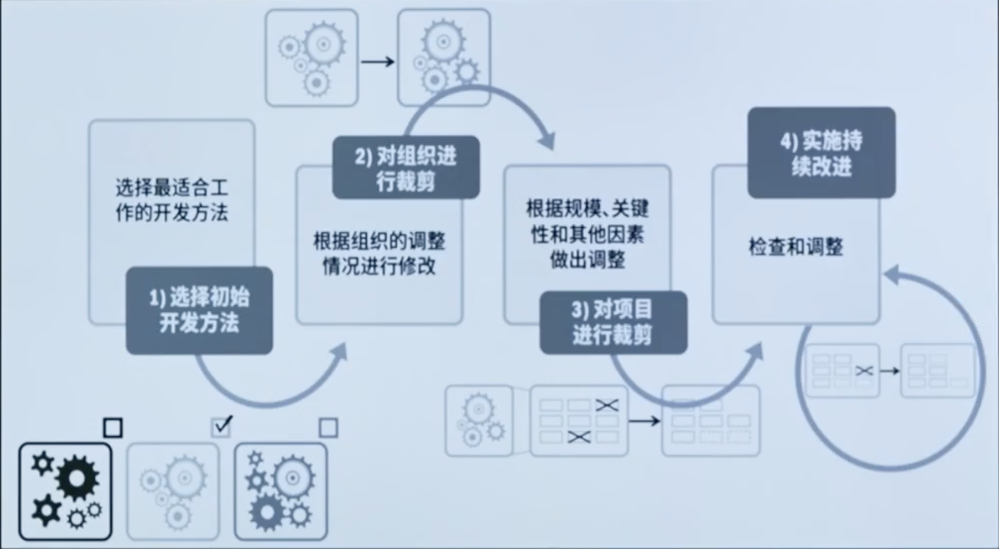
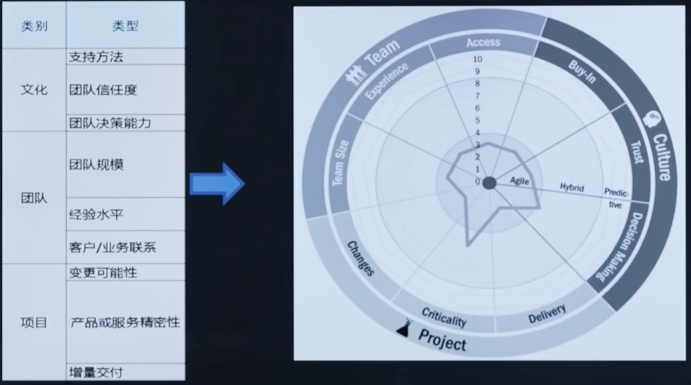
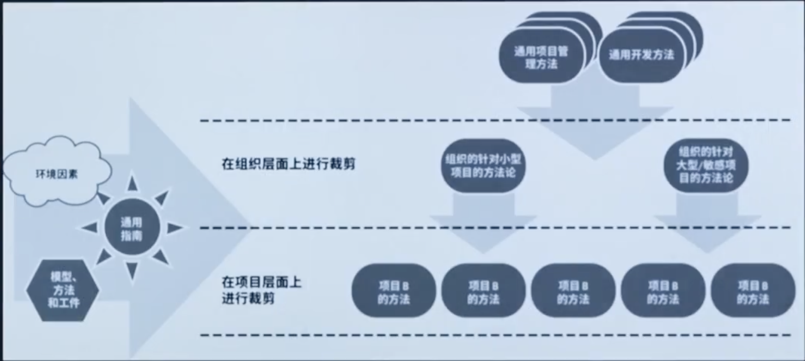
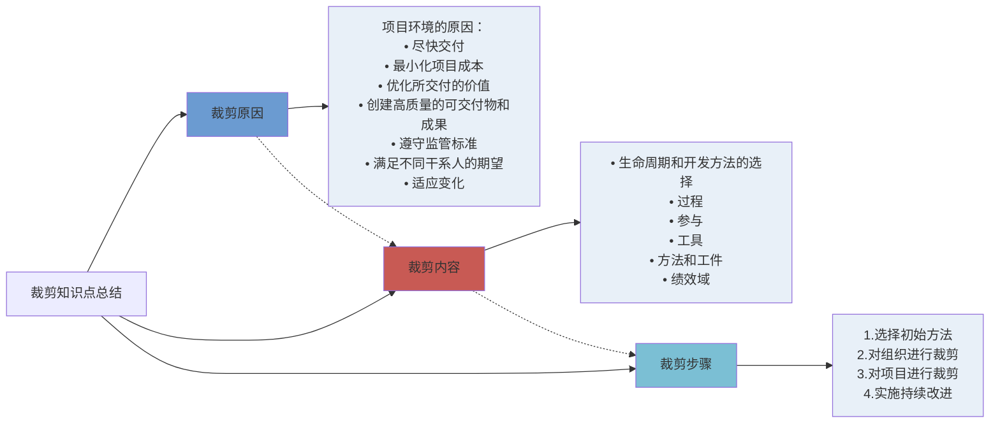

# 第3章: 裁减

# 课时 249 : 课前思考

# 课时 250 : 裁剪概括、原因和裁剪内容

| 标题  | 课时  | 章节  |
| ---- | ---- | ---- |
| 进度  | 250  | 17 |

## 裁剪概述和原因

裁剪的替代方案是使用未经修改的框架或方法论。有许多方法论可以描述项目中使用的过程、阶段、方法、工件和模板。这些方法论及其组件不是根据组织环境定制的。

==它们中的大多数都有明确的指导说明，它指出不应只是严格遵守，而是要经过一个裁剪过程，以便根据项目的特定类型、规模和复杂性确定哪些要素最有用。==

项目的运行环境非常复杂，需要平衡下列潜在的互相矛盾的要求，包括但不限于：

- 尽快交付：
- 最小化项目成本；
- 优化所交付的价值；
- 创建高质量的可交付物和成果；
- 遵守监管标准；
- 满足不同干系人的期望；
- 适应变化。

## 裁剪内容

可以裁剪的项目方面包括：

- 生命周期和开发方法的选择：一些大型项目可能同时使用各种开发和交付方法的组合。
  例如，建设新的数据中心可能涉及（a）使用预测型方法进行建筑施工和装修，
  和（b）采用迭代型方法来了解和构建所需的计算能力。
  从项目层面来看，这种组合代表着混合型方法，但施工团队和计算团队可能只会使用预测型或迭代型开发方法。
- 过程：例如，对一个集中办公、具有良好沟通的小型项目团队，可以取消会议记录。
- 参与：例如，在具有挑战性或有时间约束的项目中，指派经验丰富的项目团队成员比使用经验不足的项目团队成员更合乎逻辑。
- ==工具==：通常，==项目团队==最了解适合情况的工具，但这些选择可能需要根相关成本做出调整。
- ==方法和工件==：对将用于项目的文档、模板和其他工件进行裁剪有助于确份工件适合项目和组织。
- 绩效域：为适合项目背景进行裁剪。
- 
## 本节知识点

| 序号 | 知识点 | 重点 |
| :--- | :--- | :--- |
| 1 | 裁剪的原因 | 项目运行环境的复杂性和矛盾性 |
| 2 | 裁剪的内容 | 生命周期和开发方法的选择 过程 参与 工具 方法和工件 绩效域 |

## 练习题

在一个大型的智能城市建设项目中，涵盖了基础设施建设、软件开发以及数据管理等多个领域。项目管理团队正在考虑如何对项目进行裁剪以更好地适应项目需求，以下做法正确的是什么？
A. 由于项目涉及多个领域，所以在整个项目中统一采用敏捷开发方法，认为这样能快速响应变化
B. 对于基础设施建设部分，因为施工流程相对固定，所以采用预测型方法：软件开发部分采用迭代型方法，数据管理部分采用敏捷方法，不同部分使用不同的开发方法
C. 不管项目团队规模大小和沟通情况如何，一律严格按照公司标准流程，每次会议都必须详细记录会议内容
D. 为了节省成本，在工具选择上，优先选用免费但功能有限的工具，而不考虑项目实际需求对工具功能的要求

> 选 B
> 其他几个选项都没有考虑到项目裁剪的必要性

---

# 选修： 裁剪过程（选修）

| 标题  | 课时  | 章节  |
| ---- | ---- | ---- |
| 进度  | ---  | 18 |

## 裁剪过程

项目存在于可能对其有影响的环境中。在进行裁剪之前，需要分析和理解项目环境。
进行裁剪时通常首先会选择开发和交付方法、对组织进行裁剪、对项目进行裁剪，然后实施持续改进。

## 选择初始开发方法

合适性筛选器这种工具可帮助项目团队考虑项目是否具有适合预测型、混合型或适应型方法的特征。

根据文化、项目团队和项目因素，通过对标准进行评估，

台适性筛选器可生成诊断性视觉资料，这些视觉资料有助于讨论和确定初始方法。

## 对组织和项目进行裁剪

- 对组织的方法裁剪包括增加、取消和重新配置该方法的要素，以使该方法更适合组织。
- 对项目进行裁剪受许多属性影响。这些属性主要包括：产品/可交付物、项目团队、文化。
- 内部项目裁剪可能只需项目经理批准即可，而对外部团队有影响的裁剪变更可能需经 PMO或 VDO 批准。
- 更多使用适应型方法的交付组织可能会设立 VDO。VDO 承担着促进者的角色，而非管理或监督职能。它侧重于为项目团队提供教练；在整个组织内培养适应性技能和能力；以及辅导发起人和产品负责人更有效地承担这些角色。

## 实施持续改进

- 裁剪过程并非单一的，一次性的过程。在渐进明细过程中，项目國队的工作方式、产品或可交付物的演变方式，以及其他知识等问题将表明哪些进一步的裁剪可以带来改进。审查点、阶段关口和回顾会议都提供了必要的检查和调整过程、开发方法和交付频率的机会。
- 让项目团队参与过程改进可以培养主人翁意识，并表现出对实施持续改进和质量的承诺。让项目团队参与寻找和实施改进措施也表明了对他们自己的技能和建议以及赋能的信任。项目团队参与裁剪展示了创新和改进而不是安于现状的思维模式。

#### 表 3-1. 常见情况和裁剪建议

| 情况 | 裁剪的建议 |
| :--- | :--- |
| 内置类的可交付物 | 增加更多反馈性实做环节和质量保证步骤。 |
| 团队成员不确定该如何继续或开展工作 | 增加更多指导、培训及核实步骤。 |
| 等待审批的时间过长 | 在项目一定价值临界值之内，尝试通过更少的授权人简化审批决策流程。 |
| 在制品过多，或报废率过高 | 运用价值流图和看板等技术将工作可视化，识别问题并提出解决方案。 |
| 干系人没有参与或分享负面反馈 | 评估与干系人是否分享了充分的信息、反馈循环是否存在且有效，以及更大人的参与是否可能比简单的沟通更为有效。 |
| 对项目进展缺乏可视性和了解。 | 进行检查，以确保团队和干系人会议期间正在收集、分析、分享和讨论当前的情况；确认团队内部和干系人就相关情报形成一致。 |
| 持续出现团队未准备好应对的问题和/或风险，需要团队做出反应，而非处理进展中的工作。 | 探究根本原因，以识别项目过程或支持中是否存在相关差距。 |

## 本节知识点

| 序号 | 知识点 | 重点 |
| :--- | :--- | :--- |
| 1 | 步骤 | 选择初始开发方法 对组织和项目进行裁剪 实施持续改进 |

## 练习题

**某公司承接了一个创新型电子产品研发项目，项目团队准备对项目管理方法进行裁剪。关于裁剪步骤的实施，以下做法正确的是什么？**

A. 项目团队跳过选择初始开发方法这一步，直接按照以往类似项目经验进行项目管理，认为这样可以节省时间
B. 选择初始开发方法时，项目团队结合项目创新性强、需求变化可能较大的特点，决定先采用敏捷开发方法作为初始选
C 在对组织和项目进行裁剪时，仅考虑了项目的规模大小，忽略了组织的文化、资源可用性以及项目的复杂程度等因素
D. 项目实施过程中，虽然遇到了一些问题，但团队认为只要按照既定的裁剪方案执行就可以，不需要进行持续改讲

> 选项 B 对
> A 不能跳过
> C 考虑不够全面
> D 不进行持续改进不行

---

# 选修： 裁剪知识点总结（选修）

| 标题  | 课时  | 章节  |
| ---- | ---- | ---- |
| 进度  | ---  | 19 |

## 裁剪原因

**项目环境的原因：**

- 尽快交付；
- 最小化项目成本；
- 优化所交付的价值；
- 创建高质量的可交付物和成果；
- 遵守监管标准；
- 满足不同干系人的期望；
- 适应变化。

> 裁剪原因总结七字口诀：
> 快，省，优，高，规，期，变

## 裁剪内容

- 生命周期和开发方法的选择；
- 过程；
- 参与；
- 工具；
- 方法和工件；
- 绩效域。

> 裁剪内容
> 周，程，参，具，法，绩

## 裁剪步骤

1. 选择初始方法；
2. 对组织进行裁剪；
3. 对项目进行裁剪；
4. 实施持续改进。

> 裁剪步骤
> 选，组，项，持改进

## 裁剪知识点总结

---