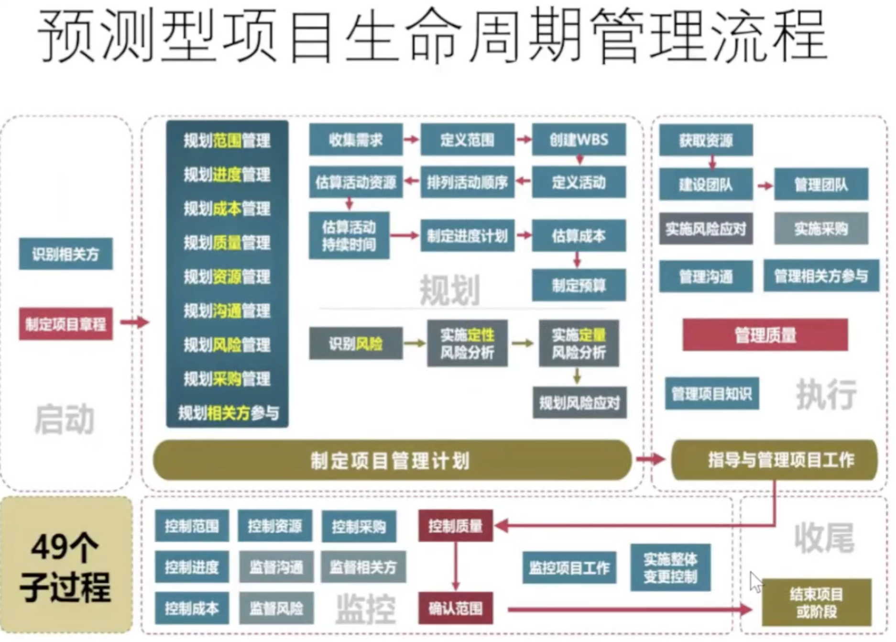
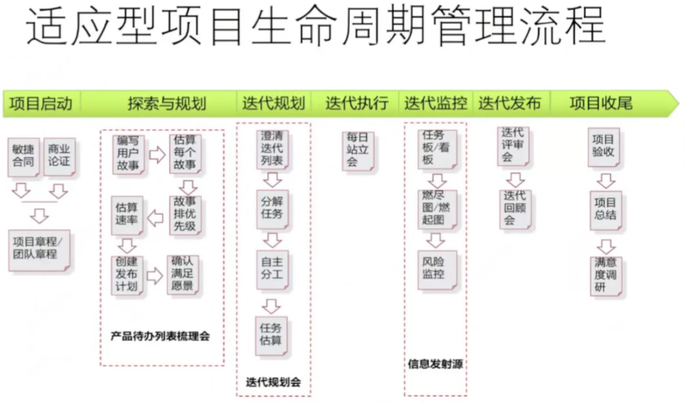
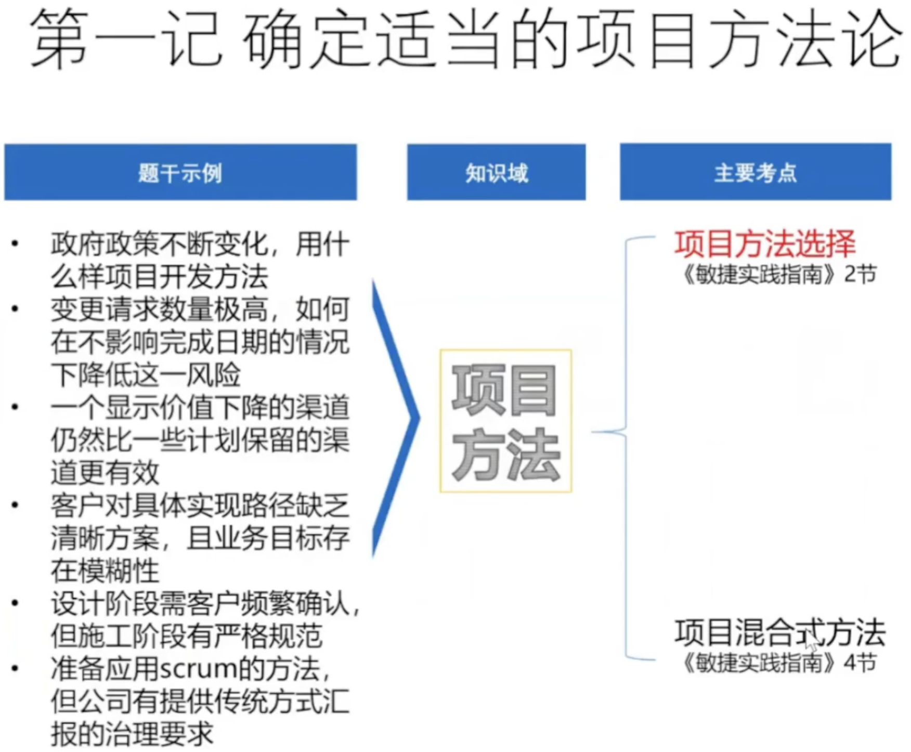
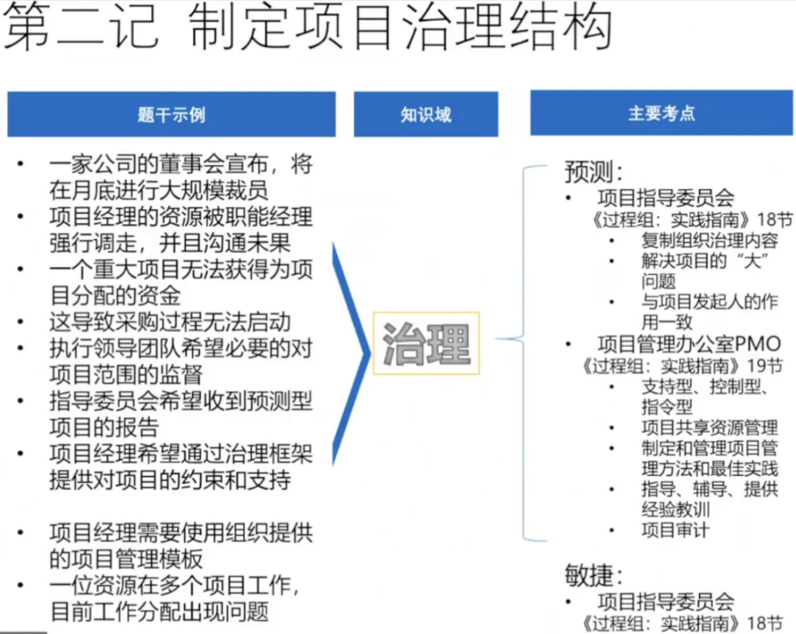
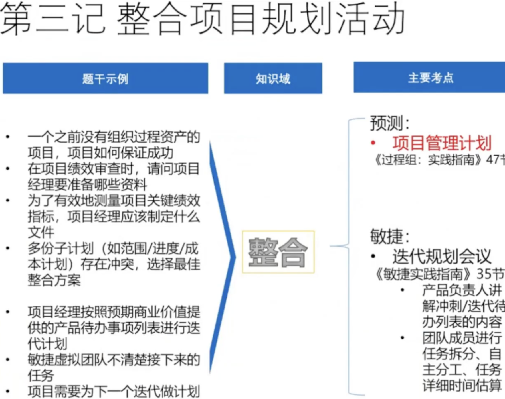
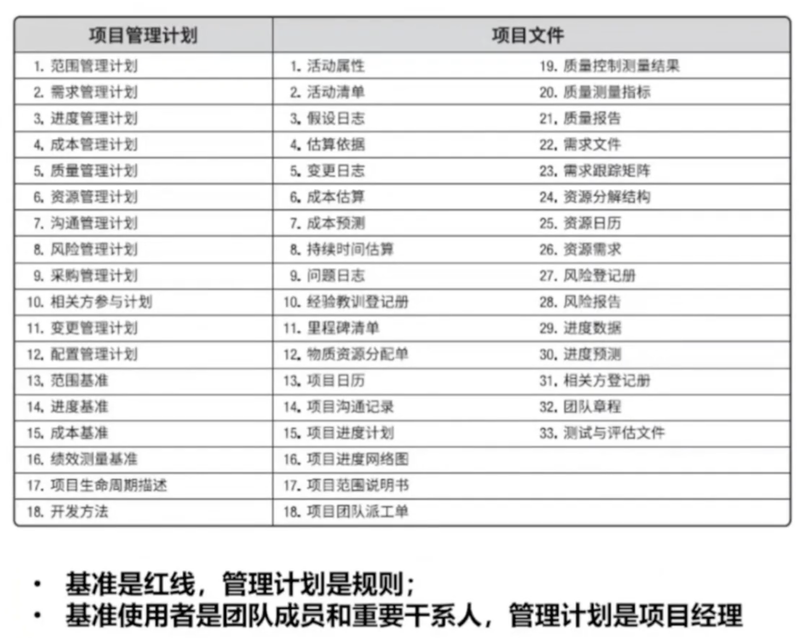
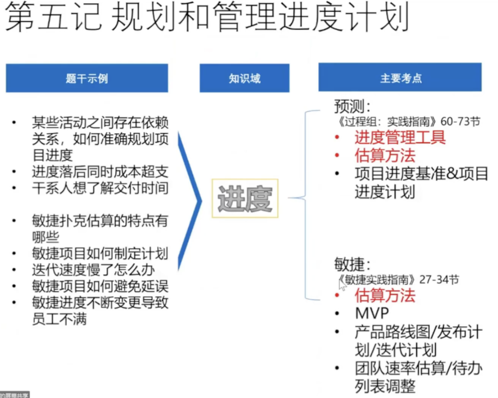
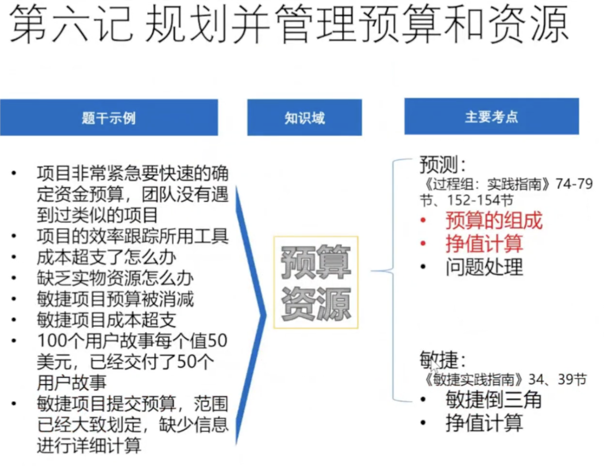
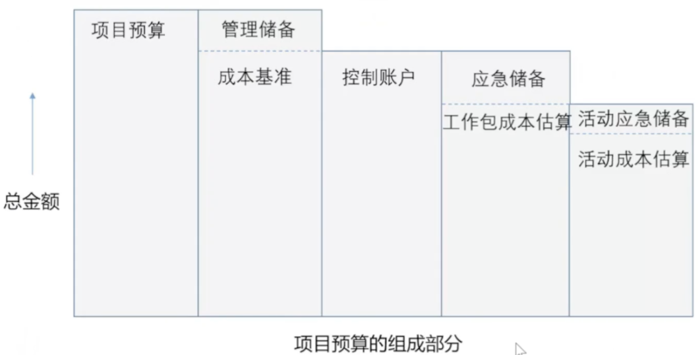

# PMP®冲刺串讲1

## 预测&适应型项目管理流程快速回顾

 

## PMP考试之三十记

### 项目管理三十记总览

| 三十记 | 序号 | 过程 | 人员 | 其他要点 |
| :---: | :---: | :--- | :--- | :--- |
| | 1 | 项目方法 | 采购 | 规则、绩效、变革、合规 |
| | 2 | 治理 | 干系人 | 建队、冲突、收益、环境 |
| 三 十 记 | 3 | 整合 | 工件 | 领导力、障碍 |
| | 4 | 范围 | 价值 | 情商、协作共识 |
| | 5 | 进度 | 培训 | 授权、变革 |
| | 6 | 预算&资源 | 问题 | |
| | 7 | 质量 | 变更 | |
| | 8 | 沟通 | 收尾 | |
| | 9 | 风险 | | |

---

## NOTE1

<!--  -->

| 题干提示 | 内容 |
| :--- | :--- |
| 政府政策不断变化，用什么样项目开发方法 | 项目方法选择，选择灵活变化的方法， 如敏捷|
| 变更请求数量极高，如何在不影响完成日期的情况下降低这一风险 | 项目方法选择，选择快速响应变更的方法，比如敏捷   |
| 一个显示价值下降的渠道仍然比一些计划保留的渠道更有效 | 项目方法选择. 选择价值交付 |
| 客户对具体实现路径缺乏清晰方案，且业务目标存在模糊性 | 项目方法选择，选择逐步合适的方法 |
| 设计阶段需客户频繁确认，但施工阶段有严格规范 | 项目方法选择，传统+敏捷 |
| 准备应用scrum的方法，但公司有提供传统方式汇报的治理要求 | 项目方法选择，混合方法 |

> ==项目方法选择==  --> 《敏捷实践指南》2节
> 
> 项目混合式方法  --> 《敏捷实践指南》4节

### 项目方法选择

| 主要考点 | 场景描述 |
| :--- | :--- |
| 适应型方法 | 市场快速变化、客户持续参与 |
| 增量型方法 | 需求明确但需快速投放市场 |
| 预测型方法 | 需求明确、高风险变更，技术和难度低 |
| 迭代型方法 | 原型验证、技术不确定性、渐进明细 |
| 混合型方法 | 部分需求确定+部分模糊 |

> - 增量交付新功能，迭代优化旧功能
> - 适应 = 增量 + 迭代

**试题1**

你正在领导一个开发新智能手机的项目。因为你要预测需求的许多变更，并<u>不断从干系人那里得到反馈来调整智能手机</u>，所以工作<u>将以小的增量迭代完成。</u>
然而，这款智能手机的摄像头将由一家<u>拒绝以渐进方式合作的供应商开发</u>。你为该项目选择什么项目管理方法是最好的？

A. 以敏捷方法为主，带有一些预测组件
B. 以预测方法为主，带有一些敏捷组件
C. 在计划过程中具有预测性，在执行过程中具有敏捷性
D. 在计划和执行期间的敏捷项目管理方法

> 我选：A
> 正确：A
> A: 项目整体以敏捷，摄像头需要预先计划。以敏捷为主
> B：和题干不符
> C：动态结合，计划和执行不是割裂的模式
> D：忽略了供应商不支持敏捷的方式

**试题2**

一个只有一位项目经理的小型组织决定从传统的瀑布式项目管理方法过渡到敏捷。
然而，<u>相关的组织人员缺乏敏捷方法的经验。</u> 该组织选择<u>使用混合生命周期作为过渡战略。</u>
还应该做些什么来促进过渡？

A. 将现有项目经理替换成经验丰富的外部敏捷教练
B. 建立指令性项目管理办公室（PMO）来领导过渡
C. 将项目经理的角色完全化敏捷团队的自我管理
D. 聘请外部敏捷教练协助组织进行过渡

> 我选：D
> 正确：D
> A：现有经理替换掉会导师现有试试的确实
> B：可能会阻碍过度，小型组织需要的知识型 PM
> C: 不应该解除项目经理的角色

## NOTE2

<!-- -->

**试题3**
项目管理办公室（PMO）应使用什么来为组织提供持续改进意见？

A.项目管理认证
B.标杆对照和经验教训
C.问卷调查
D.根本原因分析

> 我选 C
> 正确 B 
> B: PMO 的核心职能就是 基于 标杆对照和经验教训
> C: 收集反馈调查是手段，无法系统性的持续改进
> D: 也不是持续改进的动作

**试题4**

<u>项目经理被任命管理一个项目群A中的项目和一个项目群B中的项目。</u>
项目群A对组织的成功十分关键。
项目群B由项目经理的直接主管管理，要求项目经理花更多时间在项目群B的项目上。
但是，<u>由于许多项目的资源用于项目群A，项目群B步履维艰。</u>项目经理下一步怎么办？

A、与项目群A和B的发起人开会，审查项目的优先顺序
B、提交变更请求，延长项目群B的时间线
C、请求项目管理办公室（PMO）支持重新两个项目的资源排序
D、按照批准的项目管理计划执行两个项目

> 我选 C
> 正确 C 
> A: A和 B 的负责人可能只会考虑自己项目本身的利益， 很难决策真正的顺序
> B: 主观的要求已经影响了项目的进度
> D：没有解决真正的问题

**试题5**

<u>一家公司的董事会宣布</u>，将在月底进行大规模裁员，在评估影响时，项目经理发现25%的项目团队成员将被裁员。项目经理首先应该做什么？

A.请求与人力资源部门举行会议，要求他们找到解决方案来留住项目团队成员。
B.请求与客户会面，针对人员短缺造成的范围缩小和产品质量下降讨论新的方案。
C.请求与财务部门举行会议，以增加项目预算，雇佣临时人员执行受影响的活动。
D.请求与项目发起人会面，讨论项目的可行性并确定下一步行动。

> 我选 C
> 正确 D
> 项目发起人对项目的重大决策负有责任，项目重大减员的情况下，项目经理是没有决策权限的
> A: 人力资源无法提供解决方案
> B：不能直接要求客户接受品质下降的方案
> C：财务不能私自增加预算，需要发起人或者 PMO 来进行决策

## Note 3

## 项目管理计划与项目文件对照

> **重点提示：**
> - ==基准是红线，管理计划是规则==
> - ==基准使用者是团队成员和重要干系人，管理计划是项目经理==

**试题6**

为解决具有挑战性的客户请求，启动了一个项目。
该项目必须在短时间内交付。项目经理应该怎么做来<u>尽可能提高项目的成功率？</u>

A、安排采购会议，加快采购
B、将问题上报给项目发起人
C、开始执行项目活动
D、与团队一起制定详细计划

> 选 D
> A: 缺乏计划
> B: 不要直接上报
> C: 缺乏计划

---

## NOTE4

### 收集需求的工具

**连线题**

| 工具和技术 | 场景描述  | 备注 |
| :--- | :--- | :--- |
| 访谈 | ==高层级需求细化、需获取机密信息== | 可控的私密环境适合处理类似的信息
| 焦点小组 | 同领域专家意见冲突 | 领域专家深入交流能够化解立场对立
| 引导 | 跨部门需求矛盾，达成共识 |
| 头脑风暴 | 创新解決方案匮乏、风险识别初期 |
| 名义小组技术 | 需对大量创意快速排序 | 结合匿名天和优先级排序
| 思维导图 | 需求逻辑关系混乱、范围分解困难 |
| 亲和图 | ==大量用户反馈需分类== | 归纳巨量信息，将碎片信息聚类为相似的需求
| 決策 | 投票 |
| 问卷调查 | 大规模干系人意见收集、统计分析 |
| 观察 | 隐性需求难以言表 | 行为数据比口头数据更加能反馈真实的信息
| 原型法 | 需求高度不确定，复杂项目 |
| 标杆对照 | 和可比组织对比 |

### 项目范围术语

| 考点 | 场景描述  | 备注 |
| :--- | :--- | :--- |
| 范围管理计划   |  项目范围变更，需要遵循变更控制流程  | 强调范围变更的流程合规性和合理性
| 项目范围说明书   |  可交付成果边界 验收标准 项目除外内容 | 详细描述边界，验收标准，成果，项目范围的清晰度  非常详细，给团队成员看
| 项目章程   |  项目启动阶段的授权或高层级需求 | 发起人签署，不是细节描述
| 需求跟踪矩阵   |  描述需求变更或测试覆盖问题 | 需求和设计，测试双向链接的问题。 
| WBS |  任务分解颗粒度 团队成员不清楚自己的任务 | 将项目的可交付成果， 直接分解为工作包
| 产品范围   |  客户对最终产品或服务的功能/性能要求 | 属于产品范围，更多关于结果

**试题7**
一家公司计划扩大其公司网站的服务范围。
项目经理开始根据批准的项目章程收集项目的需求。
项目经理应该怎么做<u>才能就项目的可交付成果达成一致意见？</u>

A、与干系人和主题专家一起召开焦点小组会议
B、与关键干系人一起使用引导技术
C、与干系人一起进行头脑风暴
D、访谈关键干系人和发起人，以获取有关需求的更多信息

> 我选 B
> 正确 B
> 需要统一多方意见，引导效果一定是最好的
> A: 使用方案比较窄
> C: 头脑风暴是发散性的， 不利于统一答案
> D: 效率较低

**试题8**

一家公司计划改进其计算机系统，为其开户提供增值功能。
项目经理需要<u>从位于全球各地的大量员工那里收集需求，并且需要快速周转。</u>
项目经理应该怎么做？

A、要求所有干系人参与虚拟研讨会
B、与选中的客户一起召开现场研讨会
C、向海外员工分发问卷调查
D、确保收集需求符合时间限制

> 我选 C
> 正确 C 完美契合大规模干系人收集反馈的目的
> A: 不同地域，时差的所有人不一定能一起召开
> B: 现场限制，低全球员工不同地域，不符合快速周转
> D: 这是目标，不是具体的做法

**试题9**

项目发起人通知项目经理，即使已完成的项目符合进度计划，
在预算范围满足范围需求，<u>但客户对最终产品感到不满意。</u>
若要避免这种情况，项目经理应该事先做什么？

A、在制定质量管理计划的同时安排更多的会议
B、确保可交付成果符合质量控制测量结果中列出的要求
C、实施石川图工具
D、完成需求跟踪矩阵

> 我选 D
> 正确 D 需求跟踪矩阵是确保用户需求和最终交付一致
> A：安排更多会议并不能解决问题
> B：质量监控只能确保内部不出 BUG，在 D 之后执行
> C: 鱼骨图这个做法， 用于找到核心的原因。

## NOTE 5

### 进度管理工具

| 场景描述 |工具和技术 | 场景描述  | 备注 |
| :--- | :--- | :--- | :--- |
| 应对风险 | 假设情景分析 | 评估特定条件对进度的影响   | 如果xxx 则 xxxx
| 应对风险 进度分析 | 模拟 | 复杂项目进度需概率化评估 | 蒙特卡洛
| 问题解决 | 快速跟进 | 时间紧迫且可接受风险 |
| 问题解决 | 赶工 | 时间不足但预算充足 | 加班，加人
| 问题解决 | 资源平滑 | 当需维持工期，且资源局部波动可通过非关键路径调整优化时 | 在非关键路径上调整资源分配，确保关键路径不变
| 定义活动 | 分解 | 成员尚不清晰具体的工作内容 | 通过 WBS 分包，解决颗粒度果醋导致的职责模糊问题
| 进度分析 | 关键路径法 | 分析项目是否延期 | 
| 问题解决| 资源平衡 | 当资源严重短缺或冲突必须解决，且可接受工期调整时 | 被动的资源调整方式
| 进度分析 | 进度网络分析 | 综合评估进度风险或问题 | 属于综合评估工具
| 定义活动 | 滚动式规划 | 长期项目或敏捷环境 | 近细远粗 |
| | 多团队协作需协调之间接口 |  确定和整合依赖关系 | FFS， SFS 等

### 预测型估算方法

| 工具和技术 | 场景描述  | 备注 |
| :--- | :--- | :--- |
| 类比估算 | 项目启动期信息不足时的粗略估算/ 有过类似项目经验/ 经验判断 | 类比基于历史项目的数据，数据依赖性比较高， 适用于启动阶段， 粗略估算
| 自下而上估算 | 之前估算方式不正确/没有过去估算的经验 | 数据依赖低， 精度高
| 专家判断 | 缺乏参考数据但需专家专业意见 | 依赖专家判断的直觉， 无需数据依赖性， 精度低
| 参数估算 | 历史数据充足/重复性工作 | 利用统计模型计算， 数据依赖性高， 精度中等
| 三点估算 | 高风险活动或高度不确定任务 | 乐观+ 悲观， 加权计算，精度高， 适用于高风险

### 敏捷型估算方法

| 估算方法 | 重要考点  | 备注 |
| :--- | :--- | :--- |
| 相对规模估算  | • 涉及用户故事或特性的相对规模评估 • 故事点/复杂度 |
| 估算扑克 | • ==团队==为了达成共识的工作量估算技术 • 使用==斐波那契数列==衡量计划扑克的价值点
| T-shirt估算 | • ==团队==为了达成共识的==简化规模估算==技术 • 早期粗略分类需求
| 点式投票 | • 每个人自由选择为哪些用户故事投票，一个用户故事得到的点数越多，代表体量越大 • 优先级排序、民主决策、有限投票权
| 估算团队速率 | ==• 估算团队在单位时间里完成的工作量预测迭代交付能力 • 速率不能跨团队对比==

**试题10**

项目经理必须为政府编制一份工厂生产能力报告。
这份报告将通过对400家工厂的总经理进行调查而创建，并且必须在四个月内完成，然而，根据现有资源以及调查每位总经理所需的时间，该项目预计需要一年时间。
项目经理应使用什么工具或技术来满足预期期限？

A、进行压缩
B、快速跟进
C、标杆对照
D、统计抽样

> 我选 D
> 正确 B 事件缺口极大，调整工作方式来压缩工期
> A 应该是工作压缩， 这里说法错误
> C 用于参考流程， 无法用于进度
> D 质量管理的工具，于题干无关

**试题11**

项目发起人批准项目里程碑进度计划并任命一名项目经理。
评审进度计划之后，<u>项目经理得出日期不现实的结论。</u>
项目经理下一步应该怎么做？

A、创建一份因果图
B、产生进度计划网络图
C、对批准的进度计划赶工
D、执行进度网络分析
  
> 我 D
> 正确 D, 进度网络分析是评估项目进度计划可行性的核心工具，及时的实施可帮助项目经理客观的别进度不合理的原因， 为后续调整提供依据
> A 分析已发生的原因， 这里还没有发生
> B 网络图已经完成了， 无需常见
> C 计划本身不现实。不能直接开始赶工
> 

**试题12**
为了确定项目成本，项目经理利用一个<u>过往类似项目</u>的实际成本（AC）。
项目经理应使用的是哪一种估算方法？

A、参数估算
B、类比估算
C、自下而上估算
D、三点估算

> 我 B 
> 正确 B 利用了过往项目，典型的类比估算
> A C D 均不正确

**试题13**

项目经理估算一个新软件项目的成本。
根据过往经验，公司<u>制定了模块屏幕数量和生产一个模块所需的劳动小时数之间的统计关系。</u>
应使用什么成本估算技术来利用这项信息？

A、类比估算
B、参数估算
C、自下而上估算
D、粗略量级估算
> 我 C
> 正确 B
> 题目明确提供了参数间的统计关系
> C：应该有工作包的问题， 而不是预设的参数
> D 工作等级的估算而不是参数

**试题14**

敏捷团队希望集体决定项目的可能规模。如果他们使用计划扑克技术完成这项工作，那么团队将会做什么？

A. 通过使用故事点估算故事的相对规模
B. 通过将其粗略归类来估算故事
C. 通过将其与过去类似功能进行对比估算故事点
D. 使用100点来估算故事点

> 我 A
> 正确 A
> B：T-shirt
> C：类比估算， 相对规模估算
> D: 不是 100 点，而是 斐波那契数列

**试题15**
敏捷教练正在与多个团队一起工作，注意到管理层<u>衡量团队生产力的方式存在功能障碍。</u>
敏捷教练观察到的功能障碍是什么？

A. 管理层正在查看墙上展示的所有团队的燃尽图
B. 管理层查看的是团队的kanban板，来管理任务流以及显示在制品（WIP）
C. 管理层一直让团队添加WIP限制，以便额外的工作不会被拉进WIP状态中
D. 管理层正在比较团队间的速度，并奖励速度最高的团队

> 我  D  
> 正确 
> A: 观察燃尽图是正确的
> B: 查看看板是正确的 WIP 用法，正确
> C: 显示 WIP 也正确，关键事件，是正确的
> D: 团队间的速度不可比

## NOTE 6

### 项目预算的组成

> 从右往左看，从下往上 
> 每列累加

## 挣值计算

挣值分析：做了多少事，花了多少钱。用于解决进度和成本问题。一般用S曲线进行挣值分析。

| 缩写 | 公式 | 其他考点 | 备注 |
| :--- | :--- | :--- | :--- |
| CV | CV=EV-AC | >0;<0;=0 | 
| SV | SV=EV-PV | >0;<0;=0 |
| CPI | CPI=EV/AC | >1;<1;=1 |
| SPI | SPI=EV/PV | SPI和关键路径的关系 | SPI < 1 但关键路径进度正常， 需要分析哪里拖后腿了

**试题16**

项目经理确定项目已超出预算，并将需<u>管理储备来完成项目。</u>
为完成项目，项目经理应该怎么做？

A、获得项目发起人批准使用管理储备
B、修改成本基准并使用管理储备
C、获得项目发起人的批准，包含额外资金
D、执行实施整体变更控制流程，并修改成本基准

> D 使用时需要执行实施整体变更控制流程
> A 没有走流程
> B 不能修改
> C 没有体现流程

---

**试题17**

在你的建筑项目中，CPI 等于0.85，SPI等于1.25，这可能？

A. 关键资源长期病假，这一情况事先未预料到
B. 施工材料涨价10%，而你在项目计划中的预测是涨价12%
C. 预料到延期的情况，项目必须赶工以压缩进度
D. 混凝土凝固有4天的等待时间，什么工作也不能做

> 我选 C， CPI < 1 说明预算超支了，但是 SPI >  1 说明 进度超前了
> 正确：C
> CPI < 1 成超支， 说明花的钱比挣得多，  SPI > 1 进度超前
> A 病假会造成工作滞后而不是超前
> B 实际涨价比预测小，应该是成本节约， CPI > 1 才对
> C 赶工会造成进度超前，同时带来超支， 和题目相符 
> D 什么不作会造成进度滞后，而不是超前

