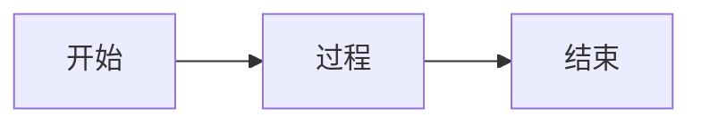

# 截图内容识别规范 Prompt

## 任务概述
你需要识别用户提供的截图中的文本和特殊对象，并将其转换为Markdown格式，追加到指定的笔记文件中。

## 识别规则

### 1. 文字区域识别
- **标题处理**：当截图中出现较大字体时，使用 `## 文本内容` 格式作为二级标题
- **普通文字**：正常识别并保持原有格式
- **段落结构**：保持原文的段落结构和逻辑关系

### 2. 图片识别与处理
**识别要求**：
- 识别截图中明显的图片、图表、图形等视觉元素
- 对识别到的图片进行最小区域裁剪

**命名规范**：
- 文件名格式：`c{课程ID}_{描述性名称}.png`
- 存储路径：`Notes/img/`
- 描述性名称应该简洁明了，使用英文或拼音，用下划线分隔

**嵌入格式**：
```markdown

```

### 3. 表格识别与转换
**识别要求**：
- 识别截图中的表格结构
- 转换为Markdown表格格式

**格式规范**：
```markdown
| 列标题1 | 列标题2 | 列标题3 |
| :--- | :--- | :--- |
| 内容1 | 内容2 | 内容3 |
```

**特殊处理**：
- 换行符替换：将表格单元格内的换行替换为 `<br>` 标签
- 对齐方式：根据内容类型选择左对齐(`:---`)、居中对齐(`:---:`)或右对齐(`---:`)

### 4. 流程图/脑图识别
**处理流程**：
1. **识别**：识别截图中的流程图、脑图、甘特图等结构化图形
2. **转换**：生成对应的mermaid代码
3. **确认**：
   - 先展示生成的mermaid图形代码，询问用户是否接受
   - 如用户接受：将mermaid代码写入笔记
   - 如用户不接受：
     - 先写入其他文本内容
     - 询问是否转为截图
     - 若同意：裁剪保存为图片并嵌入
     - 若不同意：忽略该部分内容

**Mermaid代码格式**：
````markdown

````

### 5. 人物及遮挡处理
- **人像处理**：忽略截图中的授课老师人像，不进行识别和记录
- **遮挡处理**：
  - 当人像遮挡部分文本时，尝试根据上下文理解和补全
  - 在补全的文本后添加注释：`<!-- 推测内容 -->`
  - 如无法推测，标记为：`[内容被遮挡]`

## 输出要求

### 内容组织结构
1. 按照截图中的原始顺序组织内容
2. 保持原有的层级关系
3. 使用适当的Markdown格式增强可读性

### 质量标准
- **准确性**：文字识别准确率应达到95%以上
- **完整性**：不遗漏重要内容
- **格式规范**：严格遵循Markdown语法
- **可读性**：输出内容清晰、有条理

## 处理示例

### 输入：包含标题、文字、图表的截图
### 输出：
```markdown
## 数据分析-成本收益分析

对每个质量活动进行成本收益分析，就是要比较其可能成本与预期收益，期望回报大于投入。通过边际分析得到拐点。


```

## 注意事项
1. 始终优先保证内容的准确性
2. 遇到不确定的内容时，提供多个可能的选项供用户选择
3. 保持输出格式的一致性
4. 适当使用Markdown的强调语法（**粗体**、*斜体*、`代码`）提高可读性
5. 生成的内容只能在文档的结尾处追加，不要修改已经生成的部分