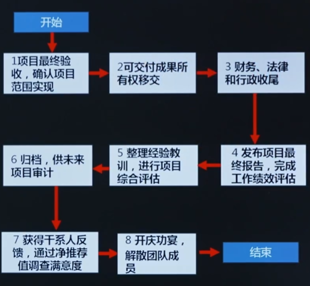

# 模考3知识点总结

# 课时 178 : 【第167节】过程：结束项目或阶段.

预测型（传统）项目收尾流程：

---

# 精讲《过程组：实践指南》134 节

精讲《过程组：实践指南》 134节 & 140节

---

课时 141 : 工具：情商&领导力

---

精讲《过程组：实践指南》43节& 113节

---

精讲《敏捷实践指南》32 节

精讲《敏捷实践指南》23 节

精讲《过程组：实践指南》131 节

---

ROI
精讲《过程组：实践指南》154 节

---

课时 141 : 工具：情商&领导力

---

