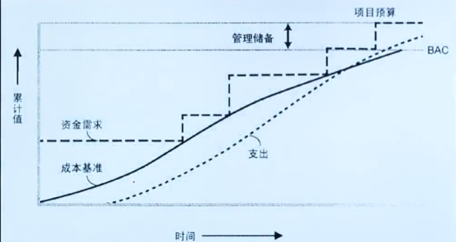
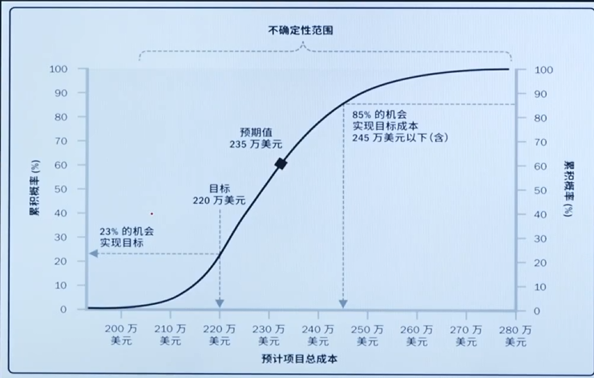
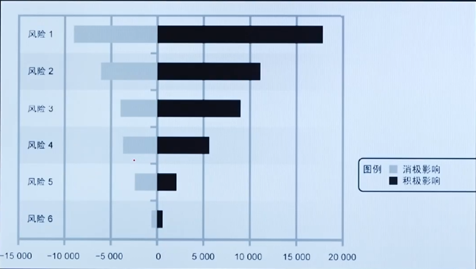
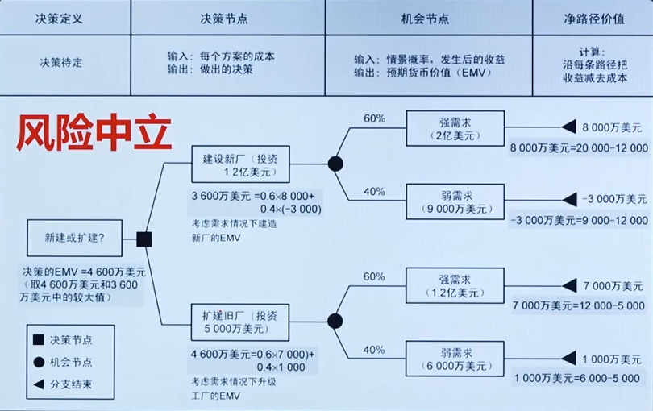
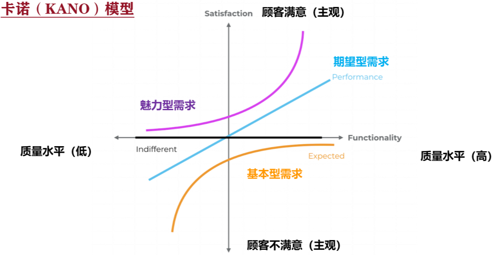
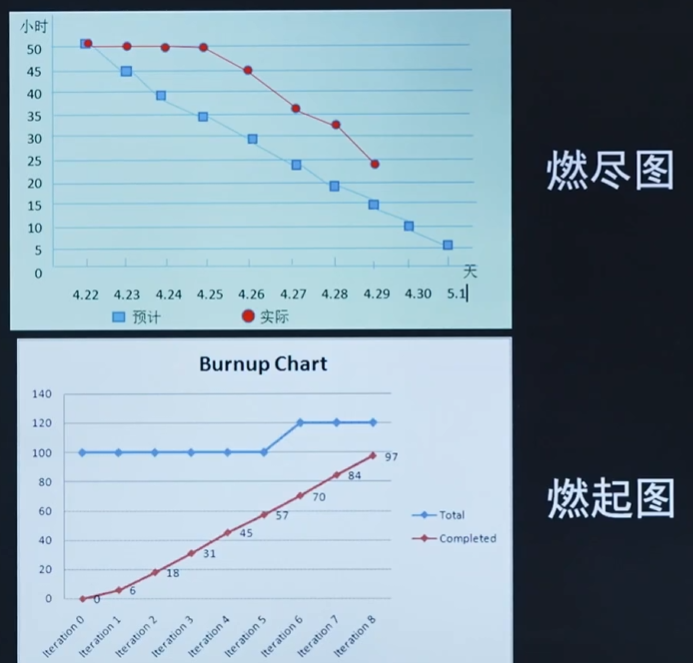
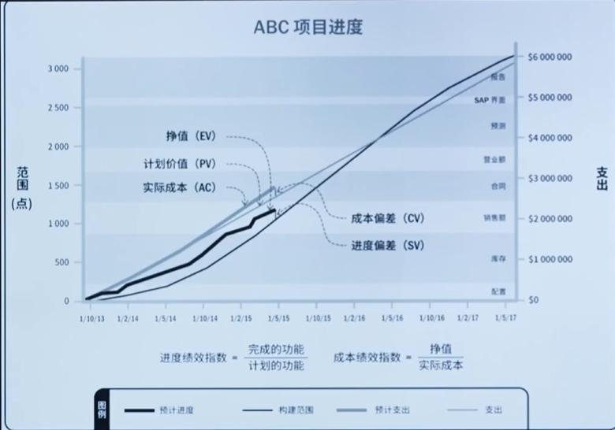

# 模考5知识点总结


# 课时 23 : 【第19节】项目管理办公室

## PMO 的类型

- **支持型（权利最小）**
  - 担当顾问
  - 向项目提供模板，最佳时间，培训，以及来自其他项目的信息和经验教训
  - 类似资源库

- **控制型 （权利适中）**
  - 通过各种手段，提供支持并遵守合规要求
  - 合规要求包括
    - 采用项目管理框架
    - 使用特定的模板，表格和工具
    - 遵守治理框架

- **指令型（权利最高）**
  - 通过直接管理项目来控制项目
  - 项目经理由PMO 指派并向其报告


> 指令型（战略型）的 PMO 可以直接治理项目的


## PMO项目管理办公室

**对于项目**
- 提出建议
- ==领导是指转移== （跨项目知识传递）
- ==终止项目== （有权利终止项目）
- 根据需要采取其他行动

**PMO的职能**
- 管理由 PMO ==所管辖项目== 的共享资源（人员）
- 确定和发展项目管理方法，最佳实践和标准
- ==教练，辅导，培训==和==监管==
- 通过==项目审计== 监督项目管理标准，政策，程序和末班的合规性
- ==制定和管理项目的政策，程序，末班和其他共享文件（组织过程资产）==
- 协调各项目之间的沟通

---

# 课时 83 : 【第79节】输出：成本基准&项目资金需求

## 成本基准

- 是经过批准且==按时间段==分配资金的项目预算 （BAC） 
- 只有通过正式的变更控制程序才能变更
- 成本基准是不同进度轰动婧批准的预算总和

## S曲线

由于成本基准中的成本估算与进度活动直接关联，
因此就可以按时间段分配成本基准，得到一条S曲线



> 帮助项目经理追踪预算使用情况，对比实际花费和计划花费，及时判断项目是否超支， 或者不足问题的一个有效的工具
> 可确保项目在预算范围内完成

---

# 课时 99 : 【第94节】输出：风险管理计划

是风险管理的流程和规则：

- ==不包含具体风险的应对==
- <u>风险登记册不是风险管理计划的组成部分</u>

> 识别到风险后， 登记的都是风险登记册，而不是风险管理计划


---
# 【第101节】工具：模拟&敏感性分析&决策树分析

**模拟**

## **蒙特卡洛模拟：**

- 使用计算机多次迭代
- ==识别风险和不确定性==



### **敏感性分析**

- 识别关键变量
- 考察每个因素的变化会对目标产生多大影响
- 龙卷风图：
- 

> 同时分析风险的 “好处” 和 “坏处”
> 项目周期中， 持续的分析敏感性分析


### **决策树分析**

- ==适合各种决策场景==
- 用来评估与一个决策点相关的多个选项，在不同的情形下的可能后果
- 评估不同决策方案的预期价值
- 需要计算: 预期货币价值 ==EMV: (Expected Monetary Value)==
- 机会的 EMV 为正值
- 威胁的 EMV 为负值
  
```
P : 机会概率
V : 价值
EMV = P * V
```

> 例题是否需要扩建还是新建
> 决策节点（方块）
> 机会节点（圆圈）
> 净路径价值 (三角)
> 先给出新建或者扩展的初始资金， 并分析市场上 强弱需求 可能出现的概率， 然后计算对应的价值




---

## 课时 216 : 【第32节】用户故事优先级排序

### 用户故事优先级排序

**莫斯科排序 MoSCOw**
  - Must have
  - Should have
  - Could have
  - Won't have

卡诺模型 

**卡诺模型 KANO**

对用户需求分类和优先级排序


**100点排序法**

总共 100 点，将 100 点分配给不同的用户故事，根据其重要性和紧急性

**多维加权分析**

单项分数A = 权重值 x 分值A
单项分数B = 权重值 x 分值B

最后将所有单项分数相加，得到最终的优先级分数

---

## 课时 209 : 【第25节】用户故事&人物角色

### 用户故事

**使用 5W1H 原则**
- What: 用户故事的目标或功能
- Who: 使用用户故事的人
- When: 用户故事的使用时间
- Where: 用户故事的使用场景
- Why: 用户故事的原因或动机
- How: 用户故事的实现方式

---

## 课时 71 : 【第66节】工具：类比&参数&三点&自下而上估算

### 类比估算

- 以前类似活动的实际历史估算
- 是==专家判断==的一种形式
- 优点：方法建议，省时省力，费用最低
- 缺点：信息模糊，准确度低

> 精度低，需要参考历史数据， 得有专家（或团队内部有能力强的组员）


### 参数估算

- 利用数据之间的统计关系。

- 在下述情况下非常可靠
  - 用于建模的历史信息是准确的
  - 在模型中使用的参数是很容易量化的
  - 模型可按照比例调整 

> 需要历史数据

### 三点估算

- 通过考虑估算中的==不确定性和风险==
- 概念源自计划评审技术（PERT）
- 一种概率方法，通常比类比估算准确
- Pert 公式：期望值 = (最乐观时间 + 4最可能时间 + 最悲观时间) / 6
- 三角分布：期望值 = (最乐观时间 + 最可能时间 + 最悲观时间) / 3
- 标准差: Sigma = (最悲观时间 - 最乐观时间) / 6 
  - 标准差越小， 确定性越高

> 考虑风险

### 自下而上计算

将活动进一步细分，然后估算资源需求
接着再把这些需求汇总起来，得到每一个活动的资源需求

如果无法以合理的可信度对活动进行估算，则需要进行自下而上估算

优点：估算比较准确，符合实际
缺点：信息采集量大，耗时费工成本高

> 耗时但是精确

---

## 课时 82 : 【第78节】工具：储备分析&资金限制平衡

### 和风险储备有很大的关系

| 储备类型 | 使用方式     | 对应风险 | 备注                                                                                                   |
| -------- | ------------ | -------- | :----------------------------------------------------------------------------------------------------- |
| 应急储备 | 不用审批     | 已知风险 | 项目经理可以动用<br>在项目的成本基准中                                                                 |
| 管理储备 | ==需要审批== | 未知风险 | 管理储备不会作为项目经理的绩效<br>不在项目成本基准中<br>通过提交变更请求 (CCB)，会改变项目的额成本基准 |


### 资金限制平衡
- 调整范围和进度
- 添加强制日期

---

# 课时 200 : 【第17节】产品负责人

- 理战略：制作产品路线图
- 定需求：
  - 增加调整用户故事
  - 根据==商业价值==，对用户故事进行<u>优先级排序</u>
  - 做验收：项目成果的评审反馈

> 谁将验证项目价值是否实现：产品负责人
> 谁去实现：团队
> 谁去跟踪流程： 项目经理


---
# 课时 201 : 【第18节】敏捷项目负责人

## 称呼
- Scrum 主管
- 项目团队领导
- 敏捷团队教练
- 团队促进者

## 职责：
- 保护：保护团队不被中断
- 保障：移除障碍
- 保持：通过项目和团队章程，保持持续引导项目和愿景
- 保姆：
  - 为团队提供支持，包括培训和指导
  - 帮助发起人和干系人制定产品愿景
  - 让团队和产品负责人一起来明确需求的期望和价值
---

# 课时 224 : 【第39节】迭代监控：燃尽图&燃起图&挣值

- 燃尽图
- 燃起图
- 挣值（敏捷挣值更多的使用故事点）
  



